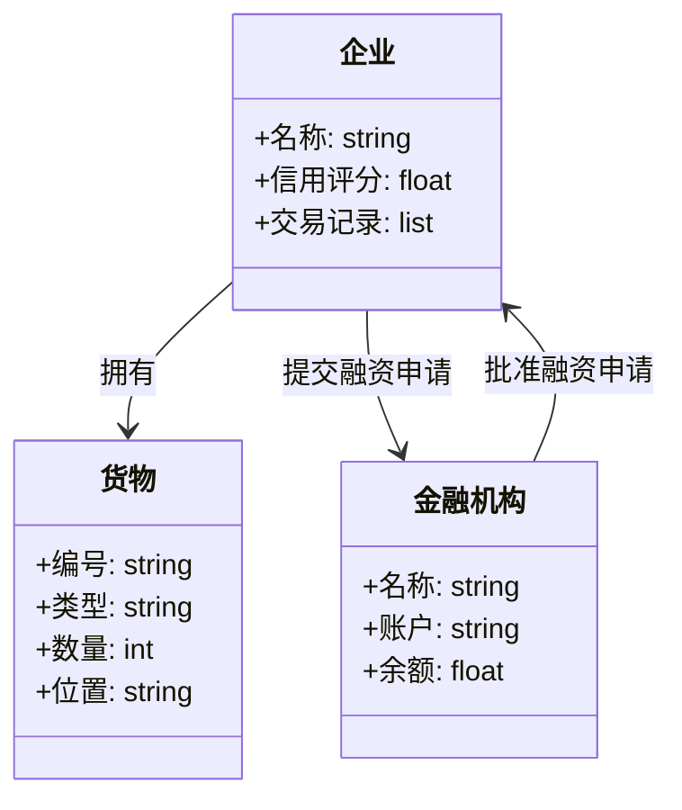
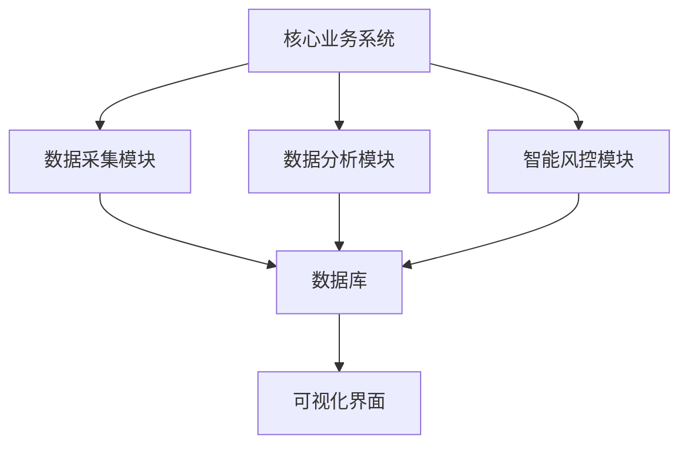
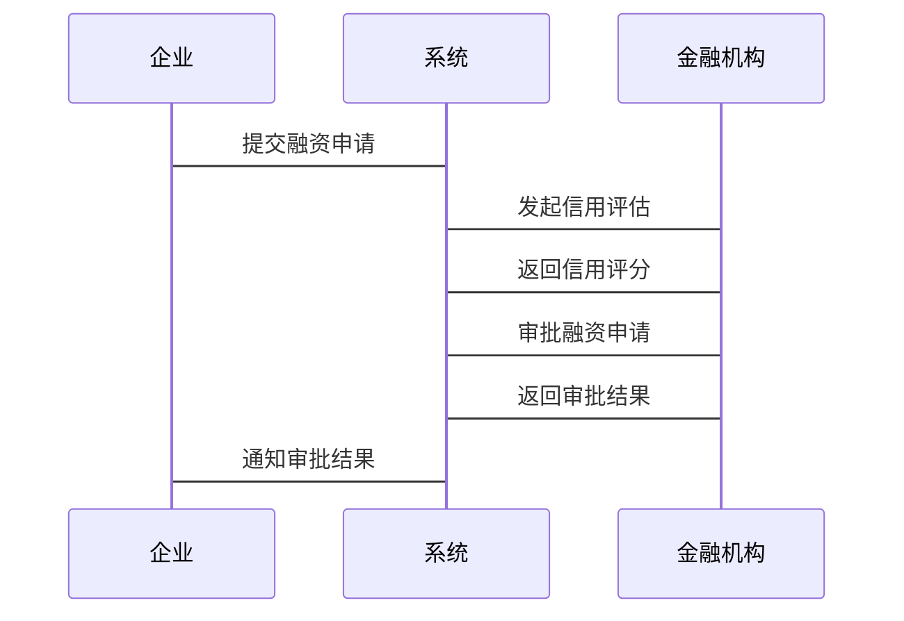

                 


```markdown
# 智能供应链金融解决方案

> 关键词：智能供应链金融、大数据、人工智能、区块链、风险管理、供应链管理

> 摘要：智能供应链金融解决方案是通过大数据、人工智能和区块链等技术，实现供应链金融的智能化、自动化和高效化。本文将从供应链金融的背景与概念出发，深入探讨智能供应链金融的核心技术与算法，结合实际项目案例，详细讲解系统架构设计与实现，最后总结智能供应链金融的最佳实践与未来发展方向。

---

## 第一部分: 智能供应链金融的背景与概念

### 第1章: 供应链金融的概述
#### 1.1 供应链金融的基本概念
##### 1.1.1 供应链金融的定义
供应链金融是指通过整合供应链上的信息、资金和物流资源，为供应链上的企业提供融资服务，以支持其生产和运营的资金需求。

##### 1.1.2 供应链金融的核心要素
- **信息流**：供应链上的交易数据、物流信息和资金流动。
- **物流**：货物的运输和存储。
- **资金流**：融资、支付和结算。

##### 1.1.3 供应链金融的参与者与角色
- **核心企业**：供应链中的主导企业。
- **供应商**：为供应链提供原材料或服务的企业。
- **客户**：供应链的终端消费者。
- **金融机构**：提供融资服务的银行或其他金融机构。

#### 1.2 供应链金融的传统模式与挑战
##### 1.2.1 传统供应链金融的运作流程
- **申请融资**：企业向金融机构提交融资申请。
- **审批**：金融机构审核企业的信用和交易数据。
- **放款**：审批通过后，金融机构向企业发放贷款。
- **还款**：企业在约定时间内偿还贷款本金和利息。

##### 1.2.2 传统模式中的痛点与不足
- **信息不对称**：金融机构难以全面获取供应链上的信息，导致信用评估困难。
- **效率低下**：融资审批流程繁琐，时间长。
- **风险高**：缺乏实时监控，难以及时发现和应对风险。

##### 1.2.3 技术驱动下的供应链金融变革
随着大数据、人工智能和区块链等技术的发展，供应链金融正在向智能化、自动化方向转型。

#### 1.3 智能供应链金融的定义与特点
##### 1.3.1 智能供应链金融的定义
智能供应链金融是指通过智能化技术手段，整合供应链上的信息流、物流和资金流，实现融资服务的自动化、智能化和高效化。

##### 1.3.2 智能供应链金融的核心特点
- **数据驱动**：利用大数据分析和人工智能技术进行信用评估和风险控制。
- **实时监控**：通过物联网和区块链技术实现供应链的实时追踪和监控。
- **自动化**：智能化系统自动完成融资申请、审批和放款流程。

##### 1.3.3 智能供应链金融与传统供应链金融的对比
| 特性                | 传统供应链金融                | 智能供应链金融                |
|---------------------|-----------------------------|-----------------------------|
| 信息获取            | 依赖企业提供的数据            | 利用大数据和物联网实时采集数据 |
| 审批效率            | 手工审核，效率低              | 系统自动化审核，效率高        |
| 风险控制            | 事后检查，风险较高            | 实时监控，风险低              |

---

### 第2章: 供应链金融的智能化需求
#### 2.1 供应链金融智能化的背景
##### 2.1.1 数字化转型的驱动
企业通过数字化转型，提高供应链管理效率，降低运营成本。

##### 2.1.2 人工智能与大数据技术的成熟
技术的进步使得供应链金融能够实现智能化。

##### 2.1.3 企业对高效融资的需求
企业希望获得更快捷、更高效的融资服务。

#### 2.2 智能供应链金融的核心需求
##### 2.2.1 自动化与智能化的融资流程
通过智能化系统实现融资申请、审批和放款的自动化。

##### 2.2.2 数据驱动的信用评估
利用大数据分析企业信用状况，降低信息不对称。

##### 2.2.3 实时监控与风险控制
通过实时监控供应链上的信息，及时发现并应对风险。

#### 2.3 智能供应链金融的业务场景
##### 2.3.1 货物融资
基于货物价值提供融资服务。

##### 2.3.2 应收账款融资
基于应收账款提供融资服务。

##### 2.3.3 存货质押融资
基于存货质押提供融资服务。

---

## 第二部分: 智能供应链金融的核心技术与算法

### 第3章: 大数据在供应链金融中的应用
#### 3.1 大数据技术的基本原理
##### 3.1.1 数据采集与处理
通过多种渠道采集供应链上的数据，并进行清洗和预处理。

##### 3.1.2 数据分析与挖掘
利用数据分析技术，挖掘数据中的价值，支持信用评估和风险预测。

##### 3.1.3 数据可视化
通过数据可视化工具，直观展示供应链上的信息。

#### 3.2 大数据在供应链金融中的应用场景
##### 3.2.1 企业信用评估
基于企业的历史交易数据和财务数据，评估企业的信用状况。

##### 3.2.2 货物追踪与管理
通过物联网技术，实时追踪货物的位置和状态。

##### 3.2.3 风险预测与控制
利用大数据分析技术，预测潜在风险并制定应对策略。

### 第4章: 人工智能在供应链金融中的应用
#### 4.1 人工智能的基本原理
##### 4.1.1 机器学习算法
通过机器学习算法，训练模型进行信用评估和风险预测。

##### 4.1.2 自然语言处理
通过自然语言处理技术，分析企业的财务报表和合同文本。

##### 4.1.3 图像识别
通过图像识别技术，识别和验证货物的真伪。

#### 4.2 人工智能在供应链金融中的应用场景
##### 4.2.1 智能信用评估
利用机器学习算法，自动化评估企业的信用状况。

##### 4.2.2 自动化审批流程
通过人工智能技术，实现融资申请的自动化审批。

##### 4.2.3 智能风控
利用人工智能技术，实时监控供应链上的风险，及时发出预警。

---

### 第5章: 区块链在供应链金融中的应用
#### 5.1 区块链技术的基本原理
##### 5.1.1 区块链的定义
区块链是一种分布式账本技术，具有去中心化、不可篡改和透明性特点。

##### 5.1.2 区块链的核心特征
- **去中心化**：数据由多个节点共同维护，避免单点故障。
- **不可篡改**：数据一旦写入区块链，无法被修改。
- **透明性**：所有交易记录对所有参与者公开。

#### 5.2 区块链在供应链金融中的应用场景
##### 5.2.1 供应链透明化
通过区块链技术，实现供应链上信息的透明共享。

##### 5.2.2 信用融资
通过区块链技术，建立企业的信用档案，支持信用融资。

##### 5.2.3 质押融资
通过区块链技术，实现质押货物的智能监控和管理。

---

## 第三部分: 智能供应链金融的系统架构与设计

### 第6章: 智能供应链金融系统的架构设计
#### 6.1 系统功能设计
##### 6.1.1 核心业务系统
- **融资申请**：企业提交融资申请。
- **信用评估**：系统基于大数据和人工智能技术评估企业的信用状况。
- **融资审批**：系统自动审批融资申请。
- **融资放款**：系统自动完成放款。

##### 6.1.2 数据处理系统
- **数据采集**：采集供应链上的交易数据、物流数据等。
- **数据存储**：存储数据并进行归档管理。
- **数据分析**：利用大数据技术分析数据，支持信用评估和风险预测。

##### 6.1.3 智能风控系统
- **风险预警**：实时监控供应链上的风险，及时发出预警。
- **风险控制**：制定风险应对策略，降低风险损失。

#### 6.2 系统架构设计
##### 6.2.1 领域模型设计


##### 6.2.2 系统架构图


---

### 第7章: 系统接口与交互设计
#### 7.1 系统接口设计
##### 7.1.1 融资申请接口
- **输入**：企业ID、融资金额、融资期限。
- **输出**：融资申请是否通过。

##### 7.1.2 信用评估接口
- **输入**：企业ID。
- **输出**：信用评分。

#### 7.2 系统交互设计
##### 7.2.1 融资申请流程


---

## 第四部分: 智能供应链金融的项目实战

### 第8章: 智能供应链金融系统的实现
#### 8.1 环境安装
##### 8.1.1 安装Python
- 下载并安装Python 3.8以上版本。
- 安装pip工具：`python get-pip.py`

##### 8.1.2 安装依赖库
- 使用pip安装所需库：
  ```bash
  pip install numpy pandas scikit-learn matplotlib
  ```

#### 8.2 核心代码实现
##### 8.2.1 数据采集模块
```python
import requests

def fetch_data(url):
    response = requests.get(url)
    return response.json()
```

##### 8.2.2 信用评估模块
```python
from sklearn.linear_model import LogisticRegression

def train_model(X, y):
    model = LogisticRegression()
    model.fit(X, y)
    return model

# 示例数据
X = [[1, 2], [3, 4], [5, 6]]
y = [0, 1, 0]
model = train_model(X, y)
```

##### 8.2.3 智能风控模块
```python
import pandas as pd
from sklearn.ensemble import RandomForestClassifier

def predict_risk(X_test):
    model = RandomForestClassifier()
    model.fit(X_train, y_train)
    return model.predict(X_test)

# 示例数据
X_test = [[7, 8], [9, 10]]
print(predict_risk(X_test))
```

#### 8.3 项目实战案例分析
##### 8.3.1 案例背景
某制造企业希望利用智能供应链金融系统实现应收账款融资。

##### 8.3.2 数据分析与建模
- 数据清洗：去除缺失值和异常值。
- 特征选择：选择关键特征进行建模。
- 模型训练：训练信用评估模型。

##### 8.3.3 系统部署与测试
- 部署系统到云平台。
- 进行功能测试和性能测试。

---

## 第五部分: 智能供应链金融的最佳实践与未来展望

### 第9章: 最佳实践
#### 9.1 选择合适的技术栈
根据业务需求选择合适的技术，例如：
- **大数据**：使用Hadoop、Spark等技术。
- **人工智能**：使用TensorFlow、Scikit-learn等框架。
- **区块链**：使用Hyperledger Fabric、 Ethereum等平台。

#### 9.2 数据安全与隐私保护
- 加强数据加密。
- 建立严格的数据访问权限控制。

#### 9.3 系统性能优化
- 优化算法模型，提高计算效率。
- 优化数据库设计，提高查询效率。

### 第10章: 未来展望
#### 10.1 技术发展趋势
- **AI与大数据的深度融合**：进一步提升信用评估和风险预测的准确性。
- **区块链的广泛应用**：实现供应链金融的全流程透明化和智能化。
- **物联网的普及**：实现供应链的全面智能化监控。

#### 10.2 智能供应链金融的未来发展
随着技术的不断进步，智能供应链金融将更加智能化、自动化和高效化，为企业提供更优质的融资服务。

---

## 第六部分: 总结

### 第11章: 总结与展望
智能供应链金融通过整合大数据、人工智能和区块链等技术，实现了供应链金融的智能化和高效化。未来，随着技术的不断进步，智能供应链金融将为企业提供更优质的服务，推动供应链金融行业的创新发展。

---

**关键词**：智能供应链金融、大数据、人工智能、区块链、风险管理、供应链管理
```

