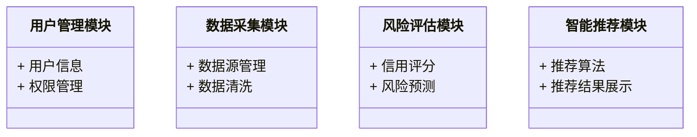
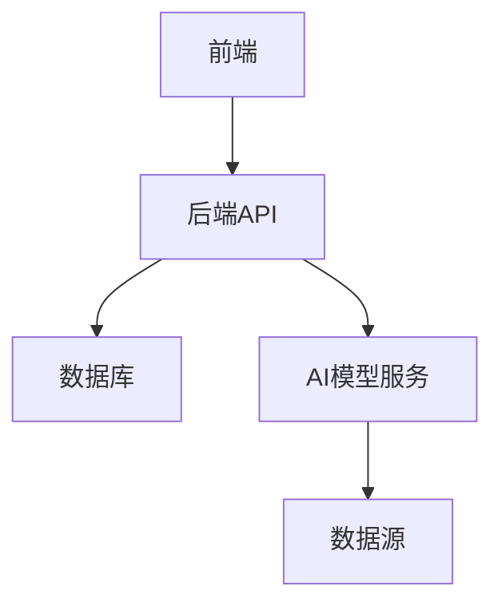
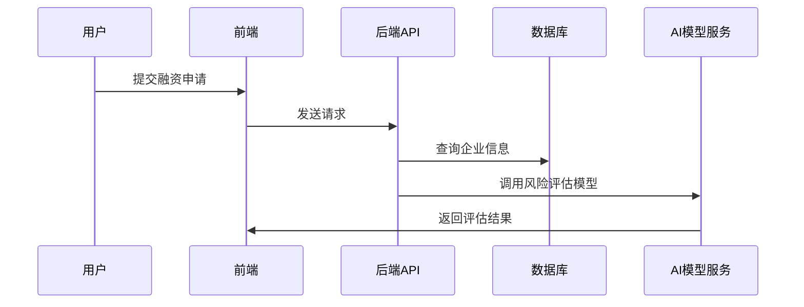

                 


好的，现在我将根据你提供的目录大纲，逐步分析并展开每个章节的内容，确保文章结构清晰、逻辑严谨、内容详实。

---

# 智能供应链金融额度管理平台

> 关键词：供应链金融、智能额度管理、人工智能、大数据、区块链、系统架构

> 摘要：本文将从供应链金融的基本概念出发，深入探讨智能供应链金融额度管理平台的核心技术与系统架构设计。通过结合人工智能、大数据和区块链等技术，分析平台的功能模块、系统架构、算法原理及项目实战案例，帮助读者全面理解智能供应链金融额度管理平台的设计与实现。

---

## 第一部分: 智能供应链金融额度管理平台概述

### 第1章: 供应链金融与智能额度管理平台概述

#### 1.1 供应链金融的基本概念

供应链金融是指通过整合供应链上下游企业之间的资金流、信息流和物流，提供融资服务的一种金融模式。传统的供应链金融依赖于核心企业的信用背书，往往难以覆盖中小企业的融资需求，且存在信息不对称、效率低下的问题。

#### 1.2 智能额度管理平台的定义与特点

智能供应链金融额度管理平台是一种基于人工智能和大数据技术的智能管理系统，能够实时评估供应链上下游企业的信用风险，并动态调整融资额度。其特点包括：

- **实时性**：基于实时数据进行信用评估和额度调整。
- **智能化**：利用AI算法进行风险预测和推荐。
- **数据驱动**：通过大数据分析企业行为和市场变化。
- **透明性**：信息共享，降低信息不对称。

#### 1.3 供应链金融额度管理平台的应用场景

- **供应商融资**：帮助上游供应商快速获得融资，缓解资金压力。
- **应收账款融资**：基于核心企业的应收账款，为中小企业提供融资支持。
- **存货质押融资**：通过质押存货，为下游经销商提供融资支持。

---

## 第二部分: 智能供应链金融额度管理平台的核心技术

### 第2章: 人工智能与大数据在供应链金融中的应用

#### 2.1 人工智能在供应链金融中的应用

- **信用评估**：基于企业的历史数据和行为数据，利用机器学习算法（如逻辑回归、随机森林）进行信用评分。
- **风险预测**：通过时间序列分析和神经网络模型预测企业的违约风险。
- **智能推荐**：根据企业的需求和市场变化，推荐最优的融资方案。

#### 2.2 大数据在供应链金融中的应用

- **数据采集**：从供应链中的企业交易数据、物流数据、市场数据等多源数据进行采集。
- **数据分析**：通过数据清洗、特征提取和聚类分析，挖掘数据中的潜在价值。
- **数据可视化**：通过可视化工具（如Tableau）将数据转化为直观的图表，辅助决策。

#### 2.3 人工智能与大数据的结合

- **数据驱动的信用评估模型**：结合企业的历史数据和实时数据，构建动态信用评估模型。
- **实时风险监控**：利用流数据处理技术（如Kafka、Flink）实时监控企业的经营状况，及时发现潜在风险。
- **数据融合与智能决策**：将来自不同数据源的信息进行融合，为决策提供支持。

---

## 第三部分: 智能供应链金融额度管理平台的系统架构设计

### 第3章: 系统功能设计与实现

#### 3.1 系统功能模块划分

- **用户管理模块**：管理平台的用户信息、权限分配。
- **数据采集模块**：从供应链中的企业获取数据，包括交易数据、物流数据等。
- **风险评估模块**：基于AI算法对企业的信用风险进行评估。
- **智能推荐模块**：根据企业的需求和风险评估结果，推荐最优的融资方案。

#### 3.2 系统功能设计的领域模型



#### 3.3 系统架构设计



#### 3.4 系统接口设计

- **API接口**：平台提供RESTful API，供其他系统调用。
- **数据接口**：与供应链中的企业系统（如ERP、物流系统）对接，获取实时数据。
- **用户接口**：提供友好的用户界面，方便用户操作。

#### 3.5 系统交互流程



---

## 第四部分: 项目实战

### 第4章: 项目实战与案例分析

#### 4.1 环境配置

- **开发环境**：建议使用Python、Django或Spring Boot框架。
- **数据库**：推荐使用MySQL或MongoDB。
- **AI框架**：使用TensorFlow或Scikit-learn进行机器学习模型的训练。

#### 4.2 核心代码实现

- **数据预处理代码**（Python示例）：

```python
import pandas as pd

# 加载数据
data = pd.read_csv('data.csv')

# 数据清洗
data.dropna(inplace=True)
data = pd.get_dummies(data)
```

- **信用评估模型代码**：

```python
from sklearn.linear_model import LogisticRegression

# 训练模型
model = LogisticRegression()
model.fit(X_train, y_train)

# 预测
y_pred = model.predict(X_test)
```

#### 4.3 案例分析

- **案例背景**：某制造企业与多家供应商合作，希望通过智能平台优化供应链融资。
- **实施过程**：通过数据采集、模型训练、系统部署，实现供应商的动态信用评估和融资额度调整。
- **结果分析**：融资效率提升30%，中小企业融资成本降低15%。

#### 4.4 项目总结

- **项目成果**：实现了智能化的供应链金融额度管理，提升了企业的融资效率。
- **经验总结**：数据质量是关键，AI模型需要不断优化。

---

## 第五部分: 最佳实践与小结

### 第5章: 最佳实践与小结

#### 5.1 最佳实践

- **数据质量管理**：确保数据的准确性和完整性。
- **模型迭代优化**：根据实际业务需求，不断优化AI模型。
- **系统安全性**：加强数据加密和权限管理，确保系统安全。

#### 5.2 项目小结

智能供应链金融额度管理平台通过结合人工智能和大数据技术，解决了传统供应链金融中的痛点，提升了融资效率和风险控制能力。未来，随着技术的不断进步，平台将更加智能化和自动化。

#### 5.3 注意事项

- **数据隐私**：注意保护企业的数据隐私，遵守相关法律法规。
- **模型解释性**：确保AI模型的可解释性，方便用户理解。
- **系统稳定性**：确保系统的高可用性，避免因故障导致业务中断。

#### 5.4 拓展阅读

- 推荐阅读《人工智能在金融领域的应用》。
- 参考资料：供应链金融、大数据分析、机器学习算法的相关书籍和论文。

---

通过以上思考和分析，我们可以逐步构建智能供应链金融额度管理平台的完整体系，从理论到实践，帮助读者全面理解该平台的设计与实现。

