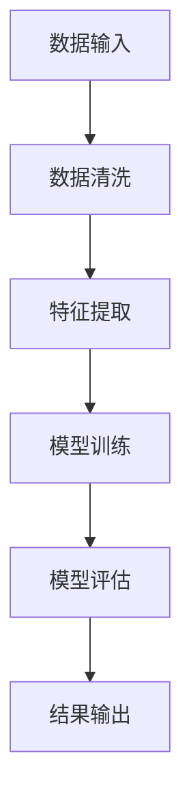
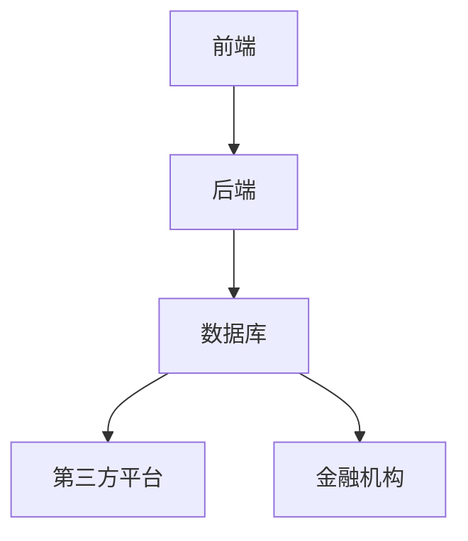
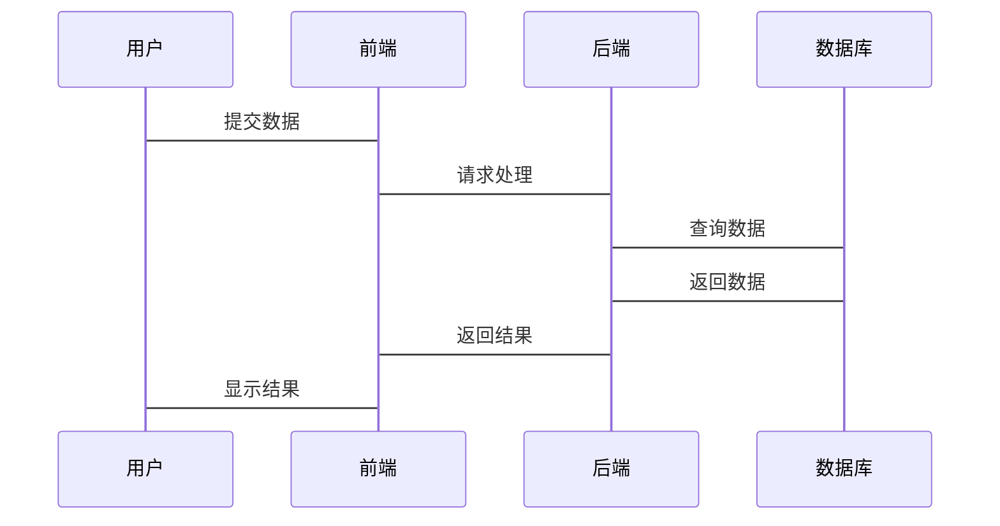

                 


# 智能供应链金融额度管理系统

## 关键词：供应链金融，智能系统，额度管理，算法原理，系统架构，项目实战，最佳实践

## 摘要：本文系统地介绍了智能供应链金融额度管理系统的背景、核心概念、算法原理、系统架构、项目实现及最佳实践。通过详细分析供应链金融额度管理的现状与挑战，阐述了智能供应链金融的概念与核心要素。结合具体算法与代码实现，深入探讨了系统的实现过程，并通过实际案例分析展示了系统的应用价值。最后，本文总结了智能供应链金融额度管理系统的最佳实践，为相关领域的研究与实践提供了参考。

---

# 第一部分：智能供应链金融额度管理系统的背景与概念

## 第1章：供应链金融的现状与挑战

### 1.1 供应链金融的定义与特点

#### 1.1.1 供应链金融的定义
供应链金融（Supply Chain Finance，SCF）是指通过整合供应链上的资金流、信息流和物流，为供应链上的企业（如供应商、制造商、分销商和零售商）提供融资服务，以优化企业的现金流管理。

#### 1.1.2 供应链金融的核心特点
- **融资渠道多样化**：通过应收账款、存货质押、订单融资等多种方式为企业提供资金支持。
- **降低企业成本**：通过优化资金流动，减少库存积压和资金占用。
- **增强供应链稳定性**：通过资金支持，确保供应链各环节的顺利运作，降低供应链中断风险。

#### 1.1.3 供应链金融在企业中的作用
供应链金融不仅仅是为企业提供融资服务，更是通过整合供应链资源，优化企业间的合作关系，提升整体供应链效率。

---

### 1.2 供应链金融额度管理的现状

#### 1.2.1 传统供应链金融额度管理的问题
- **信息孤岛**：供应链上的企业信息分散，难以形成统一的额度评估标准。
- **人工干预过多**：额度评估依赖人工审核，效率低且易出错。
- **风险控制不足**：传统额度管理难以实时监控供应链中的风险变化。

#### 1.2.2 当前供应链金融额度管理的技术瓶颈
- **数据碎片化**：供应链上的数据分布在不同企业，难以整合。
- **缺乏智能化工具**：额度评估过程缺乏人工智能技术支持，难以实现精准预测和动态调整。
- **安全性与隐私保护**：数据共享过程中存在安全风险和隐私泄露问题。

#### 1.2.3 智能化管理的必要性
- **提升效率**：通过智能化工具实现自动化额度评估和动态调整。
- **降低风险**：利用大数据和人工智能技术实时监控供应链风险。
- **增强企业间信任**：通过智能化管理实现透明化和高效的信息共享。

---

## 第2章：智能供应链金融额度管理系统的概念

### 2.1 智能供应链金融的定义
智能供应链金融是指通过人工智能、大数据、区块链等技术，整合供应链上的信息流、资金流和物流，实现智能化的融资服务和风险控制。

### 2.2 系统的核心概念与联系

#### 2.2.1 核心概念原理
智能供应链金融额度管理系统通过整合供应链上的数据，利用机器学习算法进行风险评估和额度预测，实现智能化的额度管理。

#### 2.2.2 核心概念属性特征对比表格
以下表格对比了传统供应链金融和智能供应链金融在额度管理方面的核心概念属性特征：

| 属性 | 传统供应链金融 | 智能供应链金融 |
|------|----------------|----------------|
| 数据来源 | 单一企业数据 | 多家企业数据整合 |
| 数据处理 | 人工处理 | 自动化处理 |
| 风险评估 | 事后评估 | 实时评估 |
| 额度调整 | 定期调整 | 动态调整 |

#### 2.2.3 ER实体关系图架构
以下是智能供应链金融额度管理系统的ER实体关系图：

```mermaid
erDiagram
    actor 企业A
    actor 企业B
    actor 企业C
    database 供应链数据
    database 金融机构数据
    actor 金融机构
    actor 第三方平台
    企业A --> 供应链数据: 提供数据
    企业B --> 供应链数据: 提供数据
    企业C --> 供应链数据: 提供数据
    金融机构 --> 供应链数据: 获取数据
    第三方平台 --> 供应链数据: 整合数据
    第三方平台 --> 金融机构: 提供评估报告
```

---

# 第二部分：智能供应链金融额度管理系统的算法原理

## 第3章：算法原理与实现

### 3.1 算法原理

#### 3.1.1 数据预处理
数据预处理是智能供应链金融额度管理系统的基石。以下是数据预处理的主要步骤：

1. **数据清洗**：去除重复数据、缺失数据和异常数据。
2. **数据标准化**：将不同来源的数据统一到同一格式。
3. **数据增强**：通过数据变换提升模型的泛化能力。

#### 3.1.2 特征提取
特征提取是将原始数据转化为可用于模型训练的特征向量。以下是常用的特征提取方法：

1. **主成分分析（PCA）**：通过降维技术提取数据的主要特征。
2. **因子分析**：通过因子分析提取数据的潜在特征。

#### 3.1.3 模型训练
模型训练是通过机器学习算法对特征数据进行训练，得到可用于预测的模型。以下是常用的模型训练方法：

1. **线性回归**：用于预测连续型变量（如额度）。
2. **支持向量机（SVM）**：用于分类和回归问题。
3. **随机森林**：通过集成学习提升模型的准确性和稳定性。

#### 3.1.4 模型评估与优化
模型评估是通过交叉验证、ROC曲线等方法对模型的性能进行评估，并通过超参数调优和模型集成优化模型的性能。

---

### 3.2 算法流程图

以下是智能供应链金融额度管理系统的算法流程图：



---

### 3.3 代码实现

以下是智能供应链金融额度管理系统的Python代码实现示例：

```python
# 数据预处理
import pandas as pd
data = pd.read_csv('data.csv')
data_cleaned = data.dropna()

# 特征提取
features = data_cleaned[['feature1', 'feature2', 'feature3']]

# 模型训练
from sklearn.ensemble import RandomForestRegressor
model = RandomForestRegressor()
model.fit(features, target)

# 模型评估
from sklearn.metrics import mean_squared_error
predictions = model.predict(features)
mse = mean_squared_error(target, predictions)
print('均方误差:', mse)
```

---

## 第4章：系统分析与架构设计

### 4.1 系统分析

#### 4.1.1 问题场景介绍
智能供应链金融额度管理系统的目标是通过整合供应链上的数据，利用人工智能技术实现智能化的额度管理和风险控制。

#### 4.1.2 系统功能设计
以下是系统的功能设计：

1. **数据采集**：从供应链上的企业获取数据。
2. **数据处理**：对数据进行清洗、转换和增强。
3. **模型训练**：通过机器学习算法对数据进行训练，得到预测模型。
4. **额度评估**：根据模型预测结果，动态调整企业的信用额度。
5. **风险监控**：实时监控供应链中的风险，及时发出预警。

---

### 4.2 系统架构设计

#### 4.2.1 系统架构图
以下是系统的架构图：



#### 4.2.2 系统接口设计
系统接口设计包括以下内容：

1. **数据接口**：与供应链上的企业、金融机构和第三方平台进行数据交互。
2. **API接口**：提供RESTful API，供外部系统调用。
3. **通知接口**：实时通知用户额度变化和风险预警。

#### 4.2.3 系统交互流程
以下是系统的交互流程：



---

## 第5章：项目实战

### 5.1 环境安装

#### 5.1.1 安装Python
安装Python 3.8或更高版本。

#### 5.1.2 安装依赖库
安装以下依赖库：

```bash
pip install pandas scikit-learn mermaid4jupyter jupyterlab
```

---

### 5.2 系统核心实现

#### 5.2.1 核心代码实现
以下是系统的核心代码实现：

```python
import pandas as pd
from sklearn.ensemble import RandomForestRegressor
from sklearn.metrics import mean_squared_error

# 数据加载
data = pd.read_csv('data.csv')

# 数据清洗
data_cleaned = data.dropna()

# 特征提取
features = data_cleaned[['feature1', 'feature2', 'feature3']]

# 模型训练
model = RandomForestRegressor()
model.fit(features, target)

# 模型评估
predictions = model.predict(features)
mse = mean_squared_error(target, predictions)
print('均方误差:', mse)
```

---

### 5.3 案例分析

#### 5.3.1 案例背景
假设我们有一家汽车制造企业，需要为其供应商提供供应链金融额度管理服务。

#### 5.3.2 数据分析
以下是供应商的销售数据和财务数据：

| 供应商编号 | 销售额 | 利润率 | 库存周转率 |
|------------|--------|--------|------------|
| 001        | 100万  | 5%     | 2次/月     |
| 002        | 80万   | 4%     | 1.5次/月   |
| 003        | 120万  | 6%     | 3次/月     |

---

## 第6章：最佳实践、小结与注意事项

### 6.1 最佳实践

#### 6.1.1 数据安全与隐私保护
在数据共享和处理过程中，必须注意数据的安全性和隐私保护。

#### 6.1.2 模型优化与调优
通过超参数调优和模型集成提升模型的性能和准确性。

#### 6.1.3 系统监控与维护
建立完善的系统监控机制，及时发现和处理系统故障。

---

### 6.2 小结

智能供应链金融额度管理系统通过整合供应链上的数据，利用人工智能技术实现智能化的额度管理和风险控制。本文详细介绍了系统的背景、核心概念、算法原理、系统架构和项目实现，并总结了系统的最佳实践。

---

### 6.3 注意事项

1. **数据隐私保护**：在数据共享和处理过程中，必须遵守相关法律法规，保护数据隐私。
2. **模型可解释性**：模型的可解释性是智能供应链金融额度管理系统的的重要特征，需要在模型设计中予以考虑。
3. **系统稳定性**：系统的稳定性是确保供应链金融业务顺利运行的关键，需要建立完善的系统监控和应急机制。

---

### 6.4 拓展阅读

1. **《机器学习实战》**：深入理解机器学习算法的实现和应用。
2. **《区块链技术与应用》**：了解区块链技术在供应链金融中的应用。
3. **《智能供应链管理》**：探索智能供应链管理的前沿技术和实践案例。

---

通过本文的详细介绍，读者可以全面了解智能供应链金融额度管理系统的实现过程和应用价值，并为进一步的研究和实践提供参考。

