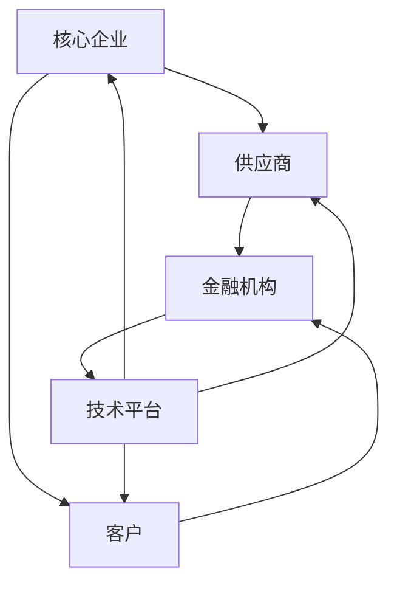
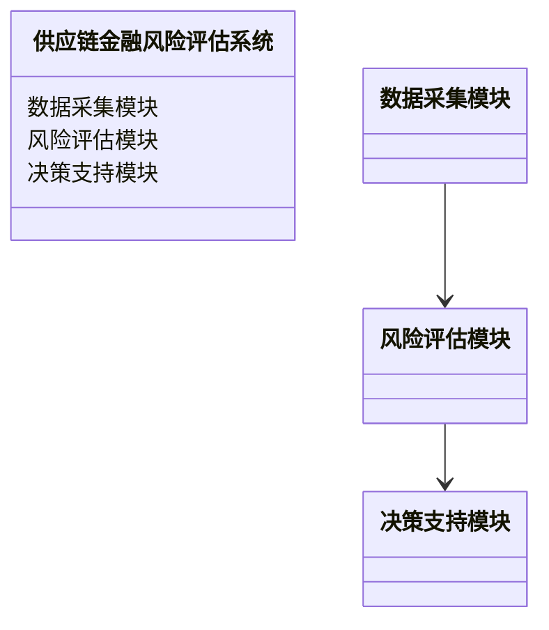

                 


# 智能供应链金融风险评估

## 关键词
智能供应链，金融风险，供应链金融，风险管理，人工智能，大数据

## 摘要
智能供应链金融风险评估是结合供应链管理和金融科技的重要领域，利用人工智能和大数据技术，通过智能算法和系统架构设计，实现对供应链金融风险的高效评估和管理。本文将从背景、核心概念、算法原理、系统架构、项目实战等多个方面详细探讨智能供应链金融风险评估的实现方法和应用。

---

# 第1章 供应链金融与智能供应链金融概述

## 1.1 供应链金融的定义与特点
### 1.1.1 供应链金融的定义
供应链金融是指通过整合供应链上的企业（如供应商、制造商、分销商和零售商）的资信状况，为其提供融资服务的一种金融模式。其目的是优化企业间的资金流动，降低供应链整体的金融风险。

### 1.1.2 供应链金融的核心特点
- **整体性**：关注整个供应链的流动性和稳定性，而非单一企业。
- **协作性**：依赖供应链上下游企业的协作与信任。
- **融资方式多样性**：包括应收账款质押、存货质押等多种融资方式。

### 1.1.3 供应链金融的参与者与角色
- **核心企业**：供应链中的主导企业，通常是制造商或零售商。
- **供应商**：为供应链提供原材料或服务的企业。
- **金融机构**：提供融资服务的银行或其他金融机构。
- **技术平台**：提供智能风控和数据分析支持的技术服务商。

## 1.2 智能供应链金融的定义与特点
### 1.2.1 智能供应链金融的定义
智能供应链金融是通过人工智能、大数据和区块链等技术，实现对供应链金融业务的智能化管理，包括风险评估、融资决策和流程优化。

### 1.2.2 智能供应链金融的核心要素
- **数据采集**：整合供应链上企业的经营数据、财务数据和交易数据。
- **智能分析**：利用机器学习模型对数据进行分析，识别潜在风险。
- **自动化决策**：基于分析结果，自动化生成融资方案或预警信息。

### 1.2.3 智能供应链金融与传统供应链金融的区别
| 特性 | 传统供应链金融 | 智能供应链金融 |
|------|----------------|----------------|
| 数据来源 | 依赖企业财报和历史数据 | 包括实时交易数据、物流数据和市场数据 |
| 分析方法 | 主要依赖人工审核和经验判断 | 基于机器学习和大数据分析 |
| 决策效率 | 较低，依赖人工处理 | 高效，自动化决策 |

## 1.3 供应链金融风险评估的必要性
### 1.3.1 供应链金融中的主要风险类型
- **信用风险**：供应链上下游企业因经营不善或恶意拖欠导致的违约风险。
- **操作风险**：因流程复杂、信息不对称导致的操作失误风险。
- **市场风险**：市场波动对供应链整体稳定性的影响。

### 1.3.2 风险评估在供应链金融中的作用
- **降低融资风险**：通过风险评估，金融机构可以更精准地评估企业的信用状况，降低坏账率。
- **优化资源配置**：通过识别高风险企业，优化资金分配，提高整体供应链的稳定性。
- **提升效率**：通过自动化风险评估，减少人工审核的时间和成本。

### 1.3.3 智能供应链金融风险评估的优势
- **实时性**：基于实时数据，能够快速识别潜在风险。
- **准确性**：利用机器学习模型，提高风险评估的准确性。
- **可扩展性**：能够处理海量数据，适用于大规模供应链金融业务。

## 1.4 本章小结
本章介绍了供应链金融和智能供应链金融的基本概念、特点以及两者之间的区别。通过对比分析，强调了智能供应链金融在风险评估方面的优势和必要性。

---

# 第2章 智能供应链金融风险评估的核心概念

## 2.1 智能供应链金融风险评估的定义
智能供应链金融风险评估是指利用人工智能和大数据技术，对供应链金融中的风险因素进行识别、量化和预测的过程，旨在为金融机构提供科学的决策依据。

## 2.2 核心概念与联系
### 2.2.1 供应链金融与风险管理的关系
供应链金融的核心目标是优化资金流动，而风险管理是实现这一目标的关键手段。通过有效的风险管理，可以降低供应链的整体风险，保障供应链的稳定运行。

### 2.2.2 智能技术在风险评估中的应用
人工智能和大数据技术在风险评估中的应用主要体现在以下几个方面：
- **数据采集与处理**：利用爬虫、API接口等技术，采集供应链上企业的经营数据、交易数据和市场数据。
- **特征提取**：通过自然语言处理（NLP）和统计分析，提取关键特征，如企业的偿债能力、运营能力和盈利能力。
- **模型训练**：利用机器学习算法（如逻辑回归、随机森林、支持向量机等）训练风险评估模型。

### 2.2.3 风险评估与企业决策的关系
风险评估结果可以直接影响企业的融资决策和供应链管理策略。例如，识别出高风险企业后，金融机构可以采取调整融资额度、增加质押比例等措施，降低风险敞口。

## 2.3 核心概念原理
### 2.3.1 供应链金融风险的来源与特征
供应链金融风险的主要来源包括：
- **企业经营风险**：企业自身经营状况不佳，如销售额下降、利润减少等。
- **行业风险**：行业整体波动，如市场需求下降、政策变化等。
- **金融风险**：融资成本上升、流动性风险等。

### 2.3.2 智能供应链金融风险评估的原理
智能供应链金融风险评估的原理可以概括为以下四个步骤：
1. **数据采集**：从供应链上的企业和外部数据源获取相关信息。
2. **特征提取**：将原始数据转化为可量化的特征，如财务指标、市场指标等。
3. **模型训练**：利用机器学习算法训练风险评估模型。
4. **风险预测**：基于模型预测企业的信用风险等级或违约概率。

### 2.3.3 风险评估的数学模型与公式
在智能供应链金融风险评估中，常用的数学模型包括：
- **层次分析法（AHP）**：用于确定各个风险因素的权重。
  $$ AHP权重 = \frac{\lambda_{max} - 1}{\sum_{i} \lambda_i - n} $$
- **贝叶斯网络**：用于构建风险因素之间的概率关系。
  $$ P(A|B) = \frac{P(B|A)P(A)}{P(B)} $$
- **逻辑回归**：用于分类问题，预测企业的违约概率。
  $$ P(Y=1|X) = \frac{e^{X\beta}}{1 + e^{X\beta}} $$

## 2.4 实体关系图
以下是智能供应链金融风险评估的实体关系图，展示了供应链金融中的主要实体及其关系。



---

# 第3章 风险评估的算法原理

## 3.1 层次分析法（AHP）原理
层次分析法是一种常用的决策分析方法，适用于多因素决策问题。以下是层次分析法的步骤：

### 3.1.1 确定决策层次
将决策问题分解为多个层次，包括目标层、准则层和方案层。

### 3.1.2 构建判断矩阵
根据专家意见，构建准则层各因素的判断矩阵。

### 3.1.3 计算权重
通过计算判断矩阵的最大特征值和特征向量，确定各因素的权重。

## 3.2 贝叶斯网络原理
贝叶斯网络是一种基于概率论的图形化模型，适用于处理不确定性问题。以下是贝叶斯网络的构建步骤：

### 3.2.1 确定变量
识别与风险评估相关的变量，如企业的财务状况、行业趋势等。

### 3.2.2 构建网络结构
根据变量之间的依赖关系，构建贝叶斯网络的有向无环图（DAG）。

### 3.2.3 定义概率分布
为每个节点定义概率分布，通常采用最大似然估计或贝叶斯估计。

## 3.3 机器学习算法的应用
### 3.3.1 算法选择
常用的机器学习算法包括逻辑回归、随机森林、支持向量机（SVM）等。

### 3.3.2 数据预处理
包括数据清洗、特征工程、数据归一化等步骤。

### 3.3.3 模型训练
利用训练数据训练机器学习模型，调整模型参数以优化性能。

### 3.3.4 模型评估
通过交叉验证、ROC曲线等方法评估模型的性能。

---

# 第4章 系统架构设计

## 4.1 系统功能设计
### 4.1.1 领域模型
以下是智能供应链金融风险评估系统的领域模型：



### 4.1.2 系统架构
以下是系统的分层架构图：

```mermaid
layeredDiagram
    layer 前端 {
        前端界面
    }
    layer 后端 {
        业务逻辑层
        数据访问层
    }
    layer 数据库 {
        数据库
    }
    前端 --> 业务逻辑层
    业务逻辑层 --> 数据访问层
    数据访问层 --> 数据库
```

## 4.2 系统接口设计
### 4.2.1 数据接口
- 数据接口1：从企业获取财务数据
- 数据接口2：从物流平台获取物流数据
- 数据接口3：从市场分析平台获取市场数据

### 4.2.2 API接口
- API1：获取企业的信用评分
- API2：获取行业的风险指数
- API3：获取企业的历史违约记录

## 4.3 系统交互流程
以下是系统的交互流程图：

```mermaid
sequenceDiagram
    用户 --> 系统：提交企业信息
    系统 --> 数据采集模块：获取企业数据
    数据采集模块 --> 风险评估模块：进行风险评估
    风险评估模块 --> 决策支持模块：生成风险报告
    系统 --> 用户：返回风险评估结果
```

---

# 第5章 项目实战

## 5.1 环境安装
### 5.1.1 安装Python
```bash
# 安装Python
sudo apt-get install python3 python3-pip
```

### 5.1.2 安装依赖库
```bash
# 安装pandas、numpy、scikit-learn
pip install pandas numpy scikit-learn
```

## 5.2 核心实现源代码
以下是风险评估模型的实现代码：

```python
import pandas as pd
from sklearn.model_selection import train_test_split
from sklearn.linear_model import LogisticRegression
from sklearn.metrics import accuracy_score

# 加载数据
data = pd.read_csv('supply_chain_risk.csv')

# 数据预处理
X = data.drop('label', axis=1)
y = data['label']

# 划分训练集和测试集
X_train, X_test, y_train, y_test = train_test_split(X, y, test_size=0.2)

# 训练模型
model = LogisticRegression()
model.fit(X_train, y_train)

# 模型预测
y_pred = model.predict(X_test)

# 评估模型
print("Accuracy:", accuracy_score(y_test, y_pred))
```

## 5.3 代码解读与分析
1. **数据加载**：从CSV文件中加载数据。
2. **数据预处理**：删除目标变量，将数据分为特征矩阵和目标向量。
3. **数据划分**：将数据划分为训练集和测试集。
4. **模型训练**：使用逻辑回归算法训练模型。
5. **模型预测**：利用训练好的模型进行预测。
6. **模型评估**：计算模型的准确率。

## 5.4 案例分析
假设我们有一个汽车制造企业的数据，模型可以预测该企业的违约概率，并提供相应的风险评估报告。

---

# 第6章 最佳实践与总结

## 6.1 小结
本章从多个角度详细探讨了智能供应链金融风险评估的核心概念、算法原理和系统设计。通过实际案例分析，展示了如何利用智能技术提高风险评估的准确性和效率。

## 6.2 注意事项
- 数据质量是风险评估的关键，需要确保数据的完整性和准确性。
- 模型的选择需要根据具体业务需求和数据特征进行调整。
- 系统设计需要考虑可扩展性和可维护性。

## 6.3 拓展阅读
- 《供应链金融：理论、实践与创新》
- 《机器学习实战》
- 《贝叶斯网络原理与应用》

---

# 结语
智能供应链金融风险评估是一项复杂但极具价值的工程。通过结合人工智能和大数据技术，可以有效降低供应链金融的风险，提升企业的竞争力。希望本文能为读者提供有价值的参考和启示。

