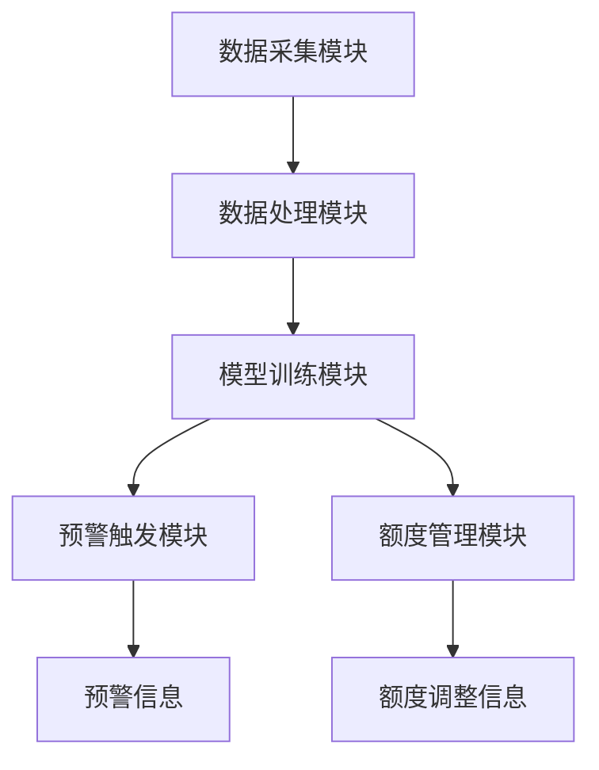
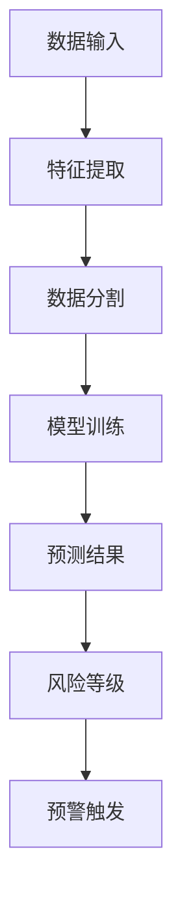
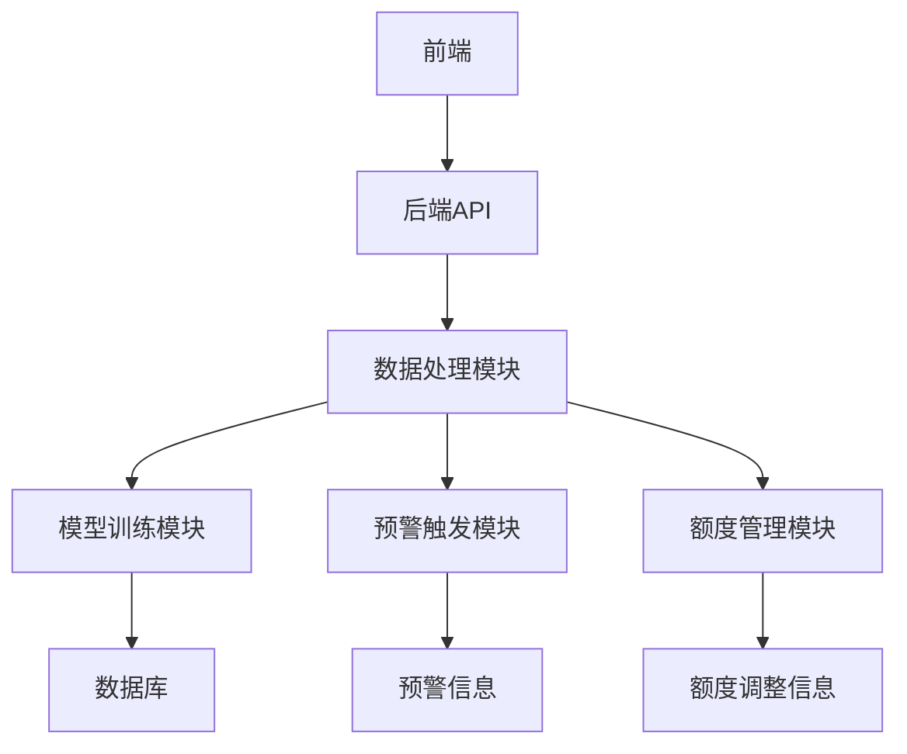
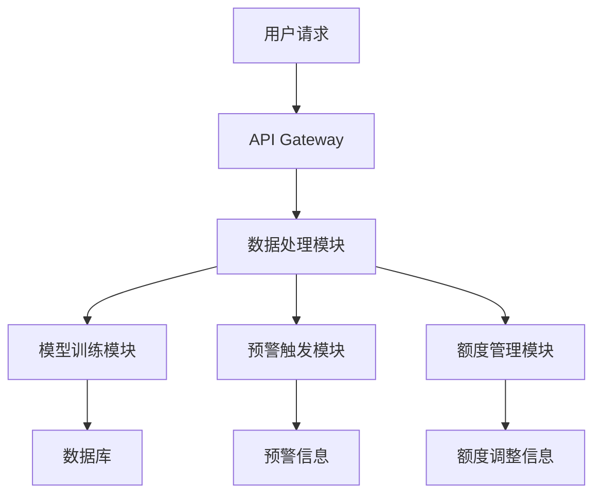

                 


# 智能供应链金融风险预警与额度管理系统

> 关键词：智能供应链金融、风险预警、额度管理、机器学习、大数据、系统架构

> 摘要：本文详细探讨智能供应链金融风险预警与额度管理系统的构建与实现。通过分析供应链金融的核心问题，结合人工智能与大数据技术，提出基于机器学习的风险预警算法和数据驱动的额度管理方法。文章内容包括系统背景、核心概念、算法原理、系统架构、项目实战及最佳实践，为读者提供从理论到实践的全面指导。

---

## 第一部分: 智能供应链金融风险预警与额度管理系统的背景与概念

### 第1章: 智能供应链金融的背景与问题背景

#### 1.1 供应链金融的基本概念

供应链金融是指通过整合供应链上下游企业的资源和数据，为其提供融资、结算、风险管理等服务的金融模式。其核心在于利用供应链中的信息流、资金流和物流，优化企业间的合作关系，降低金融风险。

- **特点**：
  - **数据驱动**：依赖于供应链中的交易数据、物流数据和信用数据。
  - **多方参与**：涉及核心企业、供应商、分销商、银行等多方主体。
  - **场景化**：针对特定供应链场景设计金融产品和服务。

- **核心参与者**：
  - **核心企业**：供应链中的主导企业，如制造企业或大型零售商。
  - **供应商**：为下游企业提供原材料或服务的企业。
  - **分销商**：负责产品销售的下游企业。
  - **银行及金融机构**：提供融资、信贷等金融服务的机构。

#### 1.2 智能供应链金融的兴起

智能供应链金融是传统供应链金融的升级版，借助人工智能（AI）和大数据技术，实现金融业务的智能化和自动化。其兴起主要得益于以下因素：

- **技术驱动**：AI和大数据技术的进步使得供应链数据的分析和处理能力大大提升。
- **行业需求**：企业对高效、透明的金融服务需求日益增长，传统供应链金融模式难以满足。
- **政策支持**：政府鼓励供应链金融创新，支持企业通过数字化手段降低融资成本。

智能供应链金融的优势在于：

- **提高效率**：通过自动化流程减少人工干预，提升金融服务效率。
- **降低风险**：利用AI技术实时监控供应链风险，提前预警潜在问题。
- **数据驱动决策**：基于海量数据进行精准分析，优化金融资源配置。

#### 1.3 供应链金融中的风险与问题

传统供应链金融面临的主要风险和问题包括：

- **信息不对称**：供应链上下游企业之间信息不透明，导致融资困难。
- **信用风险**：供应商或分销商可能因经营不善或恶意违约导致金融损失。
- **操作风险**：传统人工审核流程复杂，容易出错，效率低下。
- **缺乏透明性**：供应链金融过程缺乏透明的监控机制，难以实时掌握企业动态。

智能供应链金融通过技术手段有效降低这些风险，实现对供应链的全面监控和管理。

---

### 第2章: 智能供应链金融风险预警与额度管理的核心概念

#### 2.1 智能供应链金融风险预警的定义与原理

风险预警是智能供应链金融系统中的重要功能，旨在通过实时监控供应链中的各种风险因素，及时发出预警信号，避免或减少潜在损失。

- **定义**：基于供应链数据和AI算法，对潜在风险进行预测和预警的系统。
- **核心要素**：
  - **数据源**：包括供应链交易数据、物流数据、信用评分等。
  - **算法模型**：如机器学习算法，用于预测风险事件。
  - **预警机制**：设定风险阈值，当风险指标超过阈值时触发预警。

- **实现流程**：
  1. 数据收集：从供应链各环节获取相关数据。
  2. 数据处理：清洗、转换和特征提取。
  3. 模型训练：基于历史数据训练风险预测模型。
  4. 风险评估：实时监控数据，评估当前风险等级。
  5. 预警触发：当风险超过阈值时，向相关人员发送预警信息。

#### 2.2 智能供应链金融额度管理的定义与原理

额度管理是智能供应链金融系统中的另一个核心功能，旨在根据企业的信用状况和供应链数据，动态调整其融资额度，确保资金合理分配。

- **定义**：基于企业信用评估和供应链数据，动态计算企业可获得的融资额度。
- **核心要素**：
  - **信用评估**：通过对企业财务状况、历史交易记录等进行评估，确定企业的信用等级。
  - **供应链数据**：包括订单数据、物流数据、库存数据等。
  - **动态调整机制**：根据企业实时数据变化，调整其融资额度。

- **实现流程**：
  1. 信用评估：基于企业历史数据和外部信用评分，评估企业信用状况。
  2. 数据分析：结合供应链数据，计算企业的融资需求和风险敞口。
  3. 额度计算：根据信用评估和数据分析结果，动态调整融资额度。
  4. 额度监控：实时跟踪企业的经营状况，及时调整额度。

#### 2.3 智能供应链金融风险预警与额度管理的系统架构

智能供应链金融系统的架构设计需要考虑系统的可扩展性、实时性和安全性。以下是系统架构的核心要素：

- **模块划分**：
  - **数据采集模块**：负责从供应链各环节采集数据。
  - **数据处理模块**：对采集到的数据进行清洗、转换和特征提取。
  - **模型训练模块**：基于历史数据训练风险预测和额度计算模型。
  - **预警触发模块**：实时监控数据，触发风险预警。
  - **额度管理模块**：根据实时数据动态调整融资额度。

- **系统架构图**：



- **核心流程**：
  1. 数据采集：从供应链各环节获取交易数据、物流数据、信用评分等。
  2. 数据处理：清洗数据，提取特征，为模型训练做准备。
  3. 模型训练：使用机器学习算法训练风险预测和额度计算模型。
  4. 实时监控：持续采集实时数据，输入模型进行风险评估和额度计算。
  5. 预警与调整：根据模型输出结果，触发预警或调整融资额度。

---

## 第二部分: 智能供应链金融风险预警与额度管理系统的算法原理

### 第3章: 风险预警算法原理

#### 3.1 基于机器学习的供应链金融风险预测模型

- **机器学习在风险预测中的应用**：
  - **监督学习**：用于分类问题，如预测企业是否违约。
  - **无监督学习**：用于聚类问题，如发现异常交易。

- **常见机器学习算法及其适用场景**：
  - **决策树**：适用于分类问题，适合处理非线性关系。
  - **随机森林**：适用于特征重要性分析和高维数据处理。
  - **支持向量机（SVM）**：适用于小样本数据分类。
  - **神经网络**：适用于复杂非线性关系的建模。

- **基于决策树的供应链风险预测模型**：


- **基于随机森林的供应链风险预测模型**：


#### 3.2 基于时间序列分析的风险预警算法

- **时间序列分析的基本概念**：
  - 时间序列：按时间顺序排列的数据序列。
  - 时间序列分析：通过对历史数据的分析，预测未来的趋势。

- **基于ARIMA模型的风险预测**：
  - **ARIMA模型**：自回归积分滑动平均模型，适用于线性时间序列数据。
  - **实现步骤**：
    1. 数据预处理：检查数据的平稳性，进行差分处理。
    2. 模型参数确定：通过AIC准则选择最优参数。
    3. 模型训练与验证：使用历史数据训练模型，并验证其预测能力。
    4. 预测与预警：基于模型预测未来风险，并设置预警阈值。

- **基于LSTM模型的风险预测**：
  - **LSTM模型**：长短期记忆网络，适用于非线性时间序列数据。
  - **实现步骤**：
    1. 数据预处理：将时间序列数据转换为适合LSTM输入的格式。
    2. 模型构建：定义LSTM网络结构，包括输入层、LSTM层、全连接层和输出层。
    3. 模型训练：使用历史数据训练模型，并调整超参数。
    4. 预测与预警：基于LSTM模型预测未来风险，并触发预警。

#### 3.3 风险预警算法的实现步骤与流程图

- **实现步骤**：
  1. 数据预处理：清洗数据，提取特征。
  2. 模型选择：根据数据特点选择合适的算法。
  3. 模型训练：基于历史数据训练模型。
  4. 模型验证：通过验证数据评估模型性能。
  5. 实时预测：将实时数据输入模型，预测风险等级。
  6. 预警触发：当预测风险超过阈值时，触发预警。

- **流程图**：



---

### 第4章: 额度管理算法原理

#### 4.1 基于信用评分的额度计算方法

- **信用评分**：通过对企业的财务状况、历史交易记录等进行评估，确定企业的信用等级。
- **额度计算公式**：
  $$ \text{额度} = \frac{\text{信用评分} \times \text{年收入}}{1 + \text{风险系数}} $$

- **实现步骤**：
  1. 数据预处理：清洗企业信用数据，提取关键特征。
  2. 模型训练：基于历史数据训练信用评分模型。
  3. 额度计算：根据企业的信用评分和经营状况计算融资额度。
  4. 动态调整：根据企业实时数据调整融资额度。

#### 4.2 基于供应链数据的动态额度调整方法

- **供应链数据**：包括订单数据、物流数据、库存数据等。
- **动态调整公式**：
  $$ \text{额度} = \text{当前额度} + \Delta \text{额度} $$
  其中，$$ \Delta \text{额度} $$ 基于企业的最新数据动态调整。

- **实现步骤**：
  1. 数据采集：实时采集供应链数据。
  2. 数据分析：分析数据变化，评估企业风险。
  3. 额度调整：根据分析结果调整融资额度。
  4. 监控与反馈：实时监控额度调整效果，及时反馈调整结果。

---

## 第三部分: 智能供应链金融风险预警与额度管理系统的系统分析与架构设计

### 第5章: 系统分析与架构设计方案

#### 5.1 问题场景介绍

供应链金融系统需要解决的主要问题包括：

- **信息不对称**：供应链上下游企业之间信息不透明，导致融资困难。
- **风险高发**：供应商和分销商可能因经营不善或恶意违约导致金融损失。
- **效率低下**：传统人工审核流程复杂，效率低，容易出错。

智能供应链金融系统通过技术手段解决这些问题，实现高效、透明的金融服务。

#### 5.2 项目介绍

智能供应链金融风险预警与额度管理系统是一个基于人工智能和大数据技术的金融管理系统，旨在通过实时监控供应链中的风险因素，及时发出预警信号，并根据企业的信用状况和供应链数据，动态调整其融资额度。

#### 5.3 系统功能设计

- **功能模块划分**：
  - **数据采集模块**：负责从供应链各环节采集数据。
  - **数据处理模块**：对采集到的数据进行清洗、转换和特征提取。
  - **模型训练模块**：基于历史数据训练风险预测和额度计算模型。
  - **预警触发模块**：实时监控数据，触发风险预警。
  - **额度管理模块**：根据实时数据动态调整融资额度。

- **领域模型**：


#### 5.4 系统架构设计

- **系统架构图**：



- **系统交互流程图**：



---

## 第四部分: 智能供应链金融风险预警与额度管理系统的项目实战

### 第6章: 项目实战

#### 6.1 环境安装与配置

- **安装Python**：确保安装Python 3.8或更高版本。
- **安装依赖库**：安装`numpy`, `pandas`, `scikit-learn`, `xgboost`, `pymermaid`等库。
  ```bash
  pip install numpy pandas scikit-learn xgboost pymermaid
  ```

#### 6.2 核心代码实现

- **数据预处理代码**：
  ```python
  import pandas as pd
  import numpy as np

  # 读取数据
  data = pd.read_csv('supply_chain_data.csv')
  
  # 数据清洗
  data.dropna(inplace=True)
  data = pd.get_dummies(data)
  ```

- **模型训练代码**：
  ```python
  from sklearn.model

