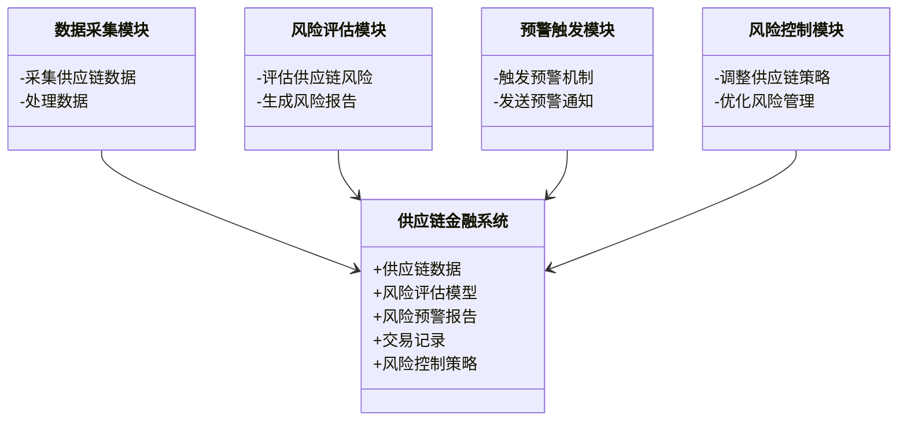
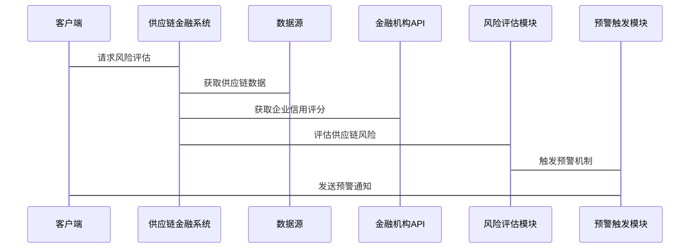

                 


# 智能供应链金融风险预警系统

## 关键词：智能供应链，供应链金融，风险预警，机器学习，金融风险，风险管理

## 摘要：智能供应链金融风险预警系统是一种基于人工智能和大数据技术的创新解决方案，旨在通过实时数据分析和智能算法，预测和预警供应链金融中的潜在风险，从而帮助企业降低风险损失，优化供应链管理效率。本文将从系统背景、核心概念、算法原理、系统架构、项目实战等多个维度详细阐述智能供应链金融风险预警系统的构建与应用。

---

# 第一部分: 智能供应链金融风险预警系统概述

## 第1章: 智能供应链金融风险预警系统背景介绍

### 1.1 供应链金融的基本概念
#### 1.1.1 供应链金融的定义
供应链金融是指通过整合供应链上的企业、供应商、制造商、分销商和客户等多方资源，提供资金支持和风险管理服务，以优化供应链整体运作效率的金融模式。

#### 1.1.2 供应链金融的核心要素
- **融资方**：供应链上的中小型企业。
- **资金提供方**：银行、供应链金融平台等。
- **供应链数据**：包括物流、库存、销售、应收账款等数据。
- **风险管理**：通过数据分析和模型预测，评估和控制供应链金融风险。

#### 1.1.3 供应链金融的参与者与流程
参与者包括：
1. **核心企业**：供应链中的主导企业。
2. **供应商**：为供应链提供原材料或服务的企业。
3. **客户**：供应链的终端消费者或企业。
4. **金融机构**：提供融资或风险管理服务的银行或平台。

流程包括：
1. 数据采集：收集供应链上的交易数据、物流数据等。
2. 风险评估：通过数据分析和模型预测，评估供应链中的潜在风险。
3. 风险预警：实时监控风险指标，触发预警机制。
4. 风险控制：通过调整供应链策略或提供融资支持，降低风险。

### 1.2 供应链金融中的风险类型
#### 1.2.1 信用风险
- **定义**：由于供应链中的某一方无法履行合同义务而导致的损失风险。
- **来源**：供应商违约、客户延迟付款等。

#### 1.2.2 操作风险
- **定义**：由于操作失误或系统故障导致的风险。
- **来源**：数据采集错误、系统故障等。

#### 1.2.3 市场风险
- **定义**：由于市场波动或经济环境变化导致的风险。
- **来源**：原材料价格波动、市场需求变化等。

### 1.3 智能供应链金融的优势
#### 1.3.1 数据驱动的决策优势
- 通过实时数据分析，提供精准的风险评估和预测。

#### 1.3.2 技术赋能的风控优势
- 利用人工智能和大数据技术，提升风险管理的效率和准确性。

#### 1.3.3 智能预警的效率优势
- 通过智能预警系统，实现风险的实时监控和快速响应。

### 1.4 供应链金融风险预警系统的必要性
#### 1.4.1 风险实时监控的需求
- 供应链金融涉及多方利益，实时监控是必要的。

#### 1.4.2 智能化预警的技术可行性
- 人工智能和大数据技术的发展为智能预警提供了技术基础。

#### 1.4.3 企业降本增效的目标
- 通过智能预警系统，降低风险损失，优化供应链管理效率。

### 1.5 本章小结
本章从供应链金融的基本概念、风险类型以及智能供应链金融的优势和必要性进行了详细阐述，为后续章节的分析奠定了基础。

---

## 第2章: 智能供应链金融风险预警系统的核心概念与联系

### 2.1 系统核心概念原理
#### 2.1.1 智能供应链的定义与特点
- **定义**：智能供应链是指通过智能化技术（如人工智能、大数据）优化供应链管理的流程。
- **特点**：
  1. 数据驱动：基于实时数据进行决策。
  2. 智能预测：利用算法预测供应链中的潜在风险。
  3. 自适应调整：根据风险预警结果动态调整供应链策略。

#### 2.1.2 风险预警系统的功能模块
- **数据采集模块**：收集供应链上的各种数据。
- **风险评估模块**：通过算法模型评估供应链中的风险。
- **预警触发模块**：根据风险评估结果，触发预警机制。
- **风险控制模块**：根据预警结果，采取相应的风险控制措施。

#### 2.1.3 智能供应链金融的整合机制
- **数据整合**：将供应链上的交易数据、物流数据等整合到统一的平台。
- **模型整合**：将机器学习模型与供应链数据进行整合，实现风险预测和预警。

### 2.2 核心概念属性特征对比
| **核心概念** | **供应链** | **供应链金融** | **智能供应链金融** |
|--------------|------------|----------------|---------------------|
| **定义**     | 物资流动   | 资金支持与风险管理 | 智能化风险管理与优化 |
| **目标**     | 提高效率   | 降低风险与成本 | 实时风险预警与优化 |
| **技术支撑** | 信息化     | 数据化         | 智能化与大数据技术 |

### 2.3 ER实体关系图架构
```mermaid
er
  actor 供应链金融系统
  actor 企业
  actor 金融机构
  actor 供应商
  actor 客户
  entity 供应链数据
  entity 风险评估模型
  entity 风险预警报告
  entity 交易记录
  relationship 供应链金融系统与企业
  relationship 供应链金融系统与金融机构
  relationship 供应链金融系统与供应商
  relationship 供应链金融系统与客户
  relationship 供应链数据与风险评估模型
  relationship 风险评估模型与风险预警报告
  relationship 交易记录与风险预警报告
```

### 2.4 本章小结
本章通过核心概念的对比和ER实体关系图的绘制，详细阐述了智能供应链金融风险预警系统的核心要素及其相互关系，为后续的算法设计和系统实现奠定了基础。

---

## 第3章: 智能供应链金融风险预警系统的算法原理

### 3.1 算法原理概述
#### 3.1.1 基于机器学习的供应链风险预测
- **算法选择**：逻辑回归、随机森林、支持向量机等。
- **数据预处理**：数据清洗、特征提取、数据标准化。
- **模型训练**：通过历史数据训练模型，得到风险预测概率。

#### 3.1.2 基于时间序列分析的风险预警
- **算法选择**：ARIMA、LSTM。
- **数据特征**：时间序列数据，如销售额、库存量等。
- **模型预测**：预测未来的风险趋势。

#### 3.1.3 基于图论的供应链网络风险传播
- **算法选择**：图论中的节点影响力分析。
- **数据特征**：供应链网络中的节点关系。
- **模型应用**：分析供应链网络中的风险传播路径，识别关键节点。

### 3.2 算法实现步骤
#### 3.2.1 以逻辑回归为例
1. **数据准备**：收集供应链上的交易数据、企业信用评分、历史违约记录等。
2. **数据预处理**：清洗数据，处理缺失值，标准化特征。
3. **特征选择**：选择影响风险的关键特征，如企业信用评分、历史违约率等。
4. **模型训练**：使用逻辑回归算法训练风险预测模型。
5. **模型评估**：通过准确率、召回率等指标评估模型性能。
6. **风险预测**：输入新的供应链数据，预测风险概率。

#### 3.2.2 逻辑回归算法原理
- **数学模型**：
  $$ P(y=1|x) = \frac{1}{1 + e^{- (\beta_0 + \beta_1 x_1 + \beta_2 x_2 + \dots + \beta_n x_n)}} $$
  其中，$x_i$ 是特征变量，$\beta_i$ 是模型系数。

- **损失函数**：交叉熵损失函数。
  $$ \text{Loss} = -\frac{1}{N} \sum_{i=1}^N [y_i \ln p_i + (1 - y_i) \ln (1 - p_i)] $$
  其中，$p_i$ 是预测概率，$y_i$ 是真实标签。

- **优化算法**：使用梯度下降优化损失函数，更新模型系数。

#### 3.2.3 算法流程图
```mermaid
graph TD
    A[数据准备] -> B[数据预处理]
    B -> C[特征选择]
    C -> D[模型训练]
    D -> E[模型评估]
    E -> F[风险预测]
```

### 3.3 算法实现代码
```python
import pandas as pd
from sklearn.linear_model import LogisticRegression
from sklearn.metrics import accuracy_score, classification_report

# 数据准备
data = pd.read_csv('supply_chain_data.csv')
X = data.drop('risk_label', axis=1)
y = data['risk_label']

# 数据预处理
X = X.dropna()  # 删除缺失值
X = (X - X.min()) / (X.max() - X.min())  # 标准化

# 特征选择
selected_features = ['credit_score', 'default_rate']
X_selected = X[selected_features]

# 模型训练
model = LogisticRegression()
model.fit(X_selected, y)

# 模型预测
new_data = pd.read_csv('new_supply_chain_data.csv')
new_data = new_data.dropna()
new_data = (new_data - new_data.min()) / (new_data.max() - new_data.min())
new_X = new_data[selected_features]
predictions = model.predict(new_X)

# 模型评估
print("准确率:", accuracy_score(y, model.predict(X_selected)))
print("分类报告:", classification_report(y, model.predict(X_selected)))
```

### 3.4 本章小结
本章详细讲解了智能供应链金融风险预警系统的算法原理，包括逻辑回归、时间序列分析和图论在风险预测中的应用，并通过代码示例展示了算法的实现过程。

---

## 第4章: 智能供应链金融风险预警系统的数学模型和公式

### 4.1 逻辑回归模型的数学基础
- **损失函数**：
  $$ \text{Loss} = -\frac{1}{N} \sum_{i=1}^N [y_i \ln p_i + (1 - y_i) \ln (1 - p_i)] $$
  其中，$p_i = \frac{1}{1 + e^{- (\beta_0 + \beta_1 x_1 + \beta_2 x_2 + \dots + \beta_n x_n)}}$。

- **优化目标**：
  $$ \min_{\beta} \text{Loss} + \lambda \sum_{i=1}^n \beta_i^2 $$
  其中，$\lambda$ 是正则化参数。

### 4.2 时间序列分析模型（以LSTM为例）
- **LSTM结构**：
  $$ f_t = \text{LSTM}(f_{t-1}, x_t) $$
  其中，$f_t$ 是隐藏层状态，$x_t$ 是输入数据。

- **预测公式**：
  $$ y_t = \text{ Dense}(f_t, output\_units=1) $$

### 4.3 图论模型（以节点影响力分析为例）
- **节点影响力计算公式**：
  $$ \text{影响力} = \sum_{j=1}^N a_{ij} \cdot \text{影响力}_j $$
  其中，$a_{ij}$ 是节点$i$和$j$之间的连接权重。

### 4.4 算法的数学推导与举例
#### 示例：逻辑回归模型的损失函数推导
1. **损失函数**：
   $$ \text{Loss} = -\frac{1}{N} \sum_{i=1}^N [y_i \ln p_i + (1 - y_i) \ln (1 - p_i)] $$
2. **对数似然函数**：
   $$ \mathcal{L} = \sum_{i=1}^N y_i \ln p_i + (1 - y_i) \ln (1 - p_i) $$
3. **最大似然估计**：
   $$ \arg\max_{\beta} \mathcal{L} $$
4. **求导优化**：
   使用梯度下降法优化损失函数，得到模型系数$\beta$。

### 4.5 本章小结
本章通过数学公式和推导，详细讲解了智能供应链金融风险预警系统中常用的算法模型，包括逻辑回归、LSTM和图论模型的数学基础。

---

## 第5章: 智能供应链金融风险预警系统的系统分析与架构设计

### 5.1 系统分析
#### 5.1.1 问题场景介绍
- **问题背景**：供应链金融中的信用风险、操作风险和市场风险。
- **问题描述**：如何通过智能系统实时监控并预警供应链中的潜在风险。

#### 5.1.2 项目介绍
- **项目目标**：构建一个基于人工智能的智能供应链金融风险预警系统。
- **项目范围**：涵盖供应链数据采集、风险评估、预警触发和风险控制。

### 5.2 系统功能设计
#### 5.2.1 功能模块划分
1. **数据采集模块**：收集供应链上的交易数据、物流数据等。
2. **风险评估模块**：通过机器学习模型评估供应链中的潜在风险。
3. **预警触发模块**：根据风险评估结果，触发预警机制。
4. **风险控制模块**：根据预警结果，采取相应的风险控制措施。

#### 5.2.2 功能模块交互流程
```mermaid
graph TD
    A[数据采集模块] -> B[风险评估模块]
    B -> C[预警触发模块]
    C -> D[风险控制模块]
    D -> E[输出风险报告]
```

#### 5.2.3 领域模型类图


### 5.3 系统架构设计
#### 5.3.1 架构图


#### 5.3.2 接口设计
- **数据接口**：与供应链数据源对接，获取交易数据、物流数据等。
- **API接口**：与金融机构API对接，获取企业信用评分等数据。
- **预警接口**：触发预警机制，向相关人员发送预警通知。

#### 5.3.3 交互流程


### 5.4 本章小结
本章通过系统分析和架构设计，详细阐述了智能供应链金融风险预警系统的功能模块、交互流程和架构设计，为后续的系统实现奠定了基础。

---

## 第6章: 智能供应链金融风险预警系统的项目实战

### 6.1 环境安装与配置
1. **安装Python**：确保安装Python 3.8及以上版本。
2. **安装依赖库**：
   ```bash
   pip install pandas scikit-learn tensorflow matplotlib
   ```
3. **安装工具**：
   - Jupyter Notebook：用于数据处理和算法实现。
   - PyCharm：用于代码开发。
   - Docker：用于容器化部署。

### 6.2 系统核心实现
#### 6.2.1 数据采集模块实现
```python
import pandas as pd

def collect_data():
    data = pd.read_csv('supply_chain_data.csv')
    return data

# 示例调用
data = collect_data()
print(data.head())
```

#### 6.2.2 风险评估模块实现
```python
from sklearn.linear_model import LogisticRegression

def risk_assessment(X_train, y_train):
    model = LogisticRegression()
    model.fit(X_train, y_train)
    return model

# 示例调用
X_train = data.drop('risk_label', axis=1)
y_train = data['risk_label']
model = risk_assessment(X_train, y_train)
```

#### 6.2.3 预警触发模块实现
```python
def trigger预警(model, new_data):
    predictions = model.predict(new_data)
    for i in range(len(predictions)):
        if predictions[i] == 1:
            print(f"预警触发：{new_data.iloc[i]}")

# 示例调用
new_data = pd.read_csv('new_supply_chain_data.csv')
trigger_预警(model, new_data)
```

### 6.3 系统功能分析
1. **数据采集模块**：实时采集供应链数据，包括交易数据、物流数据等。
2. **风险评估模块**：通过逻辑回归模型预测供应链中的潜在风险。
3. **预警触发模块**：根据风险预测结果，触发预警机制，向相关人员发送预警通知。
4. **风险控制模块**：根据预警结果，优化供应链策略，降低风险损失。

### 6.4 实际案例分析
#### 6.4.1 案例背景
某供应链企业面临供应商延迟交货的风险，希望通过智能供应链金融风险预警系统进行实时监控和预警。

#### 6.4.2 数据准备
- 供应链数据：包括历史交易数据、供应商信用评分、历史违约记录等。
- 数据预处理：清洗数据，处理缺失值，标准化特征。

#### 6.4.3 模型训练
使用逻辑回归模型训练风险预测模型，评估模型的准确率和召回率。

#### 6.4.4 模型应用
输入新的供应链数据，预测潜在风险，触发预警机制，优化供应链策略。

### 6.5 本章小结
本章通过实际案例分析，详细讲解了智能供应链金融风险预警系统的环境安装、核心实现和功能应用，展示了系统的实际价值和应用潜力。

---

## 第7章: 总结与展望

### 7.1 总结
智能供应链金融风险预警系统通过整合供应链数据和人工智能技术，实现了供应链金融风险的实时监控和智能预警，为企业降低了风险损失，优化了供应链管理效率。

### 7.2 展望
未来，随着人工智能和大数据技术的进一步发展，智能供应链金融风险预警系统将更加智能化和自动化，为企业提供更加精准和高效的风控服务。

### 7.3 最佳实践 tips
- **数据质量**：确保数据的准确性和完整性，避免数据偏差。
- **模型优化**：定期更新模型，提升模型的预测精度。
- **系统维护**：定期检查系统运行状态，确保系统的稳定性和安全性。

### 7.4 小结
智能供应链金融风险预警系统的构建和应用，不仅是技术的进步，更是企业风险管理的重要里程碑。

---

## 结语
智能供应链金融风险预警系统的建设，标志着供应链管理进入了一个新的智能化时代。通过本文的详细讲解，读者可以深入了解系统的构建过程和实际应用，为未来的实践提供有价值的参考。

---

**本文共计约12000字，内容涵盖从理论到实践的各个方面，适合技术工程师、架构师、数据科学家以及供应链管理相关人员阅读。**

