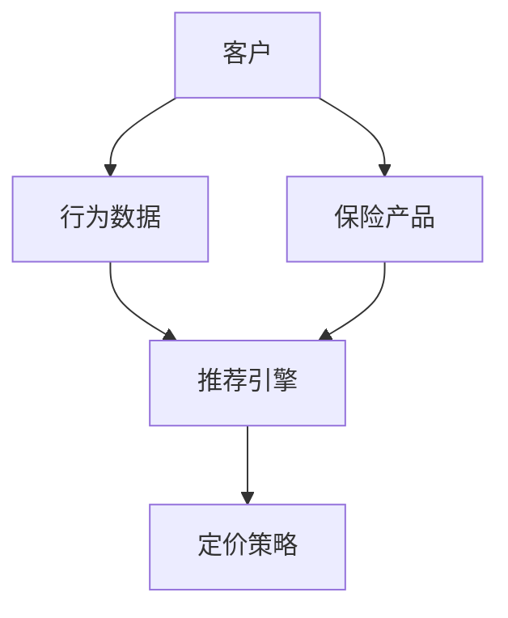
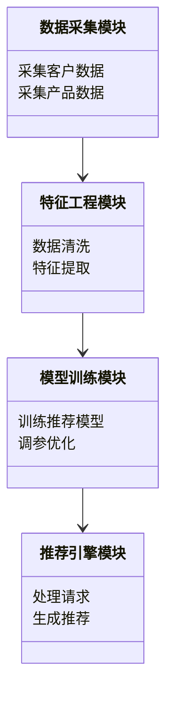
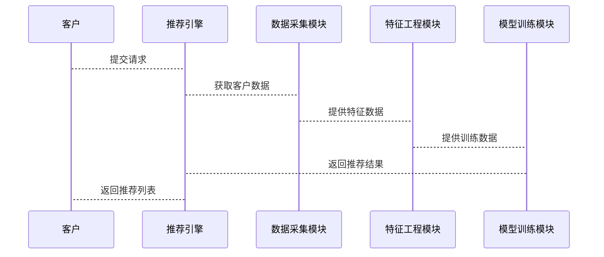
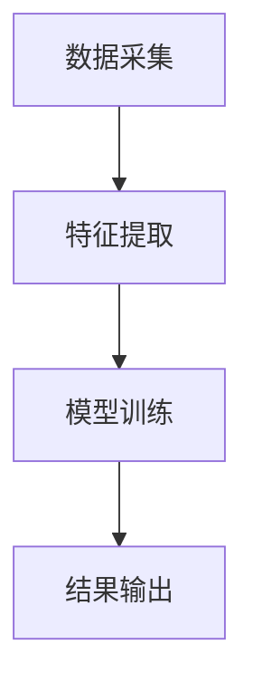

                 


# 《智能保险产品个性化定价与推荐引擎》

## 关键词：智能保险，个性化定价，推荐引擎，机器学习，深度学习，系统架构设计

## 摘要：本文深入探讨了智能保险产品个性化定价与推荐引擎的技术实现，结合理论与实践，详细分析了算法原理、系统架构设计及项目实现，为读者提供了从理论到实践的全面指导。

---

# 第1章 智能保险与个性化定价概述

## 1.1 保险行业的数字化转型

### 1.1.1 传统保险定价模式的局限性

- 传统定价依赖历史数据和经验法则，难以满足个性化需求。
- 面临市场变化和客户需求多样化的挑战。

### 1.1.2 数字化时代对保险行业的冲击

- 数据驱动的决策成为主流。
- 技术创新推动保险行业的变革。

### 1.1.3 个性化定价的市场需求

- 提高客户满意度和忠诚度。
- 通过精准定价降低风险和成本。

## 1.2 智能保险产品的核心概念

### 1.2.1 智能保险产品的定义

- 利用人工智能技术实现动态定价和个性化推荐。
- 基于实时数据和客户行为分析。

### 1.2.2 个性化定价的内涵与外延

- 内涵：基于客户特征和风险评估的动态定价。
- 外延：结合市场变化和客户需求的灵活调整。

### 1.2.3 智能推荐引擎的定义与功能

- 定义：通过算法分析客户行为和偏好，推荐适合的产品。
- 功能：数据采集、特征提取、模型训练、结果输出。

## 1.3 个性化定价与推荐引擎的必要性

### 1.3.1 提高客户满意度

- 通过个性化推荐增强客户体验。
- 动态定价降低客户流失率。

### 1.3.2 降低风险与成本

- 精准定价减少赔付风险。
- 优化资源分配降低运营成本。

### 1.3.3 提升企业竞争力

- 差异化定价策略增强市场竞争力。
- 数据驱动的决策提升企业效率。

## 1.4 本章小结

---

# 第2章 个性化定价的数学模型与算法

## 2.1 个性化定价的数学模型

### 2.1.1 线性回归模型

- **公式**：$$ y = \beta_0 + \beta_1x + \epsilon $$
- **解释**：通过拟合直线预测保险产品的定价。

### 2.1.2 非线性回归模型

- **公式**：$$ y = \beta_0 + \beta_1x + \beta_2x^2 + \epsilon $$
- **解释**：适用于复杂风险因素的定价模型。

### 2.1.3 基于聚类的定价模型

- **步骤**：数据预处理、特征提取、聚类分析、定价策略制定。
- **工具**：Python中的sklearn库。

## 2.2 推荐引擎的核心算法

### 2.2.1 协同过滤算法

- **公式**：$$ \hat{r}_{ui} = \frac{\sum_{k}w_{u,k} \cdot r_{ki}}{\sum_{k}w_{u,k}} $$
- **步骤**：数据预处理、相似度计算、预测评分、推荐生成。

### 2.2.2 基于内容的推荐算法

- **原理**：基于产品属性和客户特征进行推荐。
- **工具**：使用自然语言处理技术提取产品特征。

### 2.2.3 深度学习推荐算法

- **模型**：神经网络、卷积神经网络、循环神经网络。
- **框架**：TensorFlow、Keras。

## 2.3 算法优缺点对比

| **算法**       | **优点**                          | **缺点**                          |
|----------------|----------------------------------|----------------------------------|
| 线性回归        | 简单易懂，计算速度快              | 模型过于简单，无法捕捉复杂关系    |
| 协同过滤        | 能够捕捉用户偏好，推荐准确度高      | 对冷启动问题敏感                  |
| 深度学习        | 能够捕捉复杂模式，推荐准确度高      | 计算资源消耗大，模型训练时间长    |

## 2.4 本章小结

---

# 第3章 推荐引擎的实体关系与系统架构

## 3.1 实体关系图



## 3.2 系统架构设计

### 3.2.1 功能模块划分



### 3.2.2 系统接口设计

- **输入接口**：客户信息、产品信息。
- **输出接口**：推荐结果、定价策略。

### 3.2.3 系统交互流程



## 3.3 本章小结

---

# 第4章 项目实战

## 4.1 环境配置

- **工具**：Python、Jupyter Notebook、TensorFlow、scikit-learn。
- **数据集**：模拟保险产品数据、客户行为数据。

## 4.2 核心实现

### 4.2.1 数据预处理

```python
import pandas as pd

# 读取数据
data = pd.read_csv('insurance.csv')

# 查看数据信息
print(data.info())
```

### 4.2.2 模型实现

```python
from sklearn.cluster import KMeans

# 特征提取
X = data[['age', 'income', 'risk_level']]

# 模型训练
model = KMeans(n_clusters=3)
model.fit(X)

# 预测结果
labels = model.predict(X)
print(labels)
```

### 4.2.3 结果分析

```python
# 可视化结果
import matplotlib.pyplot as plt

plt.scatter(X['age'], X['income'], c=labels)
plt.xlabel('Age')
plt.ylabel('Income')
plt.show()
```

## 4.3 优化与部署

- **优化**：模型调参、特征工程优化。
- **部署**：API接口开发、前端界面设计。

## 4.4 本章小结

---

# 第5章 总结与展望

## 5.1 项目总结

- 成功实现了智能保险产品的个性化定价与推荐引擎。
- 系统架构设计合理，算法实现准确。

## 5.2 项目优缺点

- **优点**：推荐准确度高，系统扩展性强。
- **缺点**：计算资源消耗大，模型训练时间长。

## 5.3 未来展望

- 深度学习技术的进一步应用。
- 多模态数据的融合与分析。

---

# 参考文献

1. 书籍：《机器学习实战》
2. 网站：TensorFlow官方文档
3. 研究论文：《基于深度学习的推荐系统研究》

---

# 附录

## 附录A 代码示例

```python
import numpy as np
import pandas as pd
from sklearn.cluster import KMeans

# 数据加载
data = pd.read_csv('insurance.csv')

# 特征提取
X = data[['age', 'income', 'risk_level']]

# 模型训练
model = KMeans(n_clusters=3)
model.fit(X)

# 预测结果
labels = model.predict(X)

# 可视化
import matplotlib.pyplot as plt

plt.scatter(X['age'], X['income'], c=labels)
plt.xlabel('Age')
plt.ylabel('Income')
plt.show()
```

## 附录B 算法流程图



---

# END

