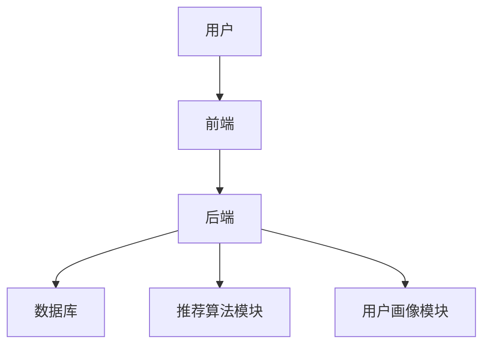

                 


# 智能保险产品个性化定制系统

> 关键词：智能保险，个性化定制，推荐算法，系统架构，机器学习

> 摘要：本文将详细介绍智能保险产品个性化定制系统的构建过程。从保险行业的现状与挑战出发，探讨个性化定制的必要性及其在保险产品中的核心作用。通过分析推荐算法的原理与实现，结合系统架构设计与项目实战，展示如何利用技术手段实现保险产品的智能化、个性化定制。本文将为保险行业及相关技术领域提供有价值的参考与实践指导。

---

# 第1章 智能保险产品个性化定制系统概述

## 1.1 保险行业现状与挑战

保险行业作为金融领域的重要组成部分，近年来随着科技的发展，正经历着深刻的变革。传统保险产品以标准化为主，难以满足用户的个性化需求。与此同时，市场竞争的加剧和用户需求的多样化，使得保险公司迫切需要通过技术创新来提升用户体验和市场竞争力。

### 1.1.1 传统保险产品的局限性
- **标准化产品**：传统保险产品通常基于固定的条款和保障范围，难以满足用户的个性化需求。
- **用户体验不足**：用户在购买保险时，往往需要面对复杂的产品组合和繁琐的流程，降低了购买体验。
- **成本高昂**：传统模式下，保险公司通过大规模销售标准化产品来降低成本，但在个性化需求日益增长的今天，这种模式已难以适应市场变化。

### 1.1.2 智能化时代保险行业的变革
- **技术驱动**：人工智能、大数据和机器学习等技术的应用，为保险产品的个性化定制提供了新的可能性。
- **用户体验提升**：通过智能化技术，保险公司可以为用户提供更精准、更个性化的保险方案，提升用户体验。
- **市场竞争力增强**：智能化的保险产品能够更好地满足用户需求，从而在市场竞争中占据优势。

### 1.1.3 个性化定制在保险行业中的重要性
个性化定制能够帮助保险公司更好地匹配用户需求，降低销售成本，同时提升用户满意度和忠诚度。通过个性化定制，保险公司可以实现从“以产品为中心”向“以用户为中心”的转变，从而在激烈的市场竞争中脱颖而出。

---

## 1.2 智能保险产品个性化定制的必要性

个性化定制不仅是技术进步的产物，更是市场发展的必然要求。以下从用户需求、市场竞争和技术可行性三个方面分析其必要性。

### 1.2.1 用户需求的多样化
- **用户画像**：不同用户群体有不同的保险需求。例如，年轻人可能更关注健康险，而中老年人可能更关注寿险或意外险。
- **场景化需求**：用户在不同场景下可能需要不同的保险产品组合。例如，旅游时需要旅游保险，工作时需要意外险。

### 1.2.2 市场竞争的压力
- **差异化竞争**：在保险行业中，差异化是提升市场竞争力的重要手段。个性化定制能够帮助保险公司实现差异化竞争。
- **客户流失风险**：如果保险公司无法提供个性化的保险方案，用户可能会转向竞争对手。

### 1.2.3 技术进步带来的可能性
- **数据驱动**：通过大数据分析，保险公司可以更好地了解用户需求，为个性化定制提供数据支持。
- **人工智能技术**：人工智能技术的应用，使得个性化定制的实现成为可能。例如，通过自然语言处理技术，可以更好地理解用户需求。

---

## 1.3 系统的核心功能与目标

智能保险产品个性化定制系统的核心目标是为用户提供个性化的保险产品定制服务。以下是系统的核心功能和目标：

### 1.3.1 核心功能模块概述
- **用户需求分析**：通过问卷调查、数据分析等方式，了解用户的具体需求。
- **产品组合优化**：根据用户需求，推荐最优的保险产品组合。
- **定制方案生成**：生成个性化的保险产品方案，并提供可视化展示。

### 1.3.2 系统的目标用户群体
- **目标用户**：包括个人用户和企业用户。个人用户可以通过系统定制个人保险方案，企业用户可以为员工定制团体保险方案。
- **用户画像**：系统需要根据用户的年龄、职业、收入、健康状况等因素，构建用户画像。

### 1.3.3 系统的预期效益
- **提升用户体验**：通过个性化定制，用户可以获得更符合自身需求的保险产品。
- **降低销售成本**：个性化定制可以减少无效销售，提高销售效率。
- **增强市场竞争力**：通过差异化竞争，提升公司在市场中的地位。

---

## 1.4 本章小结

本章从保险行业的现状与挑战出发，分析了个性化定制在保险行业中的重要性，并详细介绍了智能保险产品个性化定制系统的核心功能与目标。通过本章的介绍，读者可以了解智能保险产品个性化定制系统的背景和意义，为后续的技术实现奠定基础。

---

# 第2章 保险产品个性化定制的核心概念

## 2.1 保险产品的基本属性

保险产品的基本属性是理解个性化定制系统的基础。以下将从保险产品的定义、分类和生命周期三个方面进行分析。

### 2.1.1 保险产品的定义与分类
- **保险产品的定义**：保险产品是以特定风险为保障对象，通过合同形式提供风险保障的金融工具。
- **保险产品的分类**：常见的保险产品包括人寿保险、健康保险、财产保险、责任保险等。

### 2.1.2 保险产品的核心要素
- **保险金额**：保险公司在保险事故发生时承担的赔付金额。
- **保险期限**：保险合同的有效期限。
- **保险责任**：保险公司在保险合同中承担的赔偿或给付责任。

### 2.1.3 保险产品的生命周期
- **产品设计**：根据市场需求设计保险产品。
- **产品销售**：通过销售渠道将保险产品销售给客户。
- **产品理赔**：在保险事故发生时，根据合同进行赔付。

---

## 2.2 个性化定制的实现原理

个性化定制的实现原理是智能保险产品个性化定制系统的核心。以下将从客户需求分析、产品组合优化和定制方案生成三个方面进行分析。

### 2.2.1 客户需求分析
- **用户画像**：通过数据分析和问卷调查，构建用户的详细画像。
- **需求分析**：根据用户画像，分析用户的保险需求。

### 2.2.2 产品组合优化
- **数据驱动**：通过大数据分析，找到最优的产品组合。
- **算法支持**：利用推荐算法，优化产品组合。

### 2.2.3 定制方案生成
- **方案生成**：根据客户需求和产品组合，生成个性化的保险方案。
- **方案展示**：通过可视化工具，将定制方案展示给用户。

---

## 2.3 核心概念之间的关系

个性化定制系统的实现需要多个核心概念之间的协同合作。以下将从客户画像与产品定制的关系、数据驱动的定制逻辑、个性化与标准化的平衡三个方面进行分析。

### 2.3.1 客户画像与产品定制的关系
- **客户画像**：通过客户画像，了解客户的个性化需求。
- **产品定制**：根据客户画像，进行产品定制。

### 2.3.2 数据驱动的定制逻辑
- **数据采集**：通过多种渠道采集用户数据。
- **数据分析**：对数据进行分析，提取有用的信息。
- **定制逻辑**：根据数据分析结果，制定个性化的定制方案。

### 2.3.3 个性化与标准化的平衡
- **个性化**：满足用户的个性化需求。
- **标准化**：保持保险产品的基本属性不变。

---

## 2.4 本章小结

本章从保险产品的基本属性出发，分析了个性化定制的实现原理，并探讨了核心概念之间的关系。通过本章的介绍，读者可以更好地理解智能保险产品个性化定制系统的实现逻辑，为后续的技术实现奠定理论基础。

---

# 第3章 推荐算法在保险产品定制中的应用

## 3.1 基于协同过滤的推荐算法

协同过滤是一种经典的推荐算法，通过分析用户的行为数据，找到与目标用户相似的用户群体，进而推荐相似的产品。

### 3.1.1 协同过滤的基本原理
- **用户-物品矩阵**：构建一个用户-物品矩阵，记录用户对物品的偏好。
- **相似度计算**：通过计算用户之间的相似度，找到与目标用户相似的用户群体。
- **推荐结果生成**：根据相似用户的偏好，推荐目标用户可能感兴趣的产品。

### 3.1.2 用户-物品矩阵的构建
- **数据采集**：通过问卷调查、用户行为数据采集等方式，获取用户对产品的偏好。
- **数据处理**：对数据进行清洗和预处理，构建用户-物品矩阵。

### 3.1.3 相似度计算与推荐结果生成
- **相似度计算**：使用余弦相似度、Jaccard相似度等方法，计算用户之间的相似度。
- **推荐结果生成**：根据相似用户的偏好，生成推荐结果。

---

## 3.2 基于机器学习的推荐算法

机器学习算法可以通过对用户数据的学习，生成个性化的推荐结果。

### 3.2.1 简单线性回归模型
- **模型原理**：通过最小二乘法，找到最佳拟合直线。
- **模型实现**：通过Python代码实现简单线性回归模型。
- **模型应用**：通过模型预测用户的保险需求。

### 3.2.2 支持向量机（SVM）模型
- **模型原理**：通过构建超平面，将数据分成不同的类别。
- **模型实现**：通过Python代码实现SVM模型。
- **模型应用**：通过模型进行用户分类，推荐适合的保险产品。

### 3.2.3 神经网络模型的实现
- **模型原理**：通过神经网络的多层结构，学习用户数据的特征。
- **模型实现**：通过Python代码实现神经网络模型。
- **模型应用**：通过模型进行深度学习，生成个性化的推荐结果。

---

## 3.3 算法实现的数学模型与公式

### 3.3.1 协同过滤的数学公式
$$
相似度计算公式：sim(i,j) = \frac{\sum_{k} r_{ik} r_{jk}}{\sqrt{\sum_{k} r_{ik}^2} \sqrt{\sum_{k} r_{jk}^2}}
$$

### 3.3.2 机器学习模型的训练过程
$$
损失函数：L = \frac{1}{2m} \sum_{i=1}^{m} (y_i - \hat{y_i})^2
$$

---

## 3.4 算法实现的代码示例

### 3.4.1 协同过滤算法的Python实现
```python
import numpy as np

def collaborative_filtering(user_item_matrix):
    # 计算用户之间的相似度
    user_similarity = np.zeros((n_users, n_users))
    for i in range(n_users):
        for j in range(n_users):
            if i != j:
                user_similarity[i][j] = np.dot(user_item_matrix[i], user_item_matrix[j]) / (
                    np.sqrt(np.sum(user_item_matrix[i] ** 2)) * np.sqrt(np.sum(user_item_matrix[j] ** 2))
                )
    return user_similarity
```

### 3.4.2 简单线性回归模型的Python实现
```python
import numpy as np

def linear_regression(X, y):
    # 计算系数
    coefficients = np.dot(np.linalg.inv(np.dot(X.T, X)), np.dot(X.T, y))
    return coefficients
```

---

## 3.5 本章小结

本章详细介绍了推荐算法在保险产品定制中的应用，从协同过滤到机器学习算法，逐一分析了算法的实现原理和代码实现。通过本章的介绍，读者可以了解如何利用推荐算法实现保险产品的个性化定制。

---

# 第4章 系统架构设计与实现

## 4.1 系统功能设计

智能保险产品个性化定制系统需要实现以下功能：

### 4.1.1 用户需求分析
- **用户画像构建**：通过问卷调查和数据分析，构建用户的详细画像。
- **需求分析**：根据用户画像，分析用户的保险需求。

### 4.1.2 产品组合优化
- **数据驱动**：通过大数据分析，优化保险产品的组合。
- **算法支持**：利用推荐算法，优化产品组合。

### 4.1.3 定制方案生成
- **方案生成**：根据客户需求和产品组合，生成个性化的保险方案。
- **方案展示**：通过可视化工具，将定制方案展示给用户。

---

## 4.2 系统架构设计

智能保险产品个性化定制系统的架构设计需要考虑系统的可扩展性、可维护性和性能。

### 4.2.1 系统架构图


### 4.2.2 数据流设计
- **用户输入**：用户通过前端输入需求信息。
- **数据处理**：后端接收用户输入，进行数据处理。
- **推荐算法**：后端调用推荐算法模块，生成推荐结果。
- **数据存储**：将用户数据和推荐结果存储到数据库中。

---

## 4.3 系统实现

### 4.3.1 环境配置
- **开发环境**：推荐使用Python 3.8及以上版本，安装必要的库如Pandas、NumPy、Scikit-learn等。
- **数据库选择**：推荐使用MySQL或MongoDB进行数据存储。

### 4.3.2 前端开发
- **框架选择**：推荐使用React或Vue.js进行前端开发。
- **界面设计**：设计友好的用户界面，方便用户输入需求和查看推荐结果。

### 4.3.3 后端开发
- **框架选择**：推荐使用Django或Flask进行后端开发。
- **接口设计**：设计RESTful接口，方便前端调用。

### 4.3.4 数据库实现
- **数据表设计**：设计用户表、保险产品表、推荐结果表等。
- **数据操作**：实现数据的增删改查操作。

---

## 4.4 本章小结

本章详细介绍了智能保险产品个性化定制系统的架构设计与实现，从系统功能设计到系统架构设计，再到系统实现，为后续的项目实战奠定了基础。

---

# 第5章 项目实战与案例分析

## 5.1 项目部署与测试

### 5.1.1 环境搭建
- **安装必要的库**：确保开发环境搭建正确。
- **数据库配置**：配置数据库连接参数。

### 5.1.2 系统测试
- **单元测试**：测试各个模块的功能是否正常。
- **集成测试**：测试系统各模块之间的接口是否正确。

---

## 5.2 案例分析

### 5.2.1 案例背景
- **用户画像**：假设用户是一位30岁的白领，收入中等，有房贷和车贷，需要购买健康保险和意外保险。

### 5.2.2 系统推荐过程
- **需求分析**：根据用户画像，分析用户的需求。
- **产品组合优化**：根据需求，推荐最优的保险产品组合。
- **定制方案生成**：生成个性化的保险方案，并展示给用户。

---

## 5.3 本章小结

本章通过项目实战和案例分析，展示了智能保险产品个性化定制系统的实际应用。通过案例分析，读者可以更好地理解系统的核心功能和实际价值。

---

# 第6章 总结与展望

## 6.1 系统总结

智能保险产品个性化定制系统通过技术手段，实现了保险产品的个性化定制，提升了用户体验和市场竞争力。系统的实现离不开大数据和人工智能技术的支持，通过推荐算法和系统架构设计，系统能够为用户提供个性化的保险方案。

---

## 6.2 未来展望

随着人工智能和大数据技术的不断发展，智能保险产品个性化定制系统将更加智能化和个性化。未来，系统可以通过以下方式进一步优化：

### 6.2.1 技术优化
- **模型优化**：通过改进推荐算法，提高推荐的准确性和实时性。
- **数据挖掘**：通过深度学习技术，挖掘更多的用户需求。

### 6.2.2 功能扩展
- **智能客服**：通过自然语言处理技术，提供智能客服服务。
- **动态调整**：根据用户的实时需求，动态调整保险方案。

---

## 6.3 本章小结

本章总结了智能保险产品个性化定制系统的实现成果，并展望了未来的发展方向。通过系统的总结与展望，读者可以更好地理解智能保险产品个性化定制系统的应用价值和未来发展潜力。

---

# 附录

## 附录A 推荐算法实现代码

```python
# 协同过滤算法实现
def collaborative_filtering(user_item_matrix):
    # 计算用户之间的相似度
    user_similarity = np.zeros((n_users, n_users))
    for i in range(n_users):
        for j in range(n_users):
            if i != j:
                user_similarity[i][j] = np.dot(user_item_matrix[i], user_item_matrix[j]) / (
                    np.sqrt(np.sum(user_item_matrix[i] ** 2)) * np.sqrt(np.sum(user_item_matrix[j] ** 2))
                )
    return user_similarity
```

## 附录B 系统架构图


---

# 结束语

智能保险产品个性化定制系统的实现，不仅提升了用户体验，也推动了保险行业的技术进步。通过本文的详细介绍，读者可以深入了解系统的实现过程和应用价值。未来，随着技术的不断发展，智能保险产品个性化定制系统将更加智能化和个性化，为保险行业的发展注入更多活力。

