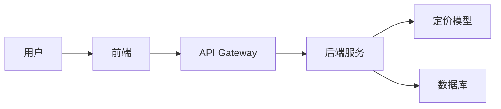
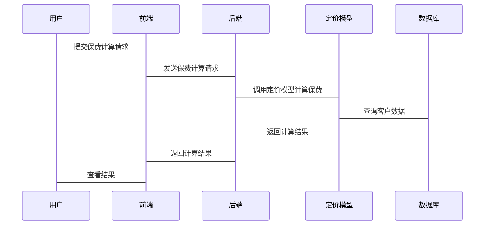

                 


# 第五章: 智能保险定价模型的系统分析与架构设计

## 5.1 系统功能设计

### 5.1.1 数据采集模块

- 数据来源：包括客户信息、保单数据、理赔记录、市场数据等。
- 数据采集方式：通过API接口、数据库连接、文件导入等方式获取数据。
- 数据预处理：清洗、转换、特征工程等，确保数据质量。

### 5.1.2 模型训练模块

- 数据分析：通过可视化工具（如Python中的matplotlib、seaborn）分析数据分布、相关性等。
- 模型选择：根据业务需求选择合适的算法（如线性回归、决策树、神经网络等）。
- 模型训练：使用训练数据训练模型，并进行交叉验证优化模型参数。
- 模型评估：通过均方误差（MSE）、R²值等指标评估模型性能。

### 5.1.3 模型部署模块

- 接口设计：设计RESTful API接口，供前端或其他系统调用。
- 模型部署：将训练好的模型部署到生产环境，如使用Flask或Django构建Web服务。
- 结果展示：通过可视化界面展示保费预测结果，并提供解释性分析。

## 5.2 系统架构设计

### 5.2.1 系统架构图



### 5.2.2 关键组件说明

- **前端**：负责用户交互，展示保费计算结果。
- **API Gateway**：负责路由请求，管理API的访问控制。
- **后端服务**：接收请求，调用定价模型进行计算。
- **定价模型**：负责根据输入数据计算保费。
- **数据库**：存储客户数据、保单数据等。

## 5.3 系统接口设计

### 5.3.1 接口描述

- **接口名称**：保费计算接口
- **请求方式**：POST
- **请求URL**：/api/policy/price
- **请求参数**：
  - customer_id: 整数，客户ID
  - coverage: 数值，保额
  - policy_type: 字符串，保单类型
- **返回参数**：
  - status: 整数，状态码
  - message: 字符串，状态描述
  - premium: 数值，保费金额

### 5.3.2 接口示例

```json
{
    "status": 200,
    "message": "保费计算成功",
    "premium": 1000.0
}
```

## 5.4 系统交互设计

### 5.4.1 交互流程图



## 5.5 本章小结

本章详细描述了智能保险定价模型的系统分析与架构设计，包括系统功能设计、架构设计、接口设计和交互设计。通过模块化的设计，确保系统的可扩展性和可维护性。后续章节将基于此架构，进行数学模型和算法原理的详细讲解，以及项目实战的实现。

---

接下来的章节将围绕数学模型、算法原理、项目实战展开，确保内容的深度和广度，满足读者对智能保险定价模型的全面理解。

