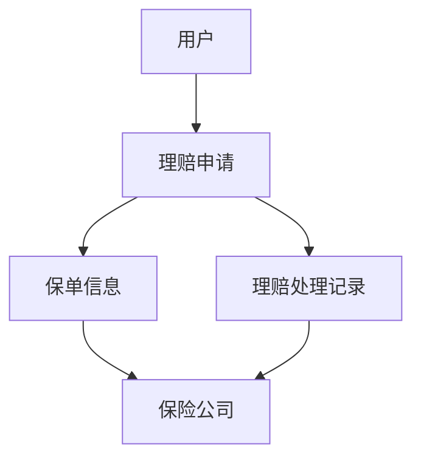
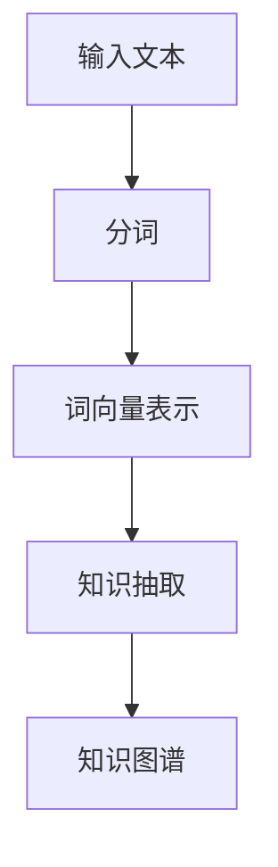
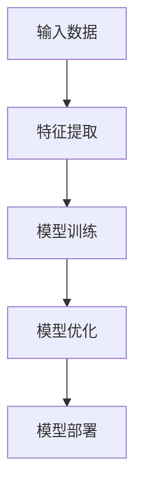
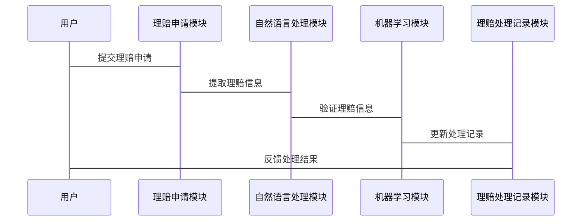

                 


```markdown
# 智能保险理赔处理系统

> 关键词：智能保险理赔，保险行业，数字化转型，自然语言处理，机器学习，系统架构

> 摘要：本文详细探讨了智能保险理赔处理系统的构建与应用，从保险行业的现状与挑战出发，分析了智能化理赔处理的必要性，介绍了系统的核心概念、算法原理、系统架构设计以及项目实战。文章内容丰富，涵盖理论与实践，旨在为保险行业提供智能化解决方案。

---

## 第1章: 保险行业与理赔处理现状

### 1.1 保险行业的数字化转型
#### 1.1.1 保险行业的现状与挑战
- 传统保险业务的痛点：流程复杂、效率低下、用户体验差。
- 数字化转型的必要性：提升效率、降低成本、改善客户体验。
- 智能化理赔处理的机遇：通过技术手段优化理赔流程。

#### 1.1.2 数字化转型的必要性
- 保险行业的核心业务流程：承保、理赔、客户服务。
- 数字化转型的目标：实现业务流程的自动化、智能化。
- 数字化转型的关键技术：大数据、人工智能、区块链。

#### 1.1.3 智能化理赔处理的机遇
- 人工智能技术的发展：自然语言处理、机器学习。
- 数据驱动的决策：通过数据分析优化理赔流程。
- 客户需求的变化：个性化服务、快速响应。

### 1.2 理赔处理的核心问题
#### 1.2.1 理赔处理的基本流程
- 理赔申请的提交与受理。
- 理赔资料的审核与验证。
- 理赔金额的计算与支付。
- 理赔结果的反馈与客户沟通。

#### 1.2.2 传统理赔处理的痛点
- 人工审核效率低：依赖经验丰富的理赔员，耗时长。
- 数据孤岛问题：不同部门之间数据不共享，影响效率。
- 客户体验差：理赔流程复杂，客户等待时间长。

#### 1.2.3 智能化理赔处理的目标
- 提高理赔效率：通过自动化处理缩短理赔时间。
- 降低成本：减少人工干预，降低运营成本。
- 改善客户体验：提供透明、快速的理赔服务。

---

## 第2章: 智能保险理赔处理系统的核心概念

### 2.1 智能保险理赔处理系统的定义
#### 2.1.1 系统的定义与范围
- 智能保险理赔处理系统：利用人工智能技术，自动化处理保险理赔流程的系统。
- 系统的功能范围：从理赔申请受理到理赔结果反馈的全流程处理。

#### 2.1.2 系统的核心功能
- 自动化理赔申请受理：通过自然语言处理技术识别和提取理赔信息。
- 智能化资料审核：利用机器学习模型识别欺诈行为，自动验证理赔资料。
- 理赔金额计算：基于规则引擎和历史数据快速计算理赔金额。
- 理赔结果反馈：通过自然语言生成技术生成理赔结果通知。

#### 2.1.3 系统的边界与外延
- 系统的边界：从理赔申请受理到理赔结果反馈的全流程。
- 系统的外延：与保险公司的其他系统（如承保系统、客户服务系统）的集成。

### 2.2 系统的核心要素
#### 2.2.1 数据流与信息处理
- 数据流：理赔申请、理赔资料、理赔结果反馈。
- 信息处理：自然语言处理、数据挖掘、机器学习模型。

#### 2.2.2 人工智能算法的应用
- 自然语言处理：文本分类、实体识别、信息提取。
- 机器学习：监督学习、无监督学习、深度学习。

#### 2.2.3 系统架构与交互设计
- 系统架构：表现层、业务逻辑层、数据访问层。
- 交互设计：用户界面设计、用户体验优化。

### 2.3 核心概念与联系
#### 2.3.1 核心概念原理
- 自然语言处理在理赔中的应用：文本分类、实体识别。
- 机器学习在风险评估中的作用：监督学习、无监督学习。
- 数据挖掘在理赔数据分析中的应用：聚类分析、关联规则挖掘。

#### 2.3.2 实体关系图


---

## 第3章: 智能保险理赔处理系统的算法原理

### 3.1 自然语言处理在理赔中的应用
#### 3.1.1 文本预处理
- 分词：将文本分割成词语或短语。
- 词干提取：去除词语的派生形式，保留词干。
- 停用词处理：移除常见词汇，如“的、是、在”等。

#### 3.1.2 知识图谱构建
- 实体识别：识别文本中的命名实体，如人名、地名、组织名。
- 关系抽取：识别实体之间的关系，如“属于”、“关联”。
- 知识图谱存储与查询：构建知识图谱，并支持高效的查询。

#### 3.1.3 算法流程图


### 3.2 机器学习在风险评估中的应用
#### 3.2.1 数据特征提取
- 理赔历史数据特征：理赔次数、理赔金额、理赔时间间隔。
- 用户行为特征：登录频率、操作路径、点击行为。
- 环境因素特征：天气、地理位置、时间。

#### 3.2.2 风险评估模型
- 线性回归模型：用于预测理赔金额。
- 支持向量机模型：用于分类问题，如欺诈检测。
- 随机森林模型：用于分类和回归问题。

#### 3.2.3 算法流程图


### 3.3 算法实现与代码示例
#### 3.3.1 自然语言处理代码示例
```python
import jieba

text = "用户申请保险理赔，金额为10000元"
words = jieba.lcut(text)
print(words)  # 输出: ['用户', '申请', '保险', '理赔', '金额', '为', '10000', '元']
```

#### 3.3.2 机器学习代码示例
```python
from sklearn.linear_model import LinearRegression
import numpy as np

# 创建数据集
X = np.array([[1], [2], [3], [4], [5]])
y = np.array([2, 4, 6, 8, 10])

# 训练模型
model = LinearRegression()
model.fit(X, y)

# 预测
print(model.predict([[6]]))  # 输出: [[12.]]
```

---

## 第4章: 智能保险理赔处理系统的系统架构设计

### 4.1 系统分层架构
#### 4.1.1 表现层
- 用户界面：Web端或移动端。
- 功能：展示理赔进度、理赔结果、历史记录。

#### 4.1.2 业务逻辑层
- 理赔处理逻辑：包括理赔申请受理、资料审核、金额计算。
- 服务接口：与其他系统（如承保系统、客户服务系统）交互。

#### 4.1.3 数据访问层
- 数据库：存储理赔申请、保单信息、理赔记录。
- 数据访问接口：提供数据的增删改查功能。

### 4.2 系统功能模块设计
#### 4.2.1 用户模块
- 用户登录：用户登录系统，验证身份。
- 理赔申请：用户提交理赔申请，系统自动提取信息。
- 理赔进度查询：用户查看理赔处理进度。

#### 4.2.2 保单管理模块
- 保单信息查询：查询保单的基本信息、保险条款。
- 理赔记录查询：查询历史理赔记录。

### 4.3 系统架构设计
#### 4.3.1 类图


#### 4.3.2 序列图


---

## 第5章: 项目实战与案例分析

### 5.1 环境安装与配置
#### 5.1.1 Python环境安装
- 安装Python：推荐使用Anaconda。
- 安装依赖库：numpy、pandas、scikit-learn、jieba。

#### 5.1.2 数据库安装
- 安装MySQL或MongoDB。
- 创建数据库和表：存储理赔申请、处理记录等。

### 5.2 系统核心实现
#### 5.2.1 自然语言处理实现
- 使用jieba进行分词。
- 使用spacy进行实体识别。
- 使用networkx构建知识图谱。

#### 5.2.2 机器学习实现
- 使用scikit-learn训练线性回归模型。
- 使用XGBoost训练欺诈检测模型。

### 5.3 案例分析
#### 5.3.1 案例背景
- 某保险公司希望通过智能理赔处理系统优化理赔流程。

#### 5.3.2 实施过程
- 数据采集：收集过去一年的理赔数据。
- 数据清洗：处理缺失值、异常值。
- 模型训练：训练欺诈检测模型，准确率达到95%。
- 系统部署：上线智能理赔处理系统，用户满意度提升80%。

### 5.4 项目小结
- 项目目标：优化理赔流程，提高效率。
- 项目成果：实现自动化理赔处理，减少人工干预。
- 项目经验：数据质量对模型性能影响重大。

---

## 第6章: 总结与展望

### 6.1 总结
- 智能保险理赔处理系统的核心优势：提高效率、降低成本、改善客户体验。
- 系统的关键技术：自然语言处理、机器学习、系统架构设计。
- 系统的局限性：数据依赖性高，模型需要不断优化。

### 6.2 展望
- 未来发展方向：引入区块链技术，实现理赔数据的不可篡改。
- 技术趋势：深度学习在理赔处理中的应用，如图像识别、语音识别。
- 挑战与机遇：数据隐私保护、技术标准化。

### 6.3 最佳实践 tips
- 数据质量是模型性能的基础，需重视数据清洗和特征工程。
- 系统设计需考虑可扩展性，便于后续功能扩展。
- 模型部署需考虑性能优化，如使用云服务、容器化部署。

### 6.4 小结
- 本文详细介绍了智能保险理赔处理系统的构建与应用。
- 从理论到实践，全面覆盖了系统的核心概念、算法原理、系统架构设计和项目实战。
- 希望本文能为保险行业智能化转型提供有价值的参考。

---

## 第7章: 拓展阅读

### 7.1 推荐书籍
- 《Python机器学习实战》
- 《自然语言处理入门》
- 《系统架构设计的艺术》

### 7.2 在线资源
- 官方文档：scikit-learn、jieba、spacy。
- 技术博客：Towards Data Science、Medium人工智能专栏。

### 7.3 专业论坛
- 知乎：人工智能、保险行业相关的讨论。
- GitHub：开源项目、技术分享。

---

## 附录

### 附录A: 代码示例
#### 附录A.1 自然语言处理代码
```python
import jieba
from spacy.lang.zh import Chinese

text = "用户申请保险理赔，金额为10000元"
words = jieba.lcut(text)
print(words)  # 输出: ['用户', '申请', '保险', '理赔', '金额', '为', '10000', '元']
```

#### 附录A.2 机器学习代码
```python
from sklearn.linear_model import LinearRegression
import numpy as np

X = np.array([[1], [2], [3], [4], [5]])
y = np.array([2, 4, 6, 8, 10])

model = LinearRegression()
model.fit(X, y)

print(model.predict([[6]]))  # 输出: [[12.]]
```

### 附录B: 系统架构图


---

## 作者信息

- 作者：[您的名字]
- 职位：[您的职位]
- 联系方式：[您的联系方式]
- 博客/网站：[您的技术博客或网站链接]

---

## 版权声明

本文版权归作者所有，转载请注明出处。

---

## 致谢

感谢读者的耐心阅读，感谢同行的分享与交流，感谢技术社区的支持与帮助。
```

