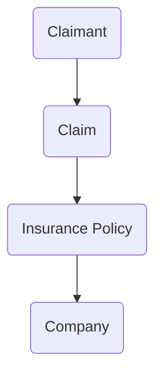
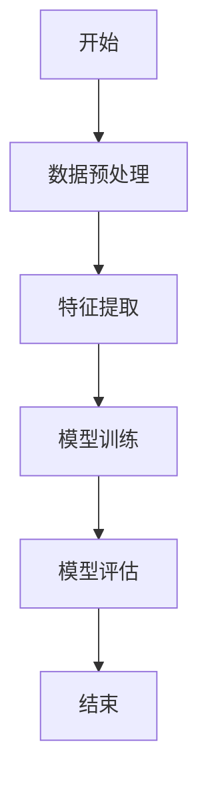
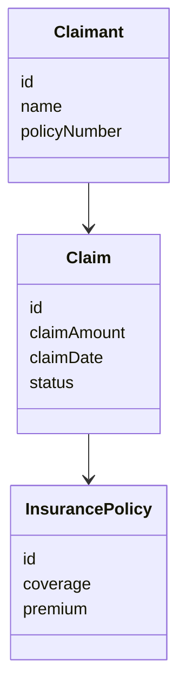
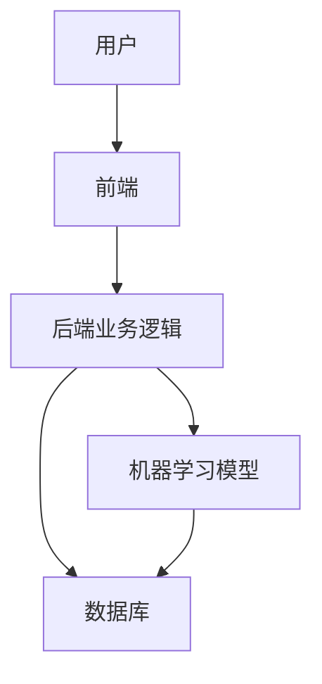
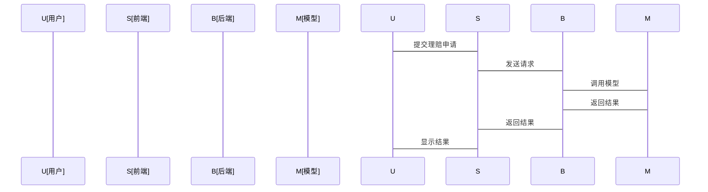

                 


# 智能保险理赔快速处理系统

## 关键词：智能保险理赔、快速处理系统、人工智能、机器学习、系统架构、项目实战

## 摘要：
智能保险理赔快速处理系统是一种基于人工智能和机器学习技术的解决方案，旨在优化保险理赔流程，提高处理效率和准确性。本文将详细探讨该系统的背景、核心概念、算法原理、系统架构、项目实战以及最佳实践，为读者提供全面的技术解析。

---

# 第1章 智能保险理赔快速处理系统概述

## 1.1 保险行业的现状与挑战

### 1.1.1 传统保险理赔流程的痛点
传统保险理赔流程通常涉及多个环节，包括报案、资料收集、审核、赔付等。这些环节存在以下问题：
- **流程繁琐**：用户需要提交大量纸质文件，流程耗时长。
- **人工干预多**：审核过程依赖人工判断，效率低且容易出错。
- **数据分散**：不同部门和系统之间的数据难以整合，导致信息孤岛。

### 1.1.2 保险行业的数字化转型趋势
随着技术的进步，保险行业正在向数字化和智能化方向转型。保险公司开始利用大数据、人工智能和区块链等技术，优化业务流程，提升用户体验。

### 1.1.3 智能保险理赔的必要性
智能保险理赔通过自动化技术，能够快速处理理赔请求，减少人工干预，降低运营成本，提高客户满意度。特别是在应对大规模理赔事件时，智能系统能够显著提升处理效率。

## 1.2 智能保险理赔快速处理系统的概念

### 1.2.1 智能保险理赔的定义
智能保险理赔是指利用人工智能技术，通过自动化流程和智能算法，快速完成保险理赔的全过程。

### 1.2.2 快速处理系统的特征
- **自动化**：系统能够自动处理理赔请求，减少人工干预。
- **智能化**：基于机器学习模型，系统能够智能判断理赔结果。
- **高效性**：通过优化算法和流程，系统能够快速处理大量理赔请求。

### 1.2.3 系统的目标与核心价值
系统的目标是实现保险理赔的快速处理和准确判断，核心价值包括：
- 提高理赔效率，缩短理赔时间。
- 降低人工成本，优化资源配置。
- 提升客户满意度，增强品牌形象。

## 1.3 本章小结
本章介绍了传统保险理赔流程的痛点以及智能保险理赔的必要性，明确了智能保险理赔快速处理系统的概念、特征和核心价值。

---

# 第2章 智能保险理赔快速处理系统的核心概念与联系

## 2.1 核心概念原理

### 2.1.1 数据采集与处理
数据是智能系统的基石。系统需要从多种来源采集数据，包括用户提交的理赔申请、历史理赔记录、医疗数据等。数据清洗和预处理是确保数据质量的关键步骤。

### 2.1.2 模型训练与优化
基于机器学习的模型训练是系统的核心。通过训练分类器，系统能够自动识别理赔类型，判断理赔金额，并预测潜在的风险。

### 2.1.3 理赔流程优化
通过优化流程，系统能够实现快速理赔。例如，自动审核小额理赔，人工审核大额理赔，从而减少等待时间。

## 2.2 核心概念属性特征对比

| 概念        | 特征                | 优势                |
|-------------|--------------------|---------------------|
| 数据采集    | 多源、实时性        | 提高数据准确性      |
| 模型训练    | 高精度、可解释性    | 提升判断准确性      |
| 理赔流程    | 自动化、高效性      | 缩短处理时间        |

## 2.3 ER实体关系图



## 2.4 本章小结
本章详细探讨了智能保险理赔系统的核心概念，包括数据采集、模型训练和流程优化，并通过表格和ER图展示了系统的核心要素及其关系。

---

# 第3章 智能保险理赔快速处理系统的算法原理

## 3.1 算法原理

### 3.1.1 机器学习基础
机器学习是一种通过数据训练模型的技术。在智能保险理赔中，常用的算法包括支持向量机（SVM）和随机森林（Random Forest）。

### 3.1.2 支持向量机（SVM）原理
SVM是一种监督学习算法，适用于分类问题。其核心思想是找到一个超平面，将数据分为两类。数学公式如下：

$$
\text{SVM目标函数} = \min_{w,b,\xi} \frac{1}{2}||w||^2 + C\sum_{i=1}^n \xi_i
$$

其中，$w$ 是权重向量，$b$ 是偏置项，$\xi$ 是松弛变量，$C$ 是惩罚系数。

### 3.1.3 随机森林算法
随机森林是一种集成学习算法，通过构建多棵决策树并进行投票或平均，提高模型的准确性和鲁棒性。数学公式如下：

$$
\text{随机森林预测} = \frac{1}{n}\sum_{i=1}^n \text{树}_i(x)
$$

其中，$n$ 是决策树的数量，$\text{树}_i(x)$ 是第$i$棵树的预测结果。

## 3.2 算法流程图



## 3.3 算法实现代码

```python
from sklearn import svm
from sklearn.ensemble import RandomForestClassifier

# 数据预处理
X = [...]  # 特征数据
y = [...]  # 标签

# 模型训练
model_svm = svm.SVC()
model_svm.fit(X, y)

model_rf = RandomForestClassifier()
model_rf.fit(X, y)

# 模型评估
print("SVM准确率:", model_svm.score(X, y))
print("随机森林准确率:", model_rf.score(X, y))
```

## 3.4 本章小结
本章详细讲解了智能保险理赔系统中常用的算法原理，包括SVM和随机森林，并通过流程图和代码示例展示了算法的实现过程。

---

# 第4章 智能保险理赔快速处理系统的系统分析与架构设计

## 4.1 问题场景介绍

### 4.1.1 项目背景
随着保险业务的复杂化，传统的理赔流程已无法满足客户需求。智能保险理赔系统的开发旨在解决这一问题。

### 4.1.2 项目介绍
本项目旨在开发一个基于AI的智能保险理赔系统，实现快速理赔和准确判断。

## 4.2 系统功能设计

### 4.2.1 领域模型


### 4.2.2 系统架构


### 4.2.3 系统交互


## 4.3 本章小结
本章从问题场景出发，设计了系统的功能模块和架构，并通过类图和序列图展示了系统的交互关系。

---

# 第5章 智能保险理赔快速处理系统的项目实战

## 5.1 环境搭建

### 5.1.1 开发环境
- Python 3.8+
- Scikit-learn、Pandas、NumPy
- Jupyter Notebook

## 5.2 核心代码实现

### 5.2.1 数据加载与预处理
```python
import pandas as pd
from sklearn.preprocessing import StandardScaler

# 加载数据
data = pd.read_csv('claims.csv')

# 数据预处理
X = data.drop('target', axis=1)
y = data['target']

scaler = StandardScaler()
X_scaled = scaler.fit_transform(X)
```

### 5.2.2 模型训练与评估
```python
from sklearn.model_selection import train_test_split
from sklearn.metrics import accuracy_score

# 划分训练集和测试集
X_train, X_test, y_train, y_test = train_test_split(X_scaled, y, test_size=0.2)

# 训练模型
model = RandomForestClassifier()
model.fit(X_train, y_train)

# 模型评估
y_pred = model.predict(X_test)
print("准确率:", accuracy_score(y_test, y_pred))
```

## 5.3 案例分析与解读

### 5.3.1 案例背景
假设我们有一个医疗理赔案例，用户提交了医疗费用发票和诊断报告。

### 5.3.2 系统处理流程
1. 系统接收理赔申请。
2. 自动提取关键信息并进行初步审核。
3. 调用机器学习模型进行风险评估。
4. 根据模型结果生成赔付方案。
5. 用户确认后完成赔付。

## 5.4 本章小结
本章通过实际案例展示了系统的实现过程，包括环境搭建、代码实现和案例分析。

---

# 第6章 智能保险理赔快速处理系统的最佳实践

## 6.1 小结
智能保险理赔系统的开发和应用为保险行业带来了显著的效率提升和成本降低。

## 6.2 注意事项
- 数据隐私保护：确保用户数据的安全性和隐私性。
- 模型可解释性：选择可解释性较强的模型，便于调试和优化。
- 系统容错性：设计容错机制，确保系统在异常情况下的稳定性。

## 6.3 拓展阅读
- 《机器学习实战》
- 《深入浅出人工智能》
- 《系统架构设计指南》

## 6.4 本章小结
本章总结了项目的开发经验，并提出了改进建议和未来的发展方向。

---

# 结语
智能保险理赔快速处理系统是人工智能技术在保险行业中的重要应用，通过自动化和智能化的处理流程，显著提升了理赔效率和准确性。未来，随着技术的不断进步，智能保险理赔系统将更加智能化和个性化，为客户和保险公司创造更大的价值。

--- 

**感谢您的阅读，希望本文对您有所帮助！**

