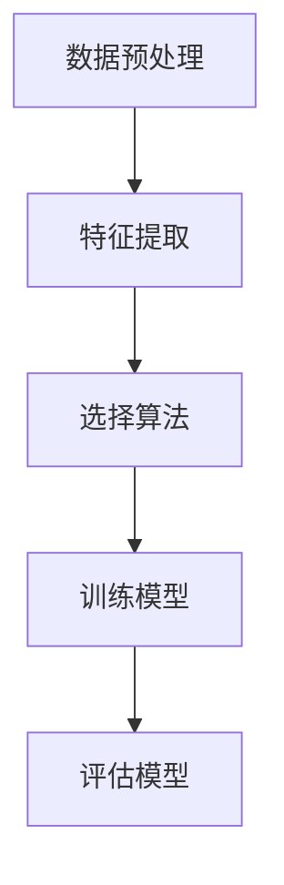

                 


# 智能保险理赔欺诈预防系统

> 关键词：保险理赔，欺诈预防，人工智能，大数据分析，机器学习，系统架构

> 摘要：本文探讨了智能保险理赔欺诈预防系统的构建与应用，详细分析了其核心概念、算法原理、系统架构，并通过实际案例展示了系统的功能实现，最后总结了系统的优缺点及未来发展方向。

---

## 第一部分：智能保险理赔欺诈预防系统概述

### 第1章：保险行业的欺诈问题与智能系统

#### 1.1 保险行业的现状与挑战
保险行业作为金融领域的重要组成部分，其核心业务流程包括承保、理赔和客户服务。然而，随着保险业务的扩展，欺诈行为在理赔环节中的频发，给保险公司带来了巨大的经济损失和声誉风险。传统的理赔欺诈检测方法主要依赖于规则引擎和人工审核，存在效率低、覆盖范围有限、难以应对复杂欺诈手段等问题。

#### 1.2 智能保险理赔欺诈预防的必要性
智能技术的应用为保险行业的欺诈预防提供了新的解决方案。通过引入人工智能（AI）、大数据分析和机器学习等技术，保险公司可以更高效地识别和预测欺诈行为，提升理赔效率，降低运营成本。

#### 1.3 智能系统的核心价值
智能保险理赔欺诈预防系统的核心价值体现在以下几个方面：
1. **提高检测精度**：通过机器学习算法，系统能够发现传统规则引擎难以识别的复杂欺诈模式。
2. **提升理赔效率**：自动化检测和决策流程减少了人工干预，缩短了理赔周期。
3. **降低运营成本**：通过智能化手段减少虚假理赔，降低赔付支出。

### 第2章：智能保险理赔欺诈预防系统的核心概念

#### 2.1 系统定义与特点
智能保险理赔欺诈预防系统是一种基于人工智能和大数据分析的智能化系统，旨在通过实时数据分析和模式识别，发现潜在的欺诈行为并进行预警。其特点包括：
1. **实时性**：能够快速处理海量数据，实现实时检测。
2. **高精度**：通过机器学习模型，系统能够识别复杂的欺诈模式。
3. **可扩展性**：支持多种数据源和业务场景的扩展。

#### 2.2 欺诈预防的关键技术
智能保险欺诈预防系统的关键技术包括：
1. **人工智能技术**：用于模式识别和智能决策。
2. **大数据分析技术**：用于海量数据的处理和分析。
3. **自然语言处理技术**：用于文本数据的分析和理解。

#### 2.3 核心要素组成
智能保险欺诈预防系统的核心要素包括：
1. **数据采集与处理**：从多种数据源采集理赔数据并进行预处理。
2. **特征提取与分析**：从数据中提取关键特征，用于模型训练。
3. **模型训练与优化**：基于机器学习算法，训练和优化欺诈检测模型。

---

## 第二部分：系统的核心概念与联系

### 第3章：系统的核心概念与联系

#### 3.1 核心概念原理
1. **数据采集与处理**：系统从多种数据源（如理赔申请、历史数据、第三方数据）采集数据，并进行清洗和预处理。
2. **特征提取与分析**：通过对数据的分析，提取出与欺诈行为相关的特征，如理赔金额、时间间隔、地点分布等。
3. **模型训练与优化**：基于提取的特征，训练分类模型（如随机森林、支持向量机）或聚类模型，优化模型性能。

#### 3.2 概念属性特征对比表格
| 特征 | 传统规则检测 | 机器学习检测 |
|------|---------------|---------------|
| 数据来源 | 结构化数据 | 结构化+非结构化数据 |
| 检测速度 | 实时性差 | 实时性高 |
| 检测精度 | 精度有限 | 精度较高 |
| 维护成本 | 成本较高 | 成本较低 |

#### 3.3 ER实体关系图
```mermaid
erDiagram
    insurant <---1..N claim
    claim <---1..N fraud_behavior
    fraud_behavior <---1..N feature
```

---

## 第三部分：算法原理与数学模型

### 第4章：反欺诈算法原理

#### 4.1 聚类算法
1. **K-means算法**：一种经典的无监督聚类算法，适用于发现欺诈行为的模式。
2. **层次聚类算法**：通过构建树状结构，发现数据中的层次关系。

#### 4.2 分类算法
1. **随机森林**：一种基于树的集成算法，适用于分类问题。
2. **支持向量机（SVM）**：适用于高维数据的分类问题。

#### 4.3 算法流程图


#### 4.4 数学模型
1. **K-means算法**：目标函数为：
   $$ \arg\min_{k} \sum_{i=1}^{k} \sum_{j=1}^{n_i} ||x_j - c_i||^2 $$
   其中，\( c_i \) 是第 \( i \) 个簇的中心，\( x_j \) 是第 \( j \) 个数据点。

---

## 第四部分：系统分析与架构设计

### 第5章：系统分析与架构设计

#### 5.1 问题场景介绍
保险公司在理赔过程中面临的主要问题包括：虚假理赔、重复理赔、故意夸大损失等。

#### 5.2 系统功能设计
系统功能包括：
1. **数据采集**：从多种数据源采集理赔数据。
2. **特征提取**：提取与欺诈行为相关的特征。
3. **模型训练**：训练欺诈检测模型。
4. **实时检测**：对新理赔请求进行实时检测。

#### 5.3 系统架构设计


#### 5.4 系统接口设计
系统接口包括：
1. 数据接口：与数据源进行数据交互。
2. 模型接口：与第三方机器学习平台进行交互。
3. 用户接口：供保险公司员工查询和分析结果。

---

## 第五部分：项目实战

### 第6章：项目实战

#### 6.1 环境安装
1. 安装Python和相关库（如scikit-learn、pandas）。
2. 安装机器学习框架（如TensorFlow、PyTorch）。

#### 6.2 核心实现
```python
import pandas as pd
from sklearn.ensemble import RandomForestClassifier
from sklearn.metrics import accuracy_score

# 数据加载
data = pd.read_csv('claims.csv')

# 特征提取
features = data[['claim_amount', 'time_diff', 'location']]
labels = data['is_fraud']

# 模型训练
model = RandomForestClassifier()
model.fit(features, labels)

# 模型预测
predictions = model.predict(features)
print('Accuracy:', accuracy_score(labels, predictions))
```

#### 6.3 案例分析
通过分析实际案例，验证系统的检测能力。例如，发现某用户在短时间内多次理赔同一事故，系统能够识别并标记为欺诈行为。

---

## 第六部分：总结与展望

### 第7章：总结与展望

#### 7.1 系统总结
智能保险理赔欺诈预防系统通过引入人工智能和大数据分析技术，显著提升了欺诈检测的效率和精度。

#### 7.2 优缺点分析
优点：
1. 提高检测精度。
2. 降低运营成本。
缺点：
1. 对数据质量和数量要求较高。
2. 模型需要定期更新。

#### 7.3 未来展望
未来，随着人工智能技术的不断发展，智能保险欺诈预防系统将更加智能化和个性化。同时，数据隐私和模型解释性问题也需要进一步解决。

---

## 参考文献
（此处列出相关文献和参考资料）

