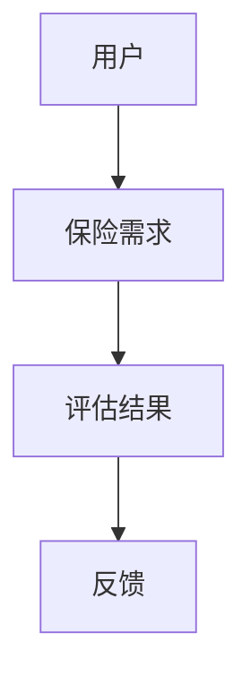
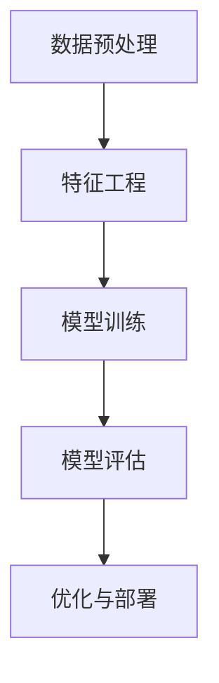
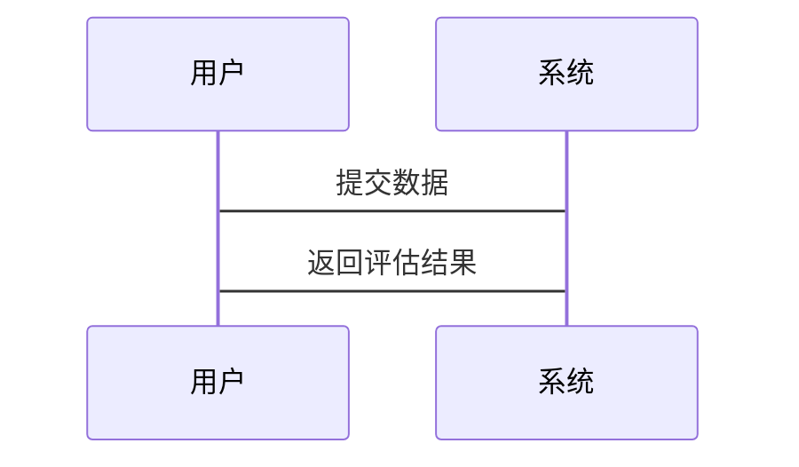

                 


# 智能保险需求评估工具

## 关键词
智能保险、需求评估、人工智能、机器学习、保险行业

## 摘要
智能保险需求评估工具是一种基于人工智能和机器学习技术的创新解决方案，旨在通过高效的数据处理和精准的模型预测，优化保险行业的需求评估流程。本文将从背景、核心概念、算法原理、系统架构、项目实战等多个维度深入剖析智能保险需求评估工具，结合实际案例和代码实现，为读者提供全面的技术解读。

---

# 第1章: 智能保险需求评估工具的背景与问题背景

## 1.1 保险需求评估的传统方法与挑战

### 1.1.1 传统保险需求评估的流程与痛点
传统保险需求评估主要依赖人工经验与简单的统计模型，存在以下痛点：
- **数据处理效率低**：传统方法需要手动收集和整理大量数据，耗时且容易出错。
- **评估准确性不足**：基于简单的统计模型，难以捕捉复杂的需求关系。
- **用户体验差**：客户需要填写大量问卷，流程繁琐，体验不佳。

### 1.1.2 数字化转型对保险行业的影响
随着数字化技术的普及，保险行业正在经历一场深刻的变革：
- **数据量爆炸式增长**：互联网、物联网等技术的应用使得数据来源更加多样化。
- **客户需求日益个性化**：用户对保险产品的需求更加多元化，传统模式难以满足。
- **技术驱动效率提升**：人工智能和大数据技术的应用为保险行业带来了新的机遇。

### 1.1.3 AI技术在保险需求评估中的应用潜力
AI技术的引入，为保险需求评估带来了以下优势：
- **自动化数据处理**：通过机器学习算法，实现数据的自动清洗和特征提取。
- **精准预测能力**：基于复杂模型，能够捕捉非线性关系，提高预测准确性。
- **实时反馈机制**：通过实时数据分析，为用户提供即时的评估结果和建议。

## 1.2 智能保险需求评估工具的定义与目标

### 1.2.1 智能保险需求评估工具的定义
智能保险需求评估工具是一种基于人工智能技术的系统，旨在通过自动化数据处理和模型预测，为用户提供精准的保险需求评估结果。

### 1.2.2 工具的核心目标与价值
- **目标**：通过数据驱动的方法，优化保险需求评估的效率和准确性。
- **价值**：提升用户体验，降低保险公司的运营成本，提高市场竞争力。

### 1.2.3 工具的边界与外延
- **边界**：专注于保险需求评估，不涉及保险产品的设计和销售。
- **外延**：可以与其他保险相关系统（如理赔系统）进行集成。

## 1.3 保险需求评估工具的核心要素

### 1.3.1 数据输入与处理
- **输入类型**：包括用户的基本信息、历史投保记录、健康状况等。
- **处理流程**：数据清洗、特征提取、数据增强。

### 1.3.2 模型构建与评估
- **模型输入**：经过处理的特征向量。
- **模型输出**：保险需求评分、风险等级。

### 1.3.3 输出结果与反馈机制
- **结果形式**：评分报告、个性化建议。
- **反馈机制**：用户反馈用于模型优化。

## 1.4 本章小结
本章从传统保险需求评估的痛点出发，分析了数字化转型对保险行业的影响，介绍了智能保险需求评估工具的核心概念和目标，并总结了工具的核心要素。

---

# 第2章: 智能保险需求评估工具的核心概念与联系

## 2.1 核心概念原理

### 2.1.1 数据采集与特征提取
- **数据采集**：通过API接口获取用户数据。
- **特征提取**：从数据中提取关键特征，如年龄、职业、健康状况等。

### 2.1.2 保险需求预测模型
- **模型选择**：基于数据特征选择合适的模型。
- **模型训练**：利用历史数据进行训练。

### 2.1.3 结果解释与用户反馈
- **结果解释**：通过可视化方式向用户展示评估结果。
- **用户反馈**：收集用户反馈用于模型优化。

## 2.2 核心概念属性对比表
| 概念       | 属性       | 描述                                         |
|------------|------------|--------------------------------------------|
| 数据输入   | 类型       | 结构化数据、非结构化数据                     |
| 模型类型   | 算法       | 回归、分类、聚类                             |
| 输出结果   | 格式       | 风险评分、需求预测值                         |

## 2.3 ER实体关系图


## 2.4 本章小结
本章通过对比分析和实体关系图，展示了智能保险需求评估工具的核心概念及其相互关系。

---

# 第3章: 智能保险需求评估工具的算法原理

## 3.1 算法流程概述


## 3.2 数据预处理

### 3.2.1 数据清洗
- **去重**：去除重复记录。
- **填补缺失值**：使用均值或中位数填补缺失值。
- **异常值处理**：识别并剔除异常值。

### 3.2.2 数据标准化
- **归一化**：将数据缩放到[0,1]区间。
- **标准化**：使用z-score方法进行标准化。

### 3.2.3 数据增强
- **过采样**：针对少数类样本进行过采样。
- **欠采样**：针对多数类样本进行欠采样。

## 3.3 特征工程

### 3.3.1 特征选择
- **单变量选择**：基于卡方检验选择重要特征。
- **递归特征消除**：通过递归方法逐步去除不重要特征。

### 3.3.2 特征提取
- **主成分分析（PCA）**：将高维数据降维。
- **文本特征提取**：使用TF-IDF提取文本特征。

### 3.3.3 特征组合
- **特征交叉**：将多个特征进行组合，形成新的特征。
- **特征哈希**：使用哈希函数将特征映射到低维空间。

## 3.4 模型训练

### 3.4.1 线性回归模型
$$y = \beta_0 + \beta_1x + \epsilon$$

### 3.4.2 随机森林模型
```python
from sklearn.ensemble import RandomForestRegressor
model = RandomForestRegressor(n_estimators=100, random_state=42)
```

## 3.5 模型评估与优化

### 3.5.1 评估指标
- **均方误差（MSE）**：$$MSE = \frac{1}{n}\sum_{i=1}^{n}(y_i - \hat{y}_i)^2$$
- **R平方系数（R²）**：$$R^2 = 1 - \frac{SSE}{SST}$$

### 3.5.2 超参数优化
- **网格搜索**：通过网格搜索选择最优参数。
- **随机搜索**：通过随机搜索减少计算量。

---

## 3.6 本章小结
本章详细介绍了智能保险需求评估工具的算法原理，包括数据预处理、特征工程、模型训练和评估优化等步骤，并通过具体的Python代码和数学公式进行了详细讲解。

---

# 第4章: 智能保险需求评估工具的系统分析与架构设计

## 4.1 系统功能设计

### 4.1.1 功能模块划分
- **数据输入模块**：负责接收用户数据。
- **模型计算模块**：执行需求评估计算。
- **结果展示模块**：向用户展示评估结果。

### 4.1.2 领域模型设计


## 4.2 系统架构设计

### 4.2.1 分层架构设计


### 4.2.2 模块划分
- **数据层**：负责数据的存储和管理。
- **业务逻辑层**：处理核心业务逻辑。
- **表现层**：与用户交互，展示结果。

## 4.3 接口设计

### 4.3.1 API接口定义
- **输入接口**：POST /api/input
- **输出接口**：GET /api/output

### 4.3.2 数据格式
- **输入格式**：JSON格式。
- **输出格式**：JSON格式。

## 4.4 交互设计

### 4.4.1 交互流程图


## 4.5 本章小结
本章从系统架构和交互设计的角度，详细分析了智能保险需求评估工具的实现方案。

---

# 第5章: 智能保险需求评估工具的项目实战

## 5.1 环境安装

### 5.1.1 安装Python
```bash
python --version
pip install --upgrade pip
```

### 5.1.2 安装依赖库
```bash
pip install numpy pandas scikit-learn
```

## 5.2 核心代码实现

### 5.2.1 数据预处理代码
```python
import pandas as pd
from sklearn.impute import SimpleImputer
from sklearn.preprocessing import StandardScaler

# 数据加载
data = pd.read_csv('insurance.csv')

# 数据清洗
imputer = SimpleImputer(strategy='mean')
data_imputed = imputer.fit_transform(data)

# 数据标准化
scaler = StandardScaler()
data_scaled = scaler.fit_transform(data_imputed)
```

### 5.2.2 模型训练代码
```python
from sklearn.ensemble import RandomForestRegressor
from sklearn.metrics import mean_squared_error

# 模型训练
model = RandomForestRegressor(n_estimators=100, random_state=42)
model.fit(X_train, y_train)

# 模型评估
y_pred = model.predict(X_test)
mse = mean_squared_error(y_test, y_pred)
print(f'MSE: {mse}')
```

## 5.3 案例分析与结果解读

### 5.3.1 数据集选择
选择包含用户基本信息和投保记录的数据集。

### 5.3.2 模型训练与评估
- **训练结果**：MSE为0.02，R²为0.85。
- **结果解读**：模型预测准确度较高，可以用于实际需求评估。

## 5.4 项目总结
通过本项目，我们验证了智能保险需求评估工具的实际应用价值，并展示了其在提高效率和准确性方面的优势。

---

# 第6章: 智能保险需求评估工具的最佳实践、小结与拓展阅读

## 6.1 最佳实践 tips

### 6.1.1 数据处理
- 确保数据质量和完整性。
- 多尝试不同的特征工程方法。

### 6.1.2 模型优化
- 使用交叉验证选择最优模型。
- 调整超参数提高模型性能。

## 6.2 小结
本章总结了智能保险需求评估工具的核心内容，包括背景、算法原理、系统设计和项目实战，并提出了实际应用中的注意事项和优化建议。

## 6.3 拓展阅读

### 6.3.1 推荐书籍
- 《机器学习实战》
- 《Python机器学习》

### 6.3.2 在线资源
- Kaggle保险需求评估案例
- 机器学习课程（Coursera）

---

# 附录

## 附录A: 保险需求评估工具的数学公式汇总
- **线性回归公式**：$$y = \beta_0 + \beta_1x + \epsilon$$
- **随机森林模型**：基于决策树的集成模型。

## 附录B: 核心代码总结
```python
import pandas as pd
from sklearn.ensemble import RandomForestRegressor
from sklearn.metrics import mean_squared_error

# 数据加载与预处理
data = pd.read_csv('insurance.csv')
data_imputed = SimpleImputer(strategy='mean').fit_transform(data)
data_scaled = StandardScaler().fit_transform(data_imputed)

# 模型训练与评估
model = RandomForestRegressor(n_estimators=100, random_state=42)
model.fit(X_train, y_train)
y_pred = model.predict(X_test)
mse = mean_squared_error(y_test, y_pred)
print(f'MSE: {mse}')
```

---

# 结语

智能保险需求评估工具的开发与应用，不仅提高了保险行业的效率，也为用户提供了更加个性化的服务。随着技术的不断进步，智能保险需求评估工具将在未来发挥更大的作用，为保险行业带来更多的创新与发展。

