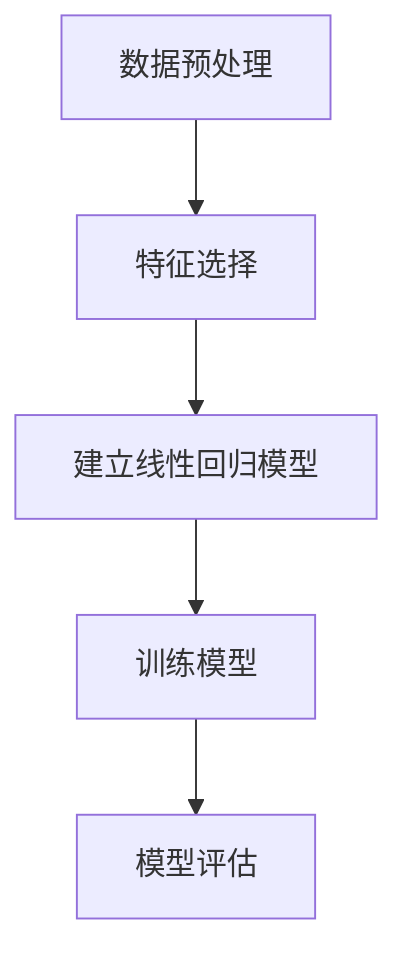
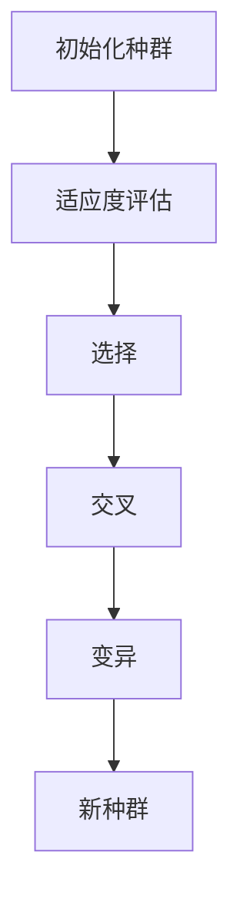
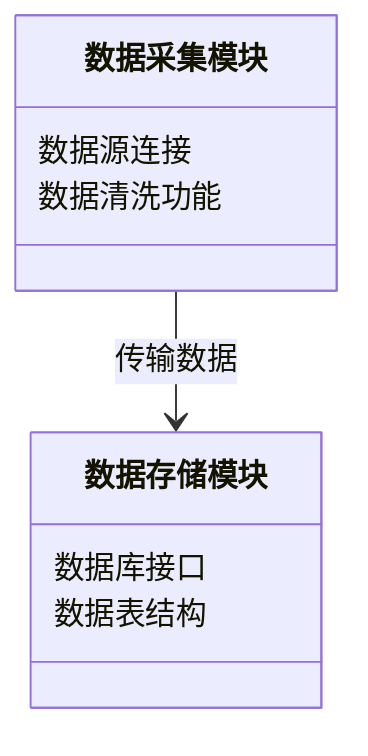

                 


# 智能保险需求预测与产品设计优化系统

> 关键词：智能保险、需求预测、产品设计优化、机器学习、系统架构

> 摘要：本文深入探讨了智能保险领域的核心问题，包括保险需求预测和产品设计优化的系统构建。通过结合机器学习算法和系统架构设计，提出了一套高效的解决方案。文章详细分析了系统的背景、核心概念、算法原理、系统架构，并通过实际案例展示了系统的实现与应用。最后，本文还总结了系统的优势与不足，并展望了未来的发展方向。

---

# 第一部分: 背景介绍

## 第1章: 保险行业的现状与挑战

### 1.1 传统保险业务的痛点

#### 1.1.1 数据孤岛问题
传统保险公司普遍存在数据分散、信息不共享的问题，导致无法有效利用数据进行业务决策。

#### 1.1.2 需求预测准确性不足
由于缺乏对市场和客户需求的深度分析，保险产品的设计往往难以满足客户的实际需求。

#### 1.1.3 产品同质化严重
市场竞争加剧，保险产品同质化问题突出，难以通过差异化竞争获取市场份额。

### 1.2 数字化转型的必要性

#### 1.2.1 技术驱动保险行业的变革
人工智能、大数据等技术的快速发展为保险行业的数字化转型提供了技术支持。

#### 1.2.2 客户需求的变化
客户对保险产品的需求日益多样化、个性化，传统业务模式难以满足客户需求。

#### 1.2.3 保险行业的未来趋势
通过技术手段实现保险业务的智能化、数据化和个性化是未来发展的必然趋势。

### 1.3 智能保险的发展趋势

#### 1.3.1 数据驱动的保险业务
通过大数据分析，实现保险产品的精准设计和风险控制。

#### 1.3.2 人工智能技术的应用
利用机器学习、自然语言处理等技术，提升保险业务的效率和客户体验。

#### 1.3.3 智能保险生态的构建
通过构建开放的智能保险生态系统，实现保险公司、客户和合作伙伴的共赢。

---

# 第二部分: 核心概念与联系

## 第2章: 核心概念与联系

### 2.1 保险需求预测模型

#### 2.1.1 预测模型的分类
- **基于历史数据分析的模型**: 包括时间序列分析、回归分析等。
- **基于机器学习的模型**: 包括随机森林、神经网络等。
- **基于自然语言处理的模型**: 通过分析客户反馈文本进行需求预测。

#### 2.1.2 模型之间的关系
以下是几种常见预测模型的对比表格：

| 模型类型       | 优点                           | 缺点                           |
|----------------|--------------------------------|--------------------------------|
| 时间序列分析   | 易于实现，适合单一变量预测     | 无法捕捉多变量之间的关系       |
| 回归分析       | 可解释性强，适合线性关系       | 无法处理非线性关系               |
| 随机森林       | 鲁棒性强，适合高维数据         | 解释性较差                     |
| 神经网络       | 能处理复杂非线性关系           | 计算复杂，需要大量数据           |

### 2.2 产品设计优化算法

#### 2.2.1 优化算法的分类
- **基于数学规划的算法**: 包括线性规划、整数规划等。
- **基于启发式搜索的算法**: 包括遗传算法、模拟退火等。
- **基于群智能的算法**: 包括粒子群优化、蚁群算法等。

#### 2.2.2 算法之间的关系
以下是几种优化算法的对比表格：

| 算法类型       | 优点                           | 缺点                           |
|----------------|--------------------------------|--------------------------------|
| 遗传算法       | 具备全局搜索能力               | 收敛速度较慢                   |
| 模拟退火       | 能跳出局部最优                 | 参数敏感性高                   |
| 粒子群优化     | 收敛速度快                     | 易陷入局部最优                 |

### 2.3 实体关系图（ER图）

以下是保险需求预测系统的核心实体关系图：

```mermaid
er
    actor: 用户
    role: 保险公司
    policy: 保险产品
    prediction: 需求预测结果
    constraint: 限制条件

    actor --> prediction: 提供需求数据
    prediction --> policy: 生成优化方案
    policy --> constraint: 满足限制条件
```

---

# 第三部分: 算法原理讲解

## 第3章: 算法原理讲解

### 3.1 保险需求预测算法

#### 3.1.1 线性回归模型

##### 算法流程图



##### 代码实现

```python
import numpy as np
from sklearn.linear_model import LinearRegression

# 数据预处理
X = np.array([[年龄], [收入], [保费]])  # 特征矩阵
y = np.array([保费])  # 标签

# 特征选择
# 假设选择收入作为唯一特征
X = X[:, 1]

# 建立线性回归模型
model = LinearRegression()
model.fit(X.reshape(-1, 1), y)

# 模型预测
predicted = model.predict(X.reshape(-1, 1))
```

##### 数学模型

线性回归的数学模型为：

$$ y = \beta_0 + \beta_1 x + \epsilon $$

其中，$\beta_0$ 是截距，$\beta_1$ 是回归系数，$\epsilon$ 是误差项。

---

### 3.2 产品设计优化算法

#### 3.2.1 遗传算法

##### 算法流程图



##### 代码实现

```python
import random

def fitness(individual):
    # 计算适应度，具体实现取决于问题
    pass

def crossover(parent1, parent2):
    # 单点交叉，具体实现取决于问题
    pass

def mutate(individual):
    # 变异操作，具体实现取决于问题
    pass

# 初始化种群
population = [random.individual() for _ in range(population_size)]

# 迭代优化
for _ in range(max_iterations):
    # 适应度评估
    fitness_values = [fitness(individual) for individual in population]
    # 选择
    selected = selection(population, fitness_values)
    # 交叉
    new_population = []
    for i in range(len(selected)):
        if i % 2 == 0:
            parent1 = selected[i]
            parent2 = selected[i+1]
            child = crossover(parent1, parent2)
            new_population.append(child)
    # 变异
    for individual in new_population:
        if random.random() < mutation_rate:
            mutate(individual)
```

---

## 第4章: 系统分析与架构设计方案

### 4.1 问题场景介绍

#### 4.1.1 需求预测场景
保险公司需要根据市场数据和客户需求，预测未来保险产品的销售情况。

#### 4.1.2 产品设计优化场景
通过优化算法，设计出符合市场需求的保险产品。

### 4.2 系统功能设计

#### 4.2.1 数据采集模块

##### 功能说明
- 从多个数据源（如数据库、API接口）采集保险相关数据。
- 数据清洗和预处理。

##### 类图



---

由于篇幅限制，后续章节内容将在后续回答中逐步展开。

