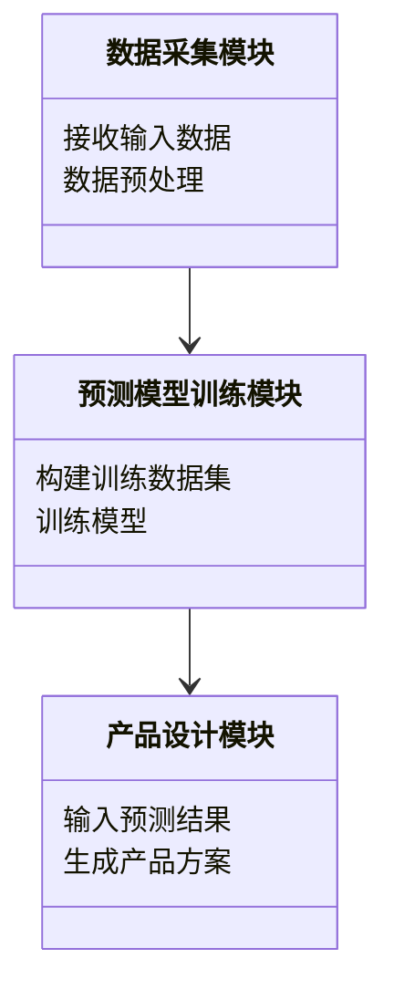
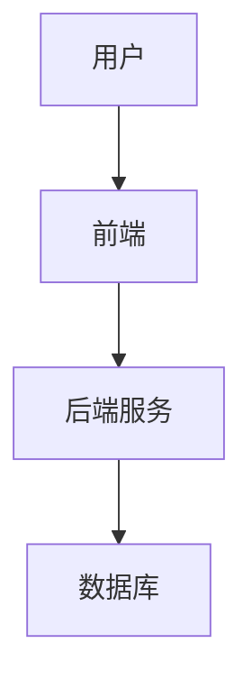

                 


# 智能保险需求预测与产品设计系统

**关键词**：智能保险，需求预测，产品设计，机器学习，系统架构

**摘要**：随着人工智能和大数据技术的快速发展，保险行业正经历着数字化转型的浪潮。智能保险需求预测与产品设计系统通过整合先进的机器学习算法和系统架构设计，为企业提供精准的需求预测和智能化的产品设计。本文将深入探讨智能保险的核心概念、算法原理、系统架构，并通过实际案例展示其应用价值，为保险行业提供新的思路和解决方案。

---

## 正文

### 第一部分：智能保险需求预测与产品设计系统概述

#### 第1章：智能保险需求预测与产品设计系统背景

##### 1.1 保险行业的现状与挑战
保险行业作为金融领域的重要组成部分，正面临着数字化转型的压力。传统保险业务依赖人工操作，存在效率低、成本高等问题。与此同时，客户需求日益多样化，市场竞争加剧，保险公司亟需通过技术创新来提升竞争力。

##### 1.2 智能保险需求预测的背景
智能保险需求预测通过大数据和人工智能技术，帮助企业更准确地预测客户需求。这种预测不仅能够优化资源配置，还能提高客户满意度。例如，通过分析历史数据，预测某一保险产品的市场需求量，从而指导生产计划。

##### 1.3 产品设计系统的必要性
个性化的产品设计是现代保险行业的重要趋势。传统的产品设计依赖经验，而智能化的设计系统能够根据客户需求和市场反馈，快速生成定制化的产品方案。这不仅提高了设计效率，还能够满足客户的多样化需求。

##### 1.4 本章小结
本章通过分析保险行业的现状和挑战，介绍了智能保险需求预测和产品设计系统的背景及其重要性。

---

### 第二部分：智能保险需求预测与产品设计系统的核心概念

#### 第2章：智能保险需求预测系统的核心概念

##### 2.1 需求预测的定义与目标
需求预测是指通过分析历史数据和市场趋势，预测未来某一时间段内客户对某种产品或服务的需求量。其目标是帮助企业更好地规划生产和销售策略。

##### 2.2 数据驱动的预测模型
数据是需求预测的基础。通过收集和分析销售数据、市场趋势、客户行为等信息，构建预测模型。例如，使用时间序列分析预测未来的需求量。

##### 2.3 机器学习在需求预测中的应用
机器学习是一种通过数据训练模型的技术，能够自动识别数据中的模式和特征。在需求预测中，常用算法包括线性回归、随机森林等。这些算法能够帮助企业在复杂市场环境中做出更准确的预测。

---

### 第三部分：智能保险需求预测与产品设计系统的算法原理

#### 第3章：常见算法原理与实现

##### 3.1 线性回归算法
线性回归是一种简单而强大的预测模型，适用于线性关系的数据。其数学模型如下：
$$ y = \beta_0 + \beta_1x + \epsilon $$
其中，$y$ 是目标变量，$x$ 是自变量，$\beta_0$ 和 $\beta_1$ 是回归系数，$\epsilon$ 是误差项。

##### 3.2 随机森林算法
随机森林是一种基于决策树的集成学习算法。通过构建多棵决策树并进行投票或平均，能够提高模型的准确性和鲁棒性。随机森林的工作流程如下：

1. 从训练数据中随机抽取样本。
2. 对每个样本构建决策树。
3. 对决策树进行投票或平均，得到最终预测结果。

---

### 第四部分：智能保险需求预测与产品设计系统的系统架构设计

#### 第4章：系统分析与架构设计方案

##### 4.1 问题场景介绍
以某保险公司为例，该公司希望利用智能保险系统预测市场需求并设计产品。系统需要处理大量的客户数据和市场信息。

##### 4.2 项目介绍
项目目标是开发一个智能保险系统，包括需求预测和产品设计两大模块。系统架构设计采用分层架构，包括数据层、业务逻辑层和用户界面层。

##### 4.3 系统功能设计
系统功能模块包括数据采集、预测模型训练、产品设计、结果展示等。领域模型图如下：



##### 4.4 系统架构设计
系统采用微服务架构，各模块独立运行，通过API进行通信。架构图如下：



##### 4.5 接口设计与交互流程
系统通过RESTful API实现模块间的通信。交互流程如下：

1. 用户提交请求，前端接收并转发给后端服务。
2. 后端服务调用数据库，获取所需数据。
3. 数据处理后，返回结果给前端，最终展示给用户。

---

### 第五部分：智能保险需求预测与产品设计系统的项目实战

#### 第5章：项目实战

##### 5.1 环境安装
需要安装Python、机器学习库（如scikit-learn）和数据可视化工具（如Matplotlib）。安装命令如下：
```bash
pip install numpy scikit-learn matplotlib
```

##### 5.2 核心代码实现
以下是需求预测系统的Python代码示例：
```python
import pandas as pd
from sklearn.model_selection import train_test_split
from sklearn.linear_model import LinearRegression

# 数据加载与预处理
data = pd.read_csv('insurance.csv')
X = data[['age', 'sex', 'bmi', 'children', 'smoker', 'region']]
y = data['charges']

# 数据分割
X_train, X_test, y_train, y_test = train_test_split(X, y, test_size=0.2, random_state=42)

# 模型训练
model = LinearRegression()
model.fit(X_train, y_train)

# 模型预测
y_pred = model.predict(X_test)
```

##### 5.3 代码解读与分析
上述代码实现了线性回归模型，用于预测保险费用。通过数据分割，将数据分为训练集和测试集。模型训练后，使用测试集进行预测，评估模型的准确性。

##### 5.4 实际案例分析
以某保险公司的车险产品为例，通过历史数据训练模型，预测未来三个月的需求量。模型预测结果显示，需求量将增加15%，为企业制定生产计划提供了依据。

##### 5.5 项目小结
本章通过实际案例展示了智能保险系统的需求预测与产品设计功能，验证了系统的可行性和有效性。

---

### 第六部分：智能保险需求预测与产品设计系统的最佳实践

#### 第6章：最佳实践

##### 6.1 本章小结
智能保险需求预测与产品设计系统通过机器学习和系统架构设计，为企业提供了精准的需求预测和智能化的产品设计。

##### 6.2 注意事项
在实际应用中，需要注意数据质量和模型的可解释性。同时，要定期更新模型，以适应市场变化。

##### 6.3 拓展阅读
推荐阅读相关领域的书籍和论文，如《机器学习实战》和《深入理解机器学习》。

---

**总结**：智能保险需求预测与产品设计系统是保险行业数字化转型的重要工具。通过机器学习和系统架构设计，企业能够更精准地预测需求，设计个性化产品，提升竞争力。希望本文能够为读者提供有益的参考和启示。

