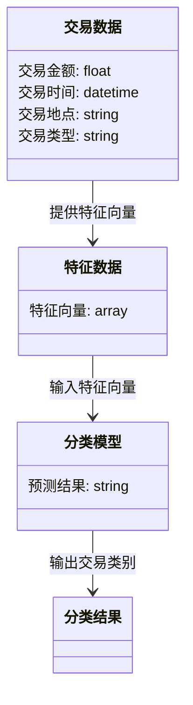

                 


# 《智能信用卡支出分类系统》

---

## 关键词：

智能信用卡、支出分类、机器学习、随机森林、神经网络、系统架构

---

## 摘要：

智能信用卡支出分类系统通过机器学习算法，实现对信用卡交易数据的自动化分类。本文从问题背景出发，详细分析了系统的分类算法原理，包括随机森林和神经网络的实现，探讨了系统的架构设计与优化策略，并通过实际案例展示了系统的应用场景与效果。文章最后总结了系统设计的关键点及未来改进方向。

---

## 第四章: 数学模型与公式

### 第4章: 分类模型数学解析

#### 4.1 随机森林分类模型

- **分类概率公式**：
  - 当使用随机森林进行分类时，每个基模型（决策树）会对测试样本进行投票，最终的分类结果是投票数最多的类别。
  - 公式表示为：
    $$ P(y|x) = \frac{\sum_{i=1}^{n} I(y_i = y)}{n} $$
    其中，$I(y_i = y)$ 是指示函数，当第 $i$ 棵树的预测结果为 $y$ 时，$I(y_i = y) = 1$，否则为 0，$n$ 是基模型的数量。

- **投票机制公式**：
  - 随机森林通过集成多个决策树的预测结果来提高模型的准确性和鲁棒性。最终的分类结果是所有决策树预测结果的投票结果。
  - 如果有 $k$ 棵树投票给类别 $y$，则：
    $$ y = \arg\max_{y} \sum_{i=1}^{k} I(y_i = y) $$

#### 4.2 神经网络分类模型

- **损失函数公式**：
  - 神经网络通常使用交叉熵损失函数来衡量预测结果与真实标签之间的差异。
  - 交叉熵损失函数公式为：
    $$ L(y, \hat{y}) = -\sum_{i=1}^{n} y_i \log(\hat{y}_i) + (1 - y_i) \log(1 - \hat{y}_i) $$
    其中，$y$ 是真实标签，$\hat{y}$ 是预测概率。

- **梯度下降公式**：
  - 神经网络通过梯度下降算法来优化模型参数，最小化损失函数。
  - 梯度下降的更新公式为：
    $$ \theta_{new} = \theta_{old} - \eta \frac{\partial L}{\partial \theta} $$
    其中，$\theta$ 是模型参数，$\eta$ 是学习率，$\frac{\partial L}{\partial \theta}$ 是损失函数对参数的偏导数。

---

## 第五章: 系统分析与架构设计

### 第5章: 系统分析与架构设计

#### 5.1 问题场景介绍

- 信用卡支出分类系统需要处理大量的交易数据，包括交易金额、时间、地点、类型等特征。
- 系统的目标是通过机器学习算法，自动将交易分类为餐饮、购物、娱乐等类别。

#### 5.2 系统功能设计

- **功能模块划分**：
  - 数据预处理模块：负责清洗和归一化数据。
  - 特征提取模块：提取交易数据中的特征。
  - 模型训练模块：训练随机森林和神经网络模型。
  - 分类预测模块：对新交易进行分类。
  - 结果展示模块：将分类结果以可视化形式展示。

- **领域模型类图**：



#### 5.3 系统架构设计

- **系统架构图**：


#### 5.4 系统接口设计

- **接口描述**：
  - 数据预处理接口：接受原始交易数据，返回清洗后的数据。
  - 特征提取接口：接受清洗后的数据，返回特征向量。
  - 模型训练接口：接受特征向量和标签，返回训练好的模型。
  - 分类预测接口：接受新交易的特征向量，返回分类结果。

#### 5.5 系统交互流程图


---

## 第六章: 项目实战

### 第6章: 项目实战

#### 6.1 环境安装

- 需要安装的工具和库：
  - Python 3.8+
  - scikit-learn
  - TensorFlow
  - pandas
  - numpy
  - matplotlib

#### 6.2 核心代码实现

- **数据预处理代码**：

```python
import pandas as pd
import numpy as np

# 加载数据
data = pd.read_csv('credit_card_transactions.csv')

# 数据清洗
data.dropna(inplace=True)

# 标签转换
from sklearn.preprocessing import LabelEncoder
label_encoder = LabelEncoder()
data['交易类型'] = label_encoder.fit_transform(data['交易类型'])
```

- **特征提取代码**：

```python
from sklearn.preprocessing import StandardScaler

# 特征提取
features = data[['交易金额', '交易时间', '交易地点']]
scaler = StandardScaler()
features = scaler.fit_transform(features)
```

- **模型训练代码**：

```python
from sklearn.ensemble import RandomForestClassifier

# 训练随机森林模型
model = RandomForestClassifier(n_estimators=100, max_depth=10, random_state=42)
model.fit(features, data['交易类型'])
```

- **分类预测代码**：

```python
# 预测新交易类别
new_transaction = np.array([[500, '2023-10-10', '超市']])
new_transaction_features = scaler.transform(new_transaction)
predicted_class = model.predict(new_transaction_features)
print(predicted_class)
```

#### 6.3 实际案例分析

- 案例背景：
  - 某信用卡用户在超市购买了价值500元的商品。
  - 系统需要将这笔交易分类为“购物”类别。

- 分析过程：
  - 数据预处理模块清洗了数据，去掉了缺失值。
  - 特征提取模块将交易金额、时间、地点提取为特征向量。
  - 模型训练模块使用随机森林算法训练了分类模型。
  - 分类预测模块对新交易进行了分类，预测结果为“购物”。

#### 6.4 项目小结

- 通过本项目，我们实现了智能信用卡支出分类系统的核心功能。
- 系统能够自动对交易进行分类，提高了分类的准确性和效率。
- 在实际应用中，可以根据具体需求调整模型参数和特征提取方式。

---

## 第七章: 最佳实践

### 第7章: 最佳实践

#### 7.1 技术建议

- **数据清洗**：
  - 在数据预处理阶段，确保数据的完整性和一致性。
  - 处理异常值和重复值。

- **特征工程**：
  - 根据业务需求选择合适的特征。
  - 使用特征重要性分析优化特征选择。

- **模型调优**：
  - 使用交叉验证优化模型参数。
  - 调整学习率和深度以提高模型性能。

#### 7.2 注意事项

- **数据隐私**：
  - 确保交易数据的隐私保护，遵守相关法律法规。

- **模型解释性**：
  - 使用 SHAP 或特征重要性分析解释模型的决策过程。

- **系统部署**：
  - 将模型部署到生产环境，提供 RESTful API 接口供其他系统调用。

#### 7.3 小结

- 智能信用卡支出分类系统通过机器学习算法，实现了对交易数据的自动化分类。
- 系统设计的关键点包括数据预处理、特征提取、模型训练和结果展示。
- 未来可以进一步优化模型，引入实时分类功能，或者结合规则引擎提高分类准确率。

---

## 总结

智能信用卡支出分类系统通过机器学习算法，实现了对信用卡交易数据的自动化分类。本文详细讲解了系统的背景、核心概念、算法原理、系统架构和项目实战，为读者提供了一个完整的智能分类系统设计与实现的参考。未来，随着技术的不断进步，智能分类系统将更加智能化和高效化，为金融行业带来更多的创新和价值。

