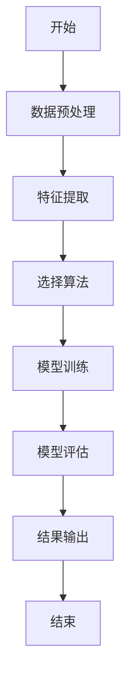
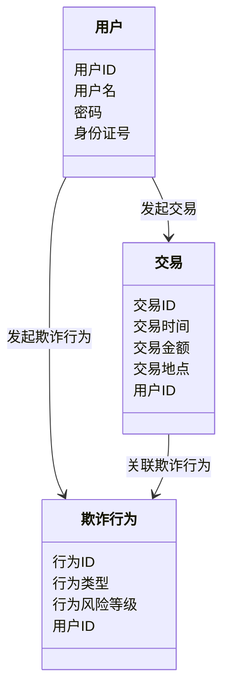
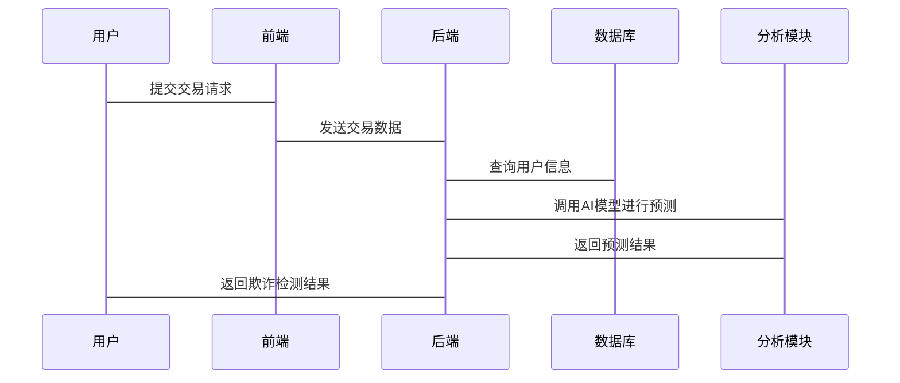

                 


# 智能信用卡欺诈检测系统

> 关键词：信用卡欺诈检测，人工智能，机器学习，风险管理，金融安全

> 摘要：智能信用卡欺诈检测系统是一种利用人工智能和机器学习技术来实时监测和预测信用卡交易中的欺诈行为的系统。本文详细探讨了该系统的背景、核心概念、算法原理、系统架构、项目实战以及总结与展望，帮助读者全面理解智能信用卡欺诈检测系统的原理和实现方法。

---

## 第一部分: 智能信用卡欺诈检测系统概述

### 第1章: 智能信用卡欺诈检测系统背景与概述

#### 1.1 信用卡欺诈检测的背景与现状

- **1.1.1 信用卡欺诈的定义与类型**
  - 信用卡欺诈是指通过非法手段获取他人信用卡信息并进行未经授权的交易。
  - 常见类型包括身份盗用、伪卡交易、网络诈骗、虚假申请等。
  - 随着电子商务的快速发展，欺诈手段日益复杂，传统检测方法已难以应对。

- **1.1.2 传统信用卡欺诈检测的局限性**
  - 基于规则的检测方法依赖人工设定的阈值，难以捕捉复杂模式。
  - 数据量大、维度高，传统方法效率低下。
  - 难以实时检测，可能导致较大损失。

- **1.1.3 智能化检测的必要性与发展趋势**
  - 人工智能和机器学习技术的应用可以显著提高检测精度和效率。
  - 智能化检测能够实时分析交易数据，快速识别异常行为。
  - 随着技术进步，智能检测系统将成为金融安全的核心工具。

#### 1.2 智能信用卡欺诈检测的核心概念

- **1.2.1 智能检测的定义与特点**
  - 智能检测系统利用机器学习算法对交易数据进行分析，自动识别欺诈行为。
  - 具有实时性、高精度、自适应性强等特点。

- **1.2.2 系统的核心要素与组成**
  - 数据采集模块：收集交易数据。
  - 特征提取模块：从交易数据中提取关键特征。
  - 模型训练模块：训练分类器。
  - 实时检测模块：对新交易进行预测。

- **1.2.3 检测系统的边界与外延**
  - 系统边界：仅关注信用卡交易数据。
  - 外延：可扩展至其他支付方式和金融欺诈检测。

#### 1.3 智能信用卡欺诈检测的系统架构

- **1.3.1 系统的整体架构**
  - 分为数据层、算法层和应用层。
  - 数据层负责数据存储和管理。
  - 算法层负责模型训练和预测。
  - 应用层负责用户交互和结果展示。

- **1.3.2 系统的主要功能模块**
  - 数据采集模块：收集交易数据。
  - 数据预处理模块：清洗和归一化数据。
  - 特征工程模块：提取特征。
  - 模型训练模块：训练分类器。
  - 实时检测模块：预测欺诈行为。

- **1.3.3 系统的输入输出流程**
  - 输入：交易数据。
  - 输出：欺诈标签（正常/欺诈）。

---

## 第2章: 智能信用卡欺诈检测的核心概念与联系

### 2.1 核心概念的原理分析

- **2.1.1 交易行为分析**
  - 通过分析交易的时间、地点、金额等信息，识别异常行为。
  - 示例：短时间内多次小额交易可能属于欺诈行为。

- **2.1.2 风险评估模型**
  - 基于机器学习算法构建风险评估模型，预测交易风险等级。
  - 示例：使用逻辑回归模型预测交易是否为欺诈。

- **2.1.3 智能学习算法**
  - 算法包括聚类、分类和深度学习等。
  - 示例：使用随机森林算法进行分类。

### 2.2 核心概念的属性特征对比

- **2.2.1 不同检测方法的对比分析**
  | 方法 | 优点 | 缺点 |
  |------|------|------|
  | 基于规则 | 易实现 | 易被绕过 |
  | 机器学习 | 高精度 | 数据依赖性强 |
  | 深度学习 | 强大学习能力 | 计算资源需求高 |

- **2.2.2 各种算法的优缺点**
  - 聚类算法：无监督学习，适合未知欺诈模式。
  - 分类算法：监督学习，适合已知欺诈样本。
  - 深度学习：适合高维数据，但需要大量数据。

- **2.2.3 系统性能指标的对比**
  - 准确率：正确分类的比例。
  - 召回率：检测到的欺诈交易比例。
  - F1分数：综合准确率和召回率。

### 2.3 系统的ER实体关系图

```mermaid
er
    entity 用户 {
        key 用户ID
        属性 用户名
        属性 密码
        属性 身份证号
    }
    entity 交易 {
        key 交易ID
        属性 交易时间
        属性 交易金额
        属性 交易地点
        属性 用户ID
    }
    entity 欺诈行为 {
        key 行为ID
        属性 行为类型
        属性 行为风险等级
        属性 用户ID
    }
    用户 --> 交易: 发起交易
    用户 --> 欺诈行为: 发起欺诈行为
    交易 --> 欺诈行为: 关联欺诈行为
```

---

## 第3章: 智能信用卡欺诈检测的算法原理

### 3.1 常见算法的原理与流程

- **3.1.1 聚类算法**
  - 原理：无监督学习，将交易数据聚类，识别异常聚类。
  - 流程：数据预处理、特征提取、聚类、异常检测。

- **3.1.2 分类算法**
  - 原理：监督学习，训练分类器预测交易是否为欺诈。
  - 流程：数据预处理、特征提取、模型训练、预测。

- **3.1.3 深度学习算法**
  - 原理：使用神经网络模型进行特征学习和分类。
  - 流程：数据预处理、模型训练、预测。

### 3.2 算法流程图



### 3.3 算法实现代码

```python
import pandas as pd
from sklearn.model_selection import train_test_split
from sklearn.ensemble import RandomForestClassifier
from sklearn.metrics import accuracy_score

# 加载数据
data = pd.read_csv('transactions.csv')

# 特征提取
features = data[['amount', 'time', 'location']]
labels = data['is_fraud']

# 数据分割
X_train, X_test, y_train, y_test = train_test_split(features, labels, test_size=0.2)

# 模型训练
model = RandomForestClassifier()
model.fit(X_train, y_train)

# 预测
y_pred = model.predict(X_test)

# 评估
print('准确率:', accuracy_score(y_test, y_pred))
```

---

## 第4章: 系统分析与架构设计

### 4.1 系统需求分析

- **功能需求**：实时检测欺诈交易。
- **性能需求**：低延迟，高吞吐量。
- **安全性需求**：保护用户数据安全。

### 4.2 系统功能设计

- **领域模型**


- **系统架构设计**


- **系统接口设计**
  - 前端接口：用户提交交易请求。
  - 后端接口：接收请求，调用AI模型进行预测。

- **系统交互设计**


---

## 第5章: 项目实战

### 5.1 环境安装

```bash
pip install pandas scikit-learn matplotlib
```

### 5.2 系统核心实现

```python
import pandas as pd
from sklearn.ensemble import RandomForestClassifier
from sklearn.metrics import accuracy_score

# 加载数据
data = pd.read_csv('transactions.csv')

# 特征提取
features = data[['amount', 'time', 'location']]
labels = data['is_fraud']

# 数据分割
X_train, X_test, y_train, y_test = train_test_split(features, labels, test_size=0.2)

# 模型训练
model = RandomForestClassifier()
model.fit(X_train, y_train)

# 预测
y_pred = model.predict(X_test)

# 评估
print('准确率:', accuracy_score(y_test, y_pred))
```

### 5.3 案例分析

- 数据预处理：清洗缺失值和异常值。
- 特征工程：选择高影响力的特征。
- 模型调优：调整超参数，提高准确率。

### 5.4 系统测试

- 单元测试：测试各个模块的功能。
- 集成测试：测试系统整体流程。
- 性能测试：测试系统的处理能力。

---

## 第6章: 总结与展望

### 6.1 最佳实践

- 定期更新模型，适应新的欺诈手段。
- 综合使用多种算法，提高检测精度。
- 加强数据安全，保护用户隐私。

### 6.2 小结

智能信用卡欺诈检测系统利用人工智能和机器学习技术，有效提高了欺诈检测的效率和精度。通过系统的架构设计和算法优化，能够实时监测交易，保护用户和金融机构的利益。

### 6.3 注意事项

- 数据隐私：确保用户数据的安全性。
- 模型更新：定期更新模型，防止过时。
- 系统监控：实时监控系统运行状态。

### 6.4 拓展阅读

- 《机器学习实战》
- 《深度学习入门》
- 《金融风险管理》

---

通过以上内容，读者可以全面了解智能信用卡欺诈检测系统的原理、实现和应用，掌握构建此类系统的方法和技巧。

