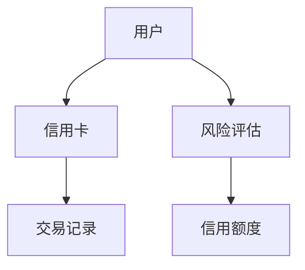
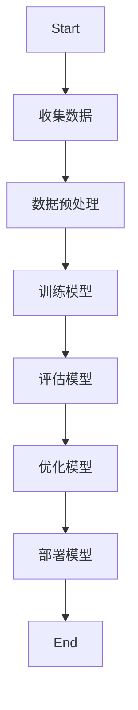
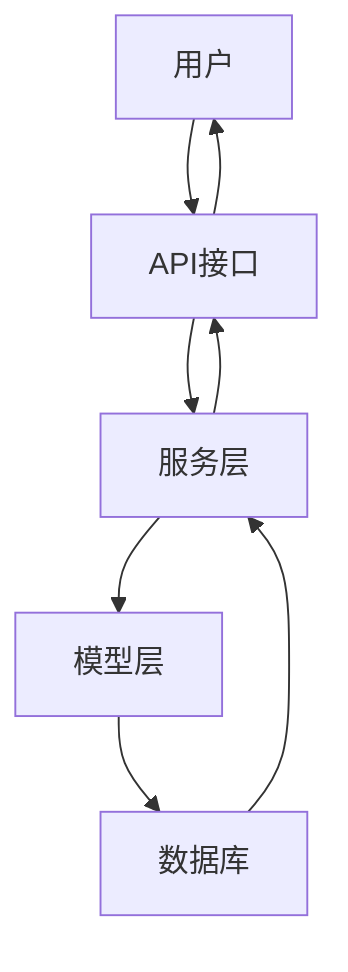

                 


# 智能信用卡额度优化管理系统

> 关键词：智能信用卡，额度优化，人工智能，机器学习，风险管理

> 摘要：本文详细探讨智能信用卡额度优化管理系统的背景、核心概念、算法原理、系统架构、项目实战及最佳实践。通过分析当前信用卡额度管理的痛点，提出基于人工智能的解决方案，结合实际案例，展示如何通过数据驱动和智能算法实现信用卡额度的动态优化管理。

---

## 第一部分: 智能信用卡额度优化管理系统的背景与核心概念

### 第1章: 信用卡额度优化管理的背景与现状

#### 1.1 信用卡额度优化管理的背景

##### 1.1.1 信用卡业务的现状与发展趋势

信用卡作为现代金融的重要组成部分，其普及率和使用频率在近年来持续上升。然而，随着经济环境的复杂化和用户需求的多样化，传统的信用卡管理方式已难以满足市场的需求。银行和金融机构需要更加智能化的手段来优化信用卡额度管理，以提升用户体验和风险控制能力。

##### 1.1.2 信用卡额度优化管理的必要性

传统信用卡额度管理主要依赖人工决策，存在效率低、误差大、难以实时调整等问题。随着大数据和人工智能技术的发展，通过智能算法优化信用卡额度，能够实现精准的用户画像、实时的风险评估和动态的额度调整，从而提高用户体验和风险管理能力。

##### 1.1.3 智能化技术在信用卡管理中的应用

人工智能、机器学习和大数据分析等技术为信用卡额度优化管理提供了新的可能性。通过智能算法，系统可以实时分析用户的交易数据、信用记录和行为特征，从而动态调整信用额度，降低风险，提升用户满意度。

#### 1.2 传统信用卡额度管理的痛点

##### 1.2.1 传统额度管理的局限性

传统信用卡额度管理主要依赖人工审核和固定规则，难以应对用户行为的多样性和市场环境的变化。人工决策的低效性和主观性可能导致额度调整不及时，影响用户体验和风险管理效果。

##### 1.2.2 人工决策的低效性

人工审核需要大量时间和资源，且容易受到主观因素的影响。特别是在用户数量庞大的情况下，人工审核的效率和准确性难以满足市场需求。

##### 1.2.3 数据孤岛与信息不对称问题

传统信用卡管理中，数据分散在不同部门或系统中，难以实现信息的共享和整合。这种数据孤岛现象导致决策者无法全面了解用户的情况，影响额度调整的准确性和及时性。

#### 1.3 智能化额度优化管理的解决方案

##### 1.3.1 数据驱动的决策模式

通过收集和分析海量数据，利用大数据技术提取用户行为特征和信用风险信息，为智能决策提供数据支持。

##### 1.3.2 人工智能技术的应用前景

人工智能技术，特别是机器学习算法，能够从历史数据中学习用户的信用行为，预测未来风险，从而实现动态额度调整。

##### 1.3.3 智能信用卡额度优化管理的定义与目标

智能信用卡额度优化管理系统通过整合用户数据、市场信息和风险指标，利用智能算法实时调整用户的信用额度，以实现风险管理、用户体验优化和业务收益提升的多重目标。

---

### 第2章: 智能信用卡额度优化管理的核心概念

#### 2.1 智能信用卡额度优化管理的定义与特点

##### 2.1.1 核心定义

智能信用卡额度优化管理系统是一种基于人工智能和大数据分析的智能系统，通过实时分析用户的信用行为和市场环境，动态调整用户的信用额度，以实现风险管理、用户体验优化和业务收益最大化。

##### 2.1.2 系统特点

- **实时性**：系统能够实时分析用户的交易数据和信用行为，快速调整信用额度。
- **精准性**：基于机器学习算法，系统能够准确预测用户的信用风险，实现精准的额度调整。
- **动态性**：系统能够根据市场环境和用户行为的变化，动态优化信用额度。
- **智能化**：系统通过智能算法实现自动化的额度调整和风险管理。

##### 2.1.3 与传统额度管理的对比

| 对比维度 | 传统额度管理 | 智能化额度管理 |
|----------|--------------|----------------|
| 决策方式 | 人工审核 | 智能算法驱动 |
| 数据来源 | 单一数据源 | 多源数据整合 |
| 调整频率 | 低频调整 | 实时动态调整 |
| 精准度 | 低 | 高 |
| 效率 | 低效 | 高效 |

#### 2.2 核心概念与联系

##### 2.2.1 实体关系图（ER图）设计



从ER图可以看出，系统涉及的核心实体包括用户、信用卡、交易记录、风险评估和信用额度。用户通过信用卡进行交易，系统根据交易记录和风险评估结果调整用户的信用额度。

##### 2.2.2 核心概念属性对比表

| 概念 | 属性 | 描述 |
|------|------|------|
| 用户 | ID | 用户唯一标识 |
| 信用卡 | 卡号 | 信用卡唯一标识 |
| 交易记录 | 时间 | 交易发生的时间 |
| 风险评估 | 评分 | 用户信用风险评分 |
| 信用额度 | 金额 | 用户信用额度 |

通过以上对比表可以看出，每个核心概念的属性及其描述，为系统设计提供了清晰的指导。

#### 2.3 核心算法与数学模型

##### 2.3.1 算法流程图



从流程图可以看出，智能信用卡额度优化管理系统的算法流程包括数据收集、数据预处理、模型训练、模型评估、模型优化和模型部署六个阶段。

##### 2.3.2 数学模型与公式

###### 2.3.2.1 线性回归模型

线性回归模型是一种常用的机器学习算法，用于预测连续型变量。在智能信用卡额度优化管理中，线性回归模型可以用于预测用户的信用额度。

$$ y = \beta_0 + \beta_1 x_1 + \beta_2 x_2 + \ldots + \beta_n x_n + \epsilon $$

其中：
- \( y \) 表示预测的信用额度。
- \( \beta_0 \) 表示截距。
- \( \beta_1, \beta_2, \ldots, \beta_n \) 表示各特征变量的系数。
- \( x_1, x_2, \ldots, x_n \) 表示各特征变量。
- \( \epsilon \) 表示误差项。

---

## 第二部分: 算法原理

### 第3章: 基于机器学习的智能信用卡额度优化算法

#### 3.1 算法选择与原理

##### 3.1.1 机器学习算法的选择

在智能信用卡额度优化管理中，常用的机器学习算法包括线性回归、决策树、随机森林和支持向量机（SVM）等。其中，线性回归适用于预测连续型变量，而决策树和随机森林适用于分类问题。

##### 3.1.2 线性回归算法的实现

线性回归算法的实现步骤如下：

1. **数据收集**：收集用户的交易数据、信用记录和行为特征。
2. **数据预处理**：对数据进行清洗、归一化和特征提取。
3. **模型训练**：利用线性回归算法训练模型，得到特征变量的系数。
4. **模型评估**：通过均方误差（MSE）和决定系数（R²）评估模型的性能。
5. **模型优化**：通过调整模型参数和特征选择优化模型。
6. **模型部署**：将优化后的模型部署到生产环境中，实时调整用户的信用额度。

##### 3.1.3 决策树算法的实现

决策树算法是一种常用的分类算法，适用于将用户分为不同的信用风险等级。

1. **数据收集**：收集用户的交易数据、信用记录和行为特征。
2. **数据预处理**：对数据进行清洗、归一化和特征提取。
3. **模型训练**：利用决策树算法训练模型，构建决策树。
4. **模型评估**：通过准确率、召回率和F1分数评估模型的性能。
5. **模型优化**：通过剪枝和特征选择优化模型。
6. **模型部署**：将优化后的模型部署到生产环境中，实时调整用户的信用额度。

---

### 第4章: 算法实现与优化

#### 4.1 算法实现的步骤

##### 4.1.1 数据预处理

数据预处理是机器学习算法实现的重要步骤，包括数据清洗、归一化和特征提取。

##### 4.1.2 模型训练与评估

利用训练数据训练模型，并通过评估指标（如MSE、R²等）评估模型的性能。

##### 4.1.3 模型优化

通过调整模型参数和特征选择优化模型，提高模型的准确性和效率。

#### 4.2 算法优化的策略

##### 4.2.1 参数调优

通过网格搜索和随机搜索等方法优化模型参数，提高模型的性能。

##### 4.2.2 特征选择

通过特征重要性分析和特征选择算法优化模型的特征，提高模型的准确性和效率。

##### 4.2.3 模型集成

通过集成学习（如投票法和加权法）优化模型，提高模型的准确性和稳定性。

---

## 第三部分: 系统架构与设计

### 第5章: 智能信用卡额度优化管理系统的架构设计

#### 5.1 系统整体架构

智能信用卡额度优化管理系统的整体架构包括前端界面、后端服务和数据库三部分。

##### 5.1.1 前端界面

前端界面负责与用户交互，包括用户登录、额度查询和交易记录查询等功能。

##### 5.1.2 后端服务

后端服务负责接收前端请求，调用智能算法模型进行额度优化，并将结果返回前端。

##### 5.1.3 数据库

数据库负责存储用户数据、交易记录和模型数据，为系统提供数据支持。

#### 5.2 微服务架构设计

智能信用卡额度优化管理系统采用微服务架构，包括用户服务、交易服务、风险评估服务和额度优化服务。

##### 5.2.1 用户服务

用户服务负责管理用户信息，包括用户注册、登录和信息查询等功能。

##### 5.2.2 交易服务

交易服务负责管理交易记录，包括交易数据的录入、查询和统计分析等功能。

##### 5.2.3 风险评估服务

风险评估服务负责评估用户的信用风险，包括信用评分和风险等级评估等功能。

##### 5.2.4 额度优化服务

额度优化服务负责动态调整用户的信用额度，包括额度计算、调整记录和优化结果输出等功能。

#### 5.3 数据库设计

##### 5.3.1 数据库表结构设计

| 表名 | 字段 | 描述 |
|------|------|------|
| 用户表 | 用户ID | 用户唯一标识 |
| 信用卡表 | 卡号 | 信用卡唯一标识 |
| 交易记录表 | 交易时间 | 交易发生的时间 |
| 风险评估表 | 评分时间 | 风险评估的时间 |
| 额度优化表 | 调整时间 | 额度调整的时间 |

##### 5.3.2 数据库优化策略

通过索引优化、分库分表和读写分离等策略提高数据库的性能和可扩展性。

---

### 第6章: 系统功能模块设计

#### 6.1 系统功能模块

智能信用卡额度优化管理系统的功能模块包括用户管理、交易管理、风险评估和额度优化四大模块。

##### 6.1.1 用户管理模块

用户管理模块负责管理用户信息，包括用户注册、登录和信息查询等功能。

##### 6.1.2 交易管理模块

交易管理模块负责管理交易记录，包括交易数据的录入、查询和统计分析等功能。

##### 6.1.3 风险评估模块

风险评估模块负责评估用户的信用风险，包括信用评分和风险等级评估等功能。

##### 6.1.4 额度优化模块

额度优化模块负责动态调整用户的信用额度，包括额度计算、调整记录和优化结果输出等功能。

#### 6.2 功能模块实现

##### 6.2.1 用户管理模块的实现

用户管理模块的实现包括用户注册、登录和信息查询等功能。通过前端界面和后端服务的交互，实现用户的身份验证和信息管理。

##### 6.2.2 交易管理模块的实现

交易管理模块的实现包括交易数据的录入、查询和统计分析等功能。通过数据库存储和后端服务的处理，实现交易数据的高效管理和分析。

##### 6.2.3 风险评估模块的实现

风险评估模块的实现包括信用评分和风险等级评估等功能。通过机器学习算法模型，实现用户信用风险的精准评估和预测。

##### 6.2.4 额度优化模块的实现

额度优化模块的实现包括额度计算、调整记录和优化结果输出等功能。通过智能算法模型，实现用户的信用额度的动态优化和调整。

---

## 第四部分: 项目实战

### 第7章: 智能信用卡额度优化管理系统的实战开发

#### 7.1 项目环境安装

##### 7.1.1 系统运行环境

智能信用卡额度优化管理系统需要运行在Linux或Windows服务器上，推荐使用Docker容器化部署。

##### 7.1.2 开发工具安装

安装Python、Jupyter Notebook、TensorFlow和Scikit-learn等开发工具和库。

#### 7.2 核心代码实现

##### 7.2.1 数据预处理代码

```python
import pandas as pd
from sklearn.preprocessing import StandardScaler

# 数据预处理代码
data = pd.read_csv('credit_card_data.csv')
data = data.dropna()
data = data[['user_id', 'transaction_amount', 'transaction_time', 'risk_score']]
scaler = StandardScaler()
data_scaled = scaler.fit_transform(data[['transaction_amount', 'transaction_time', 'risk_score']])
```

##### 7.2.2 模型训练代码

```python
from sklearn.linear_model import LinearRegression
from sklearn.metrics import mean_squared_error

# 线性回归模型训练代码
model = LinearRegression()
model.fit(data_scaled, data['credit_limit'])
```

##### 7.2.3 模型优化代码

```python
from sklearn.model_selection import GridSearchCV

# 模型优化代码
param_grid = {'alpha': [0.1, 1, 10]}
grid_search = GridSearchCV(estimator=model, param_grid=param_grid, cv=5)
grid_search.fit(data_scaled, data['credit_limit'])
best_model = grid_search.best_estimator_
```

##### 7.2.4 系统接口设计

设计RESTful API接口，实现用户登录、额度查询和交易记录查询等功能。

##### 7.2.5 系统交互流程图



---

### 第8章: 项目部署与测试

#### 8.1 项目部署

##### 8.1.1 系统部署方案

通过Docker容器化部署智能信用卡额度优化管理系统，实现系统的快速部署和可扩展性。

##### 8.1.2 系统配置

配置系统的参数和数据库连接，确保系统的正常运行。

#### 8.2 项目测试

##### 8.2.1 功能测试

测试系统的各项功能，包括用户登录、额度查询和交易记录查询等。

##### 8.2.2 性能测试

通过LoadRunner等工具进行性能测试，确保系统的高可用性和稳定性。

##### 8.2.3 安全测试

测试系统的安全性，包括防止SQL注入和XSS攻击等。

---

## 第五部分: 最佳实践

### 第9章: 智能信用卡额度优化管理系统的最佳实践

#### 9.1 小结

智能信用卡额度优化管理系统通过人工智能和大数据分析技术，实现了信用卡额度的动态优化管理。系统的核心是智能算法，通过实时分析用户的交易数据和信用行为，动态调整用户的信用额度，降低风险，提升用户体验。

#### 9.2 注意事项

在实际应用中，需要注意数据隐私保护、模型的可解释性和系统的安全性。同时，还需要根据实际业务需求，不断优化系统的功能和性能。

#### 9.3 拓展阅读

建议读者进一步阅读以下内容：
- 《机器学习实战》——周志华
- 《深入浅出机器学习》——Andrej Karpathy
- 《大数据分析与挖掘》——范冰

---

通过以上内容，我们全面介绍了智能信用卡额度优化管理系统的背景、核心概念、算法原理、系统架构、项目实战及最佳实践。希望本文能够为读者提供有价值的技术参考和实践指导。

