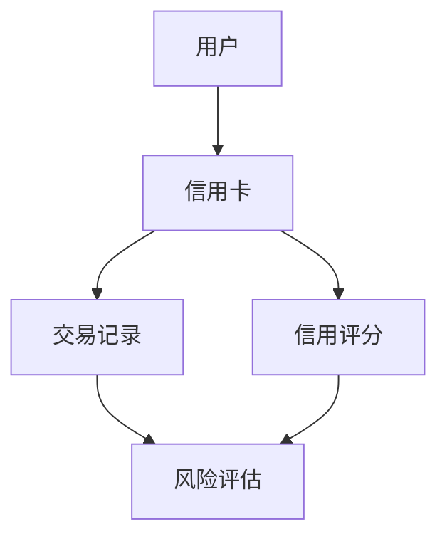
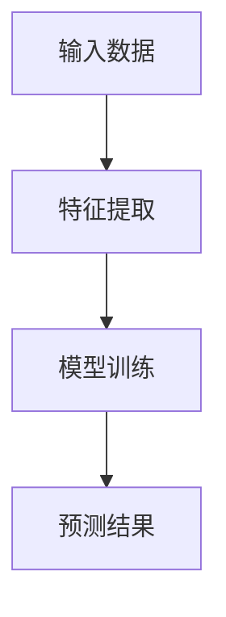
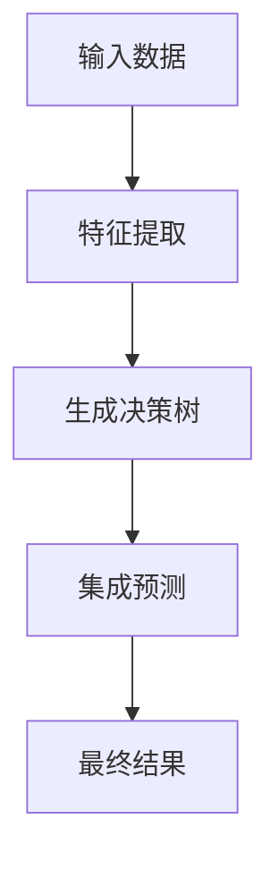
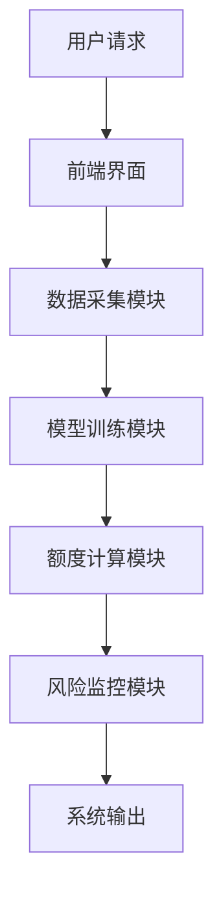
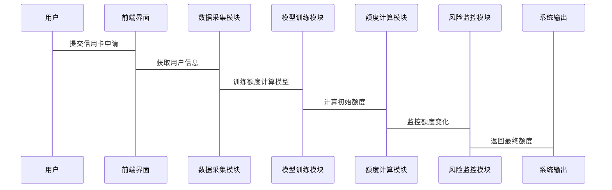

                 


# 智能信用卡额度管理优化系统

> 关键词：智能信用卡，额度管理，优化系统，人工智能，风险管理

> 摘要：本文探讨了如何利用人工智能技术优化信用卡额度管理，分析了传统额度管理的痛点，并提出了基于机器学习的智能优化系统。通过详细阐述系统的架构设计、算法实现和实际案例，本文为金融机构提供了智能化额度管理的解决方案。

---

# 第1章: 智能信用卡额度管理优化系统背景介绍

## 1.1 问题背景与问题描述

### 1.1.1 传统信用卡额度管理的痛点
传统的信用卡额度管理主要依赖人工审核和简单的规则模型，存在以下问题：
- **审批效率低**：人工审核耗时长，难以满足用户快速申请的需求。
- **额度不精准**：基于简单规则的模型难以捕捉用户的真实信用风险，导致额度设置不合理。
- **风险控制弱**：无法及时捕捉用户信用状况的变化，容易出现过度授信或授信不足的情况。

### 1.1.2 智能化额度管理的必要性
随着大数据和人工智能技术的快速发展，金融机构可以利用先进的技术手段，实时分析用户行为数据和市场动态，从而实现更精准的额度管理。

### 1.1.3 优化信用卡额度管理的核心目标
智能信用卡额度管理优化系统的核心目标包括：
- **提高审批效率**：通过自动化流程缩短审批时间。
- **精准额度计算**：基于用户数据和市场变化，动态调整额度。
- **降低风险**：通过实时监控和风险评估，减少坏账率。

## 1.2 问题解决与系统边界

### 1.2.1 系统解决的主要问题
- **自动化审批流程**：取代人工审核，提高效率。
- **动态额度调整**：根据用户信用变化实时调整额度。
- **风险控制**：通过机器学习模型预测风险，降低坏账率。

### 1.2.2 系统功能的边界与外延
- **边界**：系统仅负责额度管理，不涉及其他信用卡功能（如交易授权、还款提醒等）。
- **外延**：未来可以扩展到信用评分、欺诈检测等其他领域。

### 1.2.3 核心概念与系统组成要素
- **核心概念**：数据分析、机器学习模型、风险评估。
- **系统组成**：数据采集模块、模型训练模块、额度计算模块、风险监控模块。

## 1.3 本章小结
本章从传统信用卡额度管理的痛点出发，提出了智能化额度管理的必要性，并明确了系统的边界和核心目标。接下来将详细探讨系统的架构设计和实现方法。

---

# 第2章: 智能信用卡额度管理优化系统的核心概念与联系

## 2.1 核心概念与系统架构

### 2.1.1 数据分析与特征提取
- **数据分析**：通过对用户交易数据、信用报告和市场数据的分析，提取关键特征（如收入水平、信用历史、消费习惯）。
- **特征提取**：选择对额度计算影响最大的特征，如用户收入稳定性、消费行为规律等。

### 2.1.2 机器学习模型的应用
- **模型选择**：常用的模型包括线性回归、随机森林、梯度提升树（如XGBoost、LightGBM）。
- **模型训练**：通过历史数据训练模型，使其能够预测用户的信用风险。

### 2.1.3 风险评估与额度优化
- **风险评估**：基于机器学习模型评估用户的信用风险，确定其适合的信用额度。
- **额度优化**：根据风险评估结果动态调整额度，确保在风险可控的前提下最大化用户体验。

### 2.1.4 核心概念对比与ER图

#### 不同算法的特征对比表
| 算法类型 | 优势 | 劣势 | 适用场景 |
|----------|------|------|----------|
| 线性回归 | 简单易懂 | 解释性差 | 适用于线性关系明显的场景 |
| 随机森林 | 高准确性 | 计算复杂 | 适用于复杂非线性关系 |
| XGBoost  | 高准确性 | 易过拟合 | 适用于大数据场景 |

#### 实体关系图（ER图）


## 2.2 核心概念对比与ER图

### 2.2.1 不同算法的特征对比表
如上表所示，不同算法在准确性和复杂性方面存在差异，选择合适的算法取决于具体应用场景。

### 2.2.2 系统的ER实体关系图
通过ER图可以清晰地看到系统中各实体之间的关系，为后续的系统设计提供基础。

## 2.3 本章小结
本章详细探讨了智能信用卡额度管理系统的核心概念，包括数据分析、机器学习模型和风险评估，并通过对比分析和ER图展示了系统架构的设计思路。

---

# 第3章: 算法原理与数学模型

## 3.1 算法原理

### 3.1.1 线性回归模型
线性回归是一种简单但有效的回归算法，适用于线性关系明显的场景。其基本原理是通过最小化预测值与实际值的平方差之和，找到最佳拟合直线。

#### 线性回归流程图


### 3.1.2 随机森林模型
随机森林是一种基于决策树的集成算法，通过构建多个决策树并进行投票或平均，显著提高了模型的准确性和稳定性。

#### 随机森林流程图


## 3.2 数学模型与公式

### 3.2.1 线性回归公式
$$y = \beta_0 + \beta_1x + \epsilon$$

### 3.2.2 随机森林公式
随机森林通过集成多个决策树的结果，最终预测结果为各树预测结果的平均值或多数投票结果。

### 3.2.3 风险评估公式
$$\text{风险评分} = \sum_{i=1}^{n} w_i x_i$$
其中，$w_i$是特征$x_i$的权重。

## 3.3 算法实现与案例

### 3.3.1 算法实现步骤
1. **数据采集**：收集用户交易数据、信用报告等。
2. **数据预处理**：清洗数据，处理缺失值和异常值。
3. **特征提取**：选择对额度计算影响大的特征。
4. **模型训练**：使用训练数据训练机器学习模型。
5. **模型评估**：通过测试数据验证模型的准确性和稳定性。
6. **部署上线**：将模型集成到系统中，实现自动化额度管理。

### 3.3.2 实际案例分析
假设某银行希望优化信用卡额度管理，采用随机森林模型进行风险评估。通过分析用户的交易数据和信用报告，模型能够准确预测用户的信用风险，并动态调整额度。

## 3.4 本章小结
本章详细讲解了线性回归和随机森林两种算法的原理和实现步骤，并通过案例分析展示了它们在智能信用卡额度管理中的应用。

---

# 第4章: 系统分析与架构设计方案

## 4.1 系统分析

### 4.1.1 问题场景介绍
系统需要解决传统信用卡额度管理中的低效和不精准问题，实现自动化、动态化的额度管理。

### 4.1.2 项目介绍
项目目标是开发一个基于机器学习的智能信用卡额度管理优化系统，提高审批效率和风险控制能力。

## 4.2 系统功能设计

### 4.2.1 领域模型设计


### 4.2.2 系统架构设计


### 4.2.3 系统接口设计
系统需要与银行核心系统、交易系统等进行对接，通过API接口实现数据交互。

### 4.2.4 系统交互设计


## 4.3 本章小结
本章从系统分析的角度，详细介绍了智能信用卡额度管理优化系统的功能设计和架构设计，为后续的实现提供了理论基础。

---

# 第5章: 项目实战

## 5.1 环境安装

### 5.1.1 安装Python环境
使用Anaconda或Pyenv安装Python 3.8以上版本。

### 5.1.2 安装机器学习库
安装Scikit-learn、XGBoost、LightGBM等机器学习库。

## 5.2 系统核心实现源代码

### 5.2.1 数据预处理代码
```python
import pandas as pd
import numpy as np

# 读取数据
data = pd.read_csv('credit_data.csv')

# 处理缺失值
data = data.dropna()

# 标准化处理
from sklearn.preprocessing import StandardScaler
scaler = StandardScaler()
data_scaled = scaler.fit_transform(data)
```

### 5.2.2 模型训练代码
```python
from sklearn.ensemble import RandomForestRegressor

# 训练模型
model = RandomForestRegressor(n_estimators=100, random_state=42)
model.fit(X_train, y_train)

# 预测结果
y_pred = model.predict(X_test)
```

### 5.2.3 额度计算代码
```python
def calculate_credit_limit(predicted_score):
    if predicted_score < 0.6:
        return 5000
    elif 0.6 <= predicted_score < 0.8:
        return 10000
    else:
        return 50000
```

## 5.3 代码应用解读与分析

### 5.3.1 数据预处理解读
- **读取数据**：从CSV文件中读取信用卡数据。
- **处理缺失值**：删除包含缺失值的行，确保数据完整性。
- **标准化处理**：对数据进行标准化，消除特征之间的量纲差异。

### 5.3.2 模型训练解读
- **随机森林模型**：使用随机森林回归模型进行训练，参数设置为100棵树，随机种子为42。
- **预测结果**：在测试数据上进行预测，得到每个用户的信用评分。

### 5.3.3 额度计算解读
- **信用评分分类**：根据模型预测的信用评分，将用户分为三类：低风险、中风险和高风险。
- **动态调整额度**：根据风险等级，分别设置信用额度为5000元、10000元和50000元。

## 5.4 实际案例分析

### 5.4.1 案例背景
某用户申请信用卡，系统通过分析其交易记录、信用报告等信息，预测其信用评分为0.75。

### 5.4.2 案例分析
- **信用评分**：0.75属于中风险。
- **额度计算**：根据规则，中风险用户的信用额度为10000元。

## 5.5 项目小结
通过实际案例分析，展示了智能信用卡额度管理优化系统的实际应用效果。模型能够准确预测用户的信用风险，并动态调整额度，显著提高了风险管理效率。

---

# 第6章: 总结与展望

## 6.1 系统优势与不足

### 6.1.1 系统优势
- **高效性**：自动化流程大幅提高了审批效率。
- **精准性**：基于机器学习的模型能够准确预测信用风险。
- **灵活性**：系统能够动态调整额度，适应市场变化。

### 6.1.2 系统不足
- **模型过拟合**：部分模型在训练数据上表现优异，但在实际应用中可能过拟合。
- **数据隐私**：用户数据的安全性和隐私保护是系统设计中的重要挑战。

## 6.2 未来展望

### 6.2.1 技术发展
- **更复杂的模型**：如图神经网络（Graph Neural Network）的应用，可以更好地捕捉用户之间的关联关系。
- **实时计算**：通过边缘计算和流数据处理技术，实现实时额度调整。

### 6.2.2 应用拓展
- **信用评分优化**：进一步优化信用评分模型，提高评分的准确性。
- **欺诈检测**：结合欺诈检测技术，构建更全面的智能风控系统。

## 6.3 小结
智能信用卡额度管理优化系统通过引入机器学习技术，显著提高了额度管理的效率和准确性。未来，随着技术的不断进步和应用的拓展，系统将变得更加智能和高效。

---

# 附录

## 附录A: 核心代码实现
包括数据预处理代码、模型训练代码和额度计算代码的详细实现。

## 附录B: 算法对比分析
详细对比不同算法在智能信用卡额度管理中的表现，帮助读者选择合适的算法。

## 附录C: 系统架构图
包括领域模型类图、系统架构图和系统交互图的详细说明。

---

# 参考文献
- Scikit-learn官方文档
- XGBoost官方文档
- LightGBM官方文档
- 相关学术论文和研究报告

