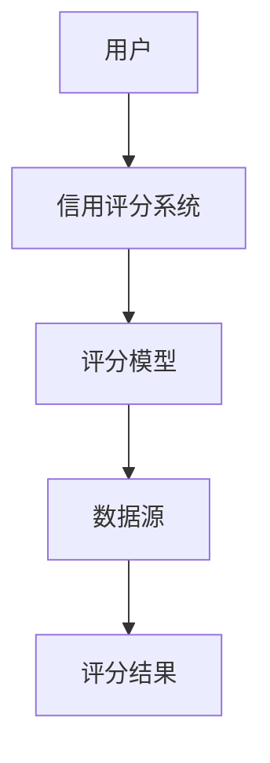
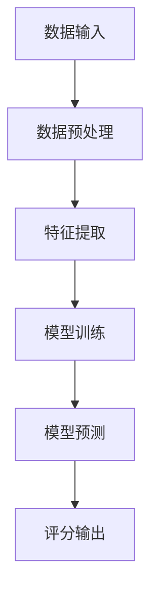

                 


# 《智能信用评分系统》

## 关键词：
智能信用评分系统、人工智能、机器学习、信用评估、金融系统、数据科学

## 摘要：
智能信用评分系统是金融领域的一项创新技术，结合了人工智能和大数据分析，能够高效、精准地评估个人或企业的信用风险。本文将从系统的背景、核心概念、算法原理、系统架构、项目实战等多方面进行详细阐述，帮助读者全面理解智能信用评分系统的构建与应用。通过本文的学习，读者将能够掌握智能信用评分系统的原理、实现方法，并能够在实际应用中设计和优化智能信用评分系统。

---

## 目录大纲：

### 第1章：背景介绍
#### 1.1 信用评分系统的基本概念
- 1.1.1 信用评分的定义与作用
- 1.1.2 传统信用评分系统的局限性
- 1.1.3 智能信用评分系统的必要性

#### 1.2 智能信用评分系统的背景与现状
- 1.2.1 人工智能在金融领域的应用趋势
- 1.2.2 智能信用评分系统的国内外发展现状
- 1.2.3 未来信用评分系统的发展方向

### 第2章：核心概念与联系
#### 2.1 核心概念原理
- 2.1.1 信用评分模型的原理
- 2.1.2 机器学习在信用评分中的应用
- 2.1.3 数据预处理与特征提取

#### 2.2 核心概念属性特征对比
- 2.2.1 不同信用评分模型的对比分析
- 2.2.2 传统评分系统与智能评分系统的优缺点对比

#### 2.3 ER实体关系图架构


### 第3章：算法原理讲解
#### 3.1 常见算法原理
- 3.1.1 逻辑回归算法
- 3.1.2 随机森林算法
- 3.1.3 神经网络算法

#### 3.2 算法流程图


#### 3.3 算法实现代码
- 逻辑回归算法示例
  ```python
  import numpy as np
  from sklearn.linear_model import LogisticRegression

  # 数据预处理
  X = np.array([[...], [...]])  # 特征向量
  y = np.array([...])  # 标签

  # 模型训练
  model = LogisticRegression()
  model.fit(X, y)

  # 预测
  new_data = np.array([[...], [...]])
  print(model.predict(new_data))
  ```

#### 3.4 数学模型与公式
- 逻辑回归模型
  $$ P(y=1|x) = \frac{1}{1 + e^{-z}} $$
  其中，$$ z = w \cdot x + b $$

- 随机森林模型
  $$ L = \sum_{i=1}^{n} (y_i - \hat{y}_i)^2 $$

### 第4章：系统分析与架构设计
#### 4.1 系统需求分析
- 4.1.1 系统功能需求
- 4.1.2 系统性能需求
- 4.1.3 系统安全性需求

#### 4.2 系统架构设计
- 4.2.1 领域模型设计
  ```mermaid
  classDiagram
      class 用户 {
          用户ID
          基本信息
          信用历史
      }
      class 数据源 {
          交易记录
          账务信息
          公共记录
      }
      class 评分模型 {
          输入特征
          模型参数
          评分规则
      }
      class 评分结果 {
          用户评分
          风险等级
          评分时间
      }
      用户 --> 数据源
      数据源 --> 评分模型
      评分模型 --> 评分结果
  ```

- 4.2.2 系统架构图
  ```mermaid
  graph TD
      A[用户请求] --> B[前端界面]
      B --> C[数据处理层]
      C --> D[模型服务层]
      D --> E[评分结果]
      E --> F[返回结果]
  ```

### 第5章：项目实战
#### 5.1 环境安装与配置
- 安装Python、Scikit-learn、TensorFlow等工具

#### 5.2 系统核心实现
- 数据预处理代码
  ```python
  import pandas as pd
  data = pd.read_csv('credit_data.csv')
  data = data.dropna()
  data = pd.get_dummies(data)
  ```

- 模型训练代码
  ```python
  from sklearn.model_selection import train_test_split
  from sklearn.metrics import accuracy_score

  X_train, X_test, y_train, y_test = train_test_split(X, y, test_size=0.2)
  model.fit(X_train, y_train)
  print("Accuracy:", accuracy_score(model.predict(X_test), y_test))
  ```

#### 5.3 实际案例分析
- 案例背景
- 数据分析
- 模型训练
- 结果解读

### 第6章：总结与最佳实践
#### 6.1 小结
- 本章主要介绍了智能信用评分系统的背景、核心概念、算法原理、系统设计和项目实战。

#### 6.2 注意事项
- 数据隐私保护
- 模型的可解释性
- 系统的实时性与稳定性

#### 6.3 拓展阅读
- 推荐书籍：《机器学习实战》、《Python机器学习》
- 推荐博客：Towards Data Science、Medium上的AI相关文章

---

通过以上大纲，您可以逐步展开每个部分的内容，撰写一篇详实的技术博客文章。

