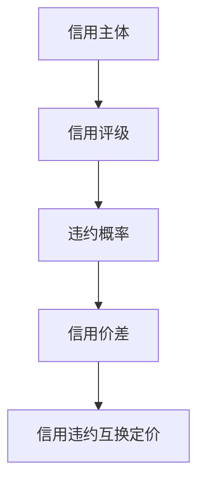
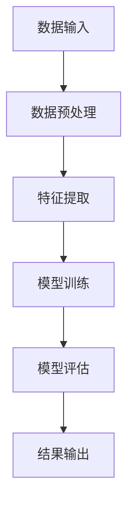
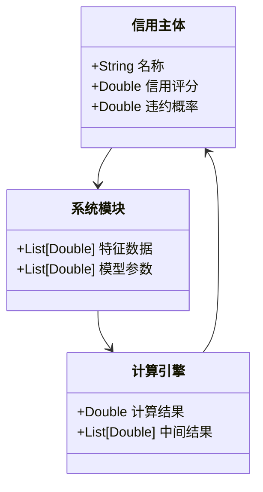
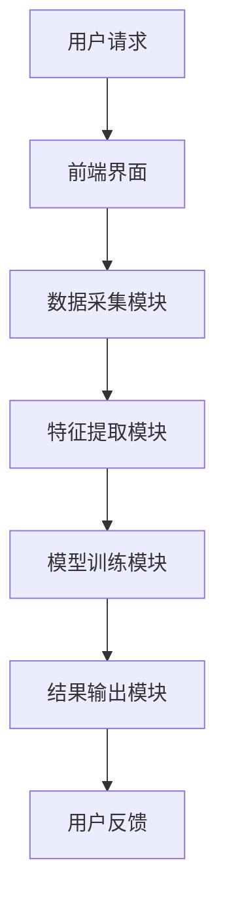
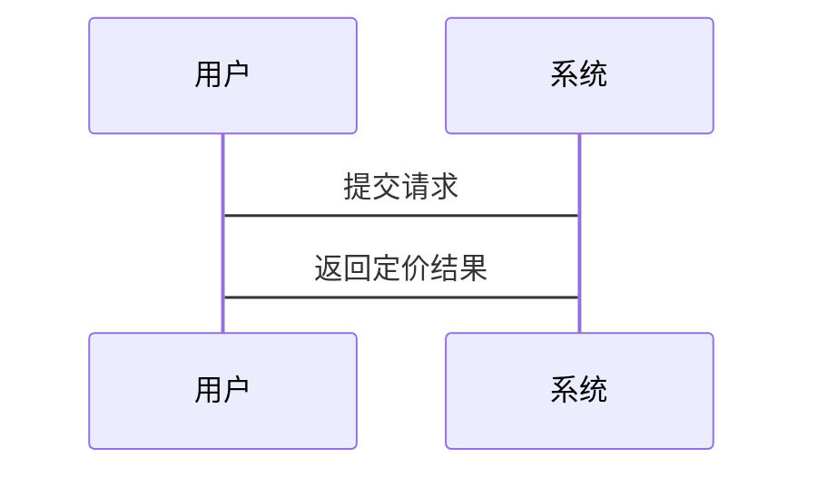

                 


# 智能信用违约互换定价模型

## 关键词：信用违约互换，智能定价模型，机器学习，风险管理，金融衍生品，信用评估，违约概率

## 摘要

智能信用违约互换定价模型是一种结合传统金融定价理论与现代机器学习技术的创新方法，旨在提高信用违约互换（CDS）定价的准确性和效率。本文将从CDS的基本概念出发，探讨智能定价模型的核心原理、算法实现、系统架构设计及实际应用案例。通过详细分析模型的数学公式、机器学习算法、系统架构图和项目实战，本文为读者提供一个全面了解智能信用违约互换定价模型的框架。

---

# 第1章: 信用违约互换与智能定价模型概述

## 1.1 信用违约互换的基本概念

### 1.1.1 信用违约互换的定义

信用违约互换（Credit Default Swap，CDS）是一种金融衍生品，用于对冲债券发行人违约的风险。买方支付定期的保费，卖方则在买方债券违约时承担赔偿责任。

### 1.1.2 信用违约互换的市场现状

CDS市场是全球金融市场的重要组成部分，广泛应用于风险管理。然而，传统定价方法在复杂市场环境下的局限性日益显现。

### 1.1.3 信用违约互换的传统定价方法

传统定价方法依赖于历史违约数据和简单的统计模型，难以捕捉复杂的市场动态和非线性关系。

## 1.2 智能定价模型的背景与意义

### 1.2.1 传统定价方法的局限性

传统方法在处理大数据和复杂关系时表现不足，难以应对市场波动和信用风险的不确定性。

### 1.2.2 智能定价模型的优势

通过引入机器学习算法，智能定价模型能够更好地捕捉市场动态，提高定价的准确性和实时性。

### 1.2.3 智能定价模型的应用前景

随着大数据和人工智能技术的快速发展，智能定价模型在金融领域的应用前景广阔。

## 1.3 智能信用违约互换定价模型的核心概念

### 1.3.1 模型的基本原理

智能定价模型通过机器学习算法，基于历史数据和市场信息，预测信用风险并定价CDS。

### 1.3.2 模型的核心要素

- 数据输入：历史违约数据、市场指标、宏观经济数据
- 模型训练：机器学习算法、特征工程
- 输出结果：违约概率、信用价差

### 1.3.3 模型的边界与外延

模型适用于标准化的CDS产品，但需注意数据质量和市场假设的合理性。

## 1.4 本章小结

---

# 第2章: 核心概念与联系

## 2.1 模型核心概念的原理

### 2.1.1 信用风险的量化方法

信用风险通过违约概率和信用价差进行量化。

### 2.1.2 违约概率的计算模型

$$P_{\text{违约}} = \text{历史违约数据} \div \text{样本总量}$$

### 2.1.3 信用价差的动态调整

信用价差根据市场变化和信用风险溢价进行调整。

## 2.2 核心概念属性特征对比

### 2.2.1 不同定价模型的对比表格

| 模型类型      | 优点                | 缺点                  |
|---------------|---------------------|-----------------------|
| 传统模型      | 简单易懂            | 难以捕捉复杂关系      |
| 智能模型      | 高准确性            | 需大量数据和计算资源  |

### 2.2.2 模型的ER实体关系图



## 2.3 模型的数学公式与原理

### 2.3.1 违约概率的计算公式

$$P_{\text{违约}} = \frac{\text{历史违约数据}}{\text{样本总量}}$$

### 2.3.2 信用价差的调整公式

$$\text{信用价差} = \text{基准利率} + \text{违约风险溢价}$$

## 2.4 本章小结

---

# 第3章: 算法原理与实现

## 3.1 算法原理概述

### 3.1.1 机器学习在信用定价中的应用

机器学习算法能够从大量数据中提取非线性关系，提高定价模型的准确性。

### 3.1.2 常见算法的优缺点对比

| 算法类型   | 优点                | 缺点                  |
|------------|---------------------|-----------------------|
| 支持向量机  | 高准确性            | 计算复杂              |
| 神经网络    | 强大学习能力        | 需大量数据            |

## 3.2 算法实现步骤

### 3.2.1 数据预处理

对数据进行清洗、特征提取和标准化处理。

### 3.2.2 模型训练

使用训练数据对机器学习模型进行训练。

### 3.2.3 模型评估

通过测试数据评估模型的准确性和稳定性。

## 3.3 算法流程图



## 3.4 算法代码实现

### 3.4.1 数据预处理

```python
import pandas as pd
from sklearn.preprocessing import StandardScaler

data = pd.read_csv('credit_data.csv')
features = data[['feature1', 'feature2', 'feature3']]
labels = data['label']

scaler = StandardScaler()
features_scaled = scaler.fit_transform(features)
```

### 3.4.2 模型训练

```python
from sklearn.ensemble import RandomForestClassifier

model = RandomForestClassifier(n_estimators=100)
model.fit(features_scaled, labels)
```

## 3.5 数学模型与公式

### 3.5.1 违约概率的计算

$$P_{\text{违约}} = \sum_{i=1}^{n} w_i \cdot x_i$$

其中，$w_i$ 是模型权重，$x_i$ 是输入特征。

### 3.5.2 信用价差的调整

$$\text{信用价差} = \alpha \cdot P_{\text{违约}} + \beta \cdot \text{市场风险溢价}$$

## 3.6 本章小结

---

# 第4章: 系统分析与架构设计方案

## 4.1 问题场景介绍

系统需要实时计算信用违约互换的定价，支持大规模数据处理和高频交易需求。

## 4.2 项目介绍

本项目旨在开发一个智能信用违约互换定价系统，结合机器学习和分布式计算技术。

## 4.3 系统功能设计

### 4.3.1 领域模型设计



### 4.3.2 系统架构设计



### 4.3.3 系统交互设计



## 4.4 本章小结

---

# 第5章: 项目实战

## 5.1 环境搭建

安装Python、机器学习库（如scikit-learn、xgboost）和可视化工具（如Matplotlib、Seaborn）。

## 5.2 核心代码实现

### 5.2.1 数据加载与预处理

```python
import pandas as pd
from sklearn.model_selection import train_test_split
from sklearn.metrics import accuracy_score

data = pd.read_csv('credit_data.csv')
X = data.drop('label', axis=1)
y = data['label']

X_train, X_test, y_train, y_test = train_test_split(X, y, test_size=0.2)
```

### 5.2.2 模型训练与评估

```python
from sklearn.ensemble import GradientBoostingClassifier

model = GradientBoostingClassifier(n_estimators=100, learning_rate=0.1)
model.fit(X_train, y_train)

y_pred = model.predict(X_test)
print("Accuracy:", accuracy_score(y_test, y_pred))
```

## 5.3 实际案例分析

### 5.3.1 案例背景

分析某公司的信用数据，预测其违约概率。

### 5.3.2 数据分析与处理

```python
import matplotlib.pyplot as plt
import seaborn as sns

plt.figure(figsize=(10, 6))
sns.histplot(data['label'], bins=20)
plt.title('违约概率分布')
plt.show()
```

### 5.3.3 模型实现与结果解读

```python
importances = model.feature_importances_
feature_names = X.columns

plt.figure(figsize=(10, 6))
sns.barplot(x=importances, y=feature_names)
plt.title('特征重要性')
plt.show()
```

## 5.4 项目总结

模型在实际案例中表现出较高的准确性，但需注意数据质量和模型解释性。

---

# 第6章: 总结与展望

## 6.1 总结

智能信用违约互换定价模型通过机器学习算法，显著提高了定价的准确性和效率。

## 6.2 展望

未来可以进一步研究模型的实时性和可解释性，探索更高效的数据处理方法。

## 6.3 注意事项

- 数据质量对模型性能影响重大。
- 模型解释性需进一步提升。
- 需注意市场环境的动态变化。

## 6.4 扩展阅读

推荐阅读《机器学习在金融中的应用》和《信用风险评估与管理》。

---

# 附录: 更多资源

## 附录A: 相关书籍

- 《Python机器学习》
- 《金融风险管理》

## 附录B: 开源工具

- scikit-learn
- xgboost
- TensorFlow

## 附录C: 参考文献

- 市场风险相关文献
- 信用评估相关论文

---

# 结束语

智能信用违约互换定价模型的开发和应用，标志着金融风险管理进入了一个新的智能化时代。通过技术创新和实践积累，我们相信这一领域将不断进步，为金融市场提供更高效、更精准的解决方案。

