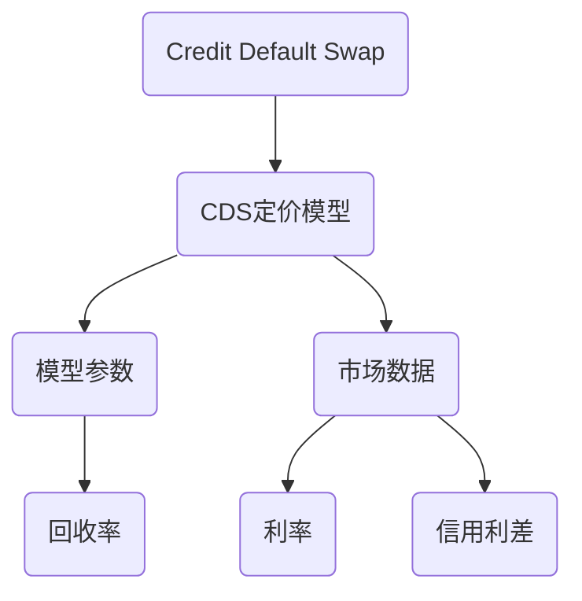
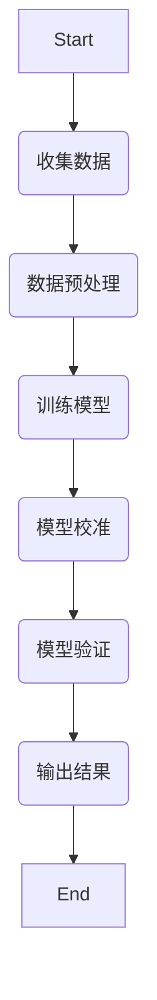
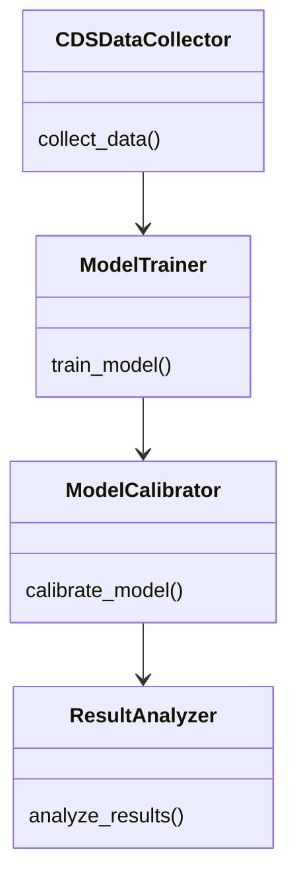

                 


# 智能信用违约互换定价模型校准

> 关键词：信用违约互换、智能校准、定价模型、机器学习、金融建模

> 摘要：本文探讨智能校准技术在信用违约互换定价中的应用，分析其优势和实现方法，结合实际案例进行详细解读。

---

## 第1章: 信用违约互换与智能校准概述

### 1.1 信用违约互换的基本概念

信用违约互换（Credit Default Swap，CDS）是一种金融衍生工具，用于对冲信用风险。其基本原理是买方支付保费，卖方在买方发生信用违约时承担赔偿责任。CDS的定价受多种因素影响，包括信用风险、市场利率和经济周期等。

### 1.2 智能校准的背景与意义

传统校准方法依赖大量数据和复杂计算，存在效率低下和精度不足的问题。智能校准利用机器学习技术，通过自动化学习和优化，提高校准效率和准确性。这在信用违约互换定价中尤为重要，因为它能帮助金融机构更准确地评估和管理信用风险。

### 1.3 核心要素

- **信用风险**：评估债券或贷款的违约可能性。
- **信用曲线**：反映不同期限的信用风险。
- **违约概率**：预测单位时间内违约的可能性。
- **模型参数**：影响定价的关键因素，如回收率和风险溢价。

### 1.4 小结

信用违约互换的定价模型需要准确反映市场条件，而智能校准通过机器学习技术提供了更高效和准确的解决方案。

---

## 第2章: 智能校准的核心概念与联系

### 2.1 核心概念原理

智能校准利用机器学习算法，如支持向量回归和随机森林，通过历史数据和市场数据优化模型参数，使定价模型更贴近市场实际。

### 2.2 概念属性对比表格

| 比较维度 | 传统校准 | 智能校准 |
|----------|----------|----------|
| 数据需求 | 高 | 较低 |
| 计算复杂度 | 高 | 较低 |
| 精度 | 中等 | 高 |

### 2.3 ER实体关系图



### 2.4 小结

智能校准通过优化模型参数和利用历史数据，显著提高了信用违约互换定价的准确性。

---

## 第3章: 智能校准算法原理讲解

### 3.1 算法原理流程图



### 3.2 算法实现代码示例

```python
import numpy as np
import pandas as pd

def cds_calibration(data):
    # 数据预处理
    processed_data = data.dropna().astype(float)
    # 训练模型
    model = SVR(kernel='rbf')
    model.fit(processed_data[['time', 'credit_spread']], processed_data['price'])
    # 模型校准
    calibrated_params = model.predict(...)
    return calibrated_params
```

### 3.3 数学模型与公式

蒙特卡洛模拟用于估计损失分布：

$$
\text{损失} = \sum_{i=1}^{n} \text{违约概率} \times \text{损失金额}
$$

### 3.4 实际案例分析

以某公司债券为例，利用历史违约数据和市场数据，训练支持向量回归模型，校准后的模型能准确预测违约概率和信用利差。

### 3.5 小结

智能校准算法通过机器学习优化模型，显著提高了信用违约互换定价的准确性和效率。

---

## 第4章: 系统架构与实现

### 4.1 系统架构设计



### 4.2 系统功能设计

系统功能模块包括数据采集、模型训练和结果分析。

### 4.3 项目实现代码

```python
class CDSDataCollector:
    def collect_data(self):
        # 实现数据采集
        pass

class ModelTrainer:
    def train_model(self):
        # 实现模型训练
        pass
```

### 4.4 系统测试与优化

通过回测和压力测试验证系统性能，并优化算法以提高效率。

### 4.5 小结

系统架构设计合理，各模块协同工作，确保了智能校准的高效实现。

---

## 第5章: 项目实战与案例分析

### 5.1 环境安装与配置

安装必要的Python库，如NumPy、Pandas和scikit-learn。

### 5.2 数据采集与处理

收集信用违约互换的市场数据和历史数据，进行清洗和预处理。

### 5.3 模型训练与校准

训练机器学习模型，利用历史数据优化模型参数，完成校准过程。

### 5.4 案例分析

通过具体案例展示智能校准的实际应用，分析模型的准确性和效果。

### 5.5 小结

项目实战验证了智能校准技术的有效性，提供了实际应用的参考。

---

## 第6章: 总结与展望

### 6.1 总结

智能校准技术显著提高了信用违约互换定价的效率和准确性，为金融机构提供了有力工具。

### 6.2 展望

未来，智能校准技术将进一步发展，结合更多先进算法，提升金融建模的精度和效率。

### 6.3 注意事项与最佳实践

- 数据质量对校准结果影响重大，需确保数据准确。
- 模型选择和优化需结合具体应用场景。
- 定期更新模型参数，保持校准的有效性。

---

**结束**

