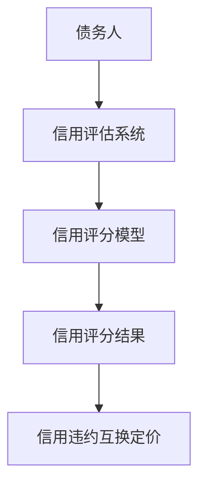
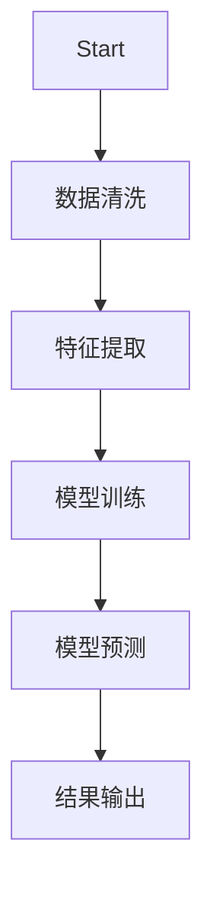
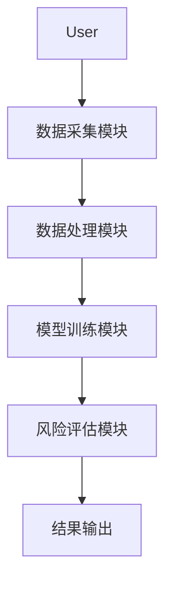

                 


# 智能信用违约互换风险评估

## 关键词
- 信用违约互换
- 风险评估
- 人工智能
- 机器学习
- 金融衍生工具

## 摘要
智能信用违约互换风险评估是利用大数据和人工智能技术，通过机器学习算法对信用违约互换的风险进行智能预测和评估的过程。本文将详细介绍信用违约互换的基本概念、智能评估的核心原理、算法实现及优化方法，同时结合实际案例分析，探讨智能信用违约互换风险评估的应用前景。

---

# 第一部分: 信用违约互换风险评估背景与基础

## 第1章: 信用违约互换的基本概念

### 1.1 信用违约互换的定义与基本结构
信用违约互换（Credit Default Swap, CDS）是一种金融衍生工具，用于对冲债券违约风险。其基本结构包括：  
- 参与者：买方（保护买方）和卖方（保护卖方）。  
- 标的资产：债券或其他信用工具。  
- 合约期限：固定期限。  
- 约定条件：买方支付固定费用，卖方在标的资产违约时提供赔偿。

### 1.2 智能信用评估的必要性
传统信用评估方法依赖人工经验，存在主观性强、效率低、覆盖面窄等问题。智能信用评估通过大数据分析和机器学习算法，能够更高效、精准地预测违约风险。

### 1.3 技术背景
- 大数据技术：支持海量数据的收集、存储和分析。  
- 人工智能：通过机器学习算法（如逻辑回归、随机森林、神经网络等）实现智能预测。

---

## 第2章: 信用违约互换风险评估的核心概念与联系

### 2.1 智能信用评估的核心原理
智能信用评估通过以下步骤实现：  
1. **数据收集**：获取债务人的财务数据、市场数据等。  
2. **特征提取**：提取关键特征（如违约概率、违约损失率等）。  
3. **模型训练**：使用机器学习算法训练风险评估模型。  
4. **风险预测**：基于模型预测违约概率。

### 2.2 核心概念对比与联系
#### 2.2.1 数据特征对比
| 特征 | 描述 | 示例 |
|------|------|------|
| 违约概率（PD） | 债务人在一定期限内违约的可能性 | 5%、10%等 |
| 违约损失率（LGD） | 违约发生时的损失比例 | 30%、50%等 |
| 信用等级 | 衡量债务人信用状况的指标 | BBB、AA等 |

#### 2.2.2 实体关系图


---

## 第3章: 智能信用违约互换风险评估的算法原理

### 3.1 机器学习算法选择
常用算法包括：  
- **逻辑回归**：用于分类问题，适合预测违约概率。  
- **随机森林**：通过集成学习提高模型准确性。  
- **神经网络**：适合复杂非线性关系的建模。

### 3.2 算法流程


### 3.3 算法实现
#### 3.3.1 逻辑回归模型
```python
import numpy as np
from sklearn.linear_model import LogisticRegression

# 数据预处理
X = np.array([[age, income], ...])
y = np.array([0, 1, 0, ...])

# 模型训练
model = LogisticRegression()
model.fit(X, y)

# 预测
new_data = np.array([[25, 50000]])
print(model.predict(new_data))
```

#### 3.3.2 模型评估
- **准确率**：预测正确的比例。  
- **召回率**：实际违约被正确预测的比例。  
- **AUC-ROC曲线**：评估模型的分类能力。

---

## 第4章: 系统分析与架构设计

### 4.1 系统应用场景
- 银行和金融机构：评估客户信用风险。  
- 投资者：优化投资组合。  
- 企业：管理信用风险。

### 4.2 系统功能设计
#### 4.2.1 功能模块
- 数据采集模块：收集债务人数据。  
- 数据处理模块：清洗和特征提取。  
- 模型训练模块：训练和优化模型。  
- 风险评估模块：输出风险评估结果。

#### 4.2.2 系统架构图


---

## 第5章: 项目实战

### 5.1 环境安装
- 安装Python和相关库：`pip install numpy scikit-learn`。

### 5.2 核心实现代码
```python
from sklearn.model_selection import train_test_split
from sklearn.metrics import accuracy_score

# 数据分割
X_train, X_test, y_train, y_test = train_test_split(X, y, test_size=0.2)

# 模型训练
model = LogisticRegression()
model.fit(X_train, y_train)

# 预测与评估
y_pred = model.predict(X_test)
print("准确率:", accuracy_score(y_test, y_pred))
```

### 5.3 案例分析
- 数据来源：某银行客户数据。  
- 模型输出：客户违约概率为15%。  
- 结论：客户信用风险较低，建议批准贷款。

---

## 第6章: 总结与展望

### 6.1 总结
智能信用违约互换风险评估通过大数据和机器学习技术，显著提高了信用风险评估的效率和准确性。  

### 6.2 注意事项
- 数据质量：确保数据准确性和完整性。  
- 模型优化：定期更新模型以适应市场变化。  
- 风险控制：结合人工审核，降低模型误判风险。

### 6.3 未来展望
- 结合区块链技术，提高数据安全性和透明度。  
- 应用深度学习技术，进一步提升模型预测能力。  

---

通过本文的系统介绍，读者可以全面了解智能信用违约互换风险评估的核心原理、算法实现和实际应用，为金融领域的风险控制提供有力支持。

