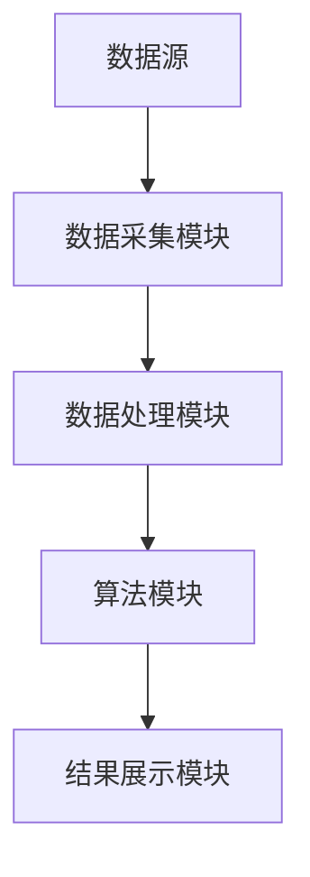

                 


# 智能债券投资组合久期管理系统

> 关键词：债券投资、久期管理、智能算法、系统架构、金融风险管理

> 摘要：本文系统地探讨了智能债券投资组合久期管理系统的构建与应用。通过分析债券投资的核心要素——久期，结合智能算法与系统架构设计，提出了高效的久期管理解决方案。文章从久期管理的理论基础出发，详细阐述了智能久期管理的必要性、核心算法、系统架构及实际案例，为金融从业者提供了一套完整的久期管理框架。

---

## 第1章: 债券投资与久期管理概述

### 1.1 债券投资的基本概念
#### 1.1.1 债券的基本定义与分类
债券是一种债务工具，发行人承诺在特定时间内向债券持有人支付利息和本金。债券可以分为政府债券、企业债券、可转换债券等。其核心特征包括期限、票面利率、面值和收益率。

#### 1.1.2 债券投资的主要目标
债券投资的主要目标包括：获取稳定的票息收入、实现资本增值、对冲投资组合的风险、降低整体投资组合的波动性。

#### 1.1.3 债券市场的基本结构与参与者
债券市场由发行人、投资者、承销商、做市商和交易商组成。市场的运作涉及一级市场和二级市场。

### 1.2 久期的定义与作用
#### 1.2.1 久期的定义
久期（Duration）是衡量债券价格对收益率变动敏感程度的指标，最早由F. Redington提出。Macaulay久期定义为债券现金流的加权平均时间，权重为现值因子。

$$ D = \frac{\sum_{t=1}^{n} \frac{CF_t}{(1 + y)^t} \cdot t}{\sum_{t=1}^{n} \frac{CF_t}{(1 + y)^t}} $$

其中，$CF_t$ 是第 $t$ 期的现金流，$y$ 是收益率。

#### 1.2.2 久期在债券投资中的重要性
久期帮助投资者评估债券价格对利率变动的敏感性。久期越长，债券价格波动性越大。久期管理是优化投资组合风险收益的核心手段。

#### 1.2.3 久期与债券价格波动的关系
久期与债券价格波动呈正相关关系。当收益率变动时，久期决定了债券价格的变化幅度。

### 1.3 债券组合管理的核心要素
#### 1.3.1 债券组合管理的目标
债券组合管理的目标包括：最大化收益、最小化风险、实现特定的投资目标。

#### 1.3.2 组合管理的核心要素
组合管理的核心要素包括：久期匹配、信用风险控制、流动性管理、税收优化。

#### 1.3.3 久期管理在组合管理中的地位
久期管理是债券组合管理的核心，通过调整久期实现风险与收益的最佳平衡。

---

## 第2章: 久期管理的理论基础

### 2.1 久期的数学模型
#### 2.1.1 Macaulay久期公式
Macaulay久期是债券现金流的时间加权平均值。

$$ D_{Macaulay} = \frac{\sum_{t=1}^{n} \frac{CF_t}{(1 + y)^t} \cdot t}{\sum_{t=1}^{n} \frac{CF_t}{(1 + y)^t}} $$

#### 2.1.2 修正久期的计算方法
修正久期考虑了债券的票面价值和当前市场价格。

$$ D_{修正} = \frac{D_{Macaulay}}{(1 + y)} $$

#### 2.1.3 凸性调整的原理
凸性（Convexity）是债券价格对收益率变化的非线性反应。凸性调整可以更准确地估计债券价格变化。

$$ D_{修正} = D_{Macaulay} + Convexity \cdot \frac{1}{(1 + y)^2} $$

### 2.2 久期与债券价格波动的关系
#### 2.2.1 久期与债券价格的线性关系
久期与债券价格变化的近似关系：

$$ \Delta P \approx -D \cdot \Delta y \cdot P $$

其中，$\Delta y$ 是收益率的变化，$P$ 是债券的当前价格。

#### 2.2.2 久期与债券收益率曲线的关系
久期与收益率曲线形状密切相关。在平的收益率曲线下，久期对价格波动的影响更大。

#### 2.2.3 久期在利率风险中的应用
久期是衡量利率风险的核心指标，通过调整久期可以有效控制投资组合的利率风险。

### 2.3 久期管理的核心原则
#### 2.3.1 久期匹配策略
通过调整组合的久期，使其与市场利率变化保持一致，以降低利率风险。

#### 2.3.2 久期免疫策略
通过构造特定的债券组合，使得投资组合的久期对利率变化免疫。

#### 2.3.3 久期调整的灵活性
根据市场变化动态调整组合的久期，以实现风险收益的最佳平衡。

---

## 第3章: 智能久期管理的必要性

### 3.1 传统久期管理的局限性
#### 3.1.1 传统久期管理的不足
传统久期管理方法过于静态，难以应对复杂市场环境的变化。

#### 3.1.2 市场波动对传统管理的挑战
债券市场的波动性增加，传统方法难以实现精准的久期控制。

#### 3.1.3 传统方法在复杂环境中的局限
传统方法忽视了多因素影响，难以实现多目标优化。

### 3.2 智能久期管理的优势
#### 3.2.1 智能算法的高效性
智能算法（如遗传算法、粒子群优化）能够快速找到最优解。

#### 3.2.2 数据驱动的精准性
通过大数据分析和机器学习，智能久期管理能够实现更精准的预测和调整。

#### 3.2.3 自适应调整的灵活性
智能系统能够根据市场变化实时调整久期，实现动态优化。

### 3.3 智能久期管理的应用场景
#### 3.3.1 复杂市场环境下的投资组合优化
智能久期管理能够帮助投资者在复杂市场中实现最优配置。

#### 3.3.2 多目标优化的实现
通过智能算法，可以同时优化久期、信用风险、流动性等多个目标。

#### 3.3.3 风险控制的智能化
智能久期管理能够实时监控风险，实现前瞻性的风险预警和控制。

---

## 第4章: 智能久期管理的核心算法与实现

### 4.1 久期管理的数学模型
#### 4.1.1 久期管理的目标函数
目标函数为最小化投资组合的久期偏离目标值。

$$ \min D_{组合} - D_{目标} $$

#### 4.1.2 约束条件
- 投资组合的总久期应在目标范围内。
- 投资组合的总收益应满足预期目标。
- 久期调整应考虑市场流动性约束。

### 4.2 智能算法的实现
#### 4.2.1 遗传算法（GA）
遗传算法通过模拟生物进化过程，实现全局优化。

```python
def genetic_algorithm():
    # 初始化种群
    population = initialize()
    # 迭代优化
    while not converged:
        # 适应度评估
        fitness = evaluate(population)
        # 选择
        parents = select(fitness)
        # 交叉
        offspring = crossover(parents)
        # 变异
        population = mutate(offspring)
    return best_solution(population)
```

#### 4.2.2 粒子群优化（PSO）
粒子群优化通过模拟鸟群觅食行为，实现局部最优。

```python
def particle_swarm_optimization():
    # 初始化粒子群
    particles = initialize()
    # 迭代优化
    while not converged:
        # 更新速度和位置
        particles = update_velocity(particles)
        particles = update_position(particles)
        # 评估适应度
        fitness = evaluate(particles)
        # 更新全局最优
        global_best = update_global_best(fitness, global_best)
    return global_best
```

#### 4.2.3 深度学习模型
深度学习模型通过神经网络结构，学习复杂的久期管理关系。

```python
def deep_learning_model():
    # 定义神经网络
    model = build_model()
    # 训练模型
    model.fit(X_train, y_train)
    # 预测久期
    y_pred = model.predict(X_test)
    return y_pred
```

### 4.3 算法实现的数学模型
#### 4.3.1 优化目标
$$ \min \sum_{i=1}^{n} (D_i - D_{目标})^2 $$

#### 4.3.2 约束条件
$$ D_{组合} \leq D_{max} $$

$$ D_{组合} \geq D_{min} $$

### 4.4 算法实现的代码示例
```python
import numpy as np
from scipy.optimize import minimize

def duration_objective(x, target_duration):
    portfolio_duration = np.sum(x * durations) / np.sum(x)
    return (portfolio_duration - target_duration)**2

# 约束条件
constraints = [
    {'type': 'ineq', 'fun': lambda x: np.sum(x) - 1},  # 投资比例约束
    {'type': 'ineq', 'fun': lambda x: np.min(x) >= 0},  # 非负约束
]

# 使用scipy.optimize.minimize进行优化
result = minimize(duration_objective, initial_guess, method='SLSQP', constraints=constraints)
optimal_weights = result.x
```

---

## 第5章: 智能久期管理系统的架构设计

### 5.1 系统功能设计
#### 5.1.1 系统模块划分
- 数据采集模块：收集市场数据、历史价格、收益率曲线。
- 算法模块：实现久期优化算法。
- 结果展示模块：显示优化结果和风险收益分析。

#### 5.1.2 系统功能描述
- 数据采集：实时获取债券市场数据。
- 久期计算：计算债券组合的久期。
- 算法优化：实现智能久期管理算法。
- 结果展示：可视化优化结果。

#### 5.1.3 系统功能流程
1. 数据采集模块获取市场数据。
2. 久期计算模块计算债券组合的久期。
3. 算法模块优化久期，生成最优组合。
4. 结果展示模块显示优化结果。

### 5.2 系统架构设计
#### 5.2.1 系统架构图



#### 5.2.2 关键模块交互
- 数据采集模块与算法模块交互，提供优化所需的市场数据。
- 算法模块与结果展示模块交互，输出优化结果。

### 5.3 系统接口设计
#### 5.3.1 数据接口
- 数据输入接口：接收债券市场数据。
- 数据输出接口：输出优化后的债券组合。

#### 5.3.2 算法接口
- 优化算法接口：接收目标久期和约束条件。
- 返回最优权重。

### 5.4 系统交互流程
1. 用户输入目标久期和约束条件。
2. 算法模块优化债券组合。
3. 结果展示模块显示优化结果。

---

## 第6章: 项目实战与案例分析

### 6.1 项目环境安装
#### 6.1.1 安装Python环境
安装Python 3.8及以上版本，安装Jupyter Notebook。

#### 6.1.2 安装依赖库
安装numpy、pandas、scipy、matplotlib等库。

### 6.2 系统核心实现
#### 6.2.1 数据导入与处理
```python
import pandas as pd
data = pd.read_csv('bond_data.csv')
```

#### 6.2.2 久期计算
```python
def calculate_duration(bond_prices, coupon_rates, face_values, terms):
    durations = []
    for i in range(len(bond_prices)):
        duration = 0
        for t in range(1, terms[i] + 1):
            cash_flow = coupon_rates[i] * face_values[i] / (1 + coupon_rates[i]/100)**t
            duration += t * cash_flow
        duration /= (coupon_rates[i] * face_values[i] / (1 + coupon_rates[i]/100)**terms[i])
        durations.append(duration)
    return durations
```

#### 6.2.3 智能优化
```python
from scipy.optimize import minimize

def optimize_duration(target_duration, durations, weights):
    # 目标函数
    def objective(x):
        return np.sum((np.dot(x, durations) - target_duration)**2)
    # 约束条件
    constraints = [
        {'type': 'eq', 'fun': lambda x: np.sum(x) - 1}
    ]
    # 稀疏性约束
    bounds = [(0, 1) for _ in weights]
    result = minimize(objective, weights, method='SLSQP', constraints=constraints, bounds=bounds)
    return result.x
```

### 6.3 实际案例分析
#### 6.3.1 案例背景
假设我们有3种债券，目标久期为5年。

#### 6.3.2 数据分析
计算每种债券的久期，构建优化模型。

#### 6.3.3 结果解读
优化结果给出了每种债券的最优权重，实现目标久期。

---

## 第7章: 总结与展望

### 7.1 总结
智能债券投资组合久期管理系统通过结合智能算法和系统架构设计，实现了高效、精准的久期管理。本文从理论基础、算法实现到系统设计，为读者提供了一套完整的解决方案。

### 7.2 未来展望
未来的研究方向包括：引入更先进的机器学习算法、优化系统架构、拓展应用场景。

### 7.3 最佳实践 tips
- 确保数据质量，选择可靠的市场数据源。
- 定期更新算法模型，适应市场变化。
- 结合实际需求，灵活调整优化目标。

---

通过本文的系统阐述，读者可以全面理解智能债券投资组合久期管理系统的构建与应用，并能够在实际投资中灵活运用这些方法和技术。

