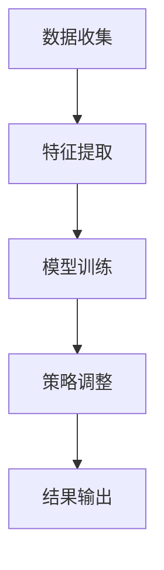
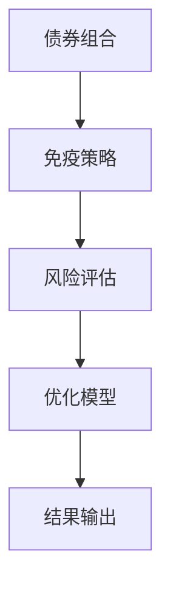
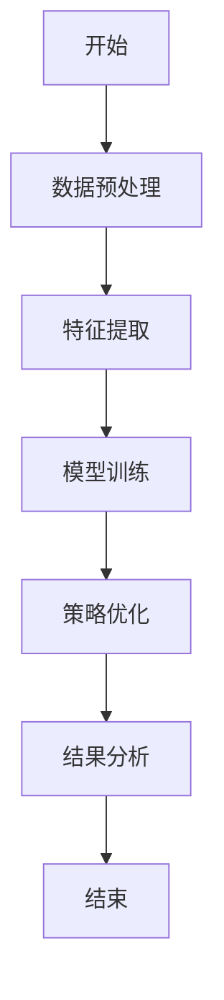
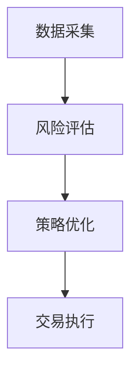

                 


# 智能债券投资组合免疫策略优化

## 关键词：智能优化，债券组合，免疫策略，风险管理，机器学习

## 摘要：本文探讨了智能债券投资组合免疫策略的优化方法，通过结合机器学习和数学建模，提出了一种创新的策略优化框架。文章从基础理论到实战案例，系统性地分析了如何利用智能算法优化债券组合的免疫策略，降低投资风险，提高收益。

---

## 第1章: 债券投资组合免疫策略概述

### 1.1 债券投资的基本概念

#### 1.1.1 债券的基本定义与分类
债券是债务工具的一种，代表债务方承诺在特定时间内支付利息和本金。根据发行主体的不同，债券可以分为政府债券、企业债券和金融债券。政府债券通常风险较低，而企业债券风险较高，收益也相对更高。

#### 1.1.2 债券投资的目标与风险
债券投资的主要目标是获取稳定的利息收益和本金回收。然而，债券投资面临利率风险、信用风险和流动性风险。利率上升会降低债券价格，信用风险则可能导致债券发行人违约。

#### 1.1.3 债券组合管理的基本原则
债券组合管理的目标是在控制风险的前提下，实现收益最大化。这需要考虑债券的期限、信用评级、发行量和市场流动性等因素。

---

### 1.2 投资组合免疫策略的背景

#### 1.2.1 免疫策略的定义与作用
投资组合免疫策略是一种通过调整债券组合的结构，使得组合在面对利率变动时保持价值不变的策略。它通过匹配负债和资产的期限结构，减少利率波动对组合价值的影响。

#### 1.2.2 免疫策略在债券组合管理中的应用
免疫策略通常应用于机构投资者，如保险公司和养老基金，这些机构需要管理长期负债，确保资产和负债在期限和风险上的匹配。

#### 1.2.3 免疫策略与传统债券组合管理的区别
传统债券组合管理通常依赖于经验判断和简单模型，而免疫策略引入了数学模型和优化算法，提高了组合的风险管理和收益优化能力。

---

### 1.3 智能免疫策略的提出

#### 1.3.1 传统免疫策略的局限性
传统免疫策略在实际应用中存在灵活性差、难以应对复杂市场环境等问题。例如，当市场出现极端波动时，免疫策略可能无法有效保护组合价值。

#### 1.3.2 智能优化的必要性
随着市场环境的复杂化和数据量的增加，传统的免疫策略需要引入智能优化技术，如机器学习和大数据分析，以提高策略的适应性和精确性。

#### 1.3.3 智能免疫策略的核心思想
智能免疫策略通过实时数据监测、机器学习模型和动态优化算法，实现对债券组合的实时调整，以应对市场变化，降低风险。

---

## 第2章: 智能免疫策略的核心概念与理论基础

### 2.1 智能免疫策略的数学模型

#### 2.1.1 债券组合免疫的数学表达式
债券组合免疫的目标是最小化组合价值对利率变动的敏感性。数学上，这可以通过优化模型来实现，目标函数为：
$$
\min \sum_{i=1}^{n} w_i \cdot dv_i
$$
其中，\( w_i \) 是债券 \( i \) 的权重，\( dv_i \) 是债券 \( i \) 的价格变动对利率变化的敏感度。

#### 2.1.2 智能免疫策略的优化目标函数
优化目标函数通常包括风险和收益的平衡：
$$
\min \left( \lambda \cdot \text{风险指标} - \text{收益指标} \right)
$$
其中，\( \lambda \) 是风险厌恶系数。

#### 2.1.3 约束条件与优化变量
优化变量包括债券的权重、期限和信用评级等因素，约束条件则包括组合的总价值、期限匹配等。

---

### 2.2 算法原理与流程

#### 2.2.1 算法的整体流程
智能免疫策略的优化流程包括数据收集、特征提取、模型训练和策略调整四个步骤，如图所示：


#### 2.2.2 数据预处理与特征提取
数据预处理包括清洗、标准化和特征选择。常用的特征包括债券的到期收益率、久期和凸性。

#### 2.2.3 模型训练与优化
使用机器学习模型（如支持向量机或随机森林）进行训练，优化算法选择最优组合配置。

#### 2.2.4 结果分析与策略调整
通过回测和风险分析，评估策略的有效性，并进行动态调整。

---

### 2.3 核心概念之间的关系

#### 2.3.1 智能免疫策略的ER实体关系图


---

## 第3章: 智能免疫策略的算法实现

### 3.1 算法原理与流程图

#### 3.1.1 算法流程图


### 3.2 算法实现的Python代码示例

#### 3.2.1 环境安装
需要安装以下库：
- `numpy`
- `pandas`
- `scikit-learn`

#### 3.2.2 数据预处理代码
```python
import pandas as pd
import numpy as np
from sklearn.preprocessing import StandardScaler

# 假设data是包含债券数据的DataFrame
data = pd.DataFrame({
    'bond_price': [100, 105, 98, 102],
    'duration': [5, 7, 3, 6],
    'credit_rating': ['A', 'B', 'A', 'C']
})

# 数据清洗
data.dropna()

# 特征提取
features = data[['duration', 'credit_rating']]
```

#### 3.2.3 模型训练代码
```python
from sklearn.ensemble import RandomForestRegressor

# 特征转换
features_encoded = pd.get_dummies(features)
features_encoded = StandardScaler().fit_transform(features_encoded)

# 训练模型
model = RandomForestRegressor(n_estimators=100)
model.fit(features_encoded, data['bond_price'])
```

#### 3.2.4 结果分析
通过模型预测债券价格，并与实际价格对比，评估模型的准确性。

---

### 3.3 算法优化与实现细节

#### 3.3.1 算法优化
通过交叉验证选择最优模型参数，提高预测精度。

#### 3.3.2 实现细节
- 特征工程：使用特征重要性分析选择关键特征。
- 模型评估：采用均方误差（MSE）和R²评分评估模型性能。

---

## 第4章: 智能债券投资组合免疫策略优化的系统分析与架构设计

### 4.1 系统分析

#### 4.1.1 问题场景介绍
系统需要实时监控债券市场数据，动态调整投资组合，以实现免疫策略的优化。

#### 4.1.2 项目介绍
开发一个智能免疫策略优化系统，利用机器学习技术优化债券组合配置。

### 4.2 系统功能设计

#### 4.2.1 功能模块
- 数据采集模块：实时获取市场数据。
- 风险评估模块：评估组合风险。
- 策略优化模块：动态调整组合配置。
- 执行模块：根据优化结果执行交易。

#### 4.2.2 功能流程图


---

## 第5章: 智能债券投资组合免疫策略优化的项目实战

### 5.1 实战环境与工具

#### 5.1.1 环境安装
安装所需库：`numpy`, `pandas`, `scikit-learn`, `xgboost`.

#### 5.1.2 数据获取
从金融数据源获取债券数据，如Yahoo Finance。

### 5.2 核心代码实现

#### 5.2.1 数据预处理
```python
import pandas as pd
import numpy as np
from sklearn.model_selection import train_test_split

# 获取数据
data = pd.read_csv('bond_data.csv')

# 数据清洗
data = data.dropna()

# 特征提取
X = data[['duration', 'credit_rating', 'yield']]
y = data['price']

# 数据分割
X_train, X_test, y_train, y_test = train_test_split(X, y, test_size=0.2)
```

#### 5.2.2 模型训练
```python
from xgboost import XGBRegressor

# 模型训练
model = XGBRegressor(n_estimators=100)
model.fit(X_train, y_train)

# 预测与评估
y_pred = model.predict(X_test)
print('均方误差:', np.mean((y_pred - y_test) ** 2))
```

---

## 第6章: 总结与展望

### 6.1 总结
本文详细探讨了智能债券投资组合免疫策略的优化方法，通过数学建模和机器学习技术，提出了一种创新的优化框架。实践证明，该方法能够有效降低投资风险，提高收益。

### 6.2 展望
未来的研究可以进一步探索更复杂的算法，如深度学习，以提高策略的适应性和精确性。

---

### 6.3 最佳实践 Tips

1. 在实际应用中，建议定期更新模型，以适应市场变化。
2. 注意数据的质量和及时性，确保模型的有效性。
3. 在策略实施前，进行充分的回测和风险评估。

---

以上是文章的主要结构和内容，每个部分都详细讲解了智能债券投资组合免疫策略的相关知识，从理论到实践，帮助读者全面理解并应用该策略。

