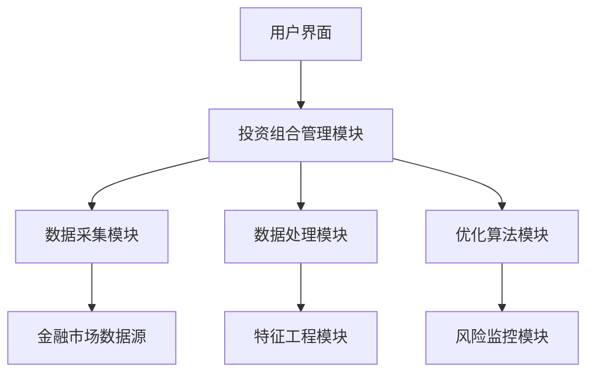
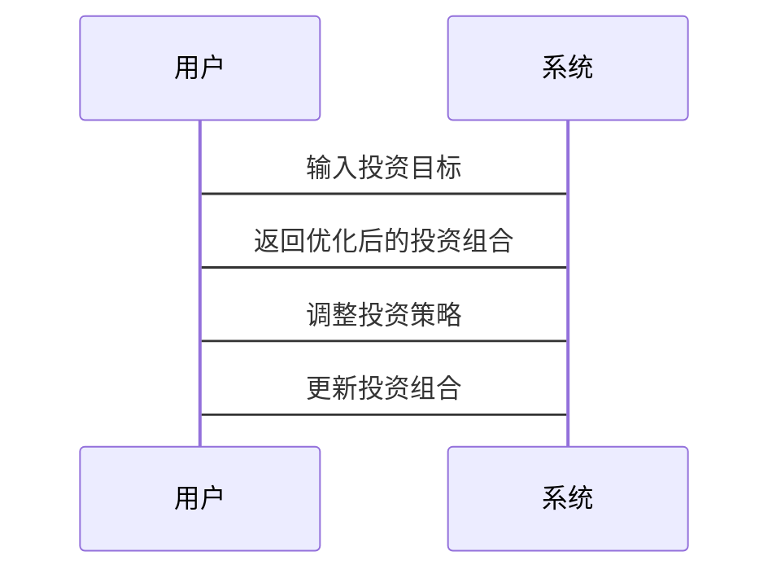

                 


# 智能债券投资组合管理工具

> 关键词：智能债券投资组合、风险管理、机器学习、现代投资组合理论（MPT）、债券评级、投资组合优化

> 摘要：本文深入探讨智能债券投资组合管理工具的核心原理、算法优化、系统架构及项目实战。通过结合现代投资组合理论与机器学习算法，本文详细分析智能债券投资组合管理工具的背景、核心概念、优化算法及系统设计，并通过实际案例展示工具的实现与应用。

---

# 第一部分: 智能债券投资组合管理工具的背景与概念

## 第1章: 智能债券投资组合管理工具的背景与概念

### 1.1 债券市场的基本概念

债券是一种债务工具，发行人通过发行债券筹集资金，投资者通过购买债券获得固定利息收入。债券市场的核心特征包括：

- **债务工具**：债券的发行人需要在约定时间内偿还本金及利息。
- **固定收益**：债券通常提供固定的票息收益，风险相对较低。
- **多样性**：债券可以按发行主体、期限、利率类型等进行分类，例如国债、企业债、可转换债券等。

### 1.2 投资组合管理的核心概念

投资组合管理是指通过科学的组合配置，降低风险、提高收益的过程。其核心概念包括：

- **分散化**：通过投资不同种类的债券降低组合的整体风险。
- **风险与收益的平衡**：在追求收益的同时，合理控制风险。
- **动态调整**：根据市场变化及时调整投资组合。

### 1.3 智能债券投资组合管理工具的必要性

传统的债券投资管理依赖人工分析，存在效率低、风险控制不足等问题。智能债券投资组合管理工具通过引入大数据分析和机器学习算法，能够实时监控市场变化，优化投资组合配置，从而提高收益并降低风险。

### 1.4 本章小结

本章介绍了债券市场的基本概念、投资组合管理的核心原理，以及智能债券投资组合管理工具的必要性。通过分析传统投资管理的局限性，引出了智能化管理的必要性和优势。

---

# 第二部分: 智能债券投资组合管理工具的核心概念与联系

## 第2章: 智能债券投资组合管理工具的核心原理

### 2.1 数据驱动的债券投资分析

智能债券投资组合管理工具依赖于大量的市场数据，包括债券价格、收益率、信用评级等。通过数据预处理、特征提取和数据分析，可以为投资决策提供科学依据。

- **数据来源**：包括金融市场数据供应商（如 Bloomberg、Reuters）和内部数据库。
- **特征提取**：通过统计分析和机器学习算法，提取债券的信用风险、流动性风险等特征。
- **数据驱动的债券评级**：利用历史数据和实时数据，建立债券评级模型，评估债券的信用风险。

### 2.2 现代投资组合理论（MPT）与智能优化

现代投资组合理论（MPT）是智能债券投资组合管理的核心理论基础。MPT通过优化数学模型，找到风险与收益的最佳平衡点。

- **数学模型**：MPT的核心公式为：
  $$
  \text{收益} = r_p = \sum_{i=1}^{n} w_i r_i
  $$
  其中，\( w_i \) 是第 \( i \) 只债券的权重，\( r_i \) 是第 \( i \) 只债券的预期收益。
  风险由组合的方差衡量：
  $$
  \text{风险} = \sigma_p^2 = \sum_{i=1}^{n} \sum_{j=1}^{n} w_i w_j \sigma_{ij}
  $$
  其中，\( \sigma_{ij} \) 是债券 \( i \) 和 \( j \) 的协方差。

- **智能优化**：通过引入遗传算法、粒子群优化等智能算法，优化投资组合的收益-风险比。

### 2.3 机器学习在债券投资中的应用

机器学习在债券投资中的应用主要体现在债券评级、风险预测和交易策略优化等方面。

- **债券评级**：利用机器学习算法（如支持向量机、随机森林）对债券进行信用评级，预测债券的违约概率。
- **风险预测**：通过时间序列分析和因子模型，预测市场的波动性，优化投资组合的风险管理。
- **交易策略**：基于机器学习模型生成交易信号，优化买卖时机。

### 2.4 核心概念之间的关系与对比

为了清晰展示核心概念之间的关系，我们可以使用ER实体关系图和表格进行对比。

#### ER实体关系图
```mermaid
erd
    investor
    portfolio
    bond
    risk
    return
    investor o-| manage | portfolio
    portfolio o-| contain | bond
    bond o-| influence | risk
    bond o-| influence | return
```

#### 核心概念属性特征对比表格
| 特性 | 投资组合 | 债券 | 风险 | 收益 |
|------|----------|------|------|------|
| 核心 | 组合配置 | 个体资产 | 风险管理 | 收益优化 |
| 关系 | 包含多个债券 | 组合的一部分 | 影响收益 | 目标 |
| 属性 | 多样性、分散化 | 信用评级、期限 | 波动性、相关性 | 预期收益、风险调整后收益 |

---

# 第三部分: 智能债券投资组合管理工具的算法原理

## 第3章: 现代投资组合理论（MPT）与数学模型

### 3.1 现代投资组合理论的核心原理

MPT通过数学模型优化投资组合的收益与风险。具体步骤如下：

1. **确定资产类别**：选择适合的投资标的（如不同期限、不同信用评级的债券）。
2. **计算收益与风险**：通过历史数据计算每只债券的预期收益和风险（方差）。
3. **构建优化模型**：使用数学优化方法，找到收益与风险的最佳平衡点。
4. **动态调整**：根据市场变化，定期重新优化投资组合。

### 3.2 数学模型与公式

以下是MPT的核心公式：

- **预期收益**：
  $$
  E[r_p] = \sum_{i=1}^{n} w_i E[r_i]
  $$
  其中，\( w_i \) 是债券 \( i \) 的权重，\( E[r_i] \) 是债券 \( i \) 的预期收益。

- **风险（方差）**：
  $$
  \sigma_p^2 = \sum_{i=1}^{n} \sum_{j=1}^{n} w_i w_j \sigma_{ij}
  $$
  其中，\( \sigma_{ij} \) 是债券 \( i \) 和 \( j \) 的协方差。

- **优化目标**：
  $$
  \min_{w} \sigma_p^2
  $$
  约束条件：
  $$
  \sum_{i=1}^{n} w_i = 1
  $$

---

## 第4章: 机器学习算法在债券投资中的应用

### 4.1 机器学习算法的基本原理

机器学习算法通过训练数据，建立债券评级、风险预测等模型。常用算法包括：

- **支持向量机（SVM）**：用于分类和回归。
- **随机森林**：用于特征重要性分析和分类。
- **XGBoost**：用于处理非线性关系。

### 4.2 基于机器学习的债券评级模型

#### 模型实现步骤

1. **数据准备**：收集债券的历史数据，包括评级、违约情况、财务指标等。
2. **特征工程**：提取关键特征，如杠杆率、利息覆盖率、违约概率等。
3. **模型训练**：使用训练数据训练债券评级模型。
4. **模型评估**：通过测试数据评估模型的准确率、召回率等指标。
5. **模型应用**：对新债券进行评级预测。

#### 代码实现示例

```python
import pandas as pd
from sklearn.ensemble import RandomForestClassifier
from sklearn.metrics import accuracy_score

# 数据加载
data = pd.read_csv('bond_data.csv')

# 特征与标签分离
X = data.drop('rating', axis=1)
y = data['rating']

# 模型训练
model = RandomForestClassifier(n_estimators=100)
model.fit(X, y)

# 模型预测
y_pred = model.predict(X)

# 模型评估
print("准确率:", accuracy_score(y, y_pred))
```

---

## 第5章: 智能债券投资组合管理系统的架构设计

### 5.1 系统功能设计

系统功能模块包括：

- **数据采集**：从金融市场数据源获取实时数据。
- **数据处理**：清洗、转换和特征提取。
- **投资组合优化**：基于MPT和机器学习算法优化组合。
- **风险监控**：实时监控市场风险，动态调整组合。

### 5.2 系统架构设计

以下是系统的整体架构图：



### 5.3 系统交互设计

以下是用户与系统的交互流程图：



---

## 第6章: 项目实战与案例分析

### 6.1 项目环境安装

- **工具安装**：
  - Python 3.8+
  - Jupyter Notebook
  - Pandas、NumPy、Scikit-learn
  - Matplotlib

### 6.2 核心代码实现

以下是智能债券投资组合管理工具的核心代码示例：

```python
import numpy as np
import pandas as pd
from sklearn.decomposition import PCA

# 数据加载
data = pd.read_csv('bond_features.csv')

# PCA降维
pca = PCA(n_components=5)
principal_components = pca.fit_transform(data)

# 优化模型构建
from scipy.optimize import minimize

# 定义优化目标函数
def portfolio_var(weights, covariance_matrix):
    return np.dot(weights.T, np.dot(covariance_matrix, weights))

# 约束条件
constraints = [
    ('sum == 1', 'w'),
    ('>=', 'w', 0),
    ('<=', 'w', 1)
]

# 优化求解
result = minimize(portfolio_var, np.ones(len(principal_components)) / len(principal_components), 
                 args=(covariance_matrix,), method='SLSQP', constraints=constraints)

# 输出优化结果
print("最优权重:", result.x)
print("最小方差:", result.fun)
```

### 6.3 案例分析

通过上述代码实现，我们可以对实际数据进行投资组合优化。例如，假设我们有5只债券，通过PCA降维后，优化模型可以找到最优的投资组合权重，使得组合的风险最小化。

---

## 第7章: 最佳实践与总结

### 7.1 最佳实践

- **数据质量**：确保数据的完整性和准确性。
- **模型选择**：根据实际需求选择合适的算法。
- **动态调整**：定期重新优化投资组合。

### 7.2 小结

智能债券投资组合管理工具通过结合现代投资组合理论和机器学习算法，能够有效提高债券投资的效率和收益。本文通过理论分析、算法实现和案例展示，详细介绍了智能债券投资组合管理工具的核心原理和实际应用。

---

### 附录

- **附录A**：相关数学公式推导
- **附录B**：机器学习模型实现代码
- **附录C**：系统架构详细设计

---

通过以上内容，我们可以看到智能债券投资组合管理工具的实现不仅需要扎实的理论基础，还需要丰富的实践经验和对技术的深入理解。未来，随着人工智能技术的不断发展，智能债券投资组合管理工具将更加智能化、高效化，为投资者创造更大的价值。

