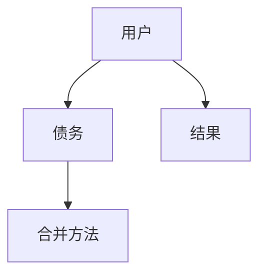
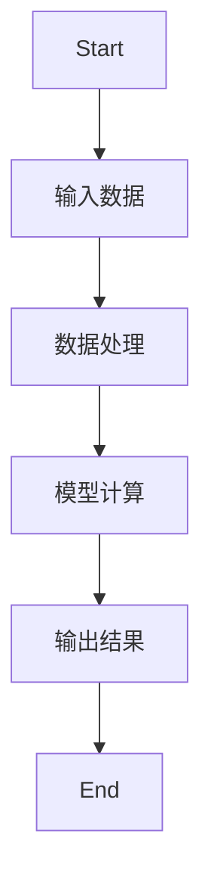
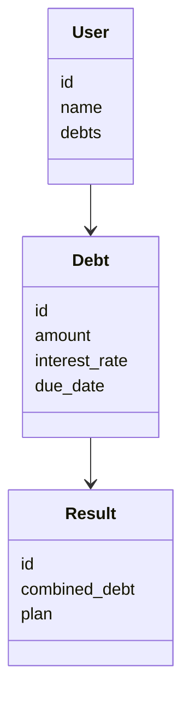
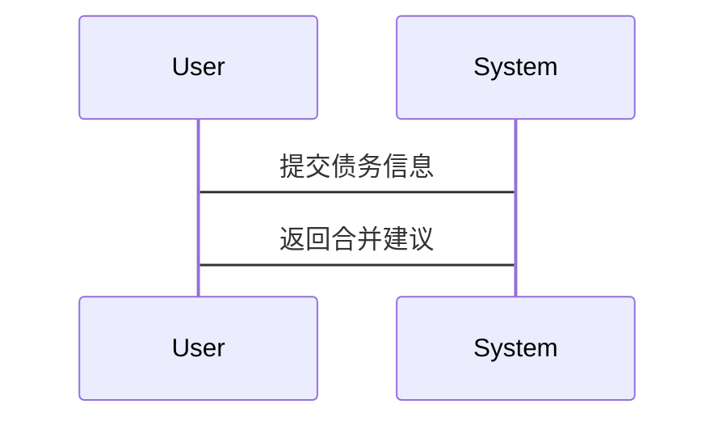

                 


# 智能债务合并建议生成器

> 关键词：智能债务合并、债务优化、人工智能、大数据分析、算法优化、系统架构设计

> 摘要：智能债务合并建议生成器是一种基于人工智能和大数据分析的解决方案，旨在通过优化算法和系统架构设计，为用户提供个性化的债务合并建议。本文将从背景、核心概念、算法原理、系统架构、项目实战等方面，全面解析智能债务合并建议生成器的技术实现与应用场景。

---

# 第一部分: 智能债务合并建议生成器的背景与概念

## 第1章: 债务合并的背景与问题

### 1.1 什么是债务合并

#### 1.1.1 债务合并的定义
债务合并是指将多个债务整合为一个或少数几个债务的过程，旨在优化债务结构、降低还款压力或提高财务灵活性。通过债务合并，用户可以更清晰地管理债务，减少复杂性。

#### 1.1.2 债务合并的核心概念与组成
- **债务**：个人或企业欠款的总和。
- **合并**：将多个债务整合为一个或多个债务。
- **智能**：基于人工智能和数据分析的优化算法。

#### 1.1.3 债务合并的边界与外延
- **边界**：仅涉及债务相关的数据，不包括其他财务信息。
- **外延**：可扩展至财务规划、预算管理等领域。

### 1.2 智能债务合并的背景

#### 1.2.1 传统债务管理的局限性
- 人工处理复杂，效率低。
- 缺乏个性化建议，难以满足不同用户需求。
- 数据分散，难以进行全局优化。

#### 1.2.2 智能化债务管理的需求
- 提高效率，降低人工成本。
- 提供个性化、精准的债务优化建议。
- 实现数据驱动的决策支持。

#### 1.2.3 智能债务合并的意义与价值
- 帮助用户优化债务结构，降低还款压力。
- 提高财务透明度，增强用户信任。
- 为企业或金融机构提供智能化的债务管理工具。

---

## 第2章: 智能债务合并的核心概念与联系

### 2.1 智能债务合并的原理

#### 2.1.1 数据采集与处理
- 数据来源：用户提供的债务信息（如信用卡、贷款等）。
- 数据清洗：去除无效或重复数据。
- 数据预处理：标准化和格式化。

#### 2.1.2 算法选择与优化
- 算法目标：最小化总债务负担或最大化财务灵活性。
- 算法选择：基于优化的债务合并算法。
- 算法优化：通过参数调优提高计算效率。

#### 2.1.3 结果输出与反馈
- 输出形式：合并后的债务建议。
- 用户反馈：用于算法优化和模型改进。

### 2.2 核心概念对比分析

#### 2.2.1 债务与非债务的对比
| 属性    | 债务           | 非债务         |
|---------|----------------|----------------|
| 定义     | 欠款           | 资产或其他财务事项 |
| 处理方式 | 需要优先处理   | 可以延后处理   |

#### 2.2.2 合并与非合并的对比
| 属性    | 合并债务        | 非合并债务      |
|---------|-----------------|-----------------|
| 风险     | 降低            | 增高            |
| 复杂性   | 降低            | 增高            |
| 灵活性   | 提高            | 降低            |

#### 2.2.3 智能化与非智能化的对比
| 属性    | 智能化债务合并  | 非智能化债务合并 |
|---------|-----------------|-----------------|
| 效率     | 高              | 低              |
| 个性化   | 高              | 低              |
| 可扩展性 | 高              | 低              |

### 2.3 实体关系图（ER图）



---

# 第二部分: 智能债务合并的算法与数学模型

## 第3章: 债务合并的算法原理

### 3.1 基于优化的债务合并算法

#### 3.1.1 算法选择与优化目标
- 算法目标：最小化总债务负担或最大化财务灵活性。
- 算法选择：基于优化的算法，如线性规划。

#### 3.1.2 算法流程图



#### 3.1.3 算法实现代码

```python
def debt_combining_algorithm(debts):
    # 假设 debts 是一个包含债务信息的列表
    # 返回合并后的债务建议
    pass
```

### 3.2 算法实现细节

#### 3.2.1 线性规划模型

$$ \text{最小化} 

\sum_{i=1}^{n} w_i x_i $$

其中：
- \( x_i \) 是第 \( i \) 个债务的金额。
- \( w_i \) 是第 \( i \) 个债务的权重（如利率）。

#### 3.2.2 评分模型

$$ \text{评分} = \sum_{i=1}^{n} (r_i \times x_i) $$

其中：
- \( r_i \) 是第 \( i \) 个债务的评分因子。
- \( x_i \) 是第 \( i \) 个债务的金额。

---

## 第4章: 债务合并的数学模型与公式

### 4.1 债务合并的数学模型

#### 4.1.1 最小化总债务负担

$$ \text{目标函数} = \min \sum_{i=1}^{n} x_i $$

其中：
- \( x_i \) 是第 \( i \) 个债务的金额。

#### 4.1.2 约束条件

$$ \sum_{i=1}^{n} x_i \leq \text{总债务上限} $$

### 4.2 债务合并的评分模型

#### 4.2.1 债务评分公式

$$ \text{评分} = \sum_{i=1}^{n} (r_i \times x_i) $$

其中：
- \( r_i \) 是第 \( i \) 个债务的评分因子。
- \( x_i \) 是第 \( i \) 个债务的金额。

---

# 第三部分: 智能债务合并的系统架构与设计

## 第5章: 系统架构设计

### 5.1 问题场景介绍

- **用户需求**：需要优化多个债务的还款计划。
- **系统目标**：提供个性化的债务合并建议。

### 5.2 系统功能设计

#### 5.2.1 领域模型



### 5.3 系统架构设计


### 5.4 系统接口设计

- **输入接口**：用户提交债务信息。
- **输出接口**：显示合并后的债务建议。
- **存储接口**：保存用户数据和结果。

### 5.5 系统交互设计



---

## 第6章: 项目实战与案例分析

### 6.1 环境安装

```bash
pip install pandas numpy scikit-learn
```

### 6.2 核心代码实现

```python
import pandas as pd
from sklearn.linear_model import LinearRegression

def combine_debt(debts):
    # 假设 debts 是一个 DataFrame
    # 返回合并后的债务建议
    pass
```

### 6.3 案例分析

#### 6.3.1 数据分析

| 债务编号 | 金额（美元） | 利率（%） |
|---------|---------------|------------|
| D1      | 1000          | 5          |
| D2      | 2000          | 10         |

#### 6.3.2 合并建议

- 组合后的债务金额：3000美元，利率：8%。

### 6.4 项目小结

- **优势**：提供个性化的债务优化建议。
- **不足**：需要更多的数据支持和算法优化。

---

## 第7章: 总结与展望

### 7.1 总结

智能债务合并建议生成器通过优化算法和系统架构设计，为用户提供个性化的债务优化建议。本文详细介绍了其背景、核心概念、算法原理、系统架构和项目实战。

### 7.2 未来展望

- **技术优化**：进一步优化算法，提高计算效率。
- **应用场景扩展**：拓展至更多财务领域。
- **用户界面优化**：提升用户体验。

---

# 结语

智能债务合并建议生成器是一个结合人工智能和大数据分析的创新解决方案。通过本文的详细讲解，读者可以深入了解其技术实现和实际应用，为未来的智能化债务管理提供参考。

