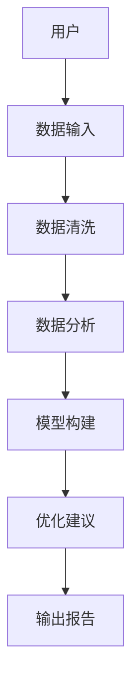
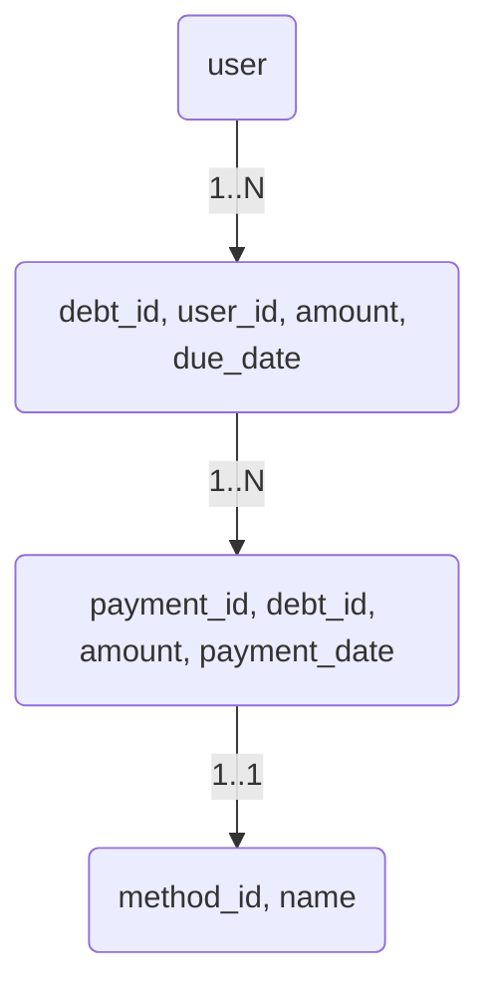
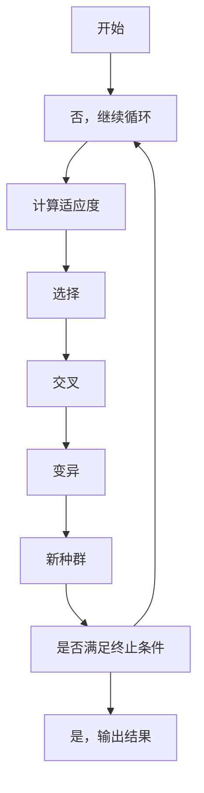
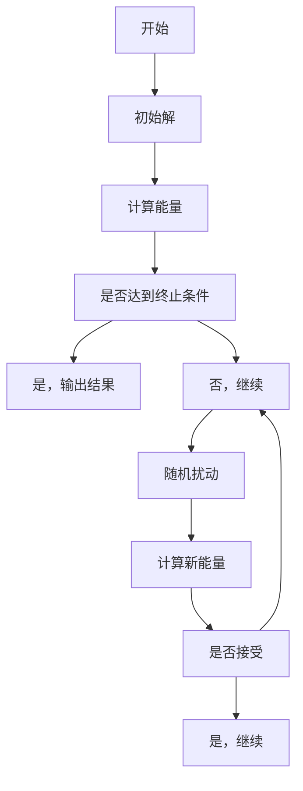
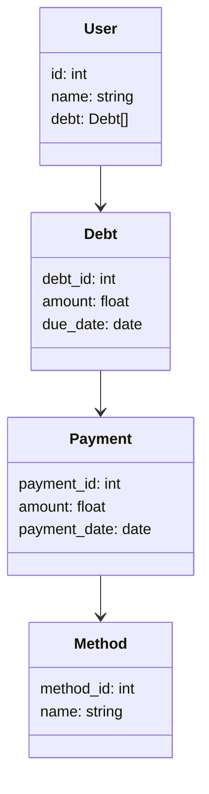
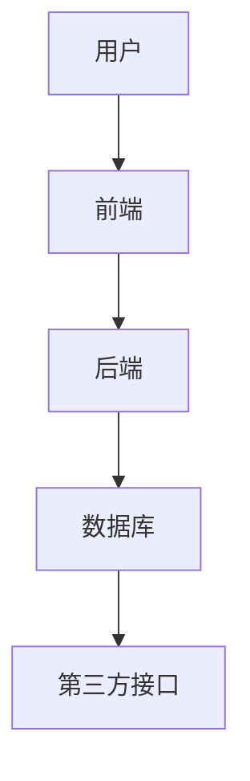

                 


# 智能债务管理建议系统

> 关键词：智能债务管理、人工智能、优化算法、系统架构、项目实战

> 摘要：智能债务管理建议系统是一种基于人工智能技术的债务管理工具，通过数据分析和算法优化，为个人和企业提供个性化的债务管理建议。本文详细介绍了系统的背景、核心概念、算法原理、系统架构、项目实战以及最佳实践，帮助读者全面了解智能债务管理系统的实现与应用。

---

# 第一部分: 智能债务管理建议系统的背景与核心概念

## 第1章: 智能债务管理建议系统的背景介绍

### 1.1 智能债务管理建议系统的背景

#### 1.1.1 传统债务管理的痛点与挑战

传统债务管理方式存在以下痛点：

1. **复杂性**：个人和企业需要处理多种债务来源，如信用卡、贷款、赊账等，管理过程复杂。
2. **低效性**：人工管理需要花费大量时间，且容易出错。
3. **风险不确定性**：传统管理难以预测债务风险，可能导致财务危机。

#### 1.1.2 智能债务管理的必要性

智能债务管理的必要性体现在以下几个方面：

1. **技术进步**：人工智能和大数据技术的发展为债务管理提供了新的工具。
2. **数据驱动决策**：通过数据分析，可以更准确地预测风险并制定优化策略。
3. **个性化需求**：不同用户有不同的财务状况和目标，需要个性化的管理方案。

#### 1.1.3 智能债务管理的核心问题

智能债务管理的核心问题包括：

1. **优化目标**：如何最小化债务成本，优化还款计划。
2. **风险控制**：如何预测和规避债务风险。
3. **个性化建议**：如何根据用户的具体情况提供定制化建议。

---

## 第2章: 智能债务管理建议系统的概念与核心要素

### 2.1 智能债务管理系统的定义

智能债务管理建议系统是一种基于人工智能的债务管理工具，通过分析用户的数据，提供个性化的优化建议。

### 2.2 系统的核心要素

系统的核心要素包括：

1. **数据采集模块**：从银行账户、信用报告、消费记录等来源获取数据。
2. **模型构建模块**：使用遗传算法、模拟退火等优化算法构建数学模型。
3. **优化建议生成模块**：根据模型结果生成还款计划、债务重组等建议。

### 2.3 系统的边界与外延

- **边界**：系统的输入是用户债务数据和财务目标，输出是优化建议和风险预警。
- **外延**：系统可以与第三方数据接口和银行API集成。

---

## 第3章: 智能债务管理建议系统的概念结构

### 3.1 数据流图



### 3.2 ER实体关系图



---

# 第二部分: 智能债务管理建议系统的算法原理

## 第4章: 优化算法原理

### 4.1 遗传算法

#### 4.1.1 遗传算法流程图



#### 4.1.2 遗传算法的数学模型

目标函数：
$$ \text{最小化} \sum_{i=1}^{n} c_i x_i $$
约束条件：
$$ \sum_{i=1}^{n} x_i \leq C $$

### 4.2 模拟退火算法

#### 4.2.1 模拟退火算法流程图



---

## 第5章: 数学模型与公式

### 5.1 目标函数

$$ \text{目标函数} = \sum_{i=1}^{n} (r_i \times a_i \times t_i) $$

其中：
- $r_i$：第$i$笔债务的利率
- $a_i$：第$i$笔债务的金额
- $t_i$：第$i$笔债务的时间

### 5.2 约束条件

1. $ \sum_{i=1}^{n} a_i \leq \text{总债务} $
2. $ \sum_{i=1}^{n} t_i \leq \text{最长还款期限} $

---

# 第三部分: 智能债务管理建议系统的系统分析与架构设计

## 第6章: 系统功能设计

### 6.1 领域模型类图



---

## 第7章: 系统架构设计

### 7.1 分层架构图



---

## 第8章: 系统接口设计

### 8.1 接口设计

1. 数据接口：
   - 输入：用户债务数据
   - 输出：清洗后的数据

2. 模型接口：
   - 输入：清洗后的数据
   - 输出：优化建议

---

# 第四部分: 智能债务管理建议系统的项目实战

## 第9章: 项目实战

### 9.1 环境安装

安装Python和必要的库：
```bash
pip install numpy pandas scikit-learn
```

### 9.2 核心代码实现

#### 9.2.1 数据预处理

```python
import pandas as pd

data = pd.read_csv('debt.csv')
data_cleaned = data.dropna()
```

#### 9.2.2 模型训练

```python
from sklearn import linear_model

model = linear_model.LinearRegression()
model.fit(X, y)
```

#### 9.2.3 优化建议生成

```python
def generate_recommendations(data, model):
    # 预测结果
    predictions = model.predict(data)
    # 生成建议
    recommendations = []
    for i in range(len(predictions)):
        if predictions[i] > 0.5:
            recommendations.append('优化')
        else:
            recommendations.append('保持')
    return recommendations
```

---

## 第10章: 实际案例分析

### 10.1 案例分析

假设用户有以下债务：
- 信用卡欠款：$10,000，利率18%
- 个人贷款：$20,000，利率12%

模型预测结果：
- 建议优先偿还信用卡欠款，以减少高利率的影响。

---

## 第11章: 项目小结

### 11.1 成果总结

通过项目实战，我们成功实现了智能债务管理建议系统的核心功能，包括数据处理、模型训练和优化建议生成。

---

# 第五部分: 智能债务管理建议系统的最佳实践

## 第12章: 最佳实践

### 12.1 系统设计注意事项

1. **数据隐私保护**：确保用户数据的安全性。
2. **模型调优**：定期更新模型，以适应市场变化。

### 12.2 未来发展方向

1. **引入机器学习**：进一步提高预测准确性。
2. **区块链技术**：确保数据不可篡改，增强信任。

---

## 第13章: 总结

智能债务管理建议系统通过人工智能技术，为个人和企业提供了一种高效、个性化的债务管理方式。未来，随着技术的不断发展，系统将更加智能化和个性化。

---

# 附录

## 附录A: 术语表

1. **遗传算法**：一种基于生物进化论的优化算法。
2. **模拟退火**：一种全局优化算法，用于解决组合优化问题。

## 附录B: 参考文献

1. 《人工智能导论》
2. 《算法导论》

---

通过以上思考和分析，我们可以系统地构建一个智能债务管理建议系统的框架，并逐步实现其功能。

