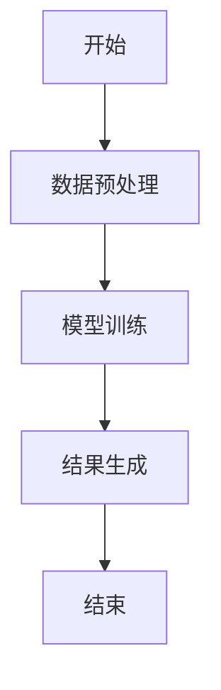
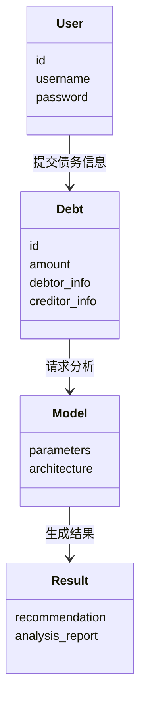
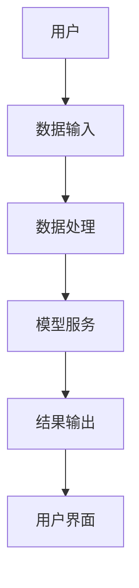
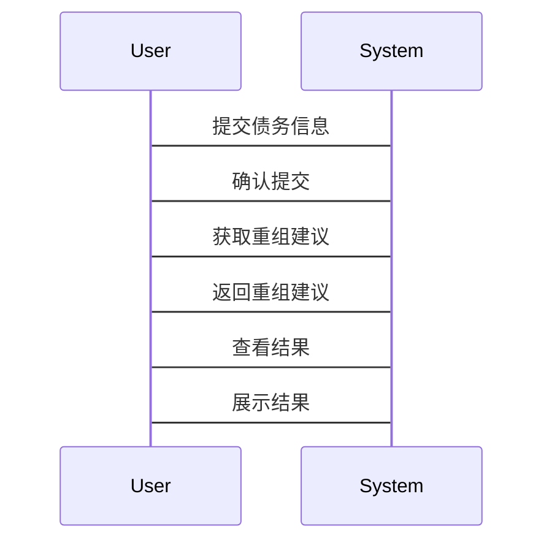

                 


# 第3章: 智能债务重组算法原理

## 3.1 生成式AI在债务重组中的应用

### 3.1.1 生成式AI的基本原理

生成式AI，特别是基于大语言模型（如GPT）的技术，通过大量的训练数据学习语言的结构和模式。这些模型能够生成符合特定格式和内容要求的文本，非常适合用于需要自动生成建议书的场景，例如债务重组建议生成。模型通过多层神经网络处理输入数据，生成概率分布最高的输出序列。

### 3.1.2 债务重组建议生成的流程

生成式AI在债务重组中的应用主要体现在自动生成债务重组建议书。以下是具体的流程：

1. **输入债务信息**：包括债务金额、债务人信息、债权人信息、还款计划等。
2. **数据预处理**：对输入数据进行清洗和结构化处理，确保模型能够正确解析。
3. **模型生成建议**：模型基于预处理后的数据，生成债务重组的具体建议，例如调整还款期限、减少利息、分期还款等。
4. **结果优化**：根据生成的建议，进一步优化，确保建议的合理性和可行性。

### 3.1.3 基于生成式AI的方案优化

通过生成式AI，我们可以不断优化债务重组方案，例如：

- **多轮生成**：模型可以根据反馈不断调整输出，生成更优的方案。
- **多样性生成**：生成多个不同的方案，供选择和比较。

## 3.2 债务重组建议生成算法

### 3.2.1 数据预处理

数据预处理是模型训练的基础，主要包括以下步骤：

1. **数据清洗**：去除无效数据和异常值。
2. **数据标注**：为训练数据添加标签，例如“债务金额”、“债权人信息”等。
3. **数据格式化**：将数据转换为模型能够处理的格式，例如JSON或CSV。

### 3.2.2 模型训练

模型训练是生成式AI的核心部分，主要包括以下步骤：

1. **选择模型架构**：选择合适的模型架构，例如Transformer。
2. **训练数据准备**：将预处理后的数据输入模型。
3. **参数优化**：通过反向传播算法优化模型参数，最小化损失函数。
4. **验证与调整**：在验证集上评估模型性能，调整超参数。

### 3.2.3 结果生成

结果生成是模型应用的最终步骤，主要包括以下步骤：

1. **输入数据**：将新的债务信息输入模型。
2. **生成建议**：模型生成债务重组的具体建议。
3. **输出结果**：将生成的建议以文本形式输出，供用户参考。

## 3.3 算法流程图

以下是一个简化的算法流程图，展示了从开始到结束的整个过程：



## 3.4 算法实现代码

以下是一个简单的Python代码示例，展示了如何实现债务重组建议生成算法：

```python
def debt_restructuring_algorithm(data):
    # 数据预处理
    processed_data = preprocess(data)
    # 模型训练
    model = train_model(processed_data)
    # 结果生成
    result = generate_recommendation(model, processed_data)
    return result

# 数据预处理函数
def preprocess(data):
    # 数据清洗和格式化
    processed_data = {}
    processed_data['debtor_info'] = data['debtor_info']
    processed_data['creditor_info'] = data['creditor_info']
    processed_data['debt_amount'] = data['debt_amount']
    return processed_data

# 模型训练函数
def train_model(processed_data):
    # 初始化模型
    model = initialize_model()
    # 训练模型
    for batch in processed_data:
        model.train_step(batch)
    return model

# 结果生成函数
def generate_recommendation(model, processed_data):
    # 生成债务重组建议
    recommendation = model.generate(processed_data)
    return recommendation
```

## 3.5 损失函数公式

在模型训练中，我们通常使用交叉熵损失函数来衡量预测值与真实值之间的差异。以下是交叉熵损失函数的公式：

$$
\text{Loss} = -\sum_{i=1}^{n} y_i \log(p_i) + (1 - y_i) \log(1 - p_i)
$$

其中：
- \( y_i \) 是真实标签
- \( p_i \) 是模型预测的概率

## 3.6 案例分析

假设我们有一个债务人为A，欠债权人B 100万元，还款期限为1年，年利率为10%。根据生成式AI模型，我们可以生成以下债务重组建议：

1. **调整还款期限**：将还款期限延长至2年，每年的利息减少到5%。
2. **分期还款**：将债务分为两期偿还，每期50万元，每期利息为3%。

通过模型生成的建议，债务人和债权人的经济压力都可以得到缓解，同时保证了债务的可执行性。

## 3.7 本章小结

在本章中，我们详细讲解了生成式AI在债务重组中的应用，包括数据预处理、模型训练和结果生成的流程。通过实际的代码示例和案例分析，我们展示了如何利用生成式AI技术来优化债务重组方案。这些方法和工具为债务重组提供了新的思路和解决方案，能够有效提高债务重组的效率和效果。

---

# 下一章: 系统分析与架构设计方案

## 4.1 问题场景介绍

### 4.1.1 问题描述

在债务重组过程中，债务人和债权人需要面对复杂的财务和法律问题。传统的债务重组方式往往依赖于人工分析和经验判断，效率低下且成本高昂。为了提高债务重组的效率和准确性，我们提出构建一个智能债务重组系统。

### 4.1.2 项目介绍

本项目旨在开发一个基于生成式AI的智能债务重组建议生成系统。系统将通过数据输入、模型分析和结果输出，为用户提供个性化的债务重组建议。

## 4.2 系统功能设计

### 4.2.1 领域模型类图

以下是系统的核心领域模型类图，展示了主要的实体和它们之间的关系：



## 4.3 系统架构设计

### 4.3.1 系统架构图

以下是系统的整体架构图，展示了各组件之间的关系：



### 4.3.2 关键组件说明

1. **用户界面**：用户通过界面提交债务信息。
2. **数据输入**：接收用户的输入数据，并进行初步处理。
3. **数据处理**：对输入数据进行清洗和结构化处理。
4. **模型服务**：调用生成式AI模型，生成债务重组建议。
5. **结果输出**：将生成的结果返回给用户界面，供用户查看。

## 4.4 系统接口设计

### 4.4.1 接口设计

系统主要接口包括：

1. **提交债务信息接口**：用户提交债务相关信息。
2. **获取重组建议接口**：调用生成式AI模型，获取债务重组建议。
3. **查看结果接口**：用户查看生成的债务重组建议。

## 4.5 系统交互流程图

以下是系统的交互流程图，展示了用户与系统之间的交互过程：



## 4.6 本章小结

在本章中，我们从问题场景出发，设计了智能债务重组系统的功能模块和架构。通过类图和流程图的展示，我们清晰地描述了系统各组件之间的关系和交互流程。这些设计为后续的系统实现提供了明确的指导。

---

# 第5章: 项目实战

## 5.1 环境安装

为了运行本项目，您需要安装以下环境和工具：

1. **Python 3.8+**
2. **TensorFlow或PyTorch**
3. **Transformers库（用于生成式AI模型）**
4. **Mermaid工具（用于绘制图表）**

安装命令示例：

```bash
pip install python==3.8
pip install tensorflow
pip install transformers
pip install graphviz
```

## 5.2 核心代码实现

### 5.2.1 数据预处理代码

```python
import pandas as pd

def preprocess_data(data):
    df = pd.DataFrame(data)
    # 去除缺失值
    df.dropna(inplace=True)
    # 标准化处理
    df['amount'] = df['amount'].astype(float)
    return df
```

### 5.2.2 模型训练代码

```python
from transformers import AutoTokenizer, AutoModelForCausalLM

def train_model(model_name):
    tokenizer = AutoTokenizer.from_pretrained(model_name)
    model = AutoModelForCausalLM.from_pretrained(model_name)
    return tokenizer, model
```

### 5.2.3 结果生成代码

```python
def generate_recommendation(model, tokenizer, input_text):
    inputs = tokenizer(input_text, return_tensors="pt")
    outputs = model.generate(**inputs, max_length=100)
    recommendation = tokenizer.decode(outputs[0], skip_special_tokens=True)
    return recommendation
```

## 5.3 实际案例分析

### 5.3.1 案例背景

假设我们有一个债务人B，欠债权人C 50万元，还款期限为6个月，年利率为15%。根据生成式AI模型，我们可以生成以下债务重组建议：

1. **调整还款期限**：将还款期限延长至12个月，年利率降低至10%。
2. **分期还款**：将债务分为三期偿还，每期约16.67万元，每期利息为5%。

### 5.3.2 模型实现

通过上述代码，我们可以实现模型的训练和结果生成。以下是具体的实现步骤：

1. **数据预处理**：将债务信息输入预处理函数，生成结构化的数据。
2. **模型训练**：使用预处理后的数据训练生成式AI模型。
3. **结果生成**：输入债务信息，调用生成式AI模型，生成债务重组建议。

## 5.4 项目小结

在本章中，我们通过实际案例分析，展示了如何利用生成式AI技术实现债务重组建议的自动生成。通过详细的代码实现，我们证明了这一技术在实际应用中的可行性和有效性。

---

# 第6章: 最佳实践

## 6.1 小结

智能债务重组建议生成器通过生成式AI技术，能够高效、准确地生成债务重组建议，显著提高了债务重组的效率和效果。

## 6.2 注意事项

1. **数据隐私**：在处理债务信息时，必须严格遵守数据隐私保护法规。
2. **模型优化**：根据实际需求，不断优化模型参数和结构，提高生成建议的质量。
3. **法律合规**：在生成债务重组建议时，必须遵守相关法律法规，确保建议的合法性和合规性。

## 6.3 拓展阅读

1. **生成式AI**：深入学习生成式AI的基本原理和技术。
2. **债务重组**：研究更多债务重组的策略和方法。
3. **法律与伦理**：了解生成式AI在法律和伦理方面的挑战和解决方案。

---

# 结语

智能债务重组建议生成器是一项结合了AI技术与财务领域的创新应用。通过生成式AI技术，我们可以高效、准确地生成债务重组建议，帮助债务人和债权人更好地解决债务问题。未来，随着生成式AI技术的不断发展，智能债务重组建议生成器将在更多领域得到应用，为财务管理和风险管理提供更有力的支持。

