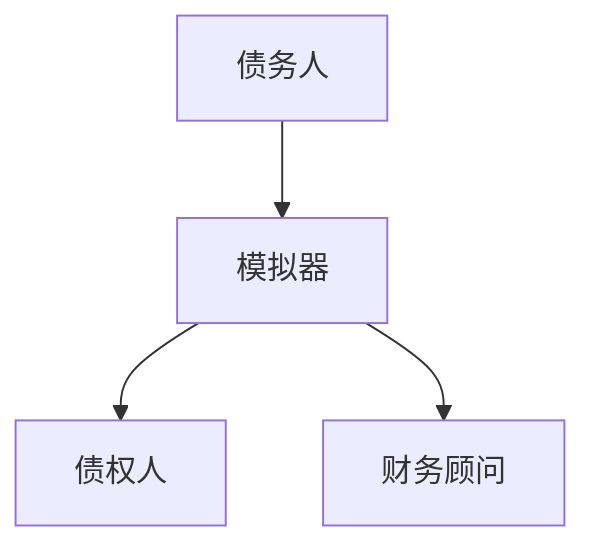
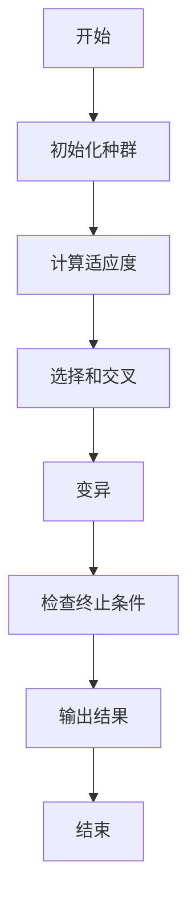
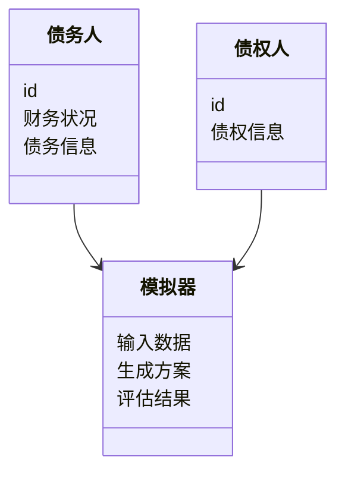
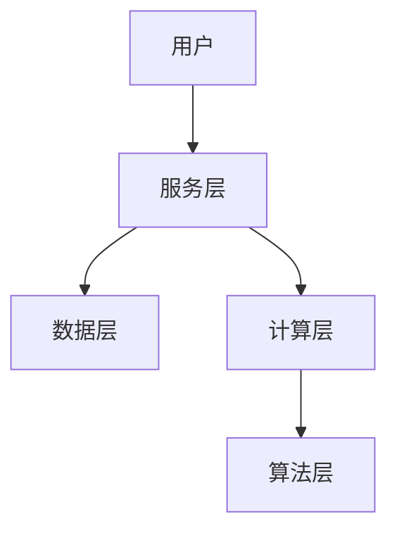

                 


# 智能债务重组方案效果模拟器

## 关键词：智能债务重组、模拟器、人工智能、债务优化、方案评估

## 摘要：智能债务重组方案效果模拟器是一种基于人工智能技术的工具，用于模拟和评估债务重组方案的效果。本文将详细介绍其背景、核心概念、算法原理、系统架构以及实际应用，帮助读者全面理解这一技术的应用和价值。

---

# 第1章 智能债务重组方案效果模拟器的背景与概念

## 1.1 债务重组的基本概念

### 1.1.1 债务重组的定义
债务重组是指债务人与债权人之间通过协商，调整债务的偿还条件和方式，以降低债务风险、优化债务结构的过程。常见的债务重组方式包括延长还款期限、降低利率、债转股等。

### 1.1.2 债务重组的常见场景
- 企业因经营不善，无法按期偿还债务。
- 个人因经济困难，无法按时偿还贷款。
- 金融机构为了降低不良资产，主动与债务人协商重组。

### 1.1.3 债务重组的法律与财务要求
债务重组必须符合相关法律法规，并在财务上进行详细的评估和规划，确保重组方案的可行性和有效性。

## 1.2 智能债务重组的定义与特点

### 1.2.1 智能债务重组的定义
智能债务重组是利用人工智能技术，通过数据驱动的方式，自动优化债务重组方案，以达到最优的债务管理和风险控制。

### 1.2.2 智能债务重组的核心特点
- **自动化**：利用算法自动生成和优化重组方案。
- **数据驱动**：基于大量数据进行分析和预测，提高方案的科学性和准确性。
- **实时性**：能够快速响应市场变化和债务情况的变化。

### 1.2.3 智能债务重组与传统债务重组的区别
传统债务重组依赖人工经验，效率低且可能存在主观偏差；智能债务重组通过算法优化，提高了效率和准确性，能够处理复杂多变的债务情况。

## 1.3 智能债务重组模拟器的定义
智能债务重组模拟器是一种基于人工智能的工具，能够模拟不同债务重组方案的效果，帮助决策者选择最优方案。

## 1.4 智能债务重组模拟器的技术背景
随着人工智能和大数据技术的发展，智能债务重组模拟器应运而生。通过机器学习算法，模拟器可以分析大量的历史数据，预测不同方案的效果，从而提高债务重组的成功率。

---

# 第2章 智能债务重组模拟器的核心概念与联系

## 2.1 核心概念原理

### 2.1.1 债务重组方案生成的原理
模拟器通过分析债务人的财务状况和市场环境，生成多种可能的债务重组方案。

### 2.1.2 方案效果评估的指标
- 偿债压力
- 资金成本
- 企业价值
- 风险敞口

### 2.1.3 方案优化的机制
通过遗传算法或模拟退火等优化算法，不断调整方案参数，找到最优解。

## 2.2 核心概念属性特征对比

### 2.2.1 模拟器功能对比表
| 功能特性         | 传统模拟器         | 智能模拟器         |
|------------------|-------------------|-------------------|
| 方案生成速度     | 慢                | 快                |
| 方案优化能力     | 有限              | 强                |
| 数据分析能力     | 低                | 高                |

### 2.2.2 实体关系图


---

# 第3章 智能债务重组模拟器的算法原理

## 3.1 算法原理概述

### 3.1.1 算法核心
模拟器采用遗传算法，通过迭代优化找到最优重组方案。

### 3.1.2 算法流程
1. 初始化种群
2. 计算适应度
3. 选择和交叉
4. 变异
5. 重复迭代

## 3.2 算法流程图


## 3.3 算法的数学模型与公式

### 3.3.1 目标函数
$$ \text{目标函数} = \min \sum_{i=1}^{n} w_i x_i $$

### 3.3.2 约束条件
$$ \sum_{i=1}^{n} x_i \leq C $$

---

# 第4章 系统分析与架构设计

## 4.1 系统功能设计

### 4.1.1 领域模型


## 4.2 系统架构设计

### 4.2.1 系统架构图


---

# 第5章 项目实战

## 5.1 环境安装
安装Python和相关库，如NumPy、Pandas、Scikit-learn。

## 5.2 核心功能实现
### 方案生成
```python
def generate方案(债务数据):
    # 算法实现
    return 方案列表
```

### 方案评估
```python
def 评估方案(方案):
    # 计算指标
    return 评估结果
```

## 5.3 案例分析
通过具体案例展示模拟器的应用效果。

---

# 第6章 最佳实践与小结

## 6.1 小结
智能债务重组模拟器通过人工智能技术，显著提高了债务重组的效率和效果。

## 6.2 注意事项
- 数据质量
- 算法选择
- 模拟结果的可解释性

## 6.3 拓展阅读
建议阅读相关的人工智能和债务重组的书籍和论文。

---

通过以上内容，我们全面介绍了智能债务重组方案效果模拟器的背景、核心概念、算法原理、系统架构以及实际应用。希望读者能够通过这篇文章，深入了解这一技术，并在实际工作中加以应用。

