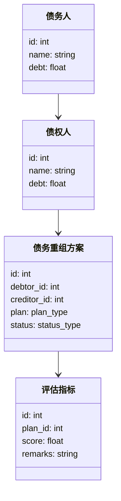
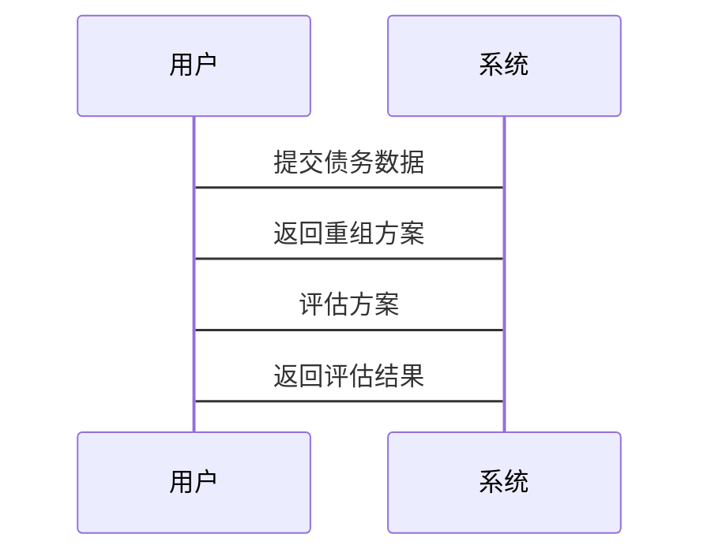

                 


# 第一部分: 智能债务重组方案效果评估工具概述

# 第1章: 智能债务重组的背景与问题背景

## 1.1 债务重组的基本概念
### 1.1.1 什么是债务重组
### 1.1.2 债务重组的常见场景
### 1.1.3 债务重组的核心问题

## 1.2 智能债务重组的必要性
### 1.2.1 传统债务重组的局限性
### 1.2.2 智能化技术在债务重组中的应用价值
### 1.2.3 智能债务重组的潜在优势

## 1.3 问题背景与目标
### 1.3.1 债务重组中的主要问题
### 1.3.2 智能债务重组的目标
### 1.3.3 问题解决的边界与外延

## 1.4 本章小结

# 第2章: 智能债务重组方案效果评估工具的核心概念

## 2.1 智能债务重组方案的核心要素
### 2.1.1 数据来源与处理
### 2.1.2 智能算法的选择
### 2.1.3 评估指标的设计

## 2.2 核心概念与联系
### 2.2.1 实体关系图（ER图）

### 2.2.2 核心概念对比表
| 概念 | 属性 | 描述 |
|------|------|------|
| 债务人 | 主体 | 需要重组债务的主体 |
| 债权人 | 主体 | 提供债务的主体 |
| 方案 | 方法 | 具体的债务重组策略 |
| 评估 | 方法 | 对方案效果的评价标准 |

## 2.3 本章小结

# 第3章: 智能债务重组方案效果评估工具的算法原理

## 3.1 算法概述
### 3.1.1 常见的智能算法
### 3.1.2 算法选择的依据
### 3.1.3 算法的优缺点对比

## 3.2 算法原理


## 3.3 算法实现
### 3.3.1 算法的数学模型
$$ f(x) = w_1x_1 + w_2x_2 + ... + w_nx_n $$
### 3.3.2 算法的实现步骤
### 3.3.3 举例说明
例如，给定一组债务数据，通过线性回归模型计算出最优的债务重组方案。

## 3.4 本章小结

# 第4章: 智能债务重组方案效果评估工具的系统架构设计

## 4.1 系统功能设计
### 4.1.1 领域模型


## 4.2 系统架构设计
### 4.2.1 分层架构


## 4.3 系统接口设计
### 4.3.1 API接口
- POST /api/debt-plan 创建债务重组方案
- GET /api/assessment 查询评估指标
- PUT /api/status 更新方案状态

## 4.4 系统交互设计


## 4.5 本章小结

# 第5章: 智能债务重组方案效果评估工具的项目实战

## 5.1 项目环境与依赖安装
### 5.1.1 环境要求
- Python 3.8+
- pip
- 虚拟环境

## 5.2 项目核心实现

### 5.2.1 数据处理模块
```python
def preprocess_data(data):
    # 数据清洗和特征提取
    pass
```

### 5.2.2 算法实现模块
```python
def evaluate_plan(plan, data):
    # 计算评估指标
    pass
```

### 5.2.3 系统接口实现
```python
from flask import Flask, request, jsonify

app = Flask(__name__)

@app.route('/api/debt-plan', methods=['POST'])
def create_plan():
    # 创建债务重组方案
    pass

@app.route('/api/assessment', methods=['GET'])
def get_assessment():
    # 获取评估指标
    pass
```

## 5.3 项目实现解读
### 5.3.1 代码结构
```
project/
├── src/
│   ├── models/
│   │   └── plan_evaluator.py
│   ├── services/
│   │   └── debt_plan_service.py
│   └── interfaces/
│       └── api_routes.py
├── requirements.txt
└── README.md
```

## 5.4 实际案例分析
### 5.4.1 案例背景
假设某公司欠银行债务1000万元，需在一年内偿还。

### 5.4.2 方案生成
通过算法生成多种还款方案，如等额本息、分期偿还等。

### 5.4.3 评估结果
评估各方案的可行性，选择最优方案。

## 5.5 本章小结

# 第6章: 总结与展望

## 6.1 项目总结
### 6.1.1 核心成果
### 6.1.2 经验与教训

## 6.2 未来展望
### 6.2.1 技术优化方向
### 6.2.2 应用场景扩展
### 6.2.3 可能的挑战

## 6.3 本章小结

# 第7章: 参考文献与扩展阅读

## 7.1 参考文献
### 1. 书籍引用
### 2. 网站链接
### 3. 论文引用

## 7.2 扩展阅读
### 1. 相关技术领域
### 2. 智能算法研究
### 3. 系统架构优化

## 7.3 本章小结

# 第8章: 最佳实践与注意事项

## 8.1 最佳实践
### 8.1.1 数据处理
### 8.1.2 算法选择
### 8.1.3 系统设计

## 8.2 注意事项
### 8.2.1 数据隐私
### 8.2.2 算法解释性
### 8.2.3 系统稳定性

## 8.3 本章小结

# 第9章: 项目部署与维护

## 9.1 项目部署
### 9.1.1 环境搭建
### 9.1.2 代码部署
### 9.1.3 测试与调试

## 9.2 系统维护
### 9.2.1 日常维护
### 9.2.2 数据更新
### 9.2.3 性能优化

## 9.3 本章小结

# 结语

# 致谢

# 附录

## 附录A: 额外代码片段

## 附录B: 参数配置说明

## 附录C: 术语表

