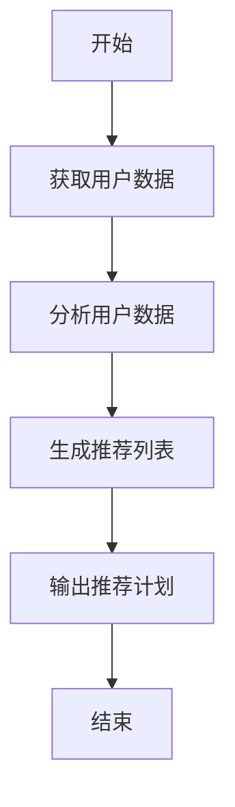
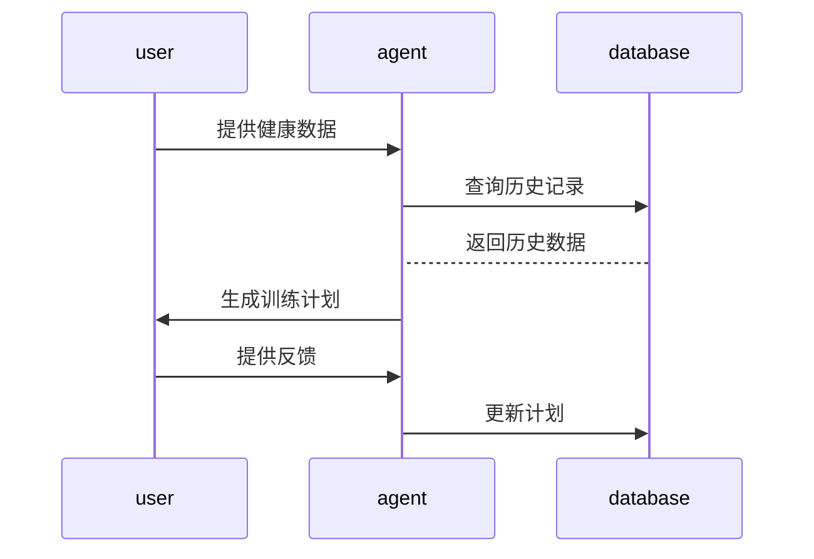

                 


# 目录大纲：《智能健身器：AI Agent的个性化训练计划》

## 第一部分：背景介绍

### 第1章：智能健身器的背景与意义

#### 1.1 问题背景
- **1.1.1 健身行业的现状与挑战**
  - 当前健身行业的痛点分析
  - 传统健身方式的不足
  - 健身行业智能化转型的趋势

- **1.1.2 传统健身计划的局限性**
  - 非个性化的训练计划问题
  - 用户参与度低的原因
  - 传统健身设备的局限性

- **1.1.3 AI技术在健身领域的应用潜力**
  - AI技术如何改变健身行业
  - 数据驱动的个性化训练的优势
  - AI在健身领域的未来发展方向

#### 1.2 问题描述
- **1.2.1 用户健身需求的多样性**
  - 不同用户的健身目标差异
  - 用户的健康状况和健身习惯的多样性
  - 用户对个性化服务的需求

- **1.2.2 个性化训练计划的重要性**
  - 个性化训练如何提高健身效果
  - 针对不同用户需求制定训练计划的必要性
  - 个性化训练在健身中的具体应用场景

- **1.2.3 当前健身解决方案的不足**
  - 现有解决方案的局限性分析
  - 传统健身教练的能力限制
  - 现有智能设备的功能不足

#### 1.3 问题解决
- **1.3.1 引入AI Agent的必要性**
  - AI Agent如何解决个性化训练问题
  - AI技术在健身领域的优势
  - AI Agent在智能健身器中的具体应用

- **1.3.2 智能健身器的核心功能**
  - 智能健身器的功能概述
  - 核心功能的具体实现方式
  - 智能健身器的创新点

- **1.3.3 解决方案的创新点**
  - 解决方案的技术创新
  - 解决方案的用户体验创新
  - 解决方案的商业模式创新

#### 1.4 系统边界与外延
- **1.4.1 系统的功能边界**
  - 系统的功能范围界定
  - 系统的输入和输出边界
  - 系统与其他系统的接口定义

- **1.4.2 系统的可扩展性**
  - 系统功能的扩展性分析
  - 系统架构的可扩展性设计
  - 系统未来发展的可能性

- **1.4.3 相关领域的影响**
  - 系统对健身行业的潜在影响
  - 系统对用户健康生活方式的改变
  - 系统对AI技术在其他领域的借鉴意义

#### 1.5 核心概念与组成
- **1.5.1 AI Agent的定义**
  - AI Agent的定义和特点
  - AI Agent在智能健身器中的角色
  - AI Agent与其他AI技术的区别

- **1.5.2 个性化训练计划的构成**
  - 个性化训练计划的主要组成部分
  - 各部分的具体内容和实现方式
  - 不同用户情况下训练计划的调整策略

- **1.5.3 系统的核心要素**
  - 系统的核心功能模块
  - 系统的硬件和软件组成
  - 系统的关键性能指标

## 第二部分：核心概念与联系

### 第2章：AI Agent与个性化训练计划

#### 2.1 核心概念原理
- **2.1.1 AI Agent的基本原理**
  - AI Agent的工作原理
  - AI Agent的核心算法
  - AI Agent的数据处理流程

- **2.1.2 个性化训练计划的生成机制**
  - 个性化训练计划的生成逻辑
  - 数据驱动的个性化推荐算法
  - 个性化训练计划的动态调整机制

#### 2.2 属性特征对比
- **2.2.1 AI Agent的属性特征**
  - 输入输出特性
  - 数据处理能力
  - 自适应能力

- **2.2.2 个性化训练计划的属性特征**
  - 个性化定制能力
  - 训练效果评估能力
  - 用户反馈处理能力

- **2.2.3 对比分析表格**
  - AI Agent和个性化训练计划在属性特征上的对比
  - 不同应用场景下的表现差异
  - 属性特征对系统性能的影响

#### 2.3 ER实体关系图
- **2.3.1 实体关系Mermaid图**
  - Mermaid图展示系统的实体关系
  - 各实体之间的关联关系
  - 实体关系对系统设计的指导意义

## 第三部分：算法原理讲解

### 第3章：推荐算法

#### 3.1 算法流程图
- **3.1.1 推荐算法Mermaid流程图**
  - Mermaid流程图展示推荐算法的步骤
  - 各步骤的具体操作说明
  - 算法流程的优化建议

#### 3.2 Python代码实现
- **3.2.1 推荐算法代码示例**
  - Python代码实现推荐算法
  - 代码的功能说明
  - 代码的运行结果展示

### 第4章：个性化生成算法

#### 4.1 算法流程图
- **4.1.1 个性化生成算法Mermaid流程图**
  - Mermaid流程图展示个性化生成算法的步骤
  - 各步骤的具体操作说明
  - 算法流程的优化建议

#### 4.2 Python代码实现
- **4.2.1 个性化生成算法代码示例**
  - Python代码实现个性化生成算法
  - 代码的功能说明
  - 代码的运行结果展示

## 第四部分：数学模型与公式

### 第5章：

- **数学模型与公式**
  - 推荐算法的数学模型
  - 个性化生成算法的数学模型
  - 公式在实际应用中的具体表现

## 第五部分：系统分析与架构设计

### 第6章：系统分析与架构设计

#### 6.1 项目背景
- 项目背景介绍
- 项目目标概述
- 项目意义

#### 6.2 系统功能设计
- **6.2.1 领域模型类图**
  - Mermaid类图展示系统的领域模型
  - 各类之间的关系说明
  - 类图对系统设计的指导意义

- **6.2.2 系统架构设计**
  - Mermaid架构图展示系统的整体架构
  - 各模块的功能描述
  - 系统架构的优化建议

- **6.2.3 接口设计**
  - 系统接口的设计说明
  - 接口的交互流程
  - 接口的设计原则

- **6.2.4 交互序列图**
  - Mermaid序列图展示系统的交互流程
  - 用户与系统之间的交互步骤
  - 交互过程中的关键点

## 第六部分：项目实战

### 第7章：项目实战

#### 7.1 环境安装
- 开发环境的要求
- 必需软件的安装步骤
- 环境配置的具体操作

#### 7.2 系统核心实现
- **7.2.1 核心代码实现**
  - 核心代码的具体实现
  - 代码的功能说明
  - 代码的运行结果展示

- **7.2.2 系统功能实现**
  - 系统核心功能的具体实现
  - 功能实现的技术细节
  - 功能实现的效果展示

#### 7.3 代码解读与分析
- 核心代码的解读
- 代码实现的优化建议
- 代码运行中的注意事项

#### 7.4 实际案例分析
- 实际案例的具体情况
- 案例分析的过程和结果
- 案例分析的总结和启示

#### 7.5 项目小结
- 项目实施的总结
- 项目成果的评估
- 项目经验的分享

## 第七部分：最佳实践

### 第8章：最佳实践

#### 8.1 小结
- 项目的总结
- 关键点的回顾
- 经验教训的总结

#### 8.2 注意事项
- 项目实施中的注意事项
- 系统使用中的注意事项
- 代码维护中的注意事项

#### 8.3 拓展阅读
- 相关领域的拓展阅读材料
- 进一步学习的资源推荐
- 未来研究的方向建议

## 参考文献

- 列出参考文献的具体内容

## 索引

- 系统中涉及的关键术语的索引

---

### 附录：Mermaid图示例

#### 1. 核心概念ER图

```mermaid
erDiagram
    user} "健身用户"
    plan} "训练计划"
    agent} "AI Agent"
    user --> plan: 制定
    plan --> agent: 优化
    user --> agent: 提供反馈
    agent --> plan: 调整
```

#### 2. 推荐算法流程图



#### 3. 系统架构图


#### 4. 交互序列图



---

### 附录：Python代码示例

#### 推荐算法示例

```python
import pandas as pd

def recommendation_algorithm(users_data, items_data):
    # 数据预处理
    processed_data = preprocess(users_data, items_data)
    # 计算相似度
    similarity_matrix = compute_similarity(processed_data)
    # 生成推荐列表
    recommendations = generate_recommendations(similarity_matrix)
    return recommendations

def preprocess(users_data, items_data):
    # 数据清洗和转换
    pass

def compute_similarity(processed_data):
    # 计算相似度
    pass

def generate_recommendations(similarity_matrix):
    # 生成推荐列表
    pass
```

#### 个性化生成算法示例

```python
def personalized_algorithm(user_profile, goals):
    # 分析用户资料
    user_analysis = analyze_profile(user_profile)
    # 生成个性化计划
    plan = generate_plan(user_analysis, goals)
    return plan

def analyze_profile(user_profile):
    # 分析用户资料
    pass

def generate_plan(user_analysis, goals):
    # 生成个性化训练计划
    pass
```

---

## 结束语

通过以上大纲，您可以逐步深入地了解智能健身器的构建过程和AI Agent在个性化训练计划中的应用。

