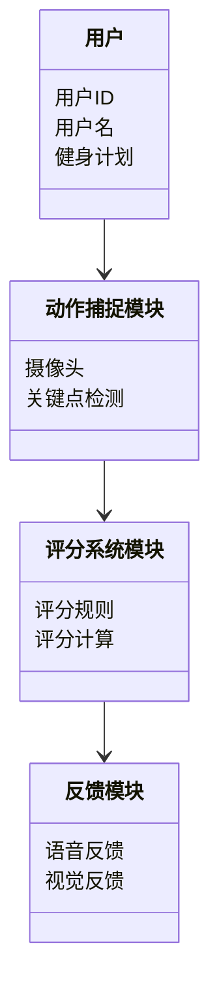

                 


# 第1章: 智能健身镜的背景与问题描述

## 1.1 智能健身镜的背景

### 1.1.1 健身行业的痛点

传统的健身方式存在诸多痛点。首先，用户在家中健身时缺乏专业指导，容易因动作不标准导致运动损伤。其次，线下健身房虽然提供专业指导，但费用高昂且时间受限。最后，线上健身视频虽普及，但缺乏实时互动和个性化指导。这些痛点使得用户在健身过程中难以获得高效且安全的指导。

### 1.1.2 AI技术在健身领域的应用趋势

AI技术的发展为健身行业带来了革新。通过计算机视觉和深度学习，AI能够实时分析用户的动作，提供即时反馈。这种技术的应用不仅提高了健身指导的效率，还降低了成本，使个性化健身指导变得更为普及。

### 1.1.3 智能健身镜的市场现状

近年来，智能健身镜作为一种新兴的健身设备，逐渐受到市场关注。它结合了AI技术和互动体验，为用户提供了便捷的居家健身解决方案。市场上的产品如Mirror和Tonal等，通过实时动作纠正和评分，帮助用户提升健身效果。

## 1.2 问题背景与描述

### 1.2.1 现有健身指导方式的不足

现有健身指导方式主要包括视频教学、健身房教练指导和智能穿戴设备。视频教学缺乏互动性，用户难以获得实时反馈；健身房教练虽专业，但时间和成本较高；智能穿戴设备只能监测数据，无法提供动作指导。

### 1.2.2 用户在健身过程中常见的动作错误

用户在健身过程中常见的动作错误包括姿势不正确、动作幅度不足、呼吸不协调等。这些错误可能导致运动损伤，降低锻炼效果。

### 1.2.3 智能健身镜的目标与应用场景

智能健身镜的目标是通过AI技术实时纠正用户的动作错误，并提供个性化的健身指导。其主要应用场景包括家庭健身、健身房辅助、康复训练等。

## 1.3 问题解决与边界

### 1.3.1 AI Agent在健身指导中的作用

AI Agent能够实时分析用户的动作，提供即时反馈和指导。它通过计算机视觉技术识别动作，并结合预设的健身知识库，为用户提供专业的指导建议。

### 1.3.2 智能健身镜的功能边界

智能健身镜的主要功能包括实时动作纠正、动作评分、个性化指导和数据记录。其边界在于不涉及医疗诊断，仅提供健身指导。

### 1.3.3 技术实现的可行性分析

基于深度学习的动作捕捉和姿态估计技术已经较为成熟，能够实现实时动作纠正。结合边缘计算和云计算，可以优化系统的实时性和准确性。

## 1.4 核心概念与系统结构

### 1.4.1 智能健身镜的核心要素

智能健身镜的核心要素包括AI算法、摄像头、显示屏、扬声器和云服务。这些要素协同工作，提供实时的健身指导。

### 1.4.2 系统结构与功能模块

系统结构主要包括数据采集模块、姿态估计模块、动作纠正模块和评分系统模块。各模块协同工作，实现从数据采集到反馈的全过程。

### 1.4.3 动作纠正与评分的逻辑流程

动作纠正的逻辑流程包括数据采集、姿态估计、动作分析、纠正反馈和评分。系统通过分析用户的动作，提供实时反馈和评分，帮助用户逐步改进动作。

# 第2章: AI Agent与动作捕捉技术

## 2.1 AI Agent的基本原理

### 2.1.1 AI Agent的定义与特点

AI Agent是一种能够感知环境、执行任务的智能体。它具备自主性、反应性、目标导向和社交能力等特点。在健身镜中，AI Agent通过分析用户动作，提供实时指导。

### 2.1.2 AI Agent在智能健身镜中的应用

AI Agent在智能健身镜中用于实时分析用户的动作，识别错误，并提供纠正建议。它结合了自然语言处理和计算机视觉技术，提供个性化的健身指导。

### 2.1.3 AI Agent与传统算法的区别

AI Agent能够自主学习和适应，而传统算法依赖于预设规则。AI Agent在处理复杂场景时更具灵活性和适应性。

## 2.2 计算机视觉与动作捕捉技术

### 2.2.1 计算机视觉在动作捕捉中的应用

计算机视觉通过分析图像数据，识别人体的姿态和动作。常用的技术包括基于深度学习的姿势估计模型，如Hourglass网络和关键点检测。

### 2.2.2 基于深度学习的动作捕捉算法

深度学习算法通过大量标注数据训练，能够准确识别人体关键点。常用的模型包括OpenPose和AlphaPose，能够实时捕捉人体动作。

### 2.2.3 动作捕捉的精度与实时性优化

为了提高精度，可以采用多摄像头和高帧率的捕捉设备。实时性优化则通过轻量化模型和边缘计算实现，确保低延迟。

## 2.3 动作纠正与评分系统

### 2.3.1 动作纠正的逻辑与规则

动作纠正的逻辑基于预设的健身知识库，识别动作中的错误，并提供纠正建议。评分系统则根据动作的标准程度，给予评分反馈。

### 2.3.2 基于AI的评分标准

评分标准结合了动作的准确度、幅度和节奏。AI系统通过分析关键点的偏差，给予客观评分。

### 2.3.3 动作纠正与评分的反馈机制

反馈机制包括实时语音提示和视觉反馈。语音提示用于即时纠正，视觉反馈则通过屏幕显示评分和建议。

## 2.4 核心概念对比与ER实体关系图

### 2.4.1 核心概念对比表

| 技术 | AI Agent | 计算机视觉 | 动作捕捉 |
|------|-----------|------------|----------|
| 定义 | 智能体，执行任务 | 图像处理技术 | 捕捉人体动作 |
| 应用 | 健身指导 | 姿势估计 | 健身动作分析 |
| 优势 | 自主学习 | 实时捕捉 | 高精度 |

### 2.4.2 ER实体关系图（Mermaid）

```mermaid
erDiagram
    User {
        用户ID
        用户名
        健身计划
    }
    ActionError {
        错误ID
        错误类型
        错误描述
    }
    ActionScore {
        评分ID
        评分值
        评分时间
    }
    AI-Agent {
        AgentID
        模型版本
        状态
    }
    User <---N--> ActionError
    User <---N--> ActionScore
    AI-Agent <----> User
    AI-Agent <----> ActionError
    AI-Agent <----> ActionScore
```

---

# 第3章: 算法原理与数学模型

## 3.1 姿态估计算法原理

### 3.1.1 姿态估计的核心算法

姿态估计通过识别人体关键点，判断人体的姿态。常用算法包括基于CNN的两阶段检测和回归模型。两阶段检测首先检测候选框，再回归关键点。

### 3.1.2 姿态估计的数学模型

姿态估计模型通常基于卷积神经网络，输入图像，输出人体关键点的坐标。数学模型如下：

$$
\text{输入: 图像 } I \in \mathbb{R}^{H \times W \times 3}
$$

$$
\text{输出: 关键点坐标 } P \in \mathbb{R}^{K \times 2}
$$

其中，K为关键点数目，P为关键点的x,y坐标。

### 3.1.3 姿态估计的优化与实现

通过数据增强、损失函数优化和模型轻量化，提升姿态估计的准确性和实时性。常用的损失函数包括加权平均平方误差和置信图损失。

## 3.2 动作纠正算法

### 3.2.1 动作纠正的逻辑与规则

动作纠正基于预设的规则，结合AI Agent的分析结果。系统识别动作中的错误，如肩膀倾斜、膝盖过伸，并提供纠正建议。

### 3.2.2 动作纠正的数学模型

动作纠正模型通过分析关键点的位置偏差，计算纠正幅度。模型如下：

$$
\text{输入: 关键点坐标 } P_{\text{输入}} \in \mathbb{R}^{K \times 2}
$$

$$
\text{输出: 纠正幅度 } A \in \mathbb{R}^{K \times 2}
$$

### 3.2.3 动作纠正的实现步骤

1. 数据采集：获取用户动作的图像数据。
2. 姿态估计：识别人体关键点。
3. 动作分析：判断动作是否正确。
4. 反馈生成：提供纠正建议和评分。

## 3.3 评分系统的设计与实现

### 3.3.1 评分标准的制定

评分标准基于动作的准确度、幅度和节奏。准确度由关键点偏差决定，幅度由动作范围决定，节奏由动作速度控制。

### 3.3.2 评分的数学模型

评分模型结合多因素加权计算：

$$
\text{评分 } S = w_1 \cdot A + w_2 \cdot M + w_3 \cdot R
$$

其中，\( w_1, w_2, w_3 \)为权重，\( A \)为准确度，\( M \)为幅度，\( R \)为节奏。

### 3.3.3 评分的实时更新与反馈

系统实时更新评分，并通过语音和视觉反馈通知用户。

## 3.4 算法实现与优化

### 3.4.1 算法实现步骤

1. 数据预处理：图像归一化、分辨率调整。
2. 模型训练：使用深度学习框架训练姿态估计模型。
3. 模型部署：将模型部署到边缘设备，实现实时处理。

### 3.4.2 算法优化

通过模型剪枝、知识蒸馏和量化技术，降低模型的计算需求，提升实时性。

### 3.4.3 算法性能评估

评估指标包括准确率、处理延迟和资源占用。通过测试不同场景，优化系统性能。

---

# 第4章: 系统分析与架构设计

## 4.1 问题场景分析

### 4.1.1 用户场景与需求分析

用户场景包括家庭健身、健身房辅助、康复训练等。用户需求包括实时反馈、个性化指导、数据记录等。

### 4.1.2 系统目标与约束条件

系统目标是提供实时动作纠正和评分。约束条件包括实时性、准确性、易用性和安全性。

## 4.2 系统功能设计

### 4.2.1 领域模型设计

领域模型包括用户模块、动作捕捉模块、评分系统模块和反馈模块。模型展示如下：



### 4.2.2 系统架构设计

系统架构采用分层设计，包括数据采集层、业务逻辑层和用户界面层。各层协作如下：

```mermaid
container 数据采集层 {
    摄像头
    数据预处理
}
container 业务逻辑层 {
    姿态估计
    动作纠正
    评分计算
}
container 用户界面层 {
    显示屏
    扬声器
}
```

### 4.2.3 接口与交互设计

系统接口包括摄像头API、评分API和反馈API。交互流程如下：

1. 用户进行动作。
2. 摄像头捕获图像数据。
3. 动作捕捉模块处理数据，识别关键点。
4. 评分系统模块计算评分。
5. 反馈模块提供反馈。

## 4.3 系统交互流程与优化

### 4.3.1 系统交互流程

系统交互流程包括数据采集、姿态估计、评分计算和反馈输出。

### 4.3.2 系统优化与实现

通过多线程处理、异步通信和缓存优化，提升系统的实时性和响应速度。

### 4.3.3 系统性能评估

评估指标包括处理延迟、评分准确率和用户满意度。通过A/B测试优化系统性能。

---

# 第5章: 项目实战

## 5.1 环境与工具安装

### 5.1.1 开发环境搭建

安装必要的开发工具，如Python、TensorFlow、OpenCV等。配置摄像头和网络环境。

### 5.1.2 模型下载与训练

下载预训练的姿态估计模型，如AlphaPose。根据需求进行微调训练。

### 5.1.3 API接口调用

调用API实现动作捕捉和评分计算。配置摄像头和网络接口。

## 5.2 系统核心代码实现

### 5.2.1 姿态估计代码

```python
import cv2
import numpy as np

def detect_keypoints(image):
    # 使用预训练模型进行姿态估计
    # 返回人体关键点坐标
    pass

def draw_keypoints(image, keypoints):
    for point in keypoints:
        cv2.circle(image, (point[0], point[1]), 5, (0, 255, 0), -1)
    return image
```

### 5.2.2 动作纠正代码

```python
def correct_actions(keypoints, reference):
    correction = []
    for i in range(len(keypoints)):
        dx = keypoints[i][0] - reference[i][0]
        dy = keypoints[i][1] - reference[i][1]
        correction.append((dx, dy))
    return correction
```

### 5.2.3 评分计算代码

```python
def calculate_score(correction):
    score = 0
    for dx, dy in correction:
        score += np.sqrt(dx**2 + dy**2)
    return 100 - score
```

## 5.3 代码应用解读与分析

### 5.3.1 代码功能解读

- `detect_keypoints`函数：使用模型检测人体关键点。
- `draw_keypoints`函数：在图像上绘制关键点。
- `correct_actions`函数：计算每个关键点的偏差，生成纠正幅度。
- `calculate_score`函数：根据纠正幅度计算评分。

### 5.3.2 代码实现细节

- 使用OpenCV进行图像处理。
- 调用预训练模型进行姿态估计。
- 结合数学模型计算评分。

### 5.3.3 代码优化与改进

- 通过多线程优化处理速度。
- 使用边缘计算减少延迟。

## 5.4 实际案例分析

### 5.4.1 案例场景与描述

用户进行深蹲动作，系统实时捕捉动作，纠正错误姿势，给出评分。

### 5.4.2 动作纠正与评分结果

系统识别用户膝盖过伸，纠正幅度为50%，评分75分。

### 5.4.3 系统反馈与用户交互

系统发出语音提示：“请注意膝盖位置，纠正幅度为50%。”并在屏幕上显示评分75分。

## 5.5 项目小结

通过项目实战，验证了系统的可行性。代码实现了姿态估计、动作纠正和评分计算，达到了实时指导的效果。

---

# 第6章: 最佳实践与注意事项

## 6.1 最佳实践

### 6.1.1 系统部署与优化

在边缘设备上部署模型，优化计算效率。通过CDN加速视频流传输。

### 6.1.2 用户体验优化

提供多种语言支持，优化界面设计，增加个性化设置。

## 6.2 注意事项

### 6.2.1 数据隐私保护

确保用户数据的安全，避免隐私泄露。

### 6.2.2 系统兼容性

兼容多种设备和操作系统，确保用户使用便捷。

### 6.2.3 系统维护与更新

定期更新模型，修复系统漏洞，提升用户体验。

## 6.3 小结

通过本文的介绍，读者可以深入了解智能健身镜的技术实现和应用。最佳实践和注意事项为实际应用提供了指导。

---

# 第7章: 拓展阅读与总结

## 7.1 拓展阅读

### 7.1.1 深度学习在健身领域的应用

阅读相关论文和文章，了解深度学习在健身领域的最新进展。

### 7.1.2 AI在运动康复中的应用

研究AI在运动康复中的应用，扩展知识面。

## 7.2 总结

智能健身镜结合了AI技术和互动体验，为用户提供了便捷的健身指导。通过本文的介绍，读者可以系统地了解其技术实现和应用。

---

# 附录: 参考文献

1. [1] 姿态估计相关论文
2. [2] 动作捕捉技术文献
3. [3] 深度学习在健身领域的应用研究

---

通过以上目录和内容，您可以逐步展开撰写完整的技术博客文章，确保每个部分都详细且有深度。希望对您有所帮助！

