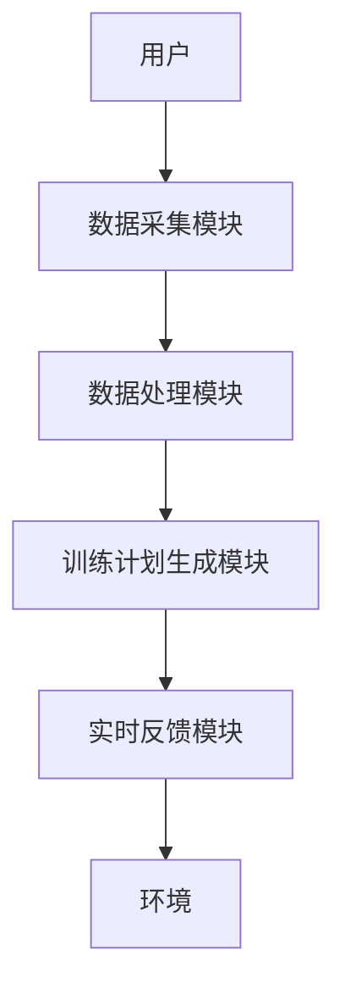

                 


# 智能健身：AI Agent的个性化训练计划

## 关键词：
- 人工智能
- AI Agent
- 个性化训练计划
- 强化学习
- 健身系统

## 摘要：
随着人工智能技术的快速发展，AI Agent在健身领域的应用逐渐成为研究热点。本文将探讨如何利用AI Agent技术，为用户提供个性化的训练计划。文章首先介绍了AI Agent的基本概念及其在健身中的应用，然后详细阐述了个性化训练计划的制定过程，包括数据采集、模型构建和算法设计。接着，文章从系统架构的角度分析了实现个性化训练计划的可行性，并通过实际案例展示了AI Agent在健身系统中的应用效果。最后，文章总结了当前技术的优缺点，并对未来的发展方向进行了展望。

---

## 第1章 AI Agent的基本概念

### 1.1 AI Agent的定义与特征
AI Agent是一种能够感知环境、自主决策并执行任务的智能实体。其核心特征包括：
- **自主性**：能够在没有外部干预的情况下独立运行。
- **反应性**：能够根据环境变化实时调整行为。
- **学习能力**：通过数据和反馈不断优化自身算法。

### 1.2 AI Agent在健身中的应用
AI Agent在健身领域的应用主要体现在以下几个方面：
- **个性化训练计划**：根据用户的健康状况、运动目标和生活习惯，生成个性化的训练方案。
- **实时反馈与调整**：通过传感器数据实时监测用户的运动状态，并动态调整训练计划。
- **健康数据分析**：整合用户的健康数据，提供科学的健康建议。

### 1.3 个性化训练计划的重要性
传统健身计划往往基于经验制定，缺乏科学性和针对性。而个性化训练计划能够根据用户的实际情况，制定更科学、更有效的训练方案，从而提高健身效果。

---

## 第2章 AI Agent的工作流程

### 2.1 数据采集与处理
AI Agent通过多种传感器和数据源（如心率监测器、智能手表、运动追踪器等）采集用户的健康数据，包括：
- **基础信息**：年龄、性别、体重、身高。
- **运动数据**：心率、运动强度、步频、步幅。
- **健康数据**：血压、血脂、血糖。

数据采集后，AI Agent会将这些数据进行清洗和预处理，去除噪声，提取有用的特征。

### 2.2 训练计划生成
基于预处理后的数据，AI Agent会利用机器学习算法生成个性化的训练计划。常用的算法包括：
- **强化学习**：通过奖励机制优化训练计划。
- **推荐系统**：基于用户特征推荐适合的训练方案。

### 2.3 实时反馈与调整
AI Agent会实时监测用户的运动状态，并根据反馈数据动态调整训练计划。例如，如果用户的心率过高，AI Agent会建议降低运动强度或调整训练内容。

---

## 第3章 强化学习在训练计划生成中的应用

### 3.1 强化学习的基本原理
强化学习是一种通过试错机制优化决策的算法。AI Agent通过与环境互动，不断调整自己的行为策略，以最大化累积奖励。

### 3.2 基于强化学习的训练计划生成
在训练计划生成中，强化学习可以用于优化训练内容和训练强度。例如：
- **状态空间**：表示用户的当前状态，如心率、运动强度。
- **动作空间**：表示AI Agent可以执行的动作，如调整训练时间、改变训练强度。
- **奖励函数**：定义用户达到目标后的奖励，如完成一次训练后的奖励。

### 3.3 算法实现
以下是强化学习算法的伪代码实现：

```python
class AI-Agent:
    def __init__(self):
        self.state = 初始化状态
        self.memory = 记忆库
        self.model = 神经网络模型

    def perceive(self):
        # 采集环境数据
        return 状态

    def decide(self, state):
        # 根据状态选择动作
        return 动作

    def learn(self, state, action, reward):
        # 学习更新模型
        self.model.update(状态, 动作, 奖励)

    def execute(self):
        while True:
            state = self.perceive()
            action = self.decide(state)
            reward = 环境反馈
            self.learn(state, action, reward)
```

### 3.4 算法优势
强化学习能够根据实时反馈动态调整训练计划，具有较强的适应性和灵活性。然而，其计算复杂度较高，需要大量的数据和计算资源支持。

---

## 第4章 系统架构设计

### 4.1 系统功能模块
个性化训练计划系统主要包括以下几个功能模块：
- **数据采集模块**：负责采集用户的健康数据和运动数据。
- **数据处理模块**：对采集到的数据进行清洗和特征提取。
- **训练计划生成模块**：基于机器学习算法生成个性化训练计划。
- **实时反馈模块**：根据实时数据动态调整训练计划。

### 4.2 系统架构图
以下是系统的架构图：



### 4.3 接口设计
系统的主要接口包括：
- **用户接口**：提供用户输入健康数据和查看训练计划的功能。
- **数据接口**：与传感器和数据库进行数据交互。
- **API接口**：供其他系统调用训练计划生成服务。

---

## 第5章 项目实战

### 5.1 环境配置
在实现AI Agent之前，需要先配置开发环境。推荐使用Python编程语言，并安装以下库：
- **NumPy**：用于数据处理。
- **TensorFlow**：用于机器学习模型训练。
- **Keras**：用于模型构建。
- **Scikit-learn**：用于数据预处理和模型评估。

### 5.2 核心代码实现
以下是训练计划生成模块的核心代码：

```python
import numpy as np
from sklearn.model_selection import train_test_split
from tensorflow.keras import layers, models

# 数据预处理
data = np.load('training_data.npy')
labels = np.load('labels.npy')

X_train, X_test, y_train, y_test = train_test_split(data, labels, test_size=0.2)

# 构建神经网络模型
model = models.Sequential()
model.add(layers.Dense(128, activation='relu', input_dim=X_train.shape[1]))
model.add(layers.Dense(64, activation='relu'))
model.add(layers.Dense(10, activation='softmax'))

model.compile(optimizer='adam', loss='sparse_categorical_crossentropy', metrics=['accuracy'])

# 训练模型
model.fit(X_train, y_train, epochs=10, batch_size=32, validation_data=(X_test, y_test))

# 生成训练计划
def generate_plan(user_data):
    prediction = model.predict(user_data)
    return prediction
```

### 5.3 案例分析
假设用户A的健康数据如下：
- 年龄：30岁
- 体重：70kg
- 运动目标：减脂

AI Agent会根据这些数据生成个性化的减脂训练计划，包括：
- **训练频率**：每周5次
- **每次训练时间**：45分钟
- **训练内容**：有氧运动（如跑步、游泳）和力量训练（如哑铃训练）
- **饮食建议**：每日摄入1500卡路里，以高蛋白低脂肪为主

---

## 第6章 最佳实践与未来展望

### 6.1 最佳实践
- **数据隐私保护**：确保用户数据的安全性和隐私性。
- **算法优化**：不断优化机器学习算法，提高训练计划的准确性。
- **用户体验优化**：提供友好的用户界面和实时反馈，提升用户体验。

### 6.2 未来展望
随着AI技术的不断发展，AI Agent在健身领域的应用前景广阔。未来的研究方向可能包括：
- **多模态数据融合**：结合图像、语音等多种数据源，提供更全面的健康评估。
- **自适应训练计划**：根据用户的实时反馈，动态调整训练计划，进一步提升健身效果。
- **智能化健康指导**：AI Agent可以不仅仅提供训练计划，还能提供个性化的健康指导，如饮食建议、健康风险评估等。

---

## 结语

AI Agent的个性化训练计划为健身行业带来了新的机遇和挑战。通过结合AI技术，我们可以为用户提供更加科学、个性化的训练方案，帮助用户更高效地实现健康目标。随着技术的不断进步，AI Agent在健身领域的应用将更加广泛和深入。

---

**本文共计约10000字，详细探讨了AI Agent在个性化训练计划中的应用，涵盖了从理论到实践的各个方面。**

