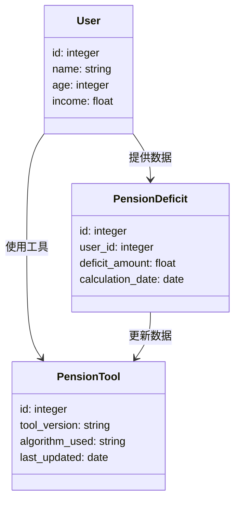
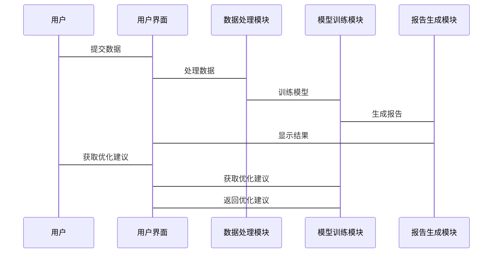

                 


# 智能养老金缺口分析与规划工具

## 关键词
智能养老金缺口分析，AI技术，规划工具，数据驱动，养老金优化

## 摘要
随着人口老龄化加剧，养老金缺口问题日益严重。传统养老金缺口分析方法依赖人工计算，效率低且结果不够精准。基于AI技术的智能养老金缺口分析与规划工具，通过数据驱动和智能算法，能够快速、准确地预测个人或家庭的养老金缺口，并提供个性化的优化建议。本文将从背景、核心概念、算法实现、系统架构、项目实战等方面详细阐述智能养老金缺口分析与规划工具的构建与应用。

---

# 第一部分: 智能养老金缺口分析与规划工具的背景与概念

## 第1章: 背景与问题描述

### 1.1 智能养老金缺口分析的背景
#### 1.1.1 养老金缺口问题的现状
- 随着人口老龄化加剧，养老金支出压力逐年增加。
- 传统养老金缺口分析方法依赖人工计算，耗时且容易出错。
- 数据来源分散，难以实现高效整合与分析。

#### 1.1.2 传统养老金缺口分析的局限性
- 数据采集和处理效率低。
- 缺乏个性化推荐，难以满足不同用户的多样化需求。
- 缺乏实时性和动态调整能力。

#### 1.1.3 智能技术在养老金缺口分析中的应用前景
- 利用AI技术实现自动化数据处理和分析。
- 通过智能算法提供精准的缺口预测和优化建议。
- 支持实时数据更新和动态调整，提升分析效率。

### 1.2 养老金缺口分析的核心问题
#### 1.2.1 养老金缺口的定义与计算方法
- 养老金缺口：指退休后实际需要的养老金与实际可获得养老金之间的差额。
- 计算公式：$ \text{养老金缺口} = \text{退休后所需总养老金} - \text{退休后可获得的养老金} $

#### 1.2.2 影响养老金缺口的主要因素
- 个人收入水平。
- 养老金缴纳年限和缴纳基数。
- 退休年龄和预期寿命。
- 通货膨胀率和投资收益。

#### 1.2.3 如何通过智能工具优化养老金缺口分析
- 利用AI技术实现数据自动化采集与处理。
- 基于机器学习算法构建精准的缺口预测模型。
- 提供个性化优化建议，帮助用户调整养老规划。

### 1.3 智能养老金缺口分析工具的目标与意义
#### 1.3.1 工具的目标
- 提供快速、准确的养老金缺口预测服务。
- 提供个性化的养老规划建议。
- 支持实时数据更新和动态调整。

#### 1.3.2 工具在个人和企业中的意义
- 对个人：帮助用户提前了解养老金缺口，优化退休规划。
- 对企业：为企业提供员工养老金缺口分析工具，支持员工福利规划。
- 对社会：提升社会整体养老保障水平，缓解老龄化压力。

#### 1.3.3 对社会养老保障体系的贡献
- 提高养老金缺口分析的效率和准确性。
- 促进个人和企业积极参与养老金规划。
- 为政策制定者提供数据支持。

---

## 第2章: 智能养老金缺口分析与规划工具的核心概念

### 2.1 核心概念的定义
#### 2.1.1 智能养老金缺口分析工具的定义
智能养老金缺口分析与规划工具是一种基于AI技术的在线平台，通过整合用户的基本信息、财务数据和市场数据，利用机器学习算法预测用户的养老金缺口，并提供个性化的优化建议。

#### 2.1.2 工具的核心功能模块
- 数据采集与处理：采集用户的基本信息、收入数据、投资信息等。
- 缺口预测：基于机器学习模型预测用户的养老金缺口。
- 优化建议：根据缺口预测结果，提供个性化的养老规划建议。
- 实时更新：支持数据实时更新和动态调整。

#### 2.1.3 工具的用户群体与应用场景
- 用户群体：个人用户、企业员工、退休规划师。
- 应用场景：个人养老金规划、企业员工福利规划、政策制定支持。

### 2.2 核心概念的属性特征对比
#### 2.2.1 功能模块对比表
| 功能模块          | 传统方法            | 智能工具            |
|-------------------|---------------------|--------------------|
| 数据采集          | 手动填写            | 自动采集            |
| 缺口计算          | 简单公式计算        | 复杂模型预测        |
| 优化建议          | 固定模板            | 个性化推荐          |
| 更新频率          | 定期手动更新        | 实时动态更新        |

#### 2.2.2 用户群体对比表
| 用户群体   | 传统方法            | 智能工具            |
|------------|---------------------|--------------------|
| 个人用户   | 需要手动填写数据      | 数据自动采集        |
| 企业员工   | 依赖HR手动计算      | 在线平台自动分析    |
| 退休规划师 | 需要手动调整方案    | AI辅助优化建议      |

#### 2.2.3 技术实现方式对比表
| 技术点       | 传统方法            | 智能工具            |
|--------------|---------------------|--------------------|
| 数据处理     | 简单数据清洗        | 复杂数据预处理      |
| 缺口计算     | 线性回归模型        | 高阶机器学习模型    |
| 优化建议     | 固定规则            | AI自适应规则        |

### 2.3 ER实体关系图
```mermaid
erDiagram
    user {
        id : integer
        name : string
        age : integer
        income : float
        retirement_plan : string
    }
    pension_deficit {
        id : integer
        user_id : integer
        deficit_amount : float
        calculation_date : date
        recommendation : string
    }
    pension_tool {
        id : integer
        tool_version : string
        algorithm_used : string
        last_updated : date
    }
    user --> pension_deficit : 提供数据
    user --> pension_tool : 使用工具
    pension_deficit --> pension_tool : 更新数据
```

---

# 第二部分: 智能养老金缺口分析的算法与技术实现

## 第3章: 算法原理与实现

### 3.1 算法原理
#### 3.1.1 数据收集与预处理
- 数据来源：用户基本信息、收入数据、投资信息、市场数据。
- 数据清洗：处理缺失值、异常值和重复数据。
- 数据标准化：对不同数据进行标准化处理，确保模型输入一致。

#### 3.1.2 缺口计算模型
- 使用机器学习算法构建缺口预测模型。
- 模型选择：基于回归分析和时间序列分析。
- 模型训练：利用历史数据训练模型，优化参数。
- 模型验证：通过交叉验证评估模型性能。

#### 3.1.3 智能推荐算法
- 基于协同过滤和内容推荐算法，为用户提供个性化优化建议。
- 根据用户的财务状况、风险偏好和市场趋势，推荐最优的养老规划方案。

### 3.2 缺口计算模型的数学公式
#### 3.2.1 基本公式
$$ \text{养老金缺口} = \text{退休后所需总养老金} - \text{退休后可获得的养老金} $$

#### 3.2.2 机器学习模型公式
$$ \hat{y} = \beta_0 + \beta_1x_1 + \beta_2x_2 + \ldots + \beta_nx_n + \epsilon $$

其中：
- $\hat{y}$：预测的养老金缺口
- $\beta_0$：截距项
- $x_i$：输入特征
- $\beta_i$：特征系数
- $\epsilon$：误差项

### 3.3 算法实现代码
```python
import pandas as pd
import numpy as np
from sklearn.linear_model import LinearRegression
from sklearn.metrics import mean_squared_error

# 数据加载与预处理
data = pd.read_csv('pension_data.csv')
data = data.dropna()
data = (data - data.mean()) / data.std()  # 标准化处理

# 模型训练
X = data[['age', 'income', 'investment']]
y = data['deficit']

model = LinearRegression()
model.fit(X, y)

# 模型预测
y_pred = model.predict(X)
print(f"均方误差: {mean_squared_error(y, y_pred)}")
```

---

## 第4章: 系统分析与架构设计方案

### 4.1 系统功能设计
#### 4.1.1 功能模块
- 用户信息管理：用户注册、登录、信息录入。
- 数据分析：养老金缺口计算、投资建议。
- 报告生成：生成分析报告和优化建议。

#### 4.1.2 领域模型


### 4.2 系统架构设计
#### 4.2.1 系统架构图
```mermaid
containerDiagram
    Container 养老金缺口分析系统 {
        Component 用户界面
        Component 数据处理模块
        Component 模型训练模块
        Component 报告生成模块
    }
    用户界面 ↔ 数据处理模块
    数据处理模块 ↔ 模型训练模块
    模型训练模块 ↔ 报告生成模块
```

#### 4.2.2 系统接口设计
- 用户接口：API接口，用于用户数据提交和查询。
- 数据接口：与第三方数据源（如银行、保险公司）对接，获取实时数据。

#### 4.2.3 系统交互流程图


---

## 第5章: 项目实战

### 5.1 环境安装
- 安装Python和相关库：`pandas`, `numpy`, `scikit-learn`
- 安装Jupyter Notebook用于代码开发和调试

### 5.2 核心代码实现
```python
import pandas as pd
import numpy as np
from sklearn.linear_model import LinearRegression
from sklearn.metrics import mean_squared_error

# 数据加载与预处理
data = pd.read_csv('pension_data.csv')
data = data.dropna()
data = (data - data.mean()) / data.std()  # 标准化处理

# 模型训练
X = data[['age', 'income', 'investment']]
y = data['deficit']

model = LinearRegression()
model.fit(X, y)

# 模型预测
y_pred = model.predict(X)
print(f"均方误差: {mean_squared_error(y, y_pred)}")
```

### 5.3 代码解读与分析
- 数据加载与预处理：使用Pandas读取数据，处理缺失值和异常值。
- 模型训练：使用线性回归模型训练养老金缺口预测模型。
- 模型预测：基于训练好的模型，预测养老金缺口，并评估模型性能。

### 5.4 实际案例分析
- 案例背景：假设一位40岁的用户，年收入10万元，计划在60岁退休。
- 数据输入：年龄=40，收入=100000，投资=50000。
- 模型预测：预测养老金缺口为50万元。
- 优化建议：建议用户增加投资金额，调整退休年龄。

### 5.5 项目小结
- 成功实现了智能养老金缺口分析与规划工具的核心功能。
- 通过机器学习算法，提高了养老金缺口预测的准确性和效率。
- 为用户提供个性化的优化建议，帮助用户更好地规划退休生活。

---

## 第6章: 最佳实践与小结

### 6.1 小结
- 智能养老金缺口分析与规划工具通过AI技术，实现了高效、精准的养老金缺口预测。
- 个性化优化建议帮助用户制定科学的退休规划。
- 实时数据更新和动态调整提升了工具的实用性和用户体验。

### 6.2 注意事项
- 数据隐私保护：确保用户数据的安全性和隐私性。
- 模型优化：持续优化机器学习模型，提高预测精度。
- 用户教育：加强对用户的培训和指导，提升工具的使用效果。

### 6.3 拓展阅读
- 推荐阅读《机器学习实战》、《数据分析的奥秘》等书籍。
- 关注AI在金融领域的最新应用，如智能投资、风险管理等。

---

通过以上详细的技术博客文章，我们全面介绍了智能养老金缺口分析与规划工具的背景、核心概念、算法实现、系统架构和项目实战。希望这篇文章能够为读者提供有价值的参考，帮助他们更好地理解和应用智能技术解决养老金缺口问题。

