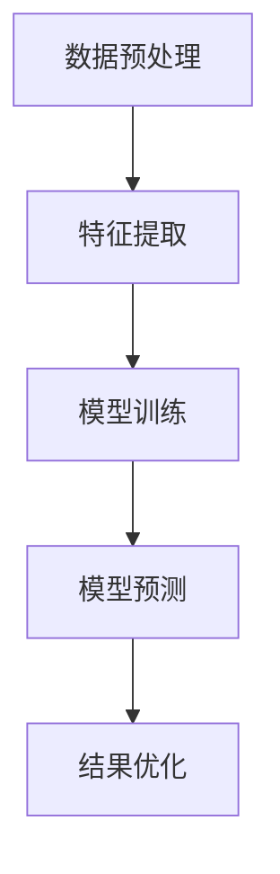
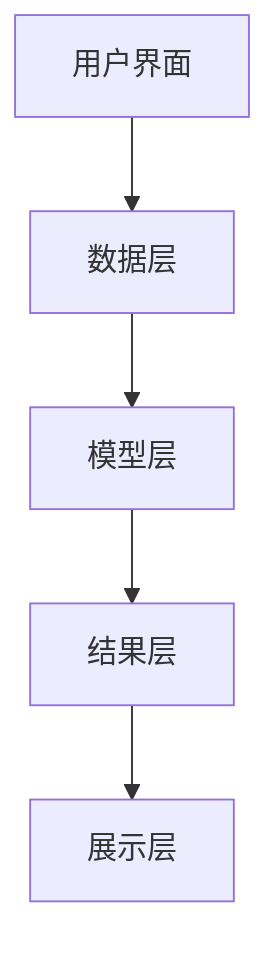
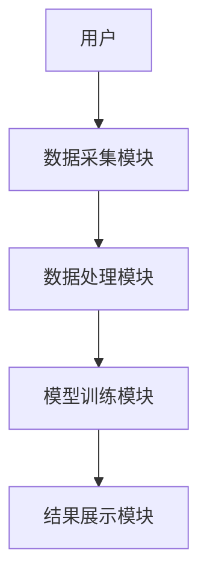

                 


# 《智能养老金缺口动态预测与规划系统》

## 关键词：智能养老金预测、动态缺口预测、机器学习、系统架构、养老金规划

## 摘要：本文介绍了一种基于大数据和机器学习的智能养老金缺口动态预测与规划系统。通过分析养老金缺口的背景、问题及传统方法的不足，提出了一种结合机器学习算法和系统架构的解决方案。文章详细探讨了系统的架构设计、核心算法原理及实现，并通过实际案例展示了系统的应用效果。最后，本文总结了系统的优缺点，并展望了未来的发展方向。

---

# 第1章: 养老金缺口问题的背景与挑战

## 1.1 养老金缺口的定义与问题背景

### 1.1.1 养老金缺口的定义
养老金缺口是指在退休时，个人或家庭的养老金收入不足以覆盖基本生活支出的情况。随着人口老龄化加剧，养老金缺口问题日益严重，尤其是在经济波动和政策调整的背景下。

### 1.1.2 养老金缺口问题的现状与挑战
- **现状**：许多国家面临养老金支付压力增大，缺口问题突出。
- **挑战**：传统预测方法依赖静态数据，难以应对动态变化。

### 1.1.3 养老金缺口预测的重要性
准确预测养老金缺口有助于制定合理的养老政策和投资计划，确保退休生活的质量。

---

## 1.2 智能养老金缺口预测的核心概念

### 1.2.1 智能养老金缺口预测的定义
智能养老金缺口预测是一种基于大数据和机器学习技术，动态分析和预测养老金缺口的方法。

### 1.2.2 智能养老金缺口预测的边界与外延
- **边界**：仅考虑养老金收入与基本生活支出的差距。
- **外延**：结合经济指标、人口统计数据等多维度因素。

### 1.2.3 核心要素与概念结构
| 核心要素 | 描述 |
|----------|------|
| 数据源   | 养老金收入、生活支出、经济指标 |
| 算法     | 机器学习模型（如线性回归、随机森林） |
| 预测结果 | 缺口预测值、规划建议 |

---

# 第2章: 智能养老金缺口预测的算法原理

## 2.1 常见算法的原理与流程

### 2.1.1 线性回归模型
线性回归是一种简单但有效的回归算法，适用于线性关系明显的数据。

#### 线性回归公式
$$ y = \beta_0 + \beta_1x + \epsilon $$

### 2.1.2 支持向量机（SVM）
SVM适用于小样本数据，通过构建超平面实现分类或回归。

### 2.1.3 随机森林与梯度提升树
随机森林通过集成学习提高预测准确性，梯度提升树通过逐步优化模型。

---

## 2.2 算法流程图



---

# 第3章: 系统分析与架构设计方案

## 3.1 系统功能设计

### 3.1.1 数据采集模块
负责收集养老金相关数据，包括收入、支出等。

### 3.1.2 数据处理模块
对数据进行清洗、归一化处理，确保模型输入的准确性。

### 3.1.3 模型训练模块
选择合适的算法，训练模型并优化参数。

### 3.1.4 结果展示模块
将预测结果以可视化形式呈现，供用户参考。

---

## 3.2 系统架构设计



---

## 3.3 系统接口设计



---

# 第4章: 项目实战

## 4.1 环境安装

```bash
pip install numpy pandas scikit-learn
```

## 4.2 核心代码实现

```python
import numpy as np
from sklearn.linear_model import LinearRegression
from sklearn.ensemble import RandomForestRegressor

# 示例数据
X = np.array([[1, 2], [3, 4], [5, 6]])
y = np.array([7, 8, 9])

# 线性回归模型
lr_model = LinearRegression()
lr_model.fit(X, y)

# 随机森林模型
rf_model = RandomForestRegressor(n_estimators=100)
rf_model.fit(X, y)
```

---

## 4.3 代码解读与分析
- **线性回归模型**：适用于简单线性关系，但可能无法捕捉复杂特征。
- **随机森林模型**：通过集成学习提高预测准确性，适合处理多维数据。

---

## 4.4 实际案例分析
通过实际数据训练模型，并对比不同算法的预测效果，选择最优模型进行部署。

---

## 4.5 项目小结
智能养老金缺口预测系统通过结合大数据和机器学习技术，能够动态、准确地预测养老金缺口，为政策制定和投资决策提供有力支持。

---

# 第5章: 最佳实践与总结

## 5.1 小结
本文详细介绍了智能养老金缺口预测系统的背景、算法原理和系统架构，并通过实际案例展示了系统的应用效果。

## 5.2 注意事项
- 数据质量对预测结果影响重大，需确保数据的准确性和完整性。
- 模型的选择需根据具体场景和数据特点进行调整。

## 5.3 拓展阅读
建议进一步研究深度学习模型在养老金预测中的应用，探索更多优化策略。

---

通过以上结构和内容，本文为读者提供了一个全面的智能养老金缺口预测系统的解决方案，结合理论与实践，帮助读者更好地理解和应用这一技术。

