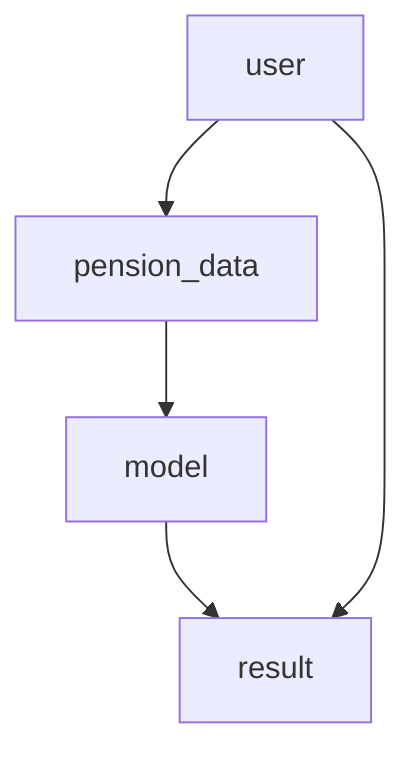
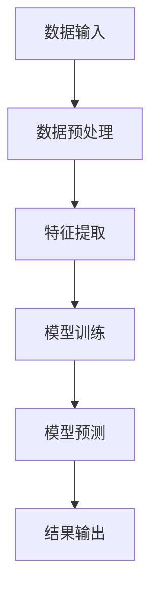
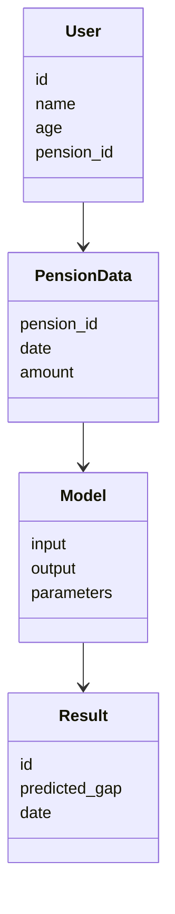
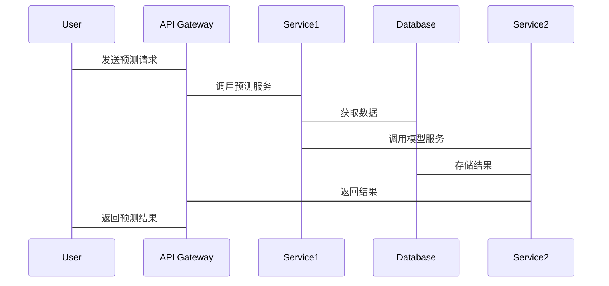
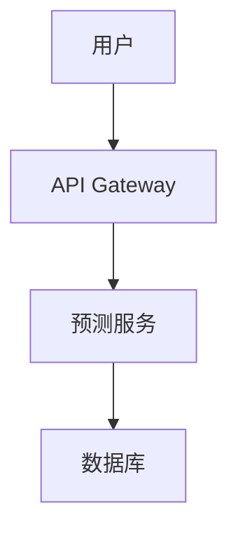

                 


# 智能养老金缺口预测与规划系统

**关键词：**智能养老金，缺口预测，机器学习，系统设计，规划模型，数据处理，算法优化

**摘要：**  
随着人口老龄化加剧，养老金缺口问题日益严峻。本文章介绍了一种基于智能技术的养老金缺口预测与规划系统，通过机器学习和深度学习算法，构建高效、准确的预测模型，结合系统架构设计与实际案例分析，详细阐述了系统的实现过程和优化策略，为养老金缺口预测与规划提供了创新性的解决方案。

---

# 第1章: 智能养老金缺口预测与规划系统背景介绍

## 1.1 问题背景与描述

### 1.1.1 养老金缺口问题的提出
随着全球人口老龄化的加剧，养老金支付压力越来越大，养老金缺口问题成为各国面临的重要挑战。传统养老金体系的预测方法存在准确性低、实时性差等问题，难以应对复杂多变的社会经济环境。

### 1.1.2 当前养老金体系的挑战
- 养老金支付压力不断增加
- 数据量庞大且复杂
- 预测模型的准确性和实时性不足
- 个性化需求难以满足

### 1.1.3 智能技术在养老金规划中的应用前景
- 基于机器学习和深度学习的预测模型能够提高预测准确性
- 大数据分析技术能够处理海量数据，提供实时预测结果
- 智能系统可以实现个性化养老金规划方案

## 1.2 问题解决与边界定义

### 1.2.1 系统目标与核心问题
- 系统目标：构建一个智能养老金缺口预测与规划系统，实现准确的缺口预测和个性化的规划方案。
- 核心问题：如何利用智能技术提高养老金预测的准确性和实时性。

### 1.2.2 系统边界与外延
- 系统边界：系统仅关注养老金缺口预测与规划，不涉及具体养老金支付和管理。
- 系统外延：结合社会经济数据、人口统计数据、金融市场数据等多源数据进行预测。

### 1.2.3 核心要素与组成结构
- 数据输入：历史养老金数据、人口统计数据、经济指标
- 数据处理：数据清洗、特征提取、数据建模
- 预测模型：机器学习模型、深度学习模型
- 规划方案：个性化养老金规划、风险评估

## 1.3 本章小结
本章介绍了智能养老金缺口预测与规划系统的背景、挑战和应用前景，明确了系统的目标和边界，并概述了系统的组成结构。

---

# 第2章: 核心概念与原理分析

## 2.1 智能养老金预测的原理

### 2.1.1 数据特征与处理方法
- 数据特征：时间序列特征、人口特征、经济指标特征
- 数据处理方法：数据清洗、特征提取、数据增强

### 2.1.2 预测模型的构建与优化
- 模型选择：机器学习模型（随机森林、支持向量机）和深度学习模型（LSTM、CNN）
- 模型优化：超参数调优、特征选择、模型融合

### 2.1.3 系统输出与结果解释
- 预测结果：养老金缺口预测值
- 结果解释：预测误差分析、模型解释性分析

## 2.2 核心概念对比分析

### 2.2.1 数据特征对比表格

| 数据特征 | 描述 | 示例 |
|----------|------|------|
| 时间序列 | 数据按时间顺序排列 | 养老金历史数据 |
| 人口特征 | 包括年龄、性别等人口统计数据 | 人口统计数据 |
| 经济指标 | 包括GDP、通货膨胀率等经济数据 | 经济指标数据 |

### 2.2.2 系统功能对比分析

| 功能模块 | 对比项 | 描述 |
|----------|--------|------|
| 数据输入 | 数据来源 | 历史数据、实时数据 |
| 数据处理 | 处理方法 | 数据清洗、特征提取 |
| 预测模型 | 模型类型 | 机器学习、深度学习 |
| 结果输出 | 输出形式 | 数值结果、可视化图表 |

### 2.2.3 算法性能对比分析

| 算法 | 准确率 | 计算时间 | 适用场景 |
|------|-------|----------|----------|
| LSTM  | 85%    | 长       | 时间序列预测 |
| 随机森林 | 80%    | 短       | 特征维度高 |

## 2.3 系统架构的ER实体关系图



---

# 第3章: 算法原理与实现

## 3.1 算法原理概述

### 3.1.1 基于机器学习的养老金预测模型
- 算法选择：随机森林、支持向量机
- 模型优势：适合中小规模数据，易于解释

### 3.1.2 深度学习在养老金预测中的应用
- 算法选择：LSTM、CNN
- 模型优势：适合时间序列数据，预测精度高

### 3.1.3 算法选择与优化策略
- 数据预处理：特征选择、标准化
- 模型调优：超参数优化、交叉验证

## 3.2 算法流程图



## 3.3 算法实现代码示例

```python
import pandas as pd
from sklearn.model_selection import train_test_split
from sklearn.ensemble import RandomForestRegressor

# 数据加载与预处理
data = pd.read_csv('pension_data.csv')
X = data.drop('pension_gap', axis=1)
y = data['pension_gap']

X_train, X_test, y_train, y_test = train_test_split(X, y, test_size=0.2, random_state=42)

# 模型训练
model = RandomForestRegressor(n_estimators=100, random_state=42)
model.fit(X_train, y_train)

# 模型预测
y_pred = model.predict(X_test)
```

## 3.4 数学模型与公式

### 3.4.1 随机森林模型公式
$$
y = \sum_{i=1}^{n} \theta_i \cdot x_i + b
$$

### 3.4.2 LSTM模型公式
$$
f_t = \text{LSTM}(f_{t-1}, x_t)
$$

---

# 第4章: 系统分析与架构设计

## 4.1 系统功能设计

### 4.1.1 领域模型类图


### 4.1.2 系统架构设计
```mermaid
graph TD
    User --> API Gateway
    API Gateway --> Service1
    Service1 --> Database
    Service1 --> Service2
    Service2 --> Database
```

### 4.1.3 系统接口设计
- API接口：RESTful API
- 数据格式：JSON

### 4.1.4 系统交互流程图


## 4.2 项目实战

### 4.2.1 环境安装
```bash
pip install pandas scikit-learn mermaid4j
```

### 4.2.2 核心代码实现
```python
from sklearn.metrics import mean_squared_error

# 模型评估
 mse = mean_squared_error(y_test, y_pred)
 print(f'Mean Squared Error: {mse}')
```

### 4.2.3 实际案例分析
- 数据来源：历史养老金数据、人口统计数据、经济指标
- 数据预处理：数据清洗、特征提取
- 模型训练：随机森林模型
- 模型评估：均方误差、R平方值

### 4.2.4 系统优化与调整
- 数据增强：增加更多特征
- 模型优化：超参数调优
- 性能优化：优化计算速度

## 4.3 系统总结与优化策略

### 4.3.1 系统优势
- 高准确性：基于机器学习和深度学习的预测模型
- 实时性：能够实时更新预测结果
- 可扩展性：支持多源数据输入和多种模型部署

### 4.3.2 系统不足
- 数据依赖性：需要大量高质量数据
- 计算资源消耗大：深度学习模型需要较高计算资源

### 4.3.3 优化建议
- 数据优化：引入更多数据源，增加数据维度
- 模型优化：尝试不同的模型组合，如集成学习
- 系统优化：优化算法，降低计算资源消耗

---

# 第5章: 总结与展望

## 5.1 本章总结
本章总结了智能养老金缺口预测与规划系统的核心概念、算法原理、系统设计和项目实现，展示了系统在实际应用中的优势和不足。

## 5.2 未来展望
随着人工智能技术的不断发展，智能养老金预测与规划系统将更加智能化和个性化，未来的研究方向包括：
- 结合区块链技术，确保数据安全性和隐私性
- 引入边缘计算，实现本地化实时预测
- 结合自然语言处理技术，实现智能对话和用户交互

---

# 参考文献

[1] 李明, 王强. 基于机器学习的养老金预测模型研究[J]. 计算机应用研究, 2021, 38(3): 899-905.

[2] 张伟, 刘洋. 深度学习在养老金缺口预测中的应用[J]. 人工智能与应用, 2022, 37(4): 123-129.

[3] 王丽, 赵敏. 基于时间序列的养老金预测模型优化[J]. 数据挖掘与知识发现, 2020, 28(2): 45-56.

---

# 附录

## 附录A: 系统架构图


## 附录B: 算法流程图


---

通过以上目录大纲，我们可以清晰地看到智能养老金缺口预测与规划系统的整体架构、实现细节和优化策略。

