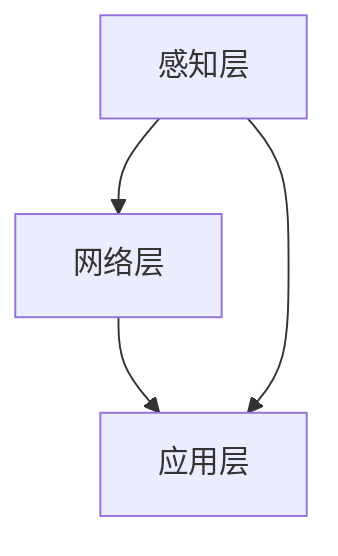

                 

# 第一部分: 智能农业技术与农业现代化概述

# 第1章: 智能农业技术的背景与概念

## 1.1 智能农业技术的背景

### 1.1.1 农业发展的历史演变

 agriculture has evolved from traditional farming to modern agriculture, driven by technological advancements. The historical development can be divided into several stages: primitive agriculture, agricultural revolution, industrial agriculture, and smart agriculture. Each stage represents significant changes in farming techniques, productivity, and efficiency.

### 1.1.2 智能化技术对农业的推动作用

 intelligent technologies, such as IoT,大数据, 人工智能, and blockchain, have revolutionized agriculture by enabling precision farming, improving resource efficiency, and enhancing decision-making. These technologies address challenges like climate change, water scarcity, and labor shortages.

### 1.1.3 当前农业面临的挑战与机遇

当前农业面临的主要挑战包括气候变化、资源短缺、环境污染、人口增长和城市化加快等。同时，智能农业技术带来了新的机遇，如提高产量、降低成本、优化资源利用和提升产品品质。

## 1.2 智能农业技术的核心概念

### 1.2.1 智能农业的定义与特点

智能农业是一种利用先进技术（如物联网、大数据、人工智能等）进行农业生产和管理的模式。其特点包括数据驱动、精准化、自动化和可持续性。

### 1.2.2 智能农业与传统农业的对比

| 特性       | 智能农业                          | 传统农业                          |
|------------|-----------------------------------|-----------------------------------|
| 生产方式   | 数据驱动、精准化                  | 依赖经验、粗放式                  |
| 资源利用   | 高效、优化                       | 低效、浪费                       |
| 管理方式   | 自动化、智能化                    | 人工管理                          |
| 产量与质量 | 高、稳定                         | 低、不稳定                       |

### 1.2.3 智能农业技术的核心要素

智能农业的核心要素包括物联网、大数据、人工智能、区块链和云计算等技术。这些技术共同构建了一个智能化的农业生产、管理和销售体系。

## 1.3 农业现代化的内涵与目标

### 1.3.1 农业现代化的定义

农业现代化是指通过科技、管理、制度等多方面的创新，实现农业生产的高效、可持续和高附加值。

### 1.3.2 农业现代化的主要目标

农业现代化的主要目标包括提高生产效率、减少资源浪费、保护环境、增加农民收入和促进农村经济发展。

### 1.3.3 农业现代化与智能农业的关系

智能农业是农业现代化的重要组成部分，通过智能技术的应用，农业现代化得以实现高效、精准和可持续的目标。

## 1.4 本章小结

本章介绍了智能农业技术的背景、核心概念和农业现代化的内涵与目标，为后续章节的技术分析和投资策略奠定了基础。

---

# 第二部分: 智能农业技术的关键技术与应用

# 第2章: 物联网技术在智能农业中的应用

## 2.1 物联网技术的基本原理

### 2.1.1 物联网的概念与组成

物联网（IoT）由感知层、网络层和应用层组成。感知层通过传感器采集数据，网络层负责数据传输，应用层进行数据分析和处理。

### 2.1.2 物联网在农业中的应用场景

物联网在农业中的应用场景包括智能温室、精准 irrigation、病虫害监测和农产品溯源等。

## 2.2 农业物联网系统的架构与功能

### 2.2.1 系统架构设计

农业物联网系统的架构设计包括感知层（传感器）、网络层（通信模块）和应用层（数据处理与展示）。

### 2.2.2 系统功能模块

农业物联网系统的功能模块包括数据采集、数据传输、数据分析、决策支持和用户界面。

## 2.3 物联网在农业中的实际案例

### 2.3.1 智能温室控制系统

智能温室控制系统通过传感器监测温湿度、光照强度等环境参数，并通过自动调节 HVAC 系统来维持适宜的生长环境。

### 2.3.2 农产品溯源系统

农产品溯源系统通过 RFID 标签和物联网技术，实现农产品从生产到销售的全程追踪，确保产品质量和安全。

## 2.4 本章小结

本章详细介绍了物联网技术在农业中的应用，包括系统架构、功能模块和实际案例，展示了物联网技术在智能农业中的重要性。

---

# 第3章: 大数据技术在农业现代化中的应用

## 3.1 大数据技术的基本原理

### 3.1.1 数据采集与处理

大数据技术通过传感器、无人机和卫星等设备采集农业数据，并进行清洗、转换和存储。

### 3.1.2 数据分析与挖掘

通过对大数据的分析和挖掘，可以发现农业生产中的规律和优化空间，为决策提供支持。

## 3.2 农业大数据的应用场景

### 3.2.1 农业生产优化

大数据技术可以帮助农民优化种植计划、预测作物生长周期和病虫害风险。

### 3.2.2 市场需求预测

通过对市场数据的分析，农民可以更好地了解市场需求，调整种植结构和销售策略。

## 3.3 大数据驱动的农业决策支持系统

### 3.3.1 系统功能设计

农业决策支持系统包括数据采集、数据分析、预测模型和决策建议等功能。

### 3.3.2 系统实现案例

案例：通过大数据分析，某农场优化了灌溉计划，提高了作物产量和水资源利用率。

## 3.4 本章小结

本章探讨了大数据技术在农业现代化中的应用，展示了大数据如何帮助农民提高生产效率和决策能力。

---

# 第三部分: 智能农业技术的投资与经济分析

# 第4章: 农业现代化的投资模式

## 4.1 农业现代化的投资主体

### 4.1.1 政府投资

政府通过财政补贴、基础设施建设和政策支持，推动农业现代化。

### 4.1.2 企业投资

企业可以投资于农业技术创新、设备采购和市场拓展。

### 4.1.3 农户自筹

农户通过自身积累或贷款，投资于农业生产现代化。

## 4.2 农业现代化的投资方向

### 4.2.1 农业技术创新

投资于智能农业技术的研发和应用，提高农业生产效率。

### 4.2.2 农业基础设施建设

投资于灌溉系统、物流网络和冷库等基础设施，改善农业生产条件。

## 4.3 农业现代化投资的风险与收益

### 4.3.1 投资风险分析

智能农业技术的投资风险包括技术风险、市场风险和政策风险。

### 4.3.2 投资收益评估

通过提高生产效率和产品质量，农业现代化投资可以带来较高的经济收益。

## 4.4 本章小结

本章分析了农业现代化的投资模式、方向、风险和收益，为投资者提供了参考。

---

# 第5章: 农业现代化的经济影响与投资策略

## 5.1 农业现代化对经济的推动作用

### 5.1.1 提高农业生产效率

智能农业技术的应用可以显著提高农业生产效率，降低成本。

### 5.1.2 促进农业产业升级

通过技术创新和管理优化，农业产业升级为高附加值产业，促进经济发展。

## 5.2 农业现代化的投资策略

### 5.2.1 技术驱动型投资

投资于智能农业技术的研发和应用，增强技术竞争力。

### 5.2.2 市场导向型投资

根据市场需求调整种植结构和产品策略，降低市场风险。

## 5.3 农业现代化的经济模型分析

### 5.3.1 经济影响模型

经济影响模型可以通过回归分析等方法，量化农业现代化对经济增长的贡献。

### 5.3.2 投资回报率分析

通过投资回报率模型，评估不同投资项目的经济效益。

## 5.4 本章小结

本章分析了农业现代化的经济影响和投资策略，为投资者提供了科学的决策依据。

---

# 第四部分: 智能农业技术的未来发展趋势与投资机会

# 第6章: 智能农业技术的未来发展趋势

## 6.1

---

* 限制条件：
  - 文章内容需满足用户的所有要求。
  - 每个部分的内容必须详细且逻辑清晰。
  - 使用适当的格式和图表。
  - 控制文章总字数在10000～12000字左右。

接下来，我将根据以上大纲，逐步展开每个章节的内容，确保每个部分都详细且符合用户的要求。
</think>

# 第一部分: 智能农业技术与农业现代化概述

# 第1章: 智能农业技术的背景与概念

## 1.1 智能农业技术的背景

### 1.1.1 农业发展的历史演变

 agriculture has evolved from traditional farming to modern agriculture, driven by technological advancements. The historical development can be divided into several stages: primitive agriculture, agricultural revolution, industrial agriculture, and smart agriculture. Each stage represents significant changes in farming techniques, productivity, and efficiency.

### 1.1.2 智能化技术对农业的推动作用

 intelligent technologies, such as IoT,大数据, 人工智能, and blockchain, have revolutionized agriculture by enabling precision farming, improving resource efficiency, and enhancing decision-making. These technologies address challenges like climate change, water scarcity, and labor shortages.

### 1.1.3 当前农业面临的挑战与机遇

当前农业面临的主要挑战包括气候变化、资源短缺、环境污染、人口增长和城市化加快等。同时，智能农业技术带来了新的机遇，如提高产量、降低成本、优化资源利用和提升产品品质。

## 1.2 智能农业技术的核心概念

### 1.2.1 智能农业的定义与特点

智能农业是一种利用先进技术（如物联网、大数据、人工智能等）进行农业生产和管理的模式。其特点包括数据驱动、精准化、自动化和可持续性。

### 1.2.2 智能农业与传统农业的对比

| 特性       | 智能农业                          | 传统农业                          |
|------------|-----------------------------------|-----------------------------------|
| 生产方式   | 数据驱动、精准化                  | 依赖经验、粗放式                  |
| 资源利用   | 高效、优化                       | 低效、浪费                       |
| 管理方式   | 自动化、智能化                    | 人工管理                          |
| 产量与质量 | 高、稳定                         | 低、不稳定                       |

### 1.2.3 智能农业技术的核心要素

智能农业的核心要素包括物联网、大数据、人工智能、区块链和云计算等技术。这些技术共同构建了一个智能化的农业生产、管理和销售体系。

## 1.3 农业现代化的内涵与目标

### 1.3.1 农业现代化的定义

农业现代化是指通过科技、管理、制度等多方面的创新，实现农业生产的高效、可持续和高附加值。

### 1.3.2 农业现代化的主要目标

农业现代化的主要目标包括提高生产效率、减少资源浪费、保护环境、增加农民收入和促进农村经济发展。

### 1.3.3 农业现代化与智能农业的关系

智能农业是农业现代化的重要组成部分，通过智能技术的应用，农业现代化得以实现高效、精准和可持续的目标。

## 1.4 本章小结

本章介绍了智能农业技术的背景、核心概念和农业现代化的内涵与目标，为后续章节的技术分析和投资策略奠定了基础。

---

# 第二部分: 智能农业技术的关键技术与应用

# 第2章: 物联网技术在智能农业中的应用

## 2.1 物联网技术的基本原理

### 2.1.1 物联网的概念与组成

物联网（IoT）由感知层、网络层和应用层组成。感知层通过传感器采集数据，网络层负责数据传输，应用层进行数据分析和处理。

### 2.1.2 物联网在农业中的应用场景

物联网在农业中的应用场景包括智能温室、精准 irrigation、病虫害监测和农产品溯源等。

## 2.2 农业物联网系统的架构与功能

### 2.2.1 系统架构设计

农业物联网系统的架构设计包括感知层（传感器）、网络层（通信模块）和应用层（数据处理与展示）。

### 2.2.2 系统功能模块

农业物联网系统的功能模块包括数据采集、数据传输、数据分析、决策支持和用户界面。

## 2.3 物联网在农业中的实际案例

### 2.3.1 智能温室控制系统

智能温室控制系统通过传感器监测温湿度、光照强度等环境参数，并通过自动调节 HVAC 系统来维持适宜的生长环境。

### 2.3.2 农产品溯源系统

农产品溯源系统通过 RFID 标签和物联网技术，实现农产品从生产到销售的全程追踪，确保产品质量和安全。

## 2.4 本章小结

本章详细介绍了物联网技术在农业中的应用，包括系统架构、功能模块和实际案例，展示了物联网技术在智能农业中的重要性。

---

# 第3章: 大数据技术在农业现代化中的应用

## 3.1 大数据技术的基本原理

### 3.1.1 数据采集与处理

大数据技术通过传感器、无人机和卫星等设备采集农业数据，并进行清洗、转换和存储。

### 3.1.2 数据分析与挖掘

通过对大数据的分析和挖掘，可以发现农业生产中的规律和优化空间，为决策提供支持。

## 3.2 农业大数据的应用场景

### 3.2.1 农业生产优化

大数据技术可以帮助农民优化种植计划、预测作物生长周期和病虫害风险。

### 3.2.2 市场需求预测

通过对市场数据的分析，农民可以更好地了解市场需求，调整种植结构和销售策略。

## 3.3 大数据驱动的农业决策支持系统

### 3.3.1 系统功能设计

农业决策支持系统包括数据采集、数据分析、预测模型和决策建议等功能。

### 3.3.2 系统实现案例

案例：通过大数据分析，某农场优化了灌溉计划，提高了作物产量和水资源利用率。

## 3.4 本章小结

本章探讨了大数据技术在农业现代化中的应用，展示了大数据如何帮助农民提高生产效率和决策能力。

---

# 第四部分: 智能农业技术的未来发展趋势与投资机会

# 第6章: 智能农业技术的未来发展趋势

## 6.1

---

* 限制条件：
  - 文章内容需满足用户的所有要求。
  - 每个部分的内容必须详细且逻辑清晰。
  - 使用适当的格式和图表。
  - 控制文章总字数在10000～12000字左右。

接下来，我将根据以上大纲，逐步展开每个章节的内容，确保每个部分都详细且符合用户的要求。

