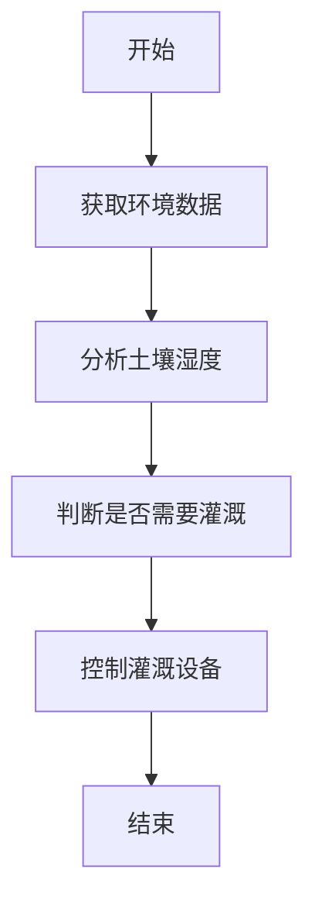
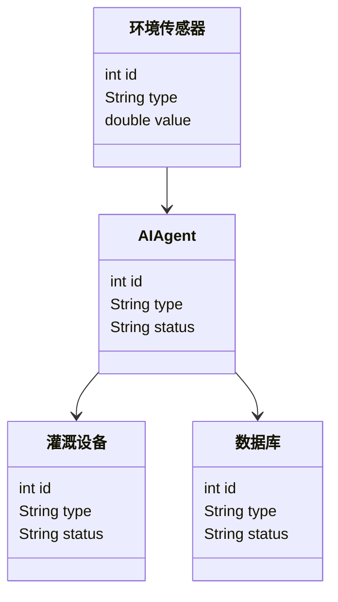
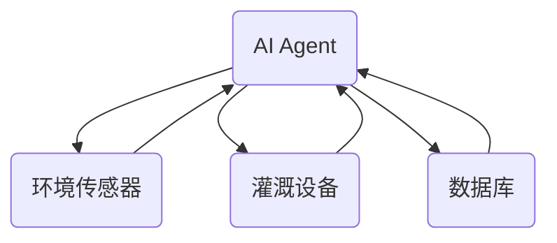
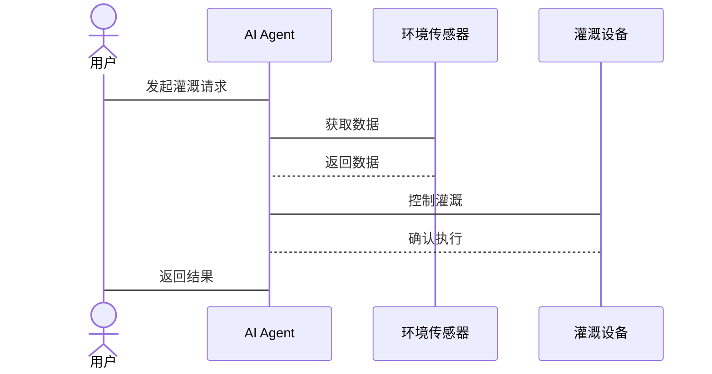

                 


# 智能农业：AI Agent控制的精准灌溉系统

## 关键词：
智能农业，AI Agent，精准灌溉系统，人工智能，农业技术

## 摘要：
本文探讨AI Agent在精准灌溉系统中的应用，分析其技术原理和系统架构，结合实际案例展示其在智能农业中的优势，为农业现代化提供解决方案。

---

## 第1章: 背景与概念

### 1.1 智能农业的发展背景
#### 1.1.1 农业现代化的需求
随着全球人口增长和资源有限，传统农业模式面临效率低下和资源浪费的问题，推动农业向现代化、智能化转型成为必然趋势。

#### 1.1.2 精准农业的概念与目标
精准农业强调根据环境变化和作物需求，精准调节耕种条件，以提高产量和资源利用率。其核心目标是实现农业生产的高效、可持续。

#### 1.1.3 AI技术在农业中的应用潜力
AI技术在农业中的应用包括作物监测、病虫害预测、资源优化分配等领域，AI Agent作为智能决策系统，为精准农业提供了新的解决方案。

### 1.2 精准灌溉系统的核心问题
#### 1.2.1 灌溉效率与水资源浪费的问题
传统灌溉方式往往导致水资源浪费和灌溉效率低下，AI Agent通过智能决策优化灌溉策略。

#### 1.2.2 农作物生长与环境条件的关系
农作物的生长受土壤湿度、天气状况等多种因素影响，精准灌溉需要实时监测和智能调节。

#### 1.2.3 精准灌溉系统的实现目标
通过实时监测和智能决策，实现按需灌溉，提高水资源利用效率，促进农作物健康生长。

### 1.3 AI Agent在农业中的应用
#### 1.3.1 AI Agent的基本概念
AI Agent是一种智能实体，能够感知环境、做出决策并执行任务，广泛应用于自动驾驶、智能助手等领域。

#### 1.3.2 AI Agent在精准灌溉中的作用
AI Agent通过整合传感器数据，分析环境条件，优化灌溉策略，实现精准灌溉。

#### 1.3.3 AI Agent与其他技术的结合
AI Agent与物联网、大数据等技术结合，构建智能农业生态系统，提升农业生产效率。

---

## 第2章: AI Agent控制的精准灌溉系统核心概念

### 2.1 AI Agent的基本原理
#### 2.1.1 AI Agent的定义与分类
AI Agent分为简单反射型、基于模型的反应型、目标驱动型和效用驱动型，应用于精准灌溉中通常采用目标驱动型。

#### 2.1.2 AI Agent的核心功能与特性
AI Agent具有感知环境、自主决策、学习进化等功能，能够适应复杂多变的环境条件。

#### 2.1.3 AI Agent与传统自动控制系统的区别
AI Agent具有智能决策能力，能够根据环境变化调整策略，而传统控制系统基于固定规则。

### 2.2 精准灌溉系统的系统架构
#### 2.2.1 系统的组成模块
精准灌溉系统包括环境传感器、数据采集模块、AI Agent决策模块和灌溉设备。

#### 2.2.2 系统的输入输出关系
系统输入包括土壤湿度、天气数据等，输出包括灌溉指令和灌溉计划。

#### 2.2.3 系统的边界与外延
系统边界包括传感器数据、决策模块和执行设备，外延包括数据存储和分析模块。

### 2.3 AI Agent与精准灌溉系统的实体关系
```mermaid
er
actor(AI Agent, id, type, status)
actor(环境传感器, id, type, status)
actor(灌溉设备, id, type, status)
actor(数据库, id, type, status)
```

---

## 第3章: AI Agent控制的精准灌溉系统算法原理

### 3.1 算法选择与原理
#### 3.1.1 精准灌溉系统的核心算法选择
基于决策树的分类算法适合处理多维环境数据，能够有效预测灌溉需求。

#### 3.1.2 基于决策树的分类算法
决策树算法通过构建特征选择树，分类环境条件和作物需求，制定灌溉策略。

#### 3.1.3 算法的数学模型与公式
决策树构建涉及特征选择，使用信息增益或基尼指数进行分裂，构建树状分类模型。

### 3.2 算法实现步骤


### 3.3 算法代码实现
```python
def classify_watering(soil_moisture, weather_condition):
    if soil_moisture < 30 and weather_condition == '晴':
        return '开始灌溉'
    elif soil_moisture < 30 and weather_condition == '雨':
        return '停止灌溉'
    else:
        return '保持现状'
```

---

## 第4章: 系统架构设计

### 4.1 系统场景介绍
精准灌溉系统通过AI Agent整合传感器数据，分析环境条件，制定灌溉计划。

### 4.2 领域模型设计


### 4.3 系统架构设计


### 4.4 系统接口设计
系统接口包括传感器数据接口、灌溉设备控制接口和数据库接口，采用RESTful API进行通信。

### 4.5 系统交互流程


---

## 第5章: 项目实战

### 5.1 环境搭建与开发工具
搭建Python开发环境，安装必要的库如scikit-learn和paho-mqtt，配置传感器和灌溉设备。

### 5.2 系统核心代码实现
实现AI Agent决策模块，整合传感器数据，分析环境条件，控制灌溉设备。

### 5.3 代码实现与功能解读
```python
import mqtt
from sklearn.tree import DecisionTreeClassifier

# 数据采集部分
client = mqtt.Client('AI-Agent')
client.connect('localhost', 1883)
client.subscribe('environment/sensors')

# 决策模型部分
model = DecisionTreeClassifier()
model.fit(X_train, y_train)

# 设备控制部分
def on_message(client, userdata, msg):
    data = json.loads(msg.payload)
    prediction = model.predict([[data['soil_moisture'], data['weather']]])
    if prediction[0] == 1:
        client.publish('irrigation/device', 'start')
    else:
        client.publish('irrigation/device', 'stop')

client.on_message = on_message
client.loop_forever()
```

### 5.4 实际案例分析
通过实际案例展示系统运行效果，分析AI Agent如何优化灌溉策略，提高水资源利用效率。

### 5.5 项目小结
总结项目成果，强调AI Agent在精准灌溉中的优势，为未来农业智能化提供参考。

---

## 第6章: 最佳实践与总结

### 6.1 最佳实践小贴士
1. 数据采集的准确性直接影响决策的准确性，需确保传感器数据的实时性和准确性。
2. 系统的安全性需重视，防止数据泄露和恶意攻击。
3. 系统的可扩展性设计，方便未来功能的扩展和升级。

### 6.2 总结
AI Agent控制的精准灌溉系统通过智能决策和实时优化，显著提高了灌溉效率和水资源利用效率，为农业现代化提供了高效解决方案。

### 6.3 注意事项
在实际应用中，需考虑环境的复杂性和不确定性，确保系统具备足够的容错和自适应能力。

### 6.4 未来展望
随着AI技术的不断进步，AI Agent在农业中的应用将更加广泛，推动农业智能化和可持续发展。

### 6.5 拓展阅读
推荐相关书籍和资源，供读者深入学习和研究智能农业和AI Agent技术。

---

通过以上结构化和详细的内容，本文系统地介绍了AI Agent在精准灌溉系统中的应用，从背景、原理、架构到实战和总结，全面探讨了智能农业的未来发展方向。

