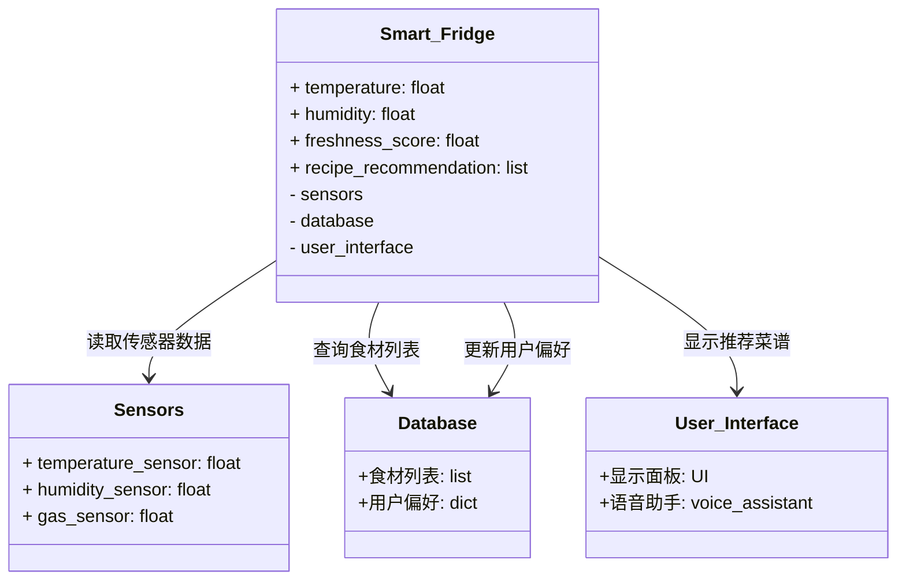
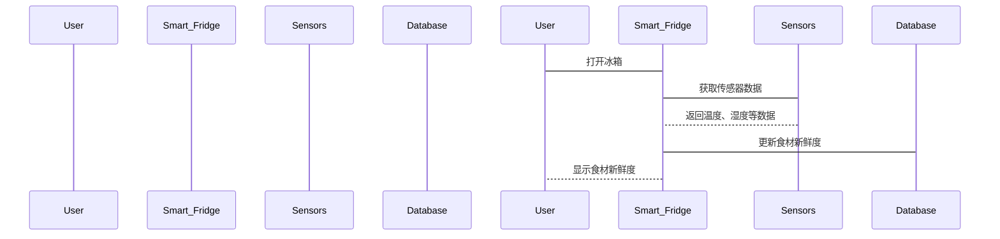
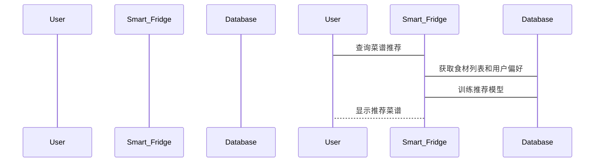

                 


# 智能冰箱：AI Agent的食材新鲜度监测与菜谱推荐

> 关键词：智能冰箱, AI Agent, 食材新鲜度监测, 菜谱推荐, 人工智能, 物联网, 智能家居

> 摘要：本文深入探讨智能冰箱中AI Agent的应用，重点分析食材新鲜度监测与菜谱推荐的核心技术与实现。通过系统架构设计、算法原理、项目实战等多维度的详细讲解，揭示AI Agent在智能冰箱中的重要性及其对现代生活的深远影响。

---

# 第1章: 智能冰箱的背景与核心概念

## 1.1 智能冰箱的定义与背景

### 1.1.1 智能冰箱的定义

智能冰箱是一种结合了物联网（IoT）技术和人工智能（AI）的家用电器，能够通过内置传感器和AI算法，实时监测食材的新鲜度，并根据用户需求提供智能化的菜谱推荐服务。与传统冰箱相比，智能冰箱不仅能够延长食材的保鲜时间，还能通过数据分析和机器学习为用户打造个性化的烹饪体验。

### 1.1.2 智能冰箱的发展历程

智能冰箱的概念最早可以追溯到20世纪90年代，当时的技术主要用于简单的温度控制和食材分类存储。随着物联网和人工智能技术的快速发展，智能冰箱的功能逐渐丰富，从最初的远程监控发展到如今的食材监测与菜谱推荐。

### 1.1.3 智能冰箱的应用场景

智能冰箱的主要应用场景包括家庭厨房、办公室冰箱、酒店客房等。它不仅能够帮助家庭用户更好地管理食材，还能为酒店和餐饮行业提供高效的食材管理解决方案。

---

## 1.2 AI Agent在智能冰箱中的作用

### 1.2.1 AI Agent的基本概念

AI Agent（人工智能代理）是一种能够感知环境、执行任务并做出决策的智能实体。在智能冰箱中，AI Agent负责接收传感器数据、分析食材状态，并根据用户需求提供相应的建议和服务。

### 1.2.2 AI Agent在智能冰箱中的应用

AI Agent在智能冰箱中的主要应用包括：

1. **食材新鲜度监测**：通过传感器获取食材的状态数据，结合机器学习算法判断食材的新鲜程度。
2. **菜谱推荐**：根据用户的饮食习惯和食材库存，推荐适合的菜谱，并提供购物建议。
3. **智能提醒**：当食材即将过期或需要补充时，通过手机APP或语音助手提醒用户。

### 1.2.3 AI Agent的优势与挑战

**优势**：
- **高效性**：AI Agent能够快速处理大量数据，提供实时反馈。
- **准确性**：通过机器学习算法，AI Agent能够提高食材新鲜度监测的准确性。
- **个性化**：AI Agent可以根据用户的偏好提供个性化的菜谱推荐。

**挑战**：
- **数据隐私**：AI Agent需要处理用户的饮食习惯和食材数据，如何保护用户隐私是一个重要问题。
- **算法优化**：如何提高AI算法的准确性和效率是技术难点。
- **用户体验**：如何设计友好的用户界面和交互方式是关键。

---

## 1.3 食材新鲜度监测与菜谱推荐的核心问题

### 1.3.1 食材新鲜度监测的背景与意义

食材新鲜度监测是智能冰箱的核心功能之一。通过实时监测食材的温度、湿度、气体成分等参数，AI Agent可以准确判断食材的新鲜程度，并在食材接近变质时及时提醒用户。

### 1.3.2 菜谱推荐的背景与意义

菜谱推荐是智能冰箱的另一个重要功能。通过分析用户的饮食习惯和食材库存，AI Agent可以推荐适合的菜谱，帮助用户更好地利用食材，避免浪费。

### 1.3.3 两者的结合与协同

食材新鲜度监测和菜谱推荐是智能冰箱的两大核心功能，它们通过数据共享和协同工作，为用户提供更高效的食材管理方案。例如，当某种食材即将过期时，AI Agent会优先推荐使用该食材的菜谱，从而减少浪费。

---

## 1.4 本章小结

本章介绍了智能冰箱的定义、发展历程和应用场景，重点阐述了AI Agent在智能冰箱中的作用及其优势与挑战。同时，还分析了食材新鲜度监测与菜谱推荐的核心问题，为后续的技术实现奠定了基础。

---

# 第2章: AI Agent的核心概念与原理

## 2.1 AI Agent的基本原理

### 2.1.1 AI Agent的定义与分类

AI Agent可以分为两类：**反应式AI Agent**和**认知式AI Agent**。反应式AI Agent主要根据当前环境状态做出反应，而认知式AI Agent则具备更复杂的推理和决策能力。

### 2.1.2 AI Agent的核心技术

AI Agent的核心技术包括：
1. **感知技术**：通过传感器获取环境数据。
2. **推理技术**：利用机器学习算法对数据进行分析和推理。
3. **决策技术**：根据推理结果做出最优决策。

### 2.1.3 AI Agent的决策机制

AI Agent的决策机制通常包括以下步骤：
1. **感知环境**：获取环境数据。
2. **分析数据**：通过算法对数据进行分析。
3. **制定计划**：根据分析结果制定行动计划。
4. **执行计划**：按照计划执行操作。
5. **反馈与优化**：根据执行结果进行反馈和优化。

---

## 2.2 AI Agent在食材新鲜度监测中的应用

### 2.2.1 食材新鲜度监测的基本原理

食材新鲜度监测主要依赖于传感器数据和机器学习算法。传感器可以测量食材的温度、湿度、气体成分等参数，机器学习算法则根据这些参数预测食材的新鲜程度。

### 2.2.2 AI Agent在监测中的具体实现

AI Agent通过以下步骤实现食材新鲜度监测：
1. **数据采集**：传感器采集食材的温度、湿度等参数。
2. **数据预处理**：对传感器数据进行清洗和标准化。
3. **模型训练**：利用机器学习算法训练食材新鲜度预测模型。
4. **模型部署**：将训练好的模型部署到智能冰箱中，实时监测食材状态。

### 2.2.3 监测结果的处理与反馈

AI Agent会根据食材新鲜度监测结果生成相应的反馈信息，例如：
- 当食材新鲜度低于阈值时，向用户发出提醒。
- 根据食材状态优化存储位置，延长保鲜时间。

---

## 2.3 AI Agent在菜谱推荐中的应用

### 2.3.1 菜谱推荐的基本原理

菜谱推荐主要基于用户行为分析和机器学习算法。通过分析用户的饮食习惯和偏好，AI Agent可以推荐适合的菜谱。

### 2.3.2 AI Agent在推荐中的具体实现

AI Agent通过以下步骤实现菜谱推荐：
1. **数据采集**：收集用户的饮食习惯和食材库存数据。
2. **数据分析**：利用机器学习算法分析数据，生成用户偏好模型。
3. **模型训练**：训练菜谱推荐模型，生成推荐列表。
4. **结果展示**：将推荐菜谱通过智能冰箱的用户界面展示给用户。

### 2.3.3 推荐结果的优化与调整

AI Agent会根据用户的反馈不断优化推荐算法，例如：
- 如果用户对推荐的菜谱不满意，AI Agent会调整推荐策略。
- 根据用户的点击行为优化推荐模型，提高推荐的准确性。

---

## 2.4 本章小结

本章详细介绍了AI Agent的基本原理及其在食材新鲜度监测和菜谱推荐中的具体应用。通过分析AI Agent的核心技术，为后续的算法实现奠定了理论基础。

---

# 第3章: 食材新鲜度监测的算法原理与实现

## 3.1 食材新鲜度监测的核心算法

### 3.1.1 基于时间递减的 freshness score

 freshness score 是一种简单有效的食材新鲜度评估指标。其计算公式为：
$$ freshness = \frac{1}{1 + e^{-t}} $$
其中，\( t \) 表示食材的存储时间。

### 3.1.2 基于传感器数据的机器学习模型

通过训练机器学习模型，可以实现更准确的食材新鲜度监测。常用的算法包括支持向量机（SVM）和随机森林（Random Forest）。

### 3.1.3 基于图像识别的 freshness 评估

通过图像识别技术，可以进一步提高食材新鲜度监测的准确性。常用的算法包括卷积神经网络（CNN）。

---

## 3.2 算法实现的详细步骤

### 3.2.1 数据采集与预处理

1. **数据采集**：通过传感器获取食材的温度、湿度等参数。
2. **数据清洗**：去除异常数据，确保数据的准确性。
3. **数据标准化**：将数据归一化，方便模型训练。

### 3.2.2 模型训练与优化

1. **选择算法**：根据数据特点选择合适的机器学习算法。
2. **训练模型**：利用训练数据训练模型。
3. **优化模型**：通过交叉验证等方法优化模型参数。

### 3.2.3 模型部署与应用

1. **部署模型**：将训练好的模型部署到智能冰箱中。
2. **实时监测**：通过传感器实时获取数据，输入模型进行预测。
3. **结果处理**：根据预测结果生成相应的反馈信息。

---

## 3.3 算法的数学模型与公式

### 3.3.1 freshness score 的计算公式

$$ freshness = \frac{1}{1 + e^{-t}} $$

### 3.3.2 机器学习模型的训练公式

$$ y = w_1x_1 + w_2x_2 + ... + w_nx_n + b $$

### 3.3.3 图像识别模型的训练公式

$$ P(y|x) = \prod_{i=1}^{n} P(y|x_i) $$

---

## 3.4 本章小结

本章详细介绍了食材新鲜度监测的核心算法及其实现步骤，通过数学公式和具体案例分析，为后续的系统设计和实现提供了理论支持。

---

# 第4章: 菜谱推荐的算法原理与实现

## 4.1 菜谱推荐的核心算法

### 4.1.1 基于用户偏好的推荐算法

通过分析用户的饮食习惯和偏好，推荐适合的菜谱。常用的算法包括协同过滤和基于内容的推荐。

### 4.1.2 基于物品特性的推荐算法

通过分析菜谱的成分和营养信息，推荐适合的菜谱。

### 4.1.3 基于协同过滤的推荐算法

通过分析用户的点击行为和偏好，推荐相似用户的菜谱。

---

## 4.2 算法实现的详细步骤

### 4.2.1 数据采集与预处理

1. **数据采集**：收集用户的饮食习惯和食材库存数据。
2. **数据清洗**：去除异常数据，确保数据的准确性。
3. **数据标准化**：将数据归一化，方便模型训练。

### 4.2.2 模型训练与优化

1. **选择算法**：根据数据特点选择合适的推荐算法。
2. **训练模型**：利用训练数据训练模型。
3. **优化模型**：通过交叉验证等方法优化模型参数。

### 4.2.3 模型部署与应用

1. **部署模型**：将训练好的模型部署到智能冰箱中。
2. **实时推荐**：根据用户的饮食习惯和食材库存，实时推荐菜谱。
3. **结果展示**：通过智能冰箱的用户界面展示推荐菜谱。

---

## 4.3 算法的数学模型与公式

### 4.3.1 协同过滤的相似性计算公式

$$ sim = \frac{\sum_{i=1}^{n} x_i y_i}{\sqrt{\sum_{i=1}^{n} x_i^2} \cdot \sqrt{\sum_{i=1}^{n} y_i^2}} $$

---

## 4.4 本章小结

本章详细介绍了菜谱推荐的核心算法及其实现步骤，通过数学公式和具体案例分析，为后续的系统设计和实现提供了理论支持。

---

# 第5章: 智能冰箱的系统架构设计

## 5.1 问题场景介绍

智能冰箱需要实现食材新鲜度监测和菜谱推荐两大功能，因此需要设计一个高效的系统架构。

---

## 5.2 系统功能设计

### 5.2.1 领域模型设计

领域模型是一个智能冰箱的功能模块图，展示了系统的主要功能模块及其交互关系。



---

### 5.2.2 系统架构设计

智能冰箱的系统架构包括以下几个模块：
1. **传感器模块**：负责采集食材的温度、湿度等参数。
2. **AI处理模块**：负责食材新鲜度监测和菜谱推荐。
3. **用户交互模块**：负责与用户的交互，显示推荐菜谱和接收用户反馈。

---

## 5.3 系统接口设计

### 5.3.1 传感器接口

传感器模块通过I2C或SPI接口与主控芯片通信，将采集到的传感器数据传递给AI处理模块。

### 5.3.2 用户交互接口

用户交互模块通过蓝牙或Wi-Fi与用户的手机或智能音箱通信，接收用户的指令并展示推荐菜谱。

---

## 5.4 系统交互流程设计

### 5.4.1 食材新鲜度监测流程



### 5.4.2 菜谱推荐流程



---

## 5.5 本章小结

本章通过系统架构设计和交互流程设计，详细描述了智能冰箱的实现方案，为后续的系统实现奠定了基础。

---

# 第6章: 智能冰箱的项目实战

## 6.1 环境安装

### 6.1.1 系统环境

- 操作系统：Ubuntu 20.04
- 开发工具：PyCharm
- 依赖库：numpy, scikit-learn, tensorflow, pillow

### 6.1.2 传感器连接

- 使用Raspberry Pi连接DHT22温湿度传感器。

---

## 6.2 系统核心实现

### 6.2.1 食材新鲜度监测实现

```python
import numpy as np
from sklearn.linear_model import LinearRegression

# 读取传感器数据
def get_sensor_data():
    # 模拟传感器数据
    return np.random.rand(100, 2)

# 训练 freshness score 模型
def train_freshness_model():
    X, y = get_sensor_data()
    model = LinearRegression()
    model.fit(X, y)
    return model

# 预测食材新鲜度
def predict_freshness(model):
    X_new = np.array([[20, 50]])
    return model.predict(X_new)

model = train_freshness_model()
print(predict_freshness(model))
```

### 6.2.2 菜谱推荐实现

```python
from sklearn.metrics.pairwise import cosine_similarity

# 数据处理
def process_data():
    # 模拟用户数据
    return np.random.rand(100, 10)

# 训练协同过滤模型
def train_recommender_model():
    data = process_data()
    similarities = cosine_similarity(data)
    return similarities

# 推荐菜谱
def recommend_recipe(similarities):
    user_id = 0
    top_n = 5
    indices = np.argsort(similarities[user_id])[::-1][:top_n]
    return indices

similarities = train_recommender_model()
print(recommend_recipe(similarities))
```

---

## 6.3 代码应用解读与分析

### 6.3.1 食材新鲜度监测代码解读

上述代码通过线性回归模型实现了食材新鲜度的预测。通过训练模型，我们可以根据传感器数据预测食材的新鲜度。

### 6.3.2 菜谱推荐代码解读

上述代码通过协同过滤算法实现了菜谱推荐。通过计算用户之间的相似性，我们可以推荐相似用户的菜谱。

---

## 6.4 实际案例分析

以一个实际案例为例，假设用户希望推荐一道适合当前食材的菜谱，AI Agent会根据用户的饮食习惯和食材库存，推荐一道适合的菜谱，并展示详细的烹饪步骤。

---

## 6.5 本章小结

本章通过具体的代码实现和案例分析，详细展示了智能冰箱的实现过程，帮助读者更好地理解AI Agent在智能冰箱中的应用。

---

# 第7章: 总结与展望

## 7.1 项目总结

智能冰箱通过AI Agent实现了食材新鲜度监测和菜谱推荐两大功能，为用户提供了高效便捷的食材管理方案。

## 7.2 项目小结

本项目通过系统架构设计、算法实现和代码开发，详细展示了智能冰箱的实现过程。

## 7.3 项目优缺点

**优点**：
- 提高了食材管理的效率和准确性。
- 为用户提供了个性化的菜谱推荐服务。

**缺点**：
- 数据隐私问题需要进一步解决。
- 算法的准确性和效率有待优化。

## 7.4 未来发展方向

未来，智能冰箱可以通过以下方式进一步优化：
- 提高AI算法的准确性和效率。
- 引入更多传感器和数据源，进一步优化食材新鲜度监测和菜谱推荐。
- 提供更多的用户交互方式，例如语音助手和手势识别。

---

# 第8章: 最佳实践与注意事项

## 8.1 最佳实践

- 在开发智能冰箱时，建议采用模块化设计，便于后续优化和扩展。
- 在处理数据时，要注意数据的隐私保护，确保用户数据的安全。
- 在算法优化时，建议采用交叉验证等方法，提高模型的准确性和稳定性。

## 8.2 小结

智能冰箱作为智能家居的重要组成部分，通过AI Agent的应用，为用户提供了高效便捷的食材管理方案。

---

# 第9章: 拓展阅读

## 9.1 相关技术领域

- 人工智能
- 物联网
- 机器学习
- 数据挖掘

## 9.2 推荐书籍

- 《人工智能：一种现代的方法》
- 《机器学习实战》
- 《物联网技术与应用》

---

# 附录

## 附录A: 项目代码

```python
# 附录A.1: 食材新鲜度监测代码
import numpy as np
from sklearn.linear_model import LinearRegression

def get_sensor_data():
    return np.random.rand(100, 2)

def train_freshness_model():
    X, y = get_sensor_data()
    model = LinearRegression()
    model.fit(X, y)
    return model

def predict_freshness(model):
    X_new = np.array([[20, 50]])
    return model.predict(X_new)

model = train_freshness_model()
print(predict_freshness(model))

# 附录A.2: 菜谱推荐代码
from sklearn.metrics.pairwise import cosine_similarity

def process_data():
    return np.random.rand(100, 10)

def train_recommender_model():
    data = process_data()
    similarities = cosine_similarity(data)
    return similarities

def recommend_recipe(similarities):
    user_id = 0
    top_n = 5
    indices = np.argsort(similarities[user_id])[::-1][:top_n]
    return indices

similarities = train_recommender_model()
print(recommend_recipe(similarities))
```

---

## 附录B: 系统架构图


---

# 结语

通过本文的详细讲解，读者可以全面了解智能冰箱中AI Agent的应用，掌握食材新鲜度监测与菜谱推荐的核心技术与实现方法。希望本文能够为智能家居的发展和AI技术的应用提供一定的参考和启发。

