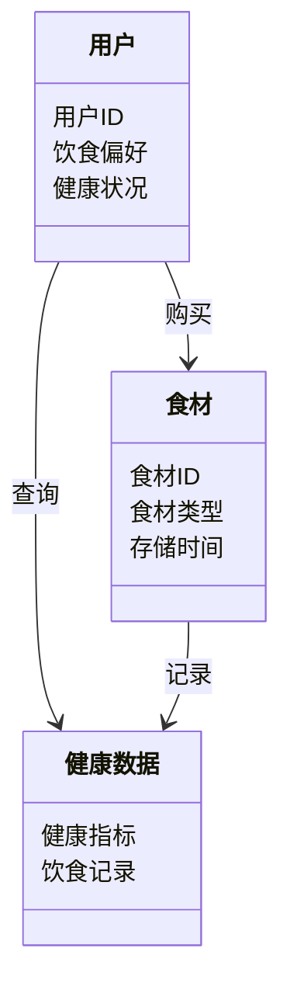
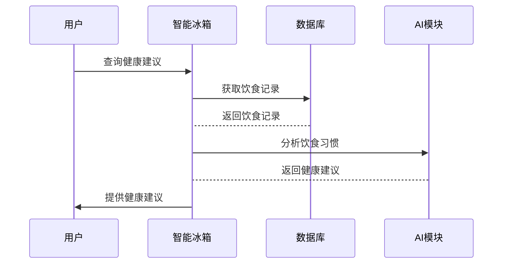

                 


# 智能冰箱：AI Agent的饮食习惯分析与健康建议

## 关键词：智能冰箱, AI Agent, 饮食习惯分析, 健康建议, 数据采集, 算法模型, 系统架构

## 摘要：  
随着人工智能技术的快速发展，智能冰箱已不仅仅是一个冷藏食品的容器，而是成为一个能够分析用户饮食习惯并提供建康建议的智能设备。本文将详细介绍智能冰箱中AI Agent的核心概念、饮食习惯分析的算法原理、系统架构设计以及实际应用场景。通过本文，读者将了解如何利用AI技术实现个性化的饮食管理，从而改善用户的健康生活方式。

---

## 第1章：智能冰箱的发展历程与AI Agent的核心概念

### 1.1 智能冰箱的概念与定义  
智能冰箱是一种集成人工智能技术的家用电器，能够通过传感器和AI算法感知用户的饮食习惯，并提供个性化的健康建议。与传统冰箱相比，智能冰箱具有以下核心功能：  
1. **数据采集**：通过传感器记录用户的饮食行为，如食材消耗量、购买频率等。  
2. **智能分析**：利用AI算法分析用户的饮食习惯，识别潜在的健康问题。  
3. **健康建议**：基于分析结果，为用户提供个性化的饮食调整建议和健康计划。  

### 1.2 AI Agent的基本原理  
AI Agent（人工智能代理）是一种能够感知环境、执行任务并做出决策的智能系统。在智能冰箱中，AI Agent的核心功能包括：  
1. **感知**：通过传感器和用户输入获取数据。  
2. **推理**：利用机器学习算法对数据进行分析和预测。  
3. **执行**：根据推理结果生成健康建议并反馈给用户。  

---

## 第2章：饮食习惯分析的算法原理

### 2.1 数据预处理  
在分析用户的饮食习惯之前，需要对数据进行预处理，包括：  
1. **数据清洗**：去除无效数据和异常值。  
2. **特征提取**：从原始数据中提取有用的特征，如用户的饮食偏好、摄入量等。  

### 2.2 机器学习模型  
常用的机器学习模型包括：  
1. **决策树**：用于分类用户的饮食偏好。  
2. **随机森林**：用于预测用户的健康风险。  
3. **线性回归**：用于分析饮食习惯与健康指标之间的关系。  

#### 示例：线性回归模型  
假设我们使用线性回归模型来分析用户的BMI（身体质量指数）与饮食习惯的关系：  
$$ BMI = \beta_0 + \beta_1 \times 脂肪摄入量 + \epsilon $$  
其中，$\beta_0$ 和 $\beta_1$ 是模型参数，$\epsilon$ 是误差项。  

### 2.3 模型训练与评估  
通过训练数据集对模型进行训练，并使用测试数据集进行评估。常用的评估指标包括准确率、召回率和F1分数。  

---

## 第3章：系统架构设计

### 3.1 领域模型设计  
以下是智能冰箱系统的领域模型（使用Mermaid图表示）：  


### 3.2 系统架构设计  
以下是智能冰箱系统的架构图（使用Mermaid图表示）：  
```mermaid
archiecture  
    客户端 --> 中间件: 数据采集  
    中间件 --> 数据库: 存储  
    中间件 --> AI模块: 分析  
    AI模块 --> 用户端: 建议  
```

### 3.3 接口设计与交互流程  
以下是用户与智能冰箱的交互流程（使用Mermaid图表示）：  


---

## 第4章：项目实战与代码实现

### 4.1 环境配置  
需要以下工具和库：  
- Python 3.8+  
- Pandas  
- Scikit-learn  
- Mermaid图生成工具  

### 4.2 数据集准备  
以下是一个示例数据集结构：  
| 用户ID | 食材类型 | 消耗量 | 购买时间 | 健康指标 |  
|-------|---------|--------|----------|----------|  
| 001   | 肉类     | 500g   | 2023-10-01 | 偏高      |  

### 4.3 代码实现  
以下是饮食习惯分析的代码示例：  
```python
# 导入所需库
import pandas as pd
from sklearn.model_selection import train_test_split
from sklearn.linear_model import LinearRegression

# 读取数据集
data = pd.read_csv('diet_data.csv')

# 数据预处理
X = data[['脂肪摄入量', '蛋白质摄入量']]
y = data['BMI']

# 划分训练集和测试集
X_train, X_test, y_train, y_test = train_test_split(X, y, test_size=0.2, random_state=42)

# 训练模型
model = LinearRegression()
model.fit(X_train, y_train)

# 模型评估
score = model.score(X_test, y_test)
print(f'模型准确率：{score:.2f}')
```

### 4.4 结果分析  
通过上述代码，我们可以得到用户的BMI预测结果，并根据结果生成健康建议。例如：  
- 如果用户的BMI偏高，建议减少脂肪摄入量，增加蔬菜摄入量。  

---

## 第5章：最佳实践与注意事项

### 5.1 最佳实践  
1. **数据隐私**：确保用户数据的安全性，避免数据泄露。  
2. **模型优化**：定期更新模型，提高预测准确性。  
3. **用户反馈**：收集用户的反馈，不断优化健康建议的准确性。  

### 5.2 注意事项  
- 避免过度依赖AI建议，用户应结合自身实际情况进行调整。  
- 定期维护智能冰箱，确保传感器的准确性。  

### 5.3 扩展阅读  
- 《机器学习实战》  
- 《深度学习入门》  

---

## 第6章：小结

通过本文的详细讲解，我们了解了智能冰箱中AI Agent的核心概念、饮食习惯分析的算法原理以及系统架构设计。智能冰箱作为AI技术的重要应用之一，正在逐步改变人们的饮食习惯和生活方式。未来，随着技术的不断进步，智能冰箱将为用户提供更加精准和个性化的健康建议，帮助用户实现健康生活的目标。

--- 

希望这篇技术博客能为读者提供有价值的内容，帮助大家更好地理解智能冰箱中的AI技术及其在饮食健康管理中的应用。

