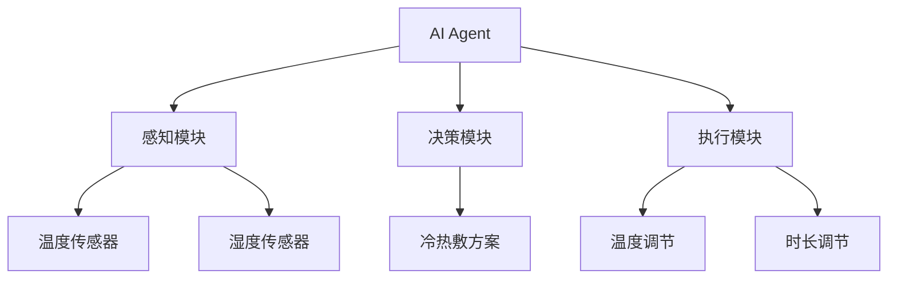
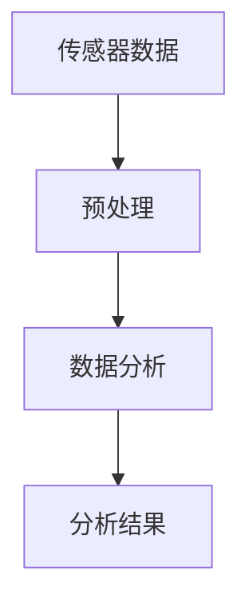
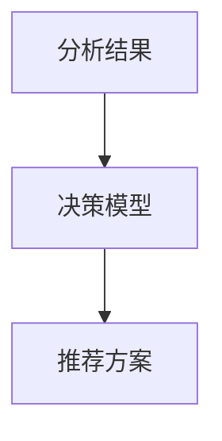
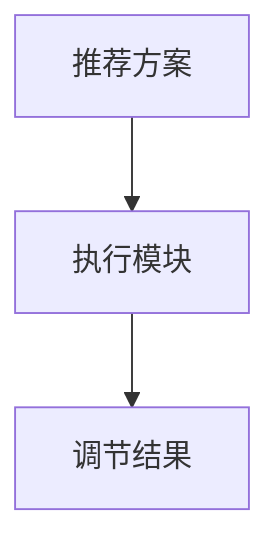
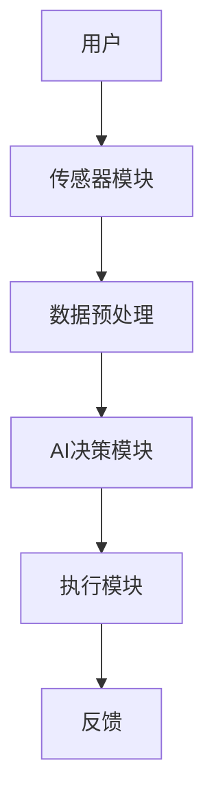
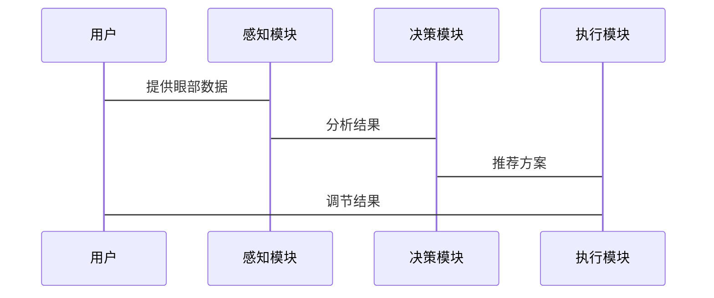

                 


# 智能冷热敷眼罩：AI Agent的眼部护理定制

> 关键词：AI Agent、智能冷热敷眼罩、定制化护理、眼部健康、智能设备

> 摘要：本文深入探讨了智能冷热敷眼罩在AI Agent技术下的眼部护理定制应用。从问题背景到系统架构，从算法原理到项目实战，全面分析了如何通过AI技术实现智能化眼部护理，提供个性化的健康解决方案。

---

# 第一部分: 智能冷热敷眼罩的背景与需求

## 第1章: 问题背景与需求分析

### 1.1 问题背景

随着现代生活的节奏加快，长时间使用电子设备导致眼部疲劳、干眼症等问题日益普遍。传统冷热敷眼罩虽然提供了一定的缓解作用，但缺乏智能化和个性化，无法满足多样化的用户需求。

#### 1.1.1 眼部健康问题的普遍性
- 眼睛疲劳：长时间盯着屏幕导致视力下降和眼睛疲劳。
- 干眼症：环境因素和生活习惯导致泪液分泌不足，眼睛干涩。
- 过敏和炎症：部分用户因过敏或炎症需要特定的冷热交替治疗。

#### 1.1.2 传统冷热敷眼罩的局限性
- 温度不稳定：无法精确控制温度，影响治疗效果。
- 时间固定：无法根据个人需求调整使用时长。
- 缺乏反馈：无法实时监测眼部状态，提供个性化建议。

#### 1.1.3 智能化眼部护理的需求
- 实时监测：通过传感器获取眼部温度、湿度等数据。
- 智能调节：根据数据动态调整冷热敷温度和时长。
- 个性化方案：结合用户数据，制定专属护理计划。

### 1.2 问题描述

用户在使用传统冷热敷眼罩时，面临以下问题：
- 温度控制不精确，影响治疗效果。
- 缺乏个性化建议，不同用户需求未得到满足。
- 使用体验单一，缺乏互动和反馈。

### 1.3 问题解决

引入AI Agent技术，智能冷热敷眼罩能够实现以下功能：
- 实时感知：通过温度、湿度传感器获取眼部数据。
- 智能决策：基于AI算法，推荐最佳冷热敷方案。
- 自动执行：调节温度和时长，提供精准护理。

### 1.4 边界与外延

智能冷热敷眼罩的功能边界：
- 仅限于眼部护理，不涉及全身健康。
- 不具备医疗诊断功能，仅为辅助护理工具。

与相关产品的区别：
- 与普通冷热敷眼罩相比，增加了AI算法和智能调节功能。
- 与智能健康手环等设备相比，专注于眼部护理。

技术实现的可行性分析：
- 现有传感器技术可实现温度、湿度监测。
- AI算法已成熟，可用于个性化推荐。

### 1.5 核心概念与组成

智能冷热敷眼罩的核心组成：
- 传感器模块：温度、湿度传感器。
- AI Agent：感知、决策、执行模块。
- 显示屏：用户交互界面。
- 控制模块：调节温度和时长。

---

## 第2章: AI Agent的核心概念与原理

### 2.1 AI Agent的基本原理

AI Agent是一个智能体，具备以下核心功能：
- **感知**：通过传感器获取环境数据。
- **决策**：基于数据进行分析和推理。
- **执行**：根据决策结果采取行动。

在智能冷热敷眼罩中的应用：
- 感知：监测眼部温度和湿度。
- 决策：根据数据推荐护理方案。
- 执行：调节冷热敷参数。

### 2.2 核心概念的联系

#### 2.2.1 感知、决策、执行模块的对比

| 模块 | 功能 | 输入 | 输出 |
|------|------|------|------|
| 感知 | 获取眼部数据 | 温度、湿度传感器 | 眼部状态数据 |
| 决策 | 推荐护理方案 | 眼部状态数据 | 冷热敷参数 |
| 执行 | 调节温度和时长 | 冷热敷参数 | 用户反馈 |

#### 2.2.2 系统架构



---

## 第3章: 算法原理讲解

### 3.1 算法流程

#### 3.1.1 感知算法

感知算法用于分析眼部数据，例如：



#### 3.1.2 决策算法

决策算法基于感知数据推荐护理方案：



#### 3.1.3 执行算法

执行算法根据决策结果调节冷热敷参数：



### 3.2 算法实现

#### 3.2.1 Python代码实现

```python
import numpy as np

def感知算法(数据):
    return 数据预处理后的结果

def 决策算法(处理后数据):
    return 冷热敷参数

def 执行算法(参数):
    调节温度和时长
    return 调节结果
```

---

## 第4章: 数学模型与公式

### 4.1 感知模块的数学模型

$$ 温度变化率 = \frac{d T}{d t} = k (T_{target} - T) $$

其中：
- \( T \) 是当前温度
- \( T_{target} \) 是目标温度
- \( k \) 是比例常数

### 4.2 决策模块的数学模型

$$ 冷热敷时间 = \int_{0}^{t} \lambda(t) dt $$

其中：
- \( \lambda(t) \) 是时间调节函数

### 4.3 执行模块的数学模型

$$ 温度调节 = T_{target} + \epsilon \cdot \sin(t) $$

其中：
- \( \epsilon \) 是温度波动幅度
- \( t \) 是时间

---

## 第5章: 系统分析与架构设计

### 5.1 项目背景

智能冷热敷眼罩旨在通过AI技术提供个性化的眼部护理解决方案。

### 5.2 系统功能设计

- 实时监测：温度、湿度传感器。
- AI决策：推荐护理方案。
- 用户交互：显示屏和按钮。

### 5.3 系统架构



### 5.4 系统接口设计

- **输入接口**：温度、湿度传感器。
- **输出接口**：温度调节、时长调节。

### 5.5 系统交互流程



---

## 第6章: 项目实战

### 6.1 环境安装

安装必要的Python库：

```bash
pip install numpy matplotlib
```

### 6.2 核心代码实现

```python
import numpy as np
import matplotlib.pyplot as plt

def感知算法(数据):
    return 数据预处理后的结果

def 决策算法(处理后数据):
    return 冷热敷参数

def 执行算法(参数):
    调节温度和时长
    return 调节结果

# 示例代码
数据 = [25, 30, 28, 35]
处理后数据 = 感知算法(数据)
推荐方案 = 决策算法(处理后数据)
调节结果 = 执行算法(推荐方案)
```

### 6.3 案例分析

假设用户眼部温度为28℃，湿度为40%，推荐冷敷15分钟。

### 6.4 项目小结

通过AI Agent技术，智能冷热敷眼罩能够实现精准的个性化护理，显著提升用户体验。

---

## 第7章: 最佳实践与总结

### 7.1 最佳实践 tips

- 定期校准传感器，确保数据准确性。
- 根据个人需求调整护理方案。

### 7.2 小结

本文详细介绍了智能冷热敷眼罩的背景、AI Agent技术的应用，以及系统的实现过程。通过AI技术，智能冷热敷眼罩能够提供更精准、个性化的护理方案，帮助用户维护眼部健康。

### 7.3 注意事项

- 避免长时间连续使用。
- 保持设备清洁，防止细菌感染。

### 7.4 拓展阅读

- 推荐阅读《AI在医疗健康中的应用》。
- 参考GitHub上的AI Agent项目实现。

---

通过以上分析，智能冷热敷眼罩结合AI Agent技术，能够为用户提供更高效、个性化的眼部护理解决方案，标志着智能健康设备的新篇章。

