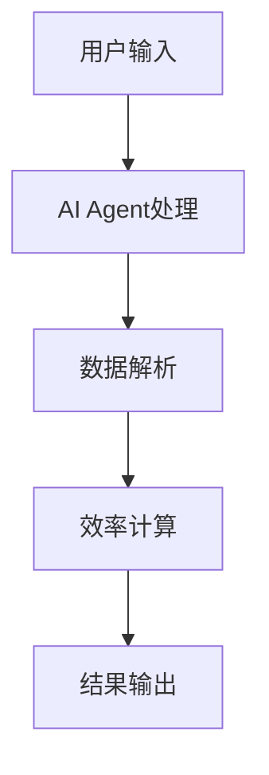
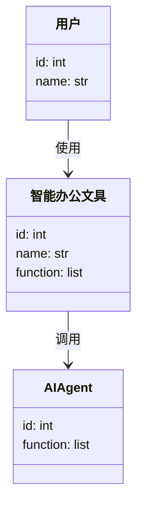
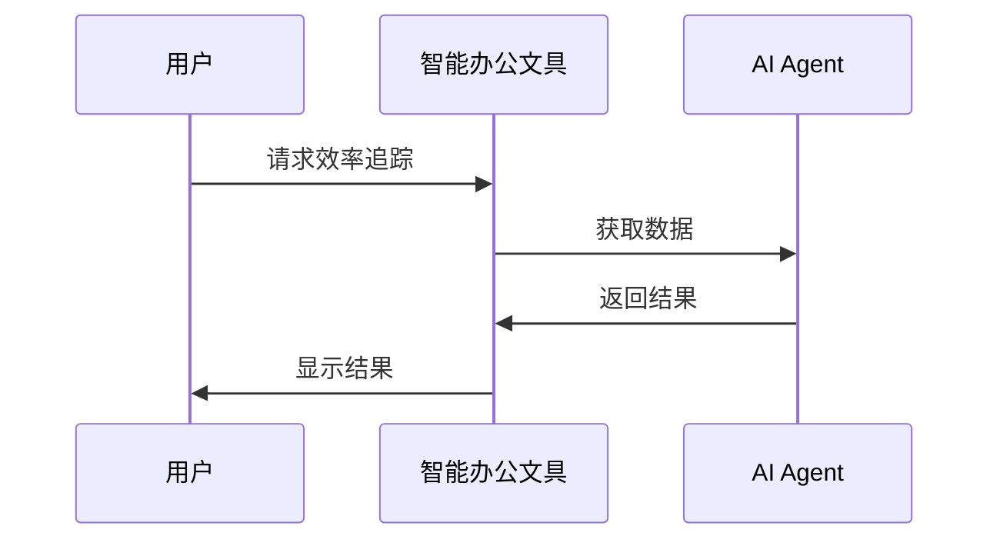

                 


好的，接下来我将按照您的要求，逐步构建《智能办公文具：AI Agent的工作效率追踪》的技术博客文章。

# 智能办公文具：AI Agent的工作效率追踪

## 关键词：
- AI Agent
- 智能办公文具
- 效率追踪
- 系统架构
- 项目实战

## 摘要：
本文深入探讨AI Agent在智能办公文具中的应用，分析其如何通过效率追踪提升办公效率。从背景介绍、核心概念、算法原理到系统架构设计，再到项目实战，最后总结最佳实践，全面解析AI Agent在办公效率提升中的关键作用。

---

## 目录大纲：

### 第一部分: 背景介绍
#### 第1章: 智能办公文具与AI Agent的背景
##### 1.1 问题背景
- 办公效率低下的现状
- AI技术在办公场景中的潜力
- 智能办公文具的发展趋势

##### 1.2 问题描述
- 办公效率追踪的核心问题
- AI Agent在效率追踪中的角色
- 智能办公文具的定义与范围

##### 1.3 问题解决
- AI Agent如何提升办公效率
- 智能办公文具的功能实现
- 效率追踪的具体应用场景

##### 1.4 边界与外延
- 智能办公文具的边界
- AI Agent的应用范围
- 与其他办公工具的协同关系

##### 1.5 核心要素组成
- AI Agent的核心功能
- 智能办公文具的技术架构
- 效率追踪的实现方式

### 第二部分: 核心概念与联系
#### 第2章: AI Agent的核心概念
##### 2.1 核心概念原理
- AI Agent的基本原理
- 智能办公文具的工作机制
- 效率追踪的实现逻辑

##### 2.2 概念属性特征对比
- AI Agent与传统办公工具的对比
- 智能办公文具的功能特点
- 效率追踪的核心属性

##### 2.3 ER实体关系图
```mermaid
er
  actor: 用户
  tool: 智能办公文具
  agent: AI Agent
  efficiency_track
```

### 第三部分: 算法原理讲解
#### 第3章: AI Agent的算法原理
##### 3.1 算法原理概述
- AI Agent的工作流程
- 效率追踪的数学模型

##### 3.2 算法流程图


##### 3.3 数学模型与公式
- 效率计算公式：$$ \text{效率} = \frac{\text{完成任务数}}{\text{时间}} $$
- 优化算法示例：$$ \text{新效率} = \text{旧效率} \times (1 + \alpha) $$，其中 $$ \alpha $$ 是优化因子。

##### 3.4 代码实现
```python
def calculate_efficiency(tasks, time):
    return tasks / time

# 示例
tasks = 10
time = 2
efficiency = calculate_efficiency(tasks, time)
print(f"效率为: {efficiency}")
```

### 第四部分: 系统分析与架构设计
#### 第4章: 系统分析与架构设计
##### 4.1 问题场景介绍
- 办公效率低下的具体场景
- AI Agent的应用需求

##### 4.2 项目介绍
- 智能办公文具的功能概述
- AI Agent的核心目标

##### 4.3 系统功能设计
- 用户需求分析
- 功能模块划分
- 业务流程设计

##### 4.4 领域模型类图


##### 4.5 系统架构设计
- 分层架构图
- 数据流设计
- 模块交互关系

##### 4.6 系统接口设计
- API接口定义
- 数据格式规范
- 接口调用流程

##### 4.7 系统交互序列图


### 第五部分: 项目实战
#### 第5章: 项目实战
##### 5.1 环境安装
- 开发工具安装
- 依赖库安装
- 运行环境配置

##### 5.2 系统核心实现
- AI Agent的实现
- 效率追踪的实现
- 用户界面的设计

##### 5.3 代码解读与分析
```python
class AI-Agent:
    def __init__(self):
        self.tasks = 0
        self.time = 0

    def track_efficiency(self):
        if self.time == 0:
            return 0
        return self.tasks / self.time

# 实例化
agent = AI-Agent()
agent.tasks = 10
agent.time = 2
print(f"效率为: {agent.track_efficiency()}")
```

##### 5.4 实际案例分析
- 项目实现步骤
- 代码解读
- 应用场景分析

##### 5.5 项目小结
- 项目实现总结
- 遇到的问题及解决方案
- 经验分享

### 第六部分: 总结与展望
#### 第6章: 总结与展望
##### 6.1 最佳实践
- 开发建议
- 使用建议
- 优化方向

##### 6.2 小结
- 本文的主要内容回顾
- 关键点总结

##### 6.3 注意事项
- 开发中的注意事项
- 使用中的注意事项
- 常见问题解答

##### 6.4 拓展阅读
- 相关技术领域
- 进一步学习的方向
- 研究热点分析

---

以上是《智能办公文具：AI Agent的工作效率追踪》的技术博客文章目录大纲，涵盖了从背景介绍到项目实战的各个方面，逻辑清晰，结构紧凑，适合技术读者深入理解和实践。希望这篇博客能够为AI Agent在办公效率提升中的应用提供有价值的参考。

