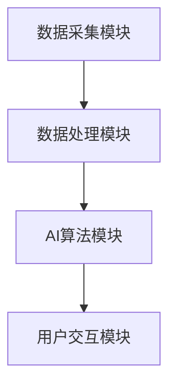
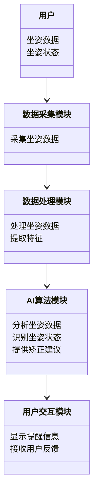
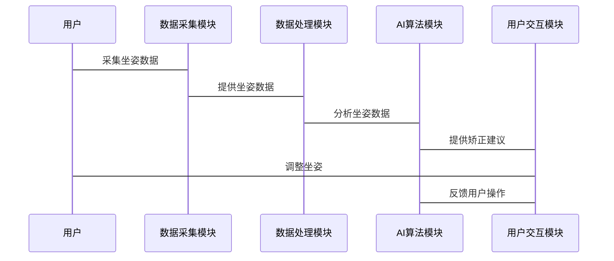

                 


# 智能办公桌：AI Agent的久坐提醒与姿势矫正

> 关键词：智能办公桌，AI Agent，久坐提醒，姿势矫正，人体工程学，传感器技术

> 摘要：随着办公环境的智能化发展，AI Agent在智能办公桌中的应用越来越广泛。本文将从AI Agent的基本概念出发，结合人体工程学原理，详细探讨智能办公桌在久坐提醒与姿势矫正方面的技术实现。通过传感器数据采集、算法分析和系统架构设计，本文旨在为用户提供一种智能化、个性化的办公解决方案。

---

## 第一部分: 智能办公桌与AI Agent的背景介绍

### 第1章: 久坐问题与智能办公桌的背景

#### 1.1 久坐问题的背景与现状
##### 1.1.1 久坐问题的定义与危害
久坐是指长时间保持坐姿，尤其是在办公环境中，长时间的坐姿不当会导致颈椎病、腰椎病、血液循环不畅等一系列健康问题。根据世界卫生组织的研究，久坐已经被列为影响全球健康的主要问题之一。现代办公模式的普及使得久坐问题日益严重，尤其是在科技高度发达的今天，员工们往往长时间面对电脑，缺乏运动，导致身体机能下降。

##### 1.1.2 办公模式的演变与久坐问题的加剧
随着互联网和信息技术的发展，远程办公和居家办公逐渐普及，但这种模式往往导致员工长时间坐在电脑前，久坐问题更加严重。传统的办公桌设计缺乏智能化，无法主动提醒用户调整坐姿或休息，进一步加剧了久坐带来的健康问题。

##### 1.1.3 智能办公桌的出现与发展趋势
智能办公桌的出现为解决久坐问题提供了新的可能性。通过集成传感器和AI技术，智能办公桌能够实时监测用户的坐姿和行为，主动提醒用户调整坐姿或休息。这种智能化的办公桌不仅能够改善员工的健康状况，还能提高办公效率，成为未来办公环境的重要组成部分。

#### 1.2 AI Agent的基本概念与应用场景
##### 1.2.1 AI Agent的定义与核心功能
AI Agent（人工智能代理）是一种能够感知环境、自主决策并执行任务的智能系统。在智能办公桌中，AI Agent的主要功能包括数据采集、行为识别、决策制定和用户交互。通过传感器采集用户的坐姿数据，AI Agent能够分析用户的坐姿状态，并根据分析结果提供相应的提醒或调整建议。

##### 1.2.2 AI Agent在办公场景中的应用
在办公场景中，AI Agent可以应用于多种场景，包括但不限于：
- 久坐提醒：通过分析用户的坐姿数据，AI Agent能够识别出久坐状态，并主动提醒用户休息。
- 姿势矫正：AI Agent可以通过传感器数据分析用户的坐姿，并提供实时的姿势矫正建议。
- 环境优化：AI Agent可以根据用户的坐姿和行为习惯，调整办公桌的高度、角度等参数，以优化用户的办公环境。

##### 1.2.3 智能办公桌中的AI Agent角色
在智能办公桌中，AI Agent扮演着“智能助手”的角色。它不仅能够感知用户的行为，还能根据感知结果主动提供服务。通过与办公桌硬件的结合，AI Agent可以实现坐姿监测、久坐提醒、姿势矫正等功能，帮助用户保持良好的办公姿势，预防健康问题。

#### 1.3 问题背景与解决方案
##### 1.3.1 久坐提醒的必要性
久坐提醒的必要性主要体现在以下几点：
- 预防健康问题：久坐会导致颈椎病、腰椎病、血液循环不畅等健康问题。
- 提高办公效率：长时间的不良坐姿会影响注意力，降低办公效率。
- 优化用户体验：通过提醒用户调整坐姿，可以提升用户的办公体验。

##### 1.3.2 姿势矫正的科学依据
姿势矫正的科学依据主要来源于人体工程学。人体工程学研究人体在工作中的舒适性和效率，通过优化办公环境和坐姿，可以减少身体疲劳和健康问题。AI Agent通过分析用户的坐姿数据，结合人体工程学的原理，提供个性化的姿势矫正建议。

##### 1.3.3 AI Agent在久坐提醒与姿势矫正中的作用
AI Agent在久坐提醒与姿势矫正中的作用主要体现在以下几个方面：
- 实时监测：通过传感器实时采集用户的坐姿数据，分析用户的坐姿状态。
- 智能提醒：当用户出现久坐或不良坐姿时，AI Agent会主动提醒用户调整坐姿或休息。
- 个性化建议：根据用户的具体情况，提供个性化的姿势矫正建议，帮助用户改善坐姿。

#### 1.4 本章小结
本章主要介绍了久坐问题的背景与现状，以及AI Agent在智能办公桌中的应用。通过分析久坐问题的严重性，提出了智能办公桌作为一种解决方案，并详细阐述了AI Agent在其中的核心作用。

---

## 第二部分: AI Agent的核心概念与人体工程学原理

### 第2章: AI Agent的核心原理与技术实现

#### 2.1 AI Agent的基本原理
##### 2.1.1 传感器数据采集与处理
AI Agent通过集成在办公桌中的传感器（如压力传感器、加速度传感器等）采集用户的坐姿数据。这些数据包括用户的坐姿角度、坐姿时间、身体压力分布等。通过数据采集模块，AI Agent可以实时获取用户的坐姿状态。

##### 2.1.2 数据分析与行为识别
通过采集到的坐姿数据，AI Agent需要对数据进行分析，识别出用户的坐姿状态。这包括坐姿的分类（如正坐、前倾、后仰等）和坐姿的持续时间。通过机器学习算法，AI Agent可以训练出一个行为识别模型，准确识别出用户的坐姿状态。

##### 2.1.3 AI算法的决策机制
在识别出用户的坐姿状态后，AI Agent需要根据预设的规则或模型做出决策。例如，当识别出用户已经久坐超过一定时间，AI Agent会触发提醒机制，提醒用户休息。或者，当识别出用户的坐姿不正确时，AI Agent会提供姿势矫正建议。

#### 2.2 人体工程学在办公桌设计中的应用
##### 2.2.1 人体工程学的基本原理
人体工程学是一门研究人与环境之间的关系的科学。它通过优化工作环境和工具的设计，提高工作效率，减少身体疲劳和健康问题。在办公桌设计中，人体工程学主要关注坐姿的舒适性、桌子的高度、角度等参数。

##### 2.2.2 办公桌设计与人体舒适度的关系
办公桌的设计直接影响用户的坐姿和舒适度。通过合理的设计，可以减少久坐带来的健康问题。例如，可调节的桌子高度可以帮助用户找到最舒适的坐姿；倾斜的桌子角度可以减少颈部和背部的压力。

##### 2.2.3 姿势矫正的科学依据
姿势矫正的科学依据来源于人体工程学和生物力学。通过分析用户的坐姿数据，可以识别出不良的坐姿，并根据科学依据提供矫正建议。例如，当用户的背部过于前倾时，可以通过调整椅子的高度或桌子的角度来改善坐姿。

#### 2.3 AI Agent与人体工程学的结合
##### 2.3.1 数据采集与行为分析
通过传感器采集用户的坐姿数据，并结合人体工程学的原理，AI Agent可以分析用户的坐姿状态。例如，通过分析用户的坐姿角度和坐姿时间，AI Agent可以识别出用户的坐姿是否符合人体工程学的要求。

##### 2.3.2 AI算法在姿势矫正中的应用
在分析出用户的坐姿问题后，AI Agent可以根据预设的规则或模型，提供相应的姿势矫正建议。例如，当用户的背部过于前倾时，AI Agent可以通过调整椅子的高度或桌子的角度来改善坐姿。同时，AI Agent还可以通过机器学习算法不断优化矫正建议，提高矫正效果。

##### 2.3.3 个性化提醒机制的设计
个性化提醒机制是AI Agent在智能办公桌中的重要功能之一。通过分析用户的坐姿习惯和健康状况，AI Agent可以制定个性化的提醒策略。例如，对于久坐习惯的用户，AI Agent可以设置更频繁的提醒；对于坐姿良好的用户，AI Agent可以适当减少提醒频率。

#### 2.4 本章小结
本章主要介绍了AI Agent的核心原理和技术实现，以及人体工程学在办公桌设计中的应用。通过传感器数据采集、数据分析和AI算法决策，AI Agent可以实现对用户坐姿的实时监测和智能提醒。同时，结合人体工程学的原理，AI Agent可以提供个性化的姿势矫正建议，帮助用户改善坐姿，预防健康问题。

---

## 第三部分: AI Agent的算法原理与数学模型

### 第3章: 数据采集与特征提取

#### 3.1 数据采集的实现方式
##### 3.1.1 传感器的选择与部署
在智能办公桌中，传感器是数据采集的核心部件。常见的传感器包括压力传感器、加速度传感器、陀螺仪等。这些传感器可以安装在椅子、桌子底部等位置，实时采集用户的坐姿数据。

##### 3.1.2 数据采集的流程与技术
数据采集的流程包括传感器数据的采集、数据预处理和特征提取。通过传感器采集到的原始数据通常需要进行预处理，例如去除噪声、平滑处理等。然后，通过特征提取技术，提取出能够反映用户坐姿状态的特征。

##### 3.1.3 数据预处理与特征提取
数据预处理的目的是提高数据的质量和一致性。例如，通过滤波技术去除传感器噪声，通过归一化处理统一数据的范围。特征提取则是从原始数据中提取出能够反映用户坐姿状态的特征，例如坐姿角度、坐姿时间等。

#### 3.2 数据分析与行为识别
##### 3.2.1 基于AI算法的行为识别模型
行为识别模型是AI Agent的核心模块之一。通过机器学习算法，AI Agent可以训练出一个行为识别模型，用于识别用户的坐姿状态。常见的机器学习算法包括支持向量机（SVM）、随机森林（Random Forest）和神经网络（Neural Network）等。

##### 3.2.2 姿势矫正的特征提取方法
在姿势矫正中，特征提取方法的选择至关重要。例如，可以通过坐姿角度、坐姿时间等特征来分析用户的坐姿状态。通过特征提取，AI Agent可以准确识别出用户的坐姿问题，并提供相应的矫正建议。

##### 3.2.3 久坐提醒的阈值设定
久坐提醒的阈值设定是基于用户的坐姿时间和坐姿状态。例如，当用户连续坐姿超过一定时间，AI Agent会触发提醒机制。阈值的设定需要结合人体工程学的原理和用户的实际情况。

#### 3.3 算法原理与数学模型
##### 3.3.1 基于时间序列的久坐提醒算法
久坐提醒算法基于时间序列分析，通过分析用户的坐姿时间，识别出久坐状态。例如，使用滑动窗口技术，统计用户在一定时间内的坐姿时间，当超过阈值时触发提醒。

##### 3.3.2 基于回归分析的姿势矫正模型
姿势矫正模型基于回归分析，通过分析用户的坐姿数据，预测用户的坐姿状态，并提供相应的矫正建议。例如，通过线性回归模型，预测用户的坐姿角度，并根据预测结果调整桌子的角度。

##### 3.3.3 算法的优化与调优
算法的优化与调优是提高AI Agent性能的关键。例如，通过交叉验证技术优化机器学习模型的参数，提高行为识别的准确率；通过数据增强技术增加训练数据的多样性，提高模型的泛化能力。

#### 3.4 本章小结
本章主要介绍了数据采集与特征提取的实现方式，以及基于AI算法的行为识别模型和数学模型。通过传感器数据采集、特征提取和算法分析，AI Agent可以实现对用户坐姿的实时监测和智能提醒。

---

## 第四部分: 系统架构与交互设计

### 第4章: 系统架构设计

#### 4.1 系统功能模块划分
##### 4.1.1 数据采集模块
数据采集模块负责采集用户的坐姿数据，包括坐姿角度、坐姿时间等。通过传感器技术，数据采集模块可以实时获取用户的坐姿状态。

##### 4.1.2 数据处理模块
数据处理模块负责对采集到的坐姿数据进行预处理和特征提取。通过数据预处理，可以去除噪声，提高数据的质量；通过特征提取，可以提取出能够反映用户坐姿状态的特征。

##### 4.1.3 AI算法模块
AI算法模块是系统的核心模块，负责分析用户的坐姿数据，并做出相应的决策。通过机器学习算法，AI算法模块可以识别出用户的坐姿状态，并触发相应的提醒或调整建议。

##### 4.1.4 用户交互模块
用户交互模块负责与用户进行交互，包括显示提醒信息、接收用户的反馈等。通过用户交互模块，用户可以与AI Agent进行实时互动，调整坐姿或休息。

#### 4.2 系统架构的实现方式
##### 4.2.1 模块之间的接口设计
模块之间的接口设计是系统架构设计的重要部分。例如，数据采集模块与数据处理模块之间的接口需要定义数据的格式和传输方式；AI算法模块与用户交互模块之间的接口需要定义提醒信息的格式和反馈方式。

##### 4.2.2 系统架构图
以下是系统架构的Mermaid图：



#### 4.3 系统功能设计
##### 4.3.1 领域模型Mermaid类图
以下是系统功能的领域模型Mermaid类图：



#### 4.4 系统接口设计
##### 4.4.1 数据采集接口
数据采集接口负责与传感器设备进行通信，获取用户的坐姿数据。接口定义如下：

```python
class Sensor:
    def get_posture_data(self):
        # 返回用户的坐姿数据
        pass
```

##### 4.4.2 AI算法接口
AI算法接口负责接收坐姿数据，分析用户的坐姿状态，并返回相应的建议。接口定义如下：

```python
class AIAlgorithm:
    def analyze_posture(self, data):
        # 分析坐姿数据，返回坐姿状态和建议
        pass
```

##### 4.4.3 用户交互接口
用户交互接口负责显示提醒信息，并接收用户的反馈。接口定义如下：

```python
class UI:
    def show_notification(self, message):
        # 显示提醒信息
        pass
```

#### 4.5 系统交互流程
##### 4.5.1 久坐提醒的交互流程
以下是久坐提醒的交互流程图：


##### 4.5.2 姿势矫正的交互流程
以下是姿势矫正的交互流程图：



#### 4.6 本章小结
本章主要介绍了系统架构设计，包括模块划分、系统架构图、领域模型类图、接口设计和交互流程。通过合理的系统架构设计，AI Agent可以实现对用户坐姿的实时监测和智能提醒，帮助用户改善坐姿，预防健康问题。

---

## 第五部分: 项目实战与最佳实践

### 第5章: 项目实战

#### 5.1 环境安装与配置
##### 5.1.1 系统环境
建议使用Python 3.6及以上版本，安装必要的库，例如：
- `numpy`：用于数据处理和计算。
- `scikit-learn`：用于机器学习算法。
- `mermaid`：用于绘制流程图和类图。
- `pyserial`：用于与传感器设备通信。

##### 5.1.2 安装步骤
1. 安装Python：
   ```bash
   # 在终端中运行以下命令安装Python
   sudo apt-get install python3 python3-pip
   ```
2. 安装必要的库：
   ```bash
   pip install numpy scikit-learn mermaid pyserial
   ```

#### 5.2 系统核心实现
##### 5.2.1 数据采集模块实现
以下是数据采集模块的Python代码：

```python
import serial
import time

class Sensor:
    def __init__(self, port):
        self.port = port
        self.sensor = serial.Serial(port, 9600)

    def get_posture_data(self):
        try:
            data = self.sensor.readline().decode().strip()
            return data
        except:
            return None

# 示例使用
sensor = Sensor('/dev/ttyUSB0')
print(sensor.get_posture_data())
```

##### 5.2.2 AI算法模块实现
以下是AI算法模块的Python代码：

```python
from sklearn import svm
import numpy as np

class AIAlgorithm:
    def __init__(self):
        self.model = svm.SVC()

    def train(self, X, y):
        self.model.fit(X, y)

    def predict(self, X):
        return self.model.predict(X)

# 示例使用
X = np.array([[1, 2, 3], [4, 5, 6], [7, 8, 9]])
y = np.array([0, 1, 0])
ai = AIAlgorithm()
ai.train(X, y)
print(ai.predict(X))
```

##### 5.2.3 用户交互模块实现
以下是用户交互模块的Python代码：

```python
class UI:
    def show_notification(self, message):
        print(f"提醒：{message}")

# 示例使用
ui = UI()
ui.show_notification("请调整坐姿")
```

#### 5.3 实际案例分析与应用解读
##### 5.3.1 案例分析
假设用户长时间保持前倾坐姿，AI Agent会通过传感器数据采集模块获取坐姿数据，AI算法模块分析出用户的坐姿状态为前倾，触发提醒机制。用户交互模块会显示提醒信息，建议用户调整坐姿。

##### 5.3.2 代码应用解读
在上述代码中，数据采集模块通过传感器获取用户的坐姿数据，AI算法模块通过机器学习算法分析坐姿状态，并触发提醒机制。用户交互模块通过显示提醒信息，与用户进行交互。

##### 5.3.3 系统运行与效果分析
系统运行后，AI Agent会实时监测用户的坐姿状态。当识别出用户的坐姿不正确或久坐时，会主动提醒用户调整坐姿或休息。通过系统的运行，用户的坐姿会得到改善，健康问题也会相应减少。

#### 5.4 本章小结
本章通过实际案例分析和代码实现，展示了AI Agent在智能办公桌中的应用。通过传感器数据采集、AI算法分析和用户交互，系统能够实现对用户坐姿的实时监测和智能提醒，帮助用户改善坐姿，预防健康问题。

---

## 第六部分: 总结与展望

### 第6章: 总结与展望

#### 6.1 本章总结
本文详细探讨了AI Agent在智能办公桌中的应用，特别是久坐提醒与姿势矫正方面的技术实现。通过传感器数据采集、AI算法分析和用户交互，AI Agent能够实时监测用户的坐姿状态，并提供相应的提醒和矫正建议。通过系统架构设计和项目实战，展示了AI Agent在智能办公桌中的实际应用。

#### 6.2 未来展望
未来，随着AI技术的不断发展，智能办公桌的功能将更加智能化和个性化。例如，AI Agent可以通过学习用户的习惯，提供更加个性化的提醒和矫正建议；通过与智能家居的联动，提供更加智能化的办公环境。同时，随着传感器技术的不断进步，智能办公桌的监测精度和响应速度也将进一步提高，为用户提供更加优质的办公体验。

#### 6.3 最佳实践 tips
- 定期调整坐姿，保持良好的办公习惯。
- 合理设置AI Agent的提醒频率，避免干扰工作。
- 定期检查传感器设备，确保数据采集的准确性。

#### 6.4 本章小结
本章总结了本文的主要内容，并展望了AI Agent在智能办公桌中的未来发展方向。通过技术的不断进步，AI Agent将为用户提供更加智能化、个性化的办公解决方案。

---

通过以上内容，我们详细探讨了AI Agent在智能办公桌中的应用，特别是在久坐提醒与姿势矫正方面的技术实现。通过传感器数据采集、AI算法分析和用户交互，AI Agent能够实时监测用户的坐姿状态，并提供相应的提醒和矫正建议。未来，随着技术的不断进步，智能办公桌的功能将更加智能化和个性化，为用户提供更加优质的办公体验。

