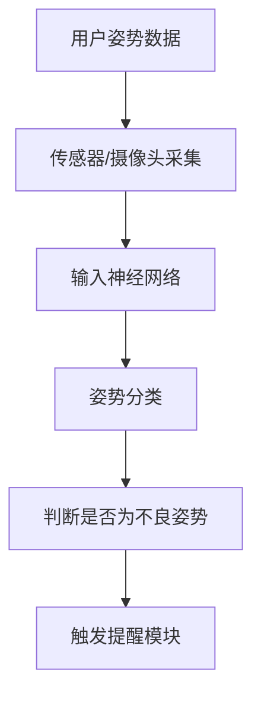
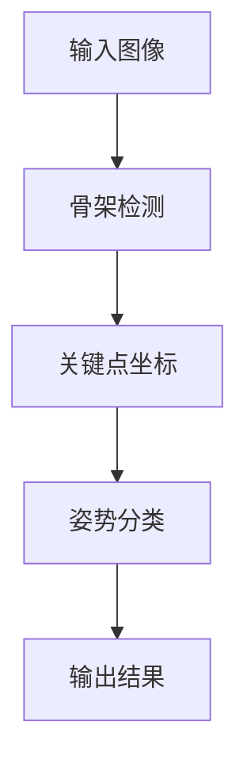
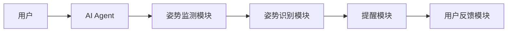
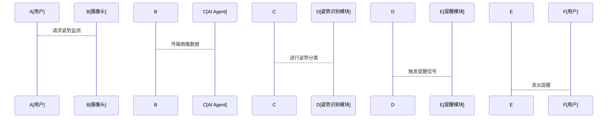

                 


# 智能办公桌：AI Agent的姿势调整提醒

> 关键词：AI Agent，智能办公桌，姿势调整，健康提醒，人体工程学，传感器技术

> 摘要：本文探讨了AI Agent在智能办公桌中的应用，重点分析了如何通过姿势调整提醒系统改善办公环境中的健康问题。文章从背景介绍、核心概念、算法原理、系统架构、项目实战等多方面展开，详细阐述了智能办公桌的设计思路和实现方法。

---

## 第1章：背景介绍与核心概念

### 1.1 问题背景

随着互联网和科技的发展，越来越多的人开始长时间坐在办公桌前工作。长时间的不良坐姿容易导致颈椎病、腰椎病等健康问题。这些问题不仅影响个人健康，还会影响工作效率和企业效益。因此，如何通过技术手段改善办公环境中的健康问题，成为一个重要的研究方向。

AI Agent（人工智能代理）作为一种能够自主决策和执行任务的智能体，具备实时监测和反馈的能力。结合智能办公桌，AI Agent可以通过传感器和摄像头等设备，实时监测用户的坐姿，并通过提醒和调整功能帮助用户保持良好的姿势。

### 1.2 问题描述

姿势问题主要表现为坐姿不正、久坐不动、低头工作等。这些问题不仅影响身体健康，还会导致工作效率下降。传统的办公桌不具备智能化功能，无法主动监测和提醒用户的姿势问题。因此，引入AI Agent技术，将智能办公桌与姿势调整提醒功能相结合，成为改善办公环境的重要手段。

### 1.3 问题解决

通过AI Agent实现姿势调整提醒，可以实时监测用户的坐姿，并在发现不良姿势时及时发出提醒。这种技术不仅能够帮助用户保持良好的姿势，还能减少因姿势问题引发的健康问题，提高工作效率。智能办公桌的设计目标是通过AI技术实现智能化、个性化的办公环境优化。

### 1.4 边界与外延

智能办公桌的姿势调整提醒系统主要针对办公室环境，适用人群为长时间办公的上班族。系统的局限性在于依赖传感器和摄像头的准确性，可能会受到环境光线、设备精度等因素的影响。此外，系统的提醒功能需要用户配合，才能达到最佳效果。

### 1.5 核心要素组成

智能办公桌的姿势调整提醒系统由以下几个核心要素组成：
1. **AI Agent**：负责监测和判断用户的姿势。
2. **传感器和摄像头**：用于采集用户姿势数据。
3. **提醒模块**：通过声音、震动等方式提醒用户调整姿势。
4. **用户反馈机制**：收集用户反馈，优化提醒策略。

---

## 第2章：核心概念与联系

### 2.1 AI Agent的核心原理

AI Agent通过传感器和摄像头采集用户的姿势数据，利用深度学习算法进行姿势识别。当检测到不良姿势时，AI Agent会触发提醒模块，发出提醒信号。提醒信号可以是声音、震动或屏幕提示，帮助用户调整姿势。

### 2.2 姿势提醒系统的实体关系

以下是姿势提醒系统的实体关系图：

```mermaid
er
actor: 用户
agent: AI Agent
system: 始终提醒系统
sensors: 传感器
cameras: 摄像头
```

### 2.3 算法原理

姿势识别算法主要基于深度学习技术，常用的模型包括卷积神经网络（CNN）和骨架检测模型。以下是基于CNN的姿势识别流程：



以下是基于骨架检测的姿势识别代码示例：

```python
import tensorflow as tf
from tensorflow.keras import layers

model = tf.keras.Sequential([
    layers.Conv2D(32, (3,3), activation='relu', input_shape=(64,64,3)),
    layers.MaxPooling2D((2,2)),
    layers.Flatten(),
    layers.Dense(128, activation='relu'),
    layers.Dense(2, activation='sigmoid')
])

model.compile(optimizer='adam', loss='binary_crossentropy', metrics=['accuracy'])
```

---

## 第3章：算法原理与实现

### 3.1 姿势识别算法

姿势识别算法是整个系统的核心，主要分为以下几个步骤：
1. **数据采集**：通过摄像头和传感器采集用户的姿势数据。
2. **数据预处理**：对采集到的数据进行归一化和增强处理。
3. **模型训练**：利用深度学习模型进行姿势分类。
4. **实时检测**：在实际场景中实时检测用户的姿势。

以下是基于骨架检测的姿势分类模型：



### 3.2 提醒策略的优化

提醒策略的优化主要通过以下方式实现：
1. **基于时间间隔的提醒算法**：每隔一定时间提醒用户调整姿势。
2. **基于用户行为模式的自适应提醒**：根据用户的姿势习惯动态调整提醒频率。
3. **基于反馈的动态调整策略**：根据用户的反馈优化提醒策略。

---

## 第4章：系统分析与架构设计

### 4.1 系统功能设计

智能办公桌的姿势调整提醒系统主要包括以下几个功能模块：
1. **姿势监测模块**：通过传感器和摄像头监测用户的姿势。
2. **姿势识别模块**：利用AI算法识别用户的姿势状态。
3. **提醒模块**：在检测到不良姿势时发出提醒信号。
4. **用户反馈模块**：收集用户的反馈信息，优化提醒策略。

### 4.2 系统架构设计

以下是系统的架构图：



### 4.3 系统接口设计

系统的接口设计主要包括以下几个部分：
1. **传感器接口**：与摄像头和传感器设备对接。
2. **用户界面**：提供友好的用户交互界面。
3. **提醒接口**：与提醒模块对接，发出提醒信号。

---

## 第5章：项目实战

### 5.1 环境安装

以下是项目实战所需的环境和工具：
1. **Python 3.8及以上版本**。
2. **TensorFlow 2.0及以上版本**。
3. **OpenCV库**。
4. **摄像头和传感器设备**。

### 5.2 核心代码实现

以下是姿势识别模块的核心代码：

```python
import cv2
import numpy as np

def pose_detection(image):
    # 对图像进行预处理
    image = cv2.resize(image, (64, 64))
    image = image / 255.0
    image = np.expand_dims(image, axis=0)
    
    # 通过模型进行预测
    prediction = model.predict(image)
    return prediction[0][0]  # 返回姿势判断结果
```

### 5.3 案例分析

以下是一个实际案例分析：



---

## 第6章：总结与展望

### 6.1 最佳实践

1. **定期更新模型**：根据新的数据优化姿势识别算法。
2. **优化提醒策略**：根据用户反馈动态调整提醒频率。
3. **加强用户教育**：通过培训提高用户对姿势健康的重视。

### 6.2 小结

智能办公桌结合AI Agent的姿势调整提醒系统，不仅能够实时监测用户的姿势，还能通过提醒功能帮助用户保持良好的姿势。这种技术的应用将有效改善办公环境中的健康问题，提高工作效率。

### 6.3 注意事项

1. **数据隐私**：注意保护用户的姿势数据，防止隐私泄露。
2. **设备精度**：确保传感器和摄像头的精度，提高检测准确性。
3. **用户体验**：优化提醒方式，避免打扰用户的正常工作。

### 6.4 拓展阅读

1. **深度学习在姿势识别中的应用**。
2. **AI Agent在办公环境中的其他应用**。
3. **人体工程学在办公设计中的应用**。

---

通过以上内容，我们可以看到，AI Agent在智能办公桌中的应用为办公环境的健康优化提供了新的思路。未来，随着技术的不断发展，智能办公桌的功能将更加智能化和个性化，为用户提供更加舒适和高效的办公体验。

