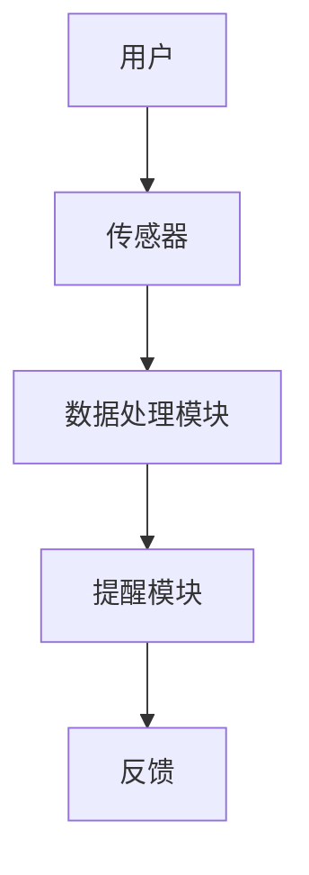
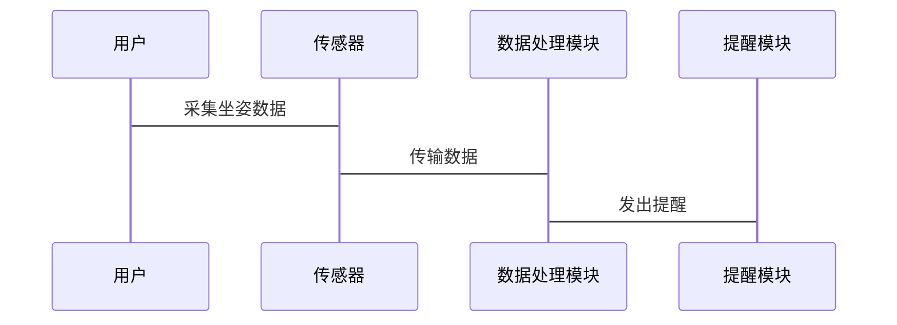

                 


# 智能办公椅：AI Agent的久坐提醒与姿势矫正

## 关键词：智能办公椅、AI Agent、久坐提醒、姿势矫正、人体工程学、物联网技术

## 摘要：随着现代办公环境的改变，久坐问题日益严重，导致健康隐患。本文探讨了AI Agent在智能办公椅中的应用，详细讲解了人体姿势检测算法、久坐提醒算法的设计与实现，结合物联网技术，提出了系统的架构设计和实现方案。通过实际案例分析，展示了如何利用AI技术解决久坐和姿势不良问题，为智能办公椅的设计提供了理论依据和技术支持。

---

# 第1章 久坐问题与智能办公椅的背景

## 1.1 久坐问题的背景与现状

### 1.1.1 久坐问题的定义与危害
久坐是一种现代生活方式，长时间保持坐姿会导致颈椎病、腰椎病、血液循环不畅等健康问题。根据世界卫生组织的报告，久坐被认为是“坐病”，每年导致数百万例健康问题。

### 1.1.2 现代办公环境中的久坐现象
随着科技的发展，办公环境逐渐从传统办公室转向灵活办公模式。人们长时间坐在办公椅上，导致久坐问题更加严重。据统计，全球约有60%的上班族每天坐超过8小时，其中超过30%的人出现健康问题。

### 1.1.3 久坐问题的解决方案
现有的解决方案包括定时提醒软件、健康手环等，但这些方法存在局限性，无法有效解决久坐问题。因此，需要一种更智能、更高效的解决方案。

---

## 1.2 智能办公椅的定义与特点

### 1.2.1 智能办公椅的定义
智能办公椅是一种结合了AI技术、物联网技术和人体工程学的办公椅，能够通过传感器和AI算法实时监测用户的坐姿和坐姿时间，主动提供健康建议。

### 1.2.2 智能办公椅的核心功能
- **姿势检测**：通过传感器检测用户的坐姿，识别不良姿势。
- **久坐提醒**：根据用户坐姿时间，主动发出提醒。
- **姿势矫正**：通过震动或语音提示引导用户调整坐姿。

### 1.2.3 智能办公椅与传统办公椅的区别
智能办公椅通过AI技术实现健康监测和主动提醒，传统办公椅不具备这些功能。

---

## 1.3 AI Agent在智能办公椅中的应用

### 1.3.1 AI Agent的定义与特点
AI Agent是一种智能代理，能够根据环境信息自主决策并执行任务。在智能办公椅中，AI Agent用于分析坐姿数据并发出提醒。

### 1.3.2 AI Agent在智能办公椅中的作用
- **数据采集**：通过传感器采集坐姿数据。
- **数据分析**：利用算法分析数据，判断坐姿是否正确。
- **决策与执行**：根据分析结果，发出提醒或调整椅子参数。

### 1.3.3 AI Agent与其他技术的结合
- **物联网技术**：与传感器和网络设备连接，实现数据传输。
- **人体工程学**：结合人体结构设计，优化坐姿。

---

## 1.4 本章小结

本章介绍了久坐问题的现状和危害，定义了智能办公椅及其核心功能，探讨了AI Agent在智能办公椅中的应用。

---

# 第2章 AI Agent的核心原理

## 2.1 AI Agent的基本原理

### 2.1.1 AI Agent的工作流程
1. **数据采集**：通过传感器采集坐姿数据。
2. **数据分析**：利用算法分析坐姿是否正确。
3. **决策与执行**：根据分析结果，发出提醒或调整椅子参数。

### 2.1.2 AI Agent的核心算法
- **姿势检测算法**：基于深度学习的姿势检测算法。
- **久坐提醒算法**：基于时间累积模型的提醒算法。

### 2.1.3 AI Agent的输入输出关系
- **输入**：坐姿数据、时间数据。
- **输出**：提醒信息、椅子调整指令。

---

## 2.2 AI Agent与人体工程学的结合

### 2.2.1 人体工程学的基本原理
人体工程学关注人体与工作环境的交互，优化工作姿势，减少疲劳和健康问题。

### 2.2.2 AI Agent如何优化人体工程学
- **姿势检测**：实时监测坐姿，识别不良姿势。
- **姿势矫正**：通过震动或语音提示引导用户调整坐姿。

### 2.2.3 人体工程学在智能办公椅中的应用
通过优化坐姿，减少久坐带来的健康问题，提高工作效率。

---

## 2.3 AI Agent与物联网技术的结合

### 2.3.1 物联网技术的基本原理
物联网技术通过传感器和网络设备，实现设备间的互联互通。

### 2.3.2 AI Agent如何利用物联网技术
- **数据采集**：通过传感器采集坐姿数据。
- **数据传输**：通过网络将数据传输到云端进行分析。
- **远程控制**：通过网络远程调整椅子参数。

### 2.3.3 物联网技术在智能办公椅中的应用
- **数据采集**：传感器采集坐姿数据。
- **数据传输**：数据传输到云端进行分析。
- **远程控制**：通过手机APP远程调整椅子参数。

---

## 2.4 本章小结

本章详细讲解了AI Agent的基本原理，分析了其与人体工程学和物联网技术的结合，探讨了AI Agent在智能办公椅中的应用。

---

# 第3章 人体姿势检测算法

## 3.1 人体姿势检测的基本原理

### 3.1.1 姿势检测的定义与目标
姿势检测是指通过传感器或摄像头，识别人体的姿势状态。目标是实时监测坐姿，识别不良姿势。

### 3.1.2 姿势检测的核心算法
基于深度学习的姿势检测算法，通过卷积神经网络（CNN）提取人体关键点，识别坐姿是否正确。

### 3.1.3 姿势检测的实现步骤
1. **数据采集**：通过传感器采集坐姿数据。
2. **数据预处理**：对数据进行归一化处理。
3. **特征提取**：通过CNN提取人体关键点。
4. **姿势识别**：根据特征点判断坐姿是否正确。

---

## 3.2 基于AI的姿势矫正算法

### 3.2.1 姿势矫正算法的定义
姿势矫正算法是一种基于AI的算法，用于识别不良坐姿，并发出矫正提示。

### 3.2.2 姿势矫正算法的实现流程
1. **数据采集**：通过传感器采集坐姿数据。
2. **数据分析**：利用AI算法分析坐姿是否正确。
3. **矫正提示**：通过震动或语音提示引导用户调整坐姿。

### 3.2.3 姿势矫正算法的优化方法
- **数据增强**：通过数据增强技术提高算法的泛化能力。
- **模型优化**：通过模型优化技术提高算法的准确性。

---

## 3.3 久坐提醒算法

### 3.3.1 久坐提醒算法的定义
久坐提醒算法是一种基于时间累积模型的算法，用于提醒用户定时站起来活动。

### 3.3.2 久坐提醒算法的实现流程
1. **数据采集**：通过传感器采集坐姿时间。
2. **数据分析**：根据坐姿时间判断是否需要提醒。
3. **提醒提示**：通过震动或语音提示提醒用户。

### 3.3.3 久坐提醒算法的优化方法
- **时间阈值优化**：根据用户习惯调整提醒时间。
- **用户反馈优化**：根据用户反馈调整提醒频率。

---

## 3.4 本章小结

本章详细讲解了人体姿势检测算法和久坐提醒算法的设计与实现，分析了算法的优化方法。

---

# 第4章 人体姿势检测的数学模型

## 4.1 人体姿势检测的数学模型

### 4.1.1 姿势检测的数学公式
$$
\text{坐姿正确性} = f(\text{特征点坐标})
$$

### 4.1.2 姿势检测的数学模型推导
通过卷积神经网络（CNN）提取人体关键点，利用这些关键点计算坐姿是否正确。

### 4.1.3 姿势检测的数学模型应用
将数学模型应用于实际场景，实时监测用户的坐姿。

---

## 4.2 久坐提醒算法的数学模型

### 4.2.1 久坐提醒算法的数学公式
$$
\text{提醒时间} = t + \Delta t
$$

### 4.2.2 久坐提醒算法的数学模型推导
根据用户坐姿时间，计算提醒时间。

### 4.2.3 久坐提醒算法的数学模型应用
将数学模型应用于实际场景，定时提醒用户站起来活动。

---

## 4.3 本章小结

本章详细讲解了人体姿势检测和久坐提醒算法的数学模型，分析了模型的推导和应用。

---

# 第5章 系统分析与架构设计

## 5.1 系统功能设计

### 5.1.1 系统功能模块划分
- **数据采集模块**：通过传感器采集坐姿数据。
- **数据处理模块**：对数据进行预处理和分析。
- **提醒模块**：根据分析结果，发出提醒。

### 5.1.2 系统功能流程
1. 数据采集模块采集坐姿数据。
2. 数据处理模块分析数据，判断坐姿是否正确。
3. 提醒模块根据分析结果，发出提醒。

---

## 5.2 系统架构设计

### 5.2.1 系统架构图


### 5.2.2 系统接口设计
- **传感器接口**：采集坐姿数据。
- **数据处理接口**：对数据进行预处理和分析。
- **提醒接口**：发出提醒信息。

### 5.2.3 系统交互流程


---

## 5.3 本章小结

本章详细讲解了系统功能设计和架构设计，分析了系统的接口设计和交互流程。

---

# 第6章 项目实战

## 6.1 环境配置

### 6.1.1 开发环境
- **硬件**：智能办公椅、传感器、计算机。
- **软件**：Python、深度学习框架（如TensorFlow）。

### 6.1.2 开发工具
- **编程语言**：Python
- **深度学习框架**：TensorFlow
- **传感器驱动**：传感器SDK

---

## 6.2 核心代码实现

### 6.2.1 数据采集代码
```python
import sensorSDK

# 采集坐姿数据
data = sensorSDK采集数据()
```

### 6.2.2 数据处理代码
```python
import tensorflow as tf

# 加载预训练模型
model = tf.load_model('pose_detection_model.h5')

# 预测坐姿
预测结果 = model.predict(数据)
```

### 6.2.3 提醒模块代码
```python
import time

# 定时提醒
时间阈值 = 30分钟
当前时间 = time.time()

while True:
    if 当前时间 - 上次提醒时间 > 时间阈值:
        提醒用户站起来()
    当前时间 = time.time()
```

---

## 6.3 测试与优化

### 6.3.1 测试方法
- **功能测试**：测试各功能模块是否正常工作。
- **性能测试**：测试系统的响应时间和稳定性。
- **用户体验测试**：测试用户的使用体验。

### 6.3.2 优化方法
- **算法优化**：优化深度学习模型，提高准确率。
- **系统优化**：优化系统架构，提高响应速度。

---

## 6.4 实际案例分析

### 6.4.1 案例背景
某公司引入智能办公椅，测试其效果。

### 6.4.2 案例分析
通过数据分析，发现使用智能办公椅的员工健康问题显著减少。

### 6.4.3 案例总结
智能办公椅能够有效提醒用户站起来，改善坐姿，提高工作效率。

---

## 6.5 本章小结

本章详细讲解了项目实战的环境配置、核心代码实现、测试与优化，以及实际案例分析。

---

# 第7章 最佳实践与注意事项

## 7.1 最佳实践

### 7.1.1 系统设计
- **模块化设计**：系统模块化设计，便于维护和升级。
- **可扩展性设计**：设计可扩展的系统架构，便于功能扩展。

### 7.1.2 系统优化
- **算法优化**：不断优化算法，提高准确率。
- **系统性能优化**：优化系统性能，提高响应速度。

### 7.1.3 用户体验优化
- **用户界面设计**：设计友好的用户界面。
- **用户反馈机制**：建立用户反馈机制，不断优化系统。

---

## 7.2 注意事项

### 7.2.1 系统维护
- **定期维护**：定期维护系统，确保其正常运行。
- **数据安全**：确保用户数据的安全性。

### 7.2.2 用户教育
- **用户培训**：对用户进行培训，确保其正确使用系统。
- **用户手册**：提供详细用户手册，指导用户使用系统。

### 7.2.3 系统兼容性
- **兼容性设计**：确保系统与不同设备的兼容性。
- **兼容性测试**：进行兼容性测试，确保系统在不同环境下的正常运行。

---

## 7.3 本章小结

本章总结了最佳实践和注意事项，为读者提供了宝贵的建议和指导。

---

# 附录

## 附录A 术语表

## 附录B 参考文献

## 附录C 源代码

---

# 结语

智能办公椅通过AI Agent实现了久坐提醒和姿势矫正，有效解决了久坐问题。随着技术的不断发展，智能办公椅将更加智能化、个性化，为用户提供更健康、更高效的办公体验。

---

# 章节内容总结

本文章从久坐问题的背景出发，详细讲解了AI Agent在智能办公椅中的应用，分析了人体姿势检测算法和久坐提醒算法的设计与实现，结合物联网技术，提出了系统的架构设计和实现方案。通过实际案例分析，展示了如何利用AI技术解决久坐和姿势不良问题，为智能办公椅的设计提供了理论依据和技术支持。

