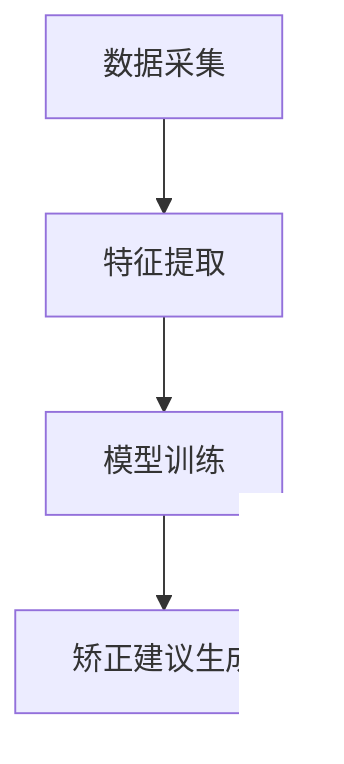
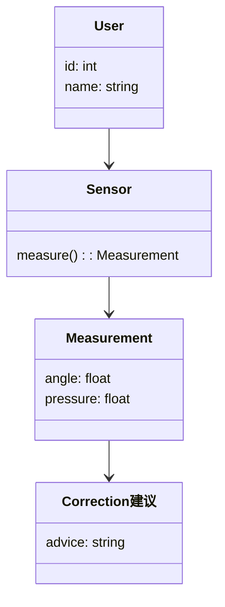
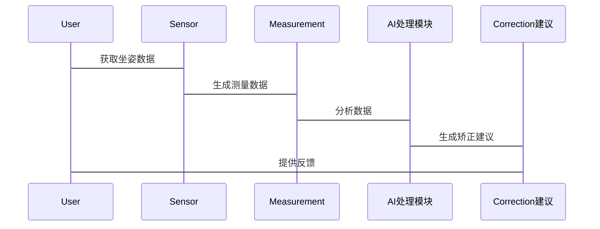

                 


# 智能办公椅：AI Agent的坐姿矫正系统

> 关键词：智能办公椅、AI Agent、坐姿矫正、传感器技术、机器学习、系统架构、健康科技

> 摘要：随着办公环境的日益复杂化和人们健康意识的增强，坐姿矫正已成为一个重要的健康问题。传统的方法依赖于人为监督和提醒，效果有限。而AI Agent技术的引入，为智能办公椅提供了实时监测和个性化矫正的可能。本文将详细介绍智能办公椅中AI Agent的坐姿矫正系统，从背景介绍到系统架构，从算法原理到项目实战，最后总结最佳实践。

---

# 第一部分: 智能办公椅的背景与核心概念

## 第1章: 智能办公椅与AI Agent的背景介绍

### 1.1 坐姿矫正的重要性
- **坐姿与健康的关系**：良好的坐姿有助于预防脊柱侧弯、颈椎病等健康问题。
- **长期不良坐姿的危害**：可能导致肌肉劳损、腰背疼痛，甚至影响内脏功能。
- **办公环境中坐姿问题的普遍性**：长时间坐着工作的上班族容易出现坐姿不良的情况。

### 1.2 AI Agent的基本概念
- **什么是AI Agent**：AI Agent（智能体）是指能够感知环境、自主决策并执行任务的智能系统。
- **AI Agent的核心功能与特点**：具备学习能力、适应性、实时反馈等特点。
- **AI Agent在智能办公椅中的应用场景**：实时监测坐姿，提供矫正建议，记录健康数据。

### 1.3 智能办公椅的定义与特点
- **智能办公椅的功能定义**：集成了传感器和AI技术，能够实时监测坐姿并提供反馈的椅子。
- **智能办公椅的核心技术特点**：内置传感器、AI算法、反馈机制、个性化设置。
- **智能办公椅与传统办公椅的主要区别**：智能化、个性化、实时反馈。

### 1.4 问题背景与问题描述
- **问题背景**：长时间坐姿不良导致的健康问题日益严重。
- **问题描述**：传统坐姿矫正方法依赖于人为监督，效果有限。
- **问题解决**：AI Agent通过实时监测和反馈，帮助用户保持良好坐姿。
- **系统的边界与外延**：智能办公椅仅关注坐姿矫正，不涉及其他健康问题。
- **核心概念与系统组成**：传感器、AI算法、反馈机制、用户界面。

---

## 第2章: 核心概念与原理

### 2.1 AI Agent坐姿矫正系统的核心原理
- **系统的工作原理**：通过传感器采集坐姿数据，AI算法分析数据并生成矫正建议。
- **传感器数据的采集与处理**：包括背部压力、坐姿角度、身体姿态等数据。
- **AI算法在坐姿矫正中的应用**：利用机器学习模型识别不良坐姿并提供矫正建议。

### 2.2 核心概念对比表
| 概念       | 描述                               |
|------------|------------------------------------|
| AI Agent   | 具有感知、决策和执行能力的智能体   |
| 坐姿矫正   | 通过技术手段纠正不良坐姿           |
| 传感器     | 采集坐姿相关的物理数据             |

### 2.3 ER实体关系图
```mermaid
er
  title 实体关系图
  User(用户)
  Sensor(传感器)
  Correction建议(矫正建议)
  Measurement(测量数据)
  User -|> Measurement: 产生
  Sensor -|> Measurement: 采集
  Measurement -|> Correction建议: 生成
```

---

# 第二部分: AI Agent坐姿矫正系统的核心概念与联系

## 第3章: 算法原理讲解

### 3.1 算法流程概述
- **数据采集**：传感器采集坐姿数据。
- **特征提取**：提取关键特征，如背部压力分布、坐姿角度等。
- **模型训练**：利用机器学习模型训练坐姿矫正算法。
- **矫正建议生成**：基于模型预测结果生成矫正建议。

### 3.2 算法流程图


### 3.3 Python源代码
```python
import numpy as np
from sklearn import svm

# 示例数据：0表示良好，1表示不良
X = np.array([[1, 0], [0, 1], [1, 1], [0, 0]])
y = np.array([0, 0, 1, 1])

# 训练SVM模型
model = svm.SVC()
model.fit(X, y)

# 预测新数据
test_data = np.array([[1, 1]])
print("预测结果：", model.predict(test_data))
```

### 3.4 数学模型与公式
- **坐姿评分公式**：
  $$ \text{评分} = \frac{1}{1 + e^{-\theta}} $$
  其中，θ是模型预测的角度偏差。

---

## 第4章: 系统分析与架构设计方案

### 4.1 问题场景介绍
- **场景描述**：办公室环境中，用户长时间坐姿不良，系统实时监测并提供反馈。

### 4.2 系统功能设计
- **数据采集模块**：采集坐姿数据。
- **AI处理模块**：分析数据并生成矫正建议。
- **反馈模块**：通过震动或语音提醒用户调整坐姿。

### 4.3 领域模型类图


### 4.4 系统架构设计
- **分层架构**：数据采集层、业务逻辑层、用户界面层。
- **数据库设计**：存储用户数据、测量数据、矫正建议。

### 4.5 接口设计
- **传感器接口**：提供坐姿数据接口。
- **矫正建议接口**：提供矫正建议的输出接口。

### 4.6 系统交互流程图


---

## 第5章: 项目实战

### 5.1 环境安装
- **安装Python和必要的库**：如numpy、scikit-learn、tensorflow。
- **安装数据库**：如SQLite或MySQL。

### 5.2 核心实现源代码
```python
import sqlite3
from sklearn.svm import SVC

# 数据库连接
conn = sqlite3.connect('posture.db')
cursor = conn.cursor()

# 创建测量数据表
cursor.execute('''CREATE TABLE measurements
                (id INTEGER PRIMARY KEY AUTOINCREMENT,
                 angle FLOAT,
                 pressure FLOAT)''')

# 训练模型
model = SVC()
model.fit(X, y)

# 保存模型
import joblib
joblib.dump(model, 'posture_model.pkl')
```

### 5.3 实际案例分析
- **案例1**：用户坐姿角度偏移，系统提示调整背部。
- **案例2**：用户长时间保持不良坐姿，系统发出震动提醒。

### 5.4 项目小结
- **项目成果**：实现了AI Agent的坐姿矫正系统。
- **经验总结**：传感器精度、模型训练效果、用户反馈机制是关键。

---

## 第6章: 最佳实践

### 6.1 小结
- AI Agent在坐姿矫正中的应用前景广阔。
- 系统设计需要关注传感器精度、算法优化和用户体验。

### 6.2 注意事项
- 数据隐私保护
- 系统稳定性与可靠性
- 用户体验设计

### 6.3 拓展阅读
- 推荐书籍：《人工智能：一种现代方法》
- 推荐论文：《基于机器学习的坐姿矫正系统研究》

---

# 结语
智能办公椅结合AI Agent的坐姿矫正系统，通过实时监测和反馈，帮助用户保持良好坐姿，预防健康问题。随着技术的进步，未来的办公环境将更加智能化和人性化。

