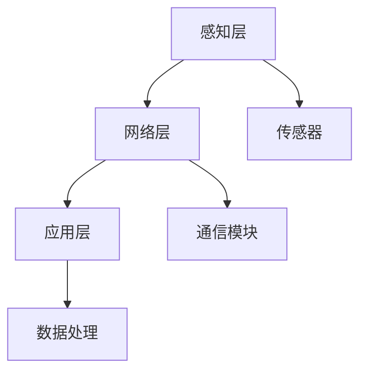
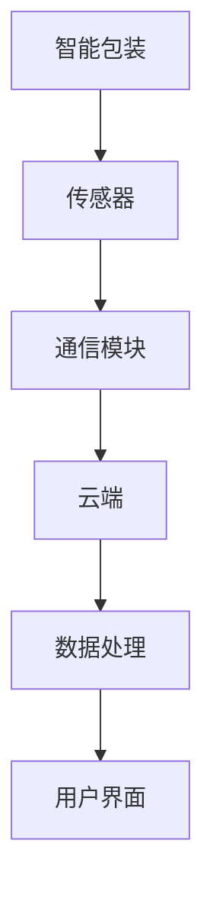

                 


# 智能包装技术在物流领域的应用与投资前景

> 关键词：智能包装技术，物流，物联网，RFID，传感器，投资前景

> 摘要：智能包装技术作为现代物流行业的重要创新方向，通过整合物联网、RFID、传感器等技术，实现了包装的智能化和数据化。本文将详细探讨智能包装技术的核心原理、在物流领域的具体应用、投资分析以及未来的发展趋势，为读者提供全面的视角。

---

## 第1章：智能包装技术的背景与定义

### 1.1 智能包装技术的定义与核心要素
智能包装技术是一种结合了物联网、传感器和数据通信技术的包装解决方案。其核心目标是通过在包装中嵌入智能设备，实时采集和传输商品的状态信息（如温湿度、震动、位置等），从而实现对物流过程的精准监控和优化。

#### 智能包装技术的核心要素
- **感知层**：通过传感器采集环境数据。
- **网络层**：利用通信技术（如Wi-Fi、蓝牙、NB-IoT）传输数据。
- **应用层**：对数据进行分析并提供决策支持。

#### 智能包装与传统包装的区别
传统包装仅起到保护和承载商品的作用，而智能包装则具备数据采集、传输和分析的功能，能够为物流企业提供实时的监控数据，从而优化供应链管理。

### 1.2 智能包装技术的背景与驱动因素
物流行业正朝着高效化、智能化方向发展，对包装技术提出了更高的要求。智能包装技术的出现，正是为了满足这一需求。

#### 技术进步对智能包装的推动
- 物联网技术的成熟。
- 传感器技术的微型化和低成本化。
- 云计算和大数据分析能力的提升。

#### 市场需求驱动
- 消费者对商品质量的要求不断提高。
- 物流企业对降本增效的需求。

### 1.3 智能包装技术的应用现状与趋势
目前，智能包装技术已在冷链物流、高端制造业等领域得到应用。未来，随着5G、人工智能技术的发展，智能包装将更加普及，并向个性化、智能化方向发展。

---

## 第2章：智能包装技术的核心技术与原理

### 2.1 智能包装技术的核心技术
智能包装技术的核心在于其感知、通信和数据处理能力。

#### 2.1.1 物联网技术
物联网技术是智能包装的基础，通过传感器和通信模块，实现包装与外部系统的实时连接。

#### 2.1.2 RFID技术
RFID（射频识别）技术通过无接触的方式采集商品信息，常用于库存管理和物流追踪。

#### 2.1.3 传感器技术
传感器用于采集包装的环境数据，如温湿度、震动等。

### 2.2 智能包装系统的整体架构
智能包装系统的架构可以分为感知层、网络层和应用层。

#### 系统架构图（Mermaid）


### 2.3 智能包装技术的实现流程
智能包装的实现流程包括数据采集、传输、处理和反馈。

#### 2.3.1 数据采集与传输
传感器采集数据后，通过通信模块将数据传输到云端。

#### 2.3.2 数据处理与分析
云端对数据进行分析，生成相应的反馈信息。

#### 2.3.3 信息反馈与决策
系统根据分析结果优化物流流程。

---

## 第3章：智能包装技术在物流领域的具体应用

### 3.1 智能包装在物流监控中的应用
智能包装能够实时监控商品的运输状态，确保商品质量。

#### 3.1.1 温湿度实时监控
通过温湿度传感器，智能包装可以实时监控药品、食品的运输条件。

#### 3.1.2 运输过程中的震动监测
震动传感器可以检测运输过程中的震动情况，避免货物损坏。

#### 3.1.3 包装状态的实时反馈
智能包装可以实时反馈包装的状态，如是否开封、是否损坏等。

### 3.2 智能包装在仓储管理中的应用
智能包装能够优化仓储管理，提高效率。

#### 3.2.1 智能仓储系统的优化
通过智能包装，仓储系统可以实现自动识别和分类。

#### 3.2.2 包裹信息的自动识别与分类
RFID技术可以快速读取包裹信息，实现自动化管理。

#### 3.2.3 库存管理的智能化
智能包装可以实时更新库存信息，提高管理效率。

### 3.3 智能包装在运输优化中的应用
智能包装能够优化运输路径和成本。

#### 3.3.1 运输路径优化
通过数据分析，智能包装可以优化运输路径，降低运输成本。

#### 3.3.2 运输成本的降低
智能包装可以帮助企业实现资源的最优分配，降低运输成本。

#### 3.3.3 运输效率的提升
智能包装可以实时监控运输过程，提高运输效率。

### 3.4 智能包装在逆向物流中的应用
智能包装能够优化逆向物流流程，降低回收成本。

#### 3.4.1 退货包装的智能识别
智能包装可以自动识别退货包装，简化退货流程。

#### 3.4.2 逆向物流流程的优化
智能包装可以实时监控退货包装的状态，确保退货流程的顺利进行。

#### 3.4.3 包装回收的智能化管理
智能包装可以实现包装的智能回收和再利用，降低回收成本。

---

## 第4章：智能包装技术的投资分析与前景展望

### 4.1 智能包装技术的市场现状与规模
智能包装技术市场正在快速增长，尤其是在中国和欧美市场。

#### 4.1.1 全球市场现状分析
全球智能包装市场预计将以年均15%的速度增长。

#### 4.1.2 中国市场规模预测
中国市场规模将从2023年的100亿元增长到2028年的300亿元。

#### 4.1.3 市场竞争格局分析
主要竞争企业包括SAP、IBM、华为等。

### 4.2 智能包装技术的投资驱动因素
#### 4.2.1 技术进步推动
物联网、5G等技术的发展为智能包装提供了技术支持。

#### 4.2.2 市场需求增长
消费者对高质量物流服务的需求不断增加。

### 4.3 智能包装技术的投资机会与风险
#### 4.3.1 投资机会
- 冷链物流领域的智能包装。
- 智能包装在新零售中的应用。

#### 4.3.2 投资风险
- 技术研发成本高。
- 市场竞争激烈。

### 4.4 未来发展前景展望
智能包装技术将在物流、零售、制造等领域得到更广泛的应用，市场规模将进一步扩大。

---

## 第5章：智能包装技术的系统设计与实现

### 5.1 系统设计思路
智能包装系统的设计需要考虑感知、通信、数据处理等多个方面。

#### 5.1.1 系统功能设计
- 数据采集模块。
- 数据传输模块。
- 数据处理模块。

#### 5.1.2 系统架构设计


### 5.2 系统实现细节
#### 5.2.1 硬件实现
- 传感器的选择与集成。
- 通信模块的选型。

#### 5.2.2 软件实现
- 数据采集程序。
- 云端数据处理系统。

---

## 第6章：智能包装技术的项目实战

### 6.1 项目背景与目标
本项目旨在开发一款适用于冷链物流的智能包装系统。

### 6.2 项目核心代码实现
#### 6.2.1 环境搭建
- 使用Python和Node.js进行开发。
- 传感器模块采用Arduino。

#### 6.2.2 核心代码
```python
import serial
import time

ser = serial.Serial('COM3', 9600)

while True:
    data = ser.readline().decode().strip()
    print(f"Current temperature: {data}°C")
    time.sleep(1)
```

### 6.3 项目案例分析
通过实际案例分析智能包装系统的运行效果。

### 6.4 项目总结
总结项目实施的经验和教训。

---

## 第7章：智能包装技术的未来展望

### 7.1 技术发展趋势
智能包装技术将向微型化、智能化方向发展。

### 7.2 未来应用领域
智能包装技术将在更多领域得到应用，如医疗、食品等行业。

### 7.3 未来投资建议
建议投资者关注技术创新和市场需求，选择有潜力的智能包装企业进行投资。

---

## 附录
### 附录A：相关技术术语解释
### 附录B：项目代码详细说明
### 附录C：参考文献

---

以上是《智能包装技术在物流领域的应用与投资前景》的完整目录大纲和内容概要。

