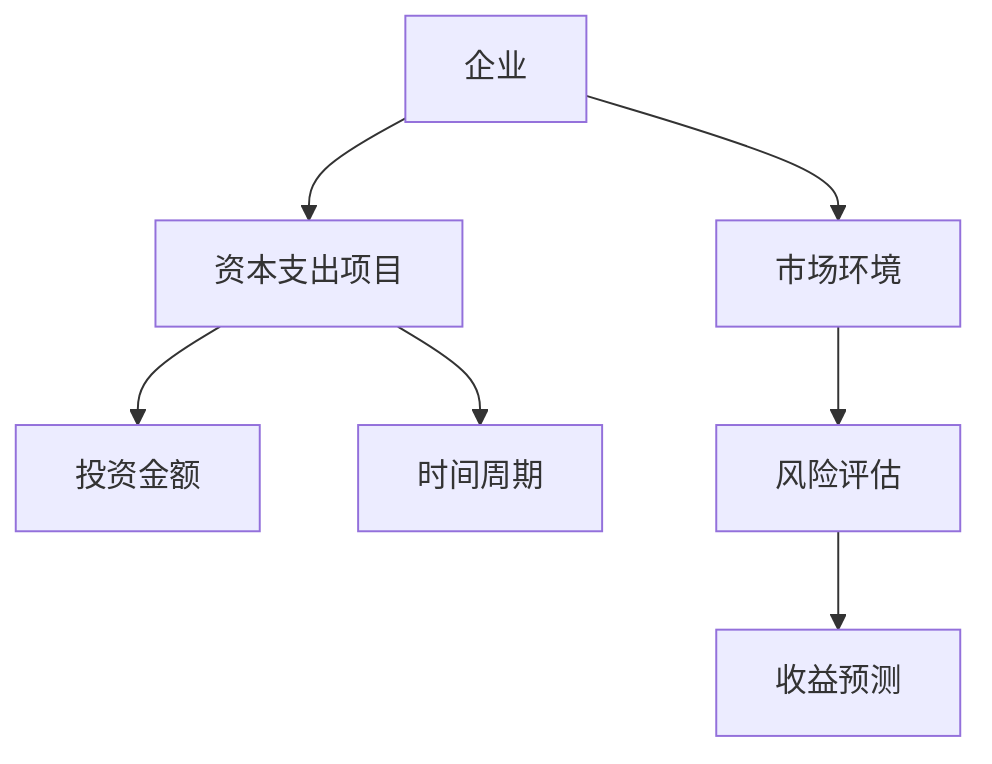
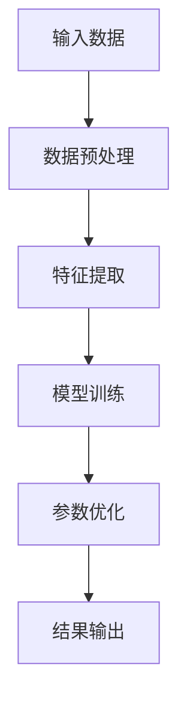
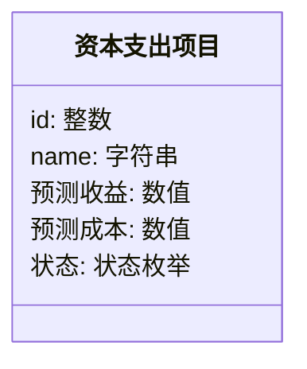
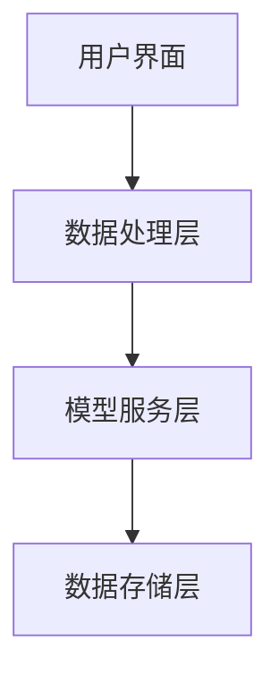
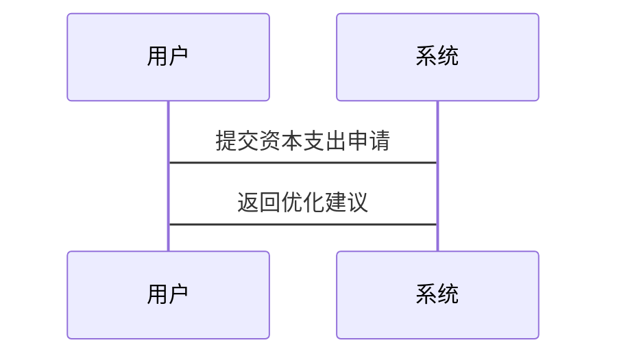

                 


# 智能化企业资本支出优化决策模型设计

## 关键词：
智能化，资本支出，决策模型，优化，人工智能

## 摘要：
本文详细探讨了如何通过智能化方法优化企业资本支出决策。结合数据分析、人工智能算法和系统架构设计，提出了一种基于强化学习的资本支出优化模型，通过实际案例分析和系统设计，展示了模型的应用价值和优势，为企业的高效决策提供了新的思路。

---

# 第一部分: 智能化企业资本支出优化决策模型概述

## 第1章: 问题背景与核心概念

### 1.1 企业资本支出优化决策的背景介绍

#### 1.1.1 企业资本支出的基本概念
资本支出（Capital Expenditure，简称CAPEX）是指企业在长期资产上的投资支出，如购买设备、建设厂房、研发等。资本支出的决策直接影响企业的财务健康和未来发展。

#### 1.1.2 传统资本支出决策的局限性
传统资本支出决策主要依赖于财务分析和人工经验判断，存在以下问题：
- 数据量有限，难以覆盖全生命周期的影响。
- 缺乏实时性和动态性，难以适应市场变化。
- 部分决策可能受到主观因素影响，存在偏差。

#### 1.1.3 智能化决策的必要性与优势
随着大数据和人工智能技术的发展，智能化决策能够显著提升资本支出决策的效率和准确性，优势包括：
- 多维度数据整合，全面评估投资影响。
- 预测能力强，能够提前发现潜在风险。
- 自适应性强，能够动态调整优化方案。

### 1.2 智能化决策的核心概念

#### 1.2.1 数据驱动决策的定义
数据驱动决策是基于大量数据进行分析和建模，以数据为基础支持决策的过程。它强调数据的准确性和完整性，通过数据挖掘、机器学习等技术提取有价值的信息。

#### 1.2.2 人工智能在资本支出中的应用
人工智能技术，如机器学习、深度学习和自然语言处理，被广泛应用于资本支出预测、风险评估和投资组合优化等领域。

#### 1.2.3 优化模型的基本原理
优化模型是通过数学方法寻找最优解的过程。在资本支出优化中，通常以投资回报率、风险最小化等为目标，结合约束条件进行建模。

### 1.3 问题描述与目标

#### 1.3.1 资本支出优化的核心问题
企业在进行资本支出时需要解决以下问题：
- 如何在多个项目中分配有限的资金。
- 如何预测项目的收益和风险。
- 如何在不确定环境下制定最优决策。

#### 1.3.2 智能化决策的目标设定
- 实现资本支出决策的自动化和智能化。
- 提高决策的准确性和效率。
- 最大化投资回报率，降低风险。

#### 1.3.3 边界与外延分析
资本支出优化模型的边界包括数据范围、时间范围和决策范围。外延则涉及模型的应用场景和扩展可能性。

### 1.4 模型的核心要素与组成

#### 1.4.1 数据来源与处理
数据来源包括财务数据、市场数据、行业数据等。数据处理涉及清洗、特征提取和标准化。

#### 1.4.2 模型输入与输出
输入包括历史数据和当前数据，输出包括预测结果和优化建议。

#### 1.4.3 优化目标与约束条件
目标是最大化收益或最小化成本，约束条件包括预算限制、时间限制等。

---

# 第二部分: 资本支出优化模型的核心原理

## 第2章: 核心概念与联系

### 2.1 模型原理概述

#### 2.1.1 数据驱动的优化方法
数据驱动优化方法利用历史数据建立模型，通过机器学习算法预测未来情况。

#### 2.1.2 人工智能在资本支出中的应用
人工智能技术能够处理复杂的数据关系，发现潜在规律，辅助决策。

#### 2.1.3 多目标优化的实现路径
通过构建多目标优化模型，平衡收益和风险等多方面目标。

### 2.2 核心概念对比表

| 比较维度 | 数据驱动决策 | 传统决策方法 |
|----------|---------------|---------------|
| 数据来源 | 结构化数据     | 主观判断       |
| 决策效率 | 高            | 低            |
| 准确性   | 高            | 中等          |

### 2.3 ER实体关系图



### 2.4 本章小结

---

# 第三部分: 算法原理与数学模型

## 第3章: 算法原理讲解

### 3.1 算法概述

#### 3.1.1 基于强化学习的决策过程
强化学习通过试错机制优化决策策略，应用于资本支出中可以动态调整投资组合。

#### 3.1.2 集成学习的应用
集成学习通过组合多个模型的结果，提高预测的准确性和稳定性。

#### 3.1.3 群优化算法的实现
群优化算法模拟自然群体行为，适用于多目标优化问题。

### 3.2 算法流程图



### 3.3 算法实现代码

```python
import numpy as np
from sklearn import linear_model

# 示例代码：线性回归模型
def optimize_capital_expenditure(data):
    model = linear_model.LinearRegression()
    model.fit(data['features'], data['target'])
    return model.predict(data['new_features'])
```

### 3.4 数学模型与公式

#### 3.4.1 线性回归模型
$$ y = \beta_0 + \beta_1x + \epsilon $$

#### 3.4.2 强化学习策略
$$ Q(s, a) = Q(s, a) + \alpha (r + \gamma \max Q(s', a') - Q(s, a)) $$

---

# 第四部分: 系统架构与实现

## 第4章: 系统架构设计

### 4.1 问题场景介绍
描述企业资本支出优化的典型场景，如预算分配、项目优先级排序等。

### 4.2 系统功能设计

#### 4.2.1 领域模型


#### 4.2.2 系统架构图


### 4.3 接口设计与交互图


---

# 第五部分: 项目实战

## 第5章: 项目实战与案例分析

### 5.1 环境安装与数据准备
描述如何安装必要的库和工具，准备数据集。

### 5.2 核心实现代码
```python
import pandas as pd
from sklearn.ensemble import RandomForestRegressor

# 示例代码：随机森林模型
def main():
    data = pd.read_csv('capital_expenditure.csv')
    features = data.drop('target', axis=1)
    target = data['target']
    model = RandomForestRegressor()
    model.fit(features, target)
    print("模型训练完成")
    
if __name__ == "__main__":
    main()
```

### 5.3 实际案例分析
通过具体案例展示模型的应用，分析优化结果，评估模型的性能。

### 5.4 项目小结
总结项目实施的经验，提出改进建议。

---

# 第六部分: 最佳实践与总结

## 第6章: 最佳实践与总结

### 6.1 小结
总结全文，重申智能化资本支出优化模型的核心价值。

### 6.2 注意事项
提醒读者在实际应用中需要注意的问题，如数据质量、模型维护等。

### 6.3 拓展阅读
推荐相关领域的书籍和资源，鼓励读者深入学习。

---

# 结语

通过本文的详细讲解，我们了解了如何设计和实现智能化的资本支出优化决策模型。这种基于数据驱动和人工智能的方法，能够显著提升企业的决策效率和准确性，为企业创造更大的价值。未来，随着技术的不断进步，资本支出优化模型将更加智能化和个性化，为企业决策提供更强大的支持。

