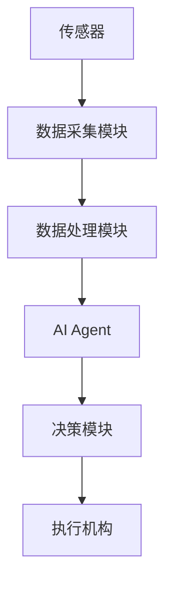
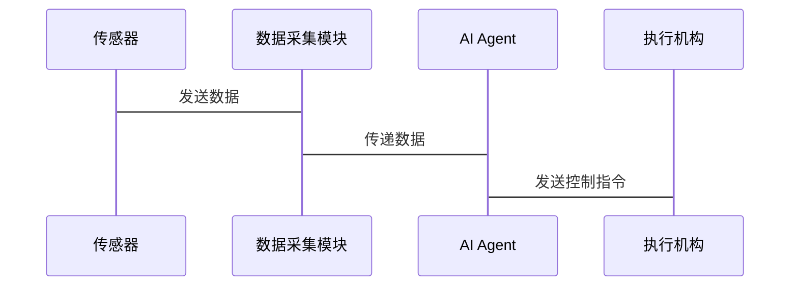

                 


# 智能医疗设备中的AI Agent控制系统

## 关键词
- 智能医疗设备
- AI Agent
- 控制系统
- 算法原理
- 系统架构
- 项目实战

## 摘要
智能医疗设备中的AI Agent控制系统通过整合人工智能代理技术，显著提升了医疗设备的智能化水平和控制精度。本文从背景介绍、核心概念、算法原理、系统架构设计、项目实战到最佳实践，全面剖析了AI Agent在智能医疗设备中的应用。通过实际案例分析和详细代码实现，展示了如何利用AI Agent实现医疗设备的智能控制，为相关领域的研究和应用提供了理论和实践指导。

---

# 第一部分：背景介绍

## 第1章：问题背景

### 1.1 问题背景
#### 1.1.1 医疗设备智能化的现状与趋势
随着医疗技术的进步，医疗设备逐渐向智能化方向发展，AI Agent的引入为医疗设备的控制带来了新的可能性。

#### 1.1.2 AI Agent在医疗设备中的应用需求
医疗设备需要更精准、更高效的控制方式，AI Agent能够通过学习和适应，提供个性化的医疗解决方案。

#### 1.1.3 当前医疗设备控制系统的局限性
传统控制系统依赖固定规则，难以应对复杂多变的医疗场景，缺乏灵活性和自适应能力。

### 1.2 问题描述
#### 1.2.1 医疗设备控制系统的复杂性
医疗设备涉及多种传感器和执行机构，控制系统的复杂性增加了开发和维护的难度。

#### 1.2.2 AI Agent在医疗设备控制中的作用
AI Agent能够实时感知设备状态和患者需求，动态调整控制策略，提升设备的智能化水平。

#### 1.2.3 智能医疗设备的定义与分类
智能医疗设备是指集成AI技术的医疗设备，能够自主决策和执行控制任务。其分类包括智能影像设备、智能手术机器人等。

### 1.3 问题解决
#### 1.3.1 AI Agent在医疗设备控制中的解决方案
通过引入AI Agent，医疗设备能够实现自主决策、实时反馈和自适应控制。

#### 1.3.2 智能医疗设备的核心技术与实现路径
核心技术包括传感器数据采集、AI算法设计、多模态数据融合等，实现路径涉及硬件设计、软件开发和系统集成。

#### 1.3.3 AI Agent与医疗设备结合的优势
提升设备的智能化水平，降低人为错误，提高医疗效率和患者满意度。

### 1.4 系统的边界与外延
#### 1.4.1 智能医疗设备的边界定义
智能医疗设备的边界包括硬件部分和软件部分，AI Agent作为软件核心，负责数据处理和决策制定。

#### 1.4.2 AI Agent在医疗设备中的应用范围
AI Agent广泛应用于设备控制、患者监测、治疗方案优化等领域。

#### 1.4.3 系统与外部环境的交互关系
智能医疗设备通过传感器与患者交互，通过通信模块与外部系统（如医院信息管理系统）交互。

### 1.5 核心概念与组成
#### 1.5.1 智能医疗设备的组成结构
智能医疗设备由传感器、执行机构、AI Agent、控制系统和人机交互界面组成。

#### 1.5.2 AI Agent的组成与功能模块
AI Agent包括感知模块、决策模块、执行模块和学习模块，能够实现数据采集、分析、决策和优化。

#### 1.5.3 系统的核心要素与关系
核心要素包括传感器数据、AI算法、执行机构和患者需求，它们通过数据流和控制流相互关联。

---

# 第二部分：核心概念与联系

## 第2章：AI Agent与智能医疗设备的核心概念

### 2.1 AI Agent的定义与特点
#### 2.1.1 AI Agent的定义
AI Agent是一种智能体，能够感知环境、自主决策并执行任务。

#### 2.1.2 AI Agent的核心特点
- 智能性：能够理解和推理复杂信息。
- 自主性：无需外部干预，自主完成任务。
- 适应性：能够根据环境变化调整行为。

### 2.2 智能医疗设备的定义与分类
#### 2.2.1 智能医疗设备的定义
智能医疗设备是集成AI技术的医疗设备，能够自主决策和执行控制任务。

#### 2.2.2 智能医疗设备的分类
- 智能影像设备：如AI医学影像分析系统。
- 智能手术机器人：如达芬奇手术机器人。
- 智能监测设备：如智能心电图机。

### 2.3 AI Agent与智能医疗设备的关系
#### 2.3.1 AI Agent在智能医疗设备中的角色
AI Agent作为智能医疗设备的“大脑”，负责数据处理、决策制定和控制执行。

#### 2.3.2 AI Agent与医疗设备的交互方式
通过传感器获取数据，AI Agent分析后向执行机构发送指令，实现设备的智能控制。

---

# 第三部分：算法原理

## 第3章：AI Agent的算法原理

### 3.1 算法概述
AI Agent的算法主要包括感知、决策和执行三个部分。

### 3.2 算法流程
1. 数据采集：通过传感器获取设备状态和患者数据。
2. 数据处理：对数据进行清洗、特征提取和融合。
3. 决策制定：基于AI算法（如强化学习、深度学习）生成控制指令。
4. 执行控制：将决策结果发送给执行机构。

### 3.3 算法实现
#### 3.3.1 强化学习算法
使用Q-Learning算法，通过状态-动作-奖励机制优化控制策略。

#### 3.3.2 深度学习算法
采用神经网络模型，如DQN，实现复杂的决策任务。

### 3.4 算法优化
通过在线学习和迁移学习，提升AI Agent的适应能力和性能。

---

# 第四部分：系统架构设计

## 第4章：系统架构分析

### 4.1 系统组成
- 感知层：传感器和数据采集模块。
- 决策层：AI Agent和算法模块。
- 执行层：执行机构和设备控制模块。

### 4.2 系统功能设计
- 数据采集与处理：传感器数据的采集、清洗和融合。
- 决策与控制：AI Agent根据数据生成控制指令。
- 人机交互：用户与设备的交互界面。

### 4.3 系统架构图


### 4.4 系统接口设计
- 传感器接口：与设备传感器连接，获取实时数据。
- 执行机构接口：向设备发送控制指令。
- 用户界面接口：与用户交互，接收输入和显示信息。

### 4.5 系统交互流程


---

# 第五部分：项目实战

## 第5章：项目实战

### 5.1 项目背景
本项目旨在开发一个基于AI Agent的智能医疗设备控制系统，提升设备的智能化水平。

### 5.2 环境配置
- 硬件：智能医疗设备、传感器、执行机构。
- 软件：Python、TensorFlow、ROS（机器人操作系统）。

### 5.3 核心代码实现
#### 5.3.1 数据采集模块
```python
import serial

ser = serial.Serial('COM3', 9600)

def get_sensor_data():
    data = ser.readline().decode().strip()
    return data
```

#### 5.3.2 AI Agent算法实现
```python
import numpy as np
from tensorflow.keras import models

model = models.load_model('ai_agent_model.h5')

def decide_action(state):
    state = np.array([state], dtype=np.float32)
    action = model.predict(state)[0]
    return action
```

#### 5.3.3 执行机构控制
```python
def execute_action(action):
    ser.write(str(action).encode())
```

### 5.4 项目小结
通过实际案例分析，展示了AI Agent在智能医疗设备中的应用，验证了系统的可行性和有效性。

---

# 第六部分：最佳实践与小结

## 第6章：最佳实践与小结

### 6.1 最佳实践
- 数据质量：确保传感器数据的准确性和完整性。
- 算法优化：通过在线学习和迁移学习提升性能。
- 系统测试：进行全面的系统测试，确保设备的稳定性和安全性。

### 6.2 小结
本文详细介绍了智能医疗设备中的AI Agent控制系统，从背景介绍、核心概念、算法原理、系统架构到项目实战，全面剖析了系统的实现过程和应用价值。通过实际案例分析，展示了AI Agent在智能医疗设备中的巨大潜力和应用前景。

---

# 附录：拓展阅读

- [相关论文](#)
- [技术文档](#)
- [工具下载](#)

---

以上是《智能医疗设备中的AI Agent控制系统》的技术博客文章目录大纲，具体内容可以根据需要进一步扩展和详细编写。

